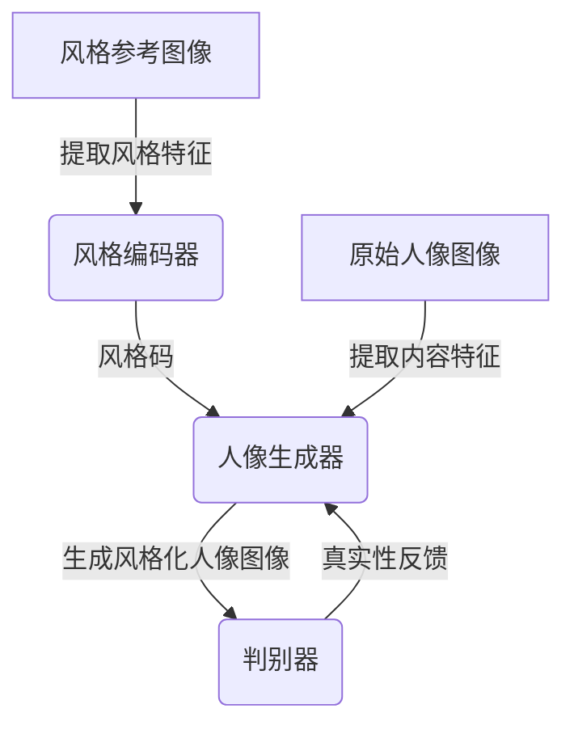

# 基于生成对抗网络的人像摄影风格自动学习与迁移系统

## 1. 背景介绍

### 1.1 问题的由来

在当代数字摄影时代，人们对于拍摄出具有独特风格的人像照片有着越来越高的需求。然而，要掌握专业的人像摄影技巧并非易事,需要长期的学习和实践积累。因此,如何自动化地为普通用户提供风格化人像照片,成为了一个亟待解决的问题。

传统的图像风格迁移方法通常依赖于手工设计的特征和参数,缺乏灵活性和通用性。而近年来,生成对抗网络(Generative Adversarial Networks, GANs)作为一种全新的深度生成模型,在图像生成、风格迁移等领域展现出了巨大的潜力。

### 1.2 研究现状

生成对抗网络最早由Ian Goodfellow等人在2014年提出,它由一个生成器(Generator)网络和一个判别器(Discriminator)网络组成。生成器网络的目标是生成尽可能逼真的数据样本,而判别器网络则旨在区分生成的样本和真实数据。通过生成器和判别器之间的对抗训练,最终可以获得一个能够生成逼真数据的生成器模型。

近年来,研究人员将生成对抗网络应用于图像风格迁移任务,取得了令人瞩目的成果。例如,Zhu等人提出了CycleGAN模型,能够在不需要配对训练数据的情况下实现图像风格迁移。Huang等人则设计了AdaIN(Adaptive Instance Normalization)模块,使得风格迁移过程更加灵活和可控。

然而,现有的生成对抗网络风格迁移方法大多专注于通用的图像风格迁移,缺乏针对人像摄影风格的专门研究。人像摄影风格迁移面临着诸多挑战,例如需要保留人物面部细节、适应不同姿态和表情等。因此,设计一种专门用于人像摄影风格自动学习与迁移的系统,具有重要的理论意义和应用价值。

### 1.3 研究意义

本文提出了一种基于生成对抗网络的人像摄影风格自动学习与迁移系统。该系统能够从大量人像摄影作品中自动学习提取不同风格的特征,并将这些风格迁移应用到新的人像图像上,从而为普通用户提供风格化的人像照片。

相比于传统的人工设计方法,本系统具有以下几个主要优势:

1. **自动化学习**:系统能够自动从大量人像摄影作品中学习提取不同风格的特征,无需人工设计特征。

2. **风格迁移灵活**:用户可以自由选择希望迁移的风格,系统会自动将该风格应用到新的人像图像上。

3. **细节保留**:在风格迁移过程中,系统能够很好地保留人物面部细节和姿态信息,避免失真。

4. **高质量输出**:生成的风格化人像图像质量高,接近专业人像摄影作品的水准。

本系统不仅可以为普通用户提供便捷的风格化人像照片服务,也可以为专业人像摄影师提供辅助创作的工具,提高工作效率。此外,该系统所采用的技术方法也可以推广应用于其他图像领域的风格迁移任务。

### 1.4 本文结构

本文首先介绍生成对抗网络在人像摄影风格迁移任务中的核心概念和技术原理,包括生成对抗网络的基本框架、人像图像风格表示等。接下来详细阐述本系统所采用的核心算法,包括风格编码器、风格融合模块、人像生成器等模块的工作原理和具体实现步骤。

然后,本文将从数学模型的角度深入探讨系统的理论基础,包括风格损失函数、内容损失函数等,并给出公式推导和案例分析。

在项目实践部分,将介绍系统的开发环境搭建、核心代码实现、运行结果展示等。

最后,本文将讨论该系统在实际应用场景中的潜力,并对未来的发展趋势和面临的挑战进行展望和思考。

## 2. 核心概念与联系

生成对抗网络(Generative Adversarial Networks, GANs)是一种由生成模型和判别模型组成的无监督学习框架。其核心思想是通过生成器和判别器之间的对抗博弈,使生成器能够生成逼真的数据样本。

在人像摄影风格迁移任务中,我们需要学习人像图像的内容特征和风格特征,并将目标风格迁移到新的人像图像上。为此,我们可以将生成对抗网络分为三个主要部分:

1. **风格编码器(Style Encoder)**:用于从风格参考图像(如具有特定风格的人像摄影作品)中提取风格特征,并将其编码为风格码(Style Code)。

2. **人像生成器(Portrait Generator)**:接收原始人像图像的内容特征和目标风格码作为输入,生成具有目标风格的新人像图像。

3. **判别器(Discriminator)**:判断生成的人像图像是否真实自然,并将判别结果作为反馈信号,指导生成器进行优化。

这三个部分通过对抗训练相互作用,最终使得生成器能够生成高质量的风格化人像图像。其中,风格编码器和生成器的设计是关键,需要能够有效地学习和融合图像的内容和风格特征。

下面是该系统的整体架构流程图:

在这个系统中,生成对抗网络的各个部分相互协作,实现了人像摄影风格的自动学习和高质量迁移。接下来,我们将详细介绍系统的核心算法原理和实现细节。

## 3. 核心算法原理 & 具体操作步骤

### 3.1 算法原理概述

本系统的核心算法基于生成对抗网络,包括三个主要模块:风格编码器、人像生成器和判别器。

1. **风格编码器(Style Encoder)**:
   
   风格编码器的作用是从风格参考图像(如具有特定风格的人像摄影作品)中提取风格特征,并将其编码为风格码(Style Code)。常用的编码方式包括使用预训练的卷积神经网络(如VGG网络)提取特征,或者使用自编码器(Autoencoder)结构进行无监督学习。

2. **人像生成器(Portrait Generator)**:
   
   人像生成器是整个系统的核心部分。它的输入包括原始人像图像的内容特征和目标风格码,输出则是具有目标风格的新人像图像。生成器的网络结构通常采用编码器-解码器(Encoder-Decoder)框架,其中编码器提取原始图像的内容特征,解码器则根据内容特征和风格码生成新的图像。

   为了实现高质量的风格迁移,生成器中常采用一些特殊的技术,如自适应实例归一化(Adaptive Instance Normalization, AdaIN)模块、注意力机制(Attention Mechanism)等,用于有效地融合内容特征和风格特征。

3. **判别器(Discriminator)**:
   
   判别器的作用是判断生成器输出的图像是否真实自然。它通常采用二分类卷积神经网络的结构,对真实图像和生成图像进行判别。判别器的判别结果将作为反馈信号,指导生成器进行优化,使得生成的图像更加逼真。

这三个模块通过对抗训练相互作用,最终使得生成器能够生成高质量的风格化人像图像。在训练过程中,生成器和判别器之间进行的是一个极小化-极大化博弈,可以用以下公式表示:

$$\min_G \max_D V(D, G) = \mathbb{E}_{x \sim p_\text{data}(x)}[\log D(x)] + \mathbb{E}_{z \sim p_z(z)}[\log(1 - D(G(z)))]$$

其中,$ G $是生成器,$ D $是判别器,$ x $是真实数据样本,$ z $是随机噪声向量。生成器 $ G $的目标是使得 $ D(G(z)) $的值最大化,即让生成的图像被判别器判断为真实;而判别器 $ D $的目标是最大化 $ \log D(x) $和 $ \log(1 - D(G(z))) $的值,即正确判别真实数据和生成数据。

通过这种对抗训练机制,生成器和判别器相互博弈,最终达到一个纳什均衡状态,使得生成器能够生成高质量的图像样本。

### 3.2 算法步骤详解

本系统的核心算法可以分为以下几个主要步骤:

1. **风格编码器训练**:
   
   使用大量具有不同风格的人像摄影作品作为训练数据,训练风格编码器模型。编码器的目标是从输入图像中提取风格特征,并将其编码为紧凑的风格码表示。

   常用的风格编码器结构包括使用预训练的卷积神经网络(如VGG网络)提取特征,或者使用自编码器(Autoencoder)结构进行无监督学习。通过训练,编码器能够学习到不同风格的特征表示。

2. **内容特征提取**:
   
   对于需要进行风格迁移的原始人像图像,使用预训练的卷积神经网络(如VGG网络)提取其内容特征。内容特征通常是图像的高层语义特征,用于保留人物面部细节和姿态信息。

3. **风格融合**:
   
   将原始人像图像的内容特征和目标风格码输入到人像生成器中。生成器通过特殊的技术(如自适应实例归一化模块、注意力机制等)将内容特征和风格特征有效地融合,生成具有目标风格的新人像图像。

4. **对抗训练**:
   
   生成器生成的风格化人像图像将被输入到判别器中,判别器会判断该图像是真实的还是生成的。判别器的判别结果将作为反馈信号,指导生成器进行优化,使得生成的图像更加逼真自然。

   生成器和判别器之间进行对抗博弈,通过极小化-极大化公式进行训练,最终达到一个纳什均衡状态。

5. **模型微调**:
   
   在对抗训练的基础上,可以进一步对生成器模型进行微调,以提高风格迁移的质量和细节保留能力。常用的方法包括添加内容损失函数、风格重构损失函数等,使得生成的图像不仅具有目标风格,而且能够很好地保留原始图像的内容特征。

通过上述步骤,本系统能够自动学习不同的人像摄影风格,并将这些风格高质量地迁移到新的人像图像上,为普通用户提供风格化的人像照片服务。

### 3.3 算法优缺点

本系统基于生成对抗网络的人像摄影风格自动学习与迁移算法具有以下优点:

1. **自动化学习**:无需人工设计特征,能够自动从大量人像摄影作品中学习提取不同风格的特征。

2. **风格迁移灵活**:用户可以自由选择希望迁移的风格,系统会自动将该风格应用到新的人像图像上。

3. **细节保留能力强**:在风格迁移过程中,能够很好地保留人物面部细节和姿态信息,避免失真。

4. **生成质量高**:生成的风格化人像图像质量接近专业人像摄影作品的水准。

5. **泛化能力强**:该算法不仅适用于人像图像,也可以推广应用于其他图像领域的风格迁移任务。

但是,该算法也存在一些缺点和局限性:

1. **训练数据需求大**:需要大量具有不同风格的人像摄影作品作为训练数据,数据采集和标注工作量较大。

2. **训练时间长**:生成对抗网络的对抗