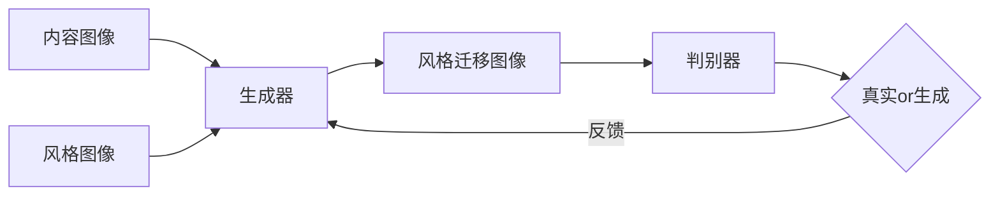
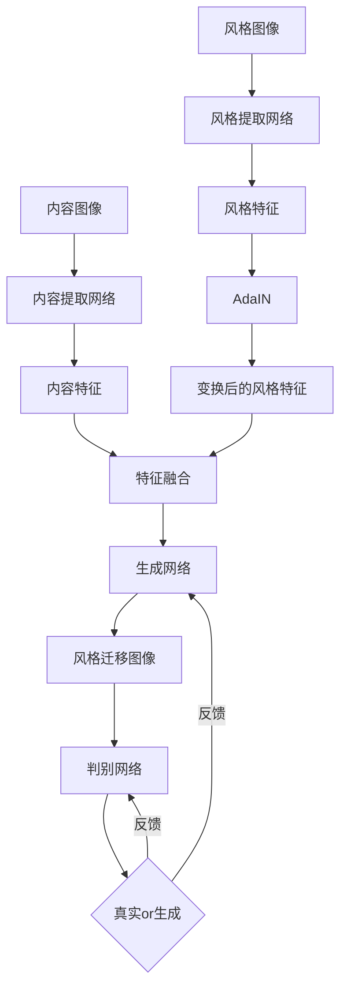

# 基于生成对抗网络的抽象艺术图像风格迁移机制

关键词：生成对抗网络、抽象艺术、图像风格迁移、深度学习、计算机视觉

## 1. 背景介绍
### 1.1 问题的由来
近年来,随着深度学习技术的飞速发展,计算机视觉领域取得了突破性的进展。其中,图像风格迁移作为一个新兴的研究方向,受到了学术界和工业界的广泛关注。图像风格迁移旨在将一幅图像的风格迁移到另一幅图像上,生成一幅具有新颖艺术风格的图像。传统的图像风格迁移方法主要基于优化理论,通过最小化内容损失和风格损失来生成风格迁移图像。然而,这类方法存在计算复杂度高、生成图像质量不高等问题。

近期,生成对抗网络(Generative Adversarial Networks, GANs)的出现为图像风格迁移提供了新的思路。GANs 通过生成器和判别器的对抗学习,可以生成高质量、逼真的图像。将 GANs 引入图像风格迁移,有望克服传统方法的不足,生成更加艺术、创新的风格迁移图像。

### 1.2 研究现状 
目前,基于 GANs 的图像风格迁移已经成为计算机视觉领域的研究热点。国内外学者提出了多种 GANs 风格迁移模型,取得了显著的效果。比如:

- Gatys 等人提出了一种基于卷积神经网络(CNN)的风格迁移算法,通过最小化内容图像和风格图像在 CNN 特征空间的统计距离实现风格迁移。

- Johnson 等人提出了一种快速风格迁移网络,引入了感知损失,大大加快了风格迁移的速度。

- Zhu 等人提出了 CycleGAN,实现了无监督的图像到图像转换,可用于风格迁移任务。

- Huang 等人提出了 AdaIN,通过自适应实例归一化层实现了任意风格迁移。

- Karras 等人提出的 StyleGAN,通过隐空间插值实现了高质量的图像编辑和风格混合。

这些研究工作极大地推动了图像风格迁移技术的发展。然而,目前的方法在抽象艺术风格迁移方面还存在一些不足,生成的图像往往缺乏抽象艺术的韵味。

### 1.3 研究意义
抽象艺术是一种重要的艺术流派,其特点是简洁、夸张、变形,注重表现主观感受。将抽象艺术风格引入图像风格迁移,可以极大地拓展风格迁移的表现力,生成更加新颖、创新的艺术图像。这不仅可以为抽象艺术的创作提供新的思路和工具,也为计算机辅助艺术创作开辟了广阔的前景。

同时,研究抽象艺术风格迁移对于深入理解视觉认知、审美机制等认知科学问题也具有重要意义。通过探索人工智能如何理解和模仿抽象艺术创作过程,有助于揭示人类视觉感知和艺术创造的奥秘。

因此,本文聚焦抽象艺术图像风格迁移,探索基于生成对抗网络的风格迁移机制,以期生成更加艺术、创新的抽象风格图像,为计算机辅助艺术创作提供新的可能。

### 1.4 本文结构
本文的结构安排如下:第2部分介绍图像风格迁移和生成对抗网络的核心概念与联系;第3部分详细阐述本文提出的抽象艺术风格迁移算法原理和操作步骤;第4部分建立算法的数学模型,并通过公式推导和案例分析进行详细讲解;第5部分给出算法的代码实现,并通过实验结果展示其有效性;第6部分讨论该算法的实际应用场景;第7部分推荐相关的学习资源和开发工具;第8部分总结全文,并展望该领域的未来发展趋势与挑战;第9部分列举一些常见问题及其解答。

## 2. 核心概念与联系
图像风格迁移和生成对抗网络是本文算法的两大核心概念。

图像风格迁移是指将一幅图像的风格迁移到另一幅图像上,生成一幅具有目标风格特征的图像。其核心是如何有效地提取和表示图像的内容信息和风格信息,并将二者巧妙地融合,生成兼具内容图像内容和风格图像风格的新图像。

生成对抗网络由生成器和判别器组成,通过两个网络的对抗学习来生成逼真的图像。其核心思想是让生成器尽可能生成以假乱真的图像去欺骗判别器,而判别器则要尽可能分辨出真实图像和生成图像。这样的博弈学习使得生成器可以生成高质量的图像。

将生成对抗网络引入图像风格迁移,可以让生成器学习到风格图像的风格特征,并将其迁移到内容图像中。判别器则起到约束生成图像质量的作用,使得生成的风格迁移图像更加自然、逼真。二者的结合可以有效克服传统风格迁移方法的不足,生成更加艺术、创新的风格迁移图像。

下图是图像风格迁移与生成对抗网络的关系示意图:

## 3. 核心算法原理 & 具体操作步骤
### 3.1 算法原理概述
本文提出的抽象艺术风格迁移算法基于生成对抗网络,由风格提取网络、内容提取网络、生成网络和判别网络组成。

其中,风格提取网络负责从风格图像中提取抽象艺术风格特征;内容提取网络负责从内容图像中提取内容特征;生成网络以内容特征为主干,融合风格特征,生成兼具内容图像内容和抽象艺术风格的风格迁移图像;判别网络负责判断生成图像是否具有抽象艺术风格,并反馈给生成网络,指导其生成更加逼真的风格迁移图像。

通过生成网络和判别网络的对抗学习,可以使生成网络掌握抽象艺术风格的精髓,将其迁移到内容图像中,同时保证生成图像的视觉质量,最终生成富有创意、艺术感的抽象风格图像。

### 3.2 算法步骤详解
算法的具体步骤如下:

1. 风格特征提取:将风格图像输入预训练的风格提取网络,提取其抽象艺术风格特征。风格提取网络采用 VGG19 网络的高层特征。

2. 内容特征提取:将内容图像输入预训练的内容提取网络,提取其内容特征。内容提取网络采用 VGG19 网络的中层特征。

3. 风格特征变换:为了使风格特征更适用于内容图像,需要对风格特征进行形状变换,使其与内容特征的形状一致。这里采用自适应实例归一化(AdaIN)层来实现特征变换。

4. 特征融合:将变换后的风格特征与内容特征逐元素相加,得到融合特征。融合特征兼具内容图像的语义信息和抽象风格的视觉特征。

5. 图像生成:将融合特征输入生成网络,生成风格迁移图像。生成网络采用 U-Net 结构,可以保留图像的细节信息。

6. 真实性判别:将生成图像输入判别网络,判断其是否具有抽象艺术风格。判别网络采用 PatchGAN 结构,可以判断局部图像的真实性。

7. 损失函数计算:计算内容损失、风格损失和对抗损失。其中,内容损失衡量生成图像与内容图像的内容相似性,风格损失衡量生成图像与风格图像的风格相似性,对抗损失衡量生成图像的真实性。

8. 参数更新:根据损失函数的梯度,利用反向传播算法更新生成网络和判别网络的参数,使得生成图像越来越逼真。

9. 重复迭代:重复步骤1-8,直到生成网络收敛,得到最终的抽象艺术风格迁移图像。

算法流程如下图所示:

### 3.3 算法优缺点
本文算法的优点如下:

1. 引入生成对抗网络,可以生成更加逼真、艺术感的风格迁移图像。

2. 采用自适应实例归一化层来变换风格特征,使其更适用于内容图像,提高了风格迁移的效果。

3. 采用 U-Net 结构的生成网络,可以更好地保留图像的细节信息。

4. 采用 PatchGAN 结构的判别网络,可以判断局部图像的真实性,提高了生成图像的质量。

5. 融合内容损失、风格损失和对抗损失,可以平衡内容保真性和风格迁移性,生成更加和谐的风格迁移图像。

但是,本文算法也存在一些局限性:

1. 抽象艺术风格的提取和表示仍然是一个难题,目前采用的 VGG19 网络可能无法完全捕捉抽象艺术的精髓。

2. 生成的风格迁移图像有时会出现一些伪影和噪点,影响视觉质量。

3. 算法的训练时间较长,需要大量的数据和计算资源。

4. 算法对风格图像和内容图像的选择比较敏感,不恰当的图像对可能会导致风格迁移失败。

### 3.4 算法应用领域
本文算法可以应用于以下领域:

1. 艺术创作:可以为艺术家提供新的创作思路和工具,生成独特、创新的抽象艺术作品。

2. 游戏设计:可以为游戏场景、角色、道具等元素赋予独特的抽象艺术风格,提升游戏的艺术品味。

3. 虚拟现实:可以为虚拟场景渲染独特的抽象艺术风格,营造沉浸式的艺术体验。

4. 电影特效:可以为电影画面添加抽象艺术滤镜,营造梦幻、超现实的视觉效果。

5. 广告设计:可以生成富有创意、吸引眼球的抽象艺术风格的广告图像和视频。

6. 用户交互:可以为用户提供图像风格化工具,让用户自定义图像的抽象艺术风格。

## 4. 数学模型和公式 & 详细讲解 & 举例说明
### 4.1 数学模型构建
本文算法的数学模型可以表示为以下优化问题:

$$\min_{G} \max_{D} \mathcal{L}(G, D) = \mathbb{E}_{x \sim p_{data}(x)}[\log D(x)] + \mathbb{E}_{z \sim p_z(z)}[\log (1 - D(G(z)))] + \lambda_c \mathcal{L}_c(G) + \lambda_s \mathcal{L}_s(G)$$

其中,$G$表示生成网络,$D$表示判别网络,$x$表示真实图像,$z$表示随机噪声,$p_{data}$表示真实图像的分布,$p_z$表示随机噪声的分布,$\mathcal{L}_c$表示内容损失,$\mathcal{L}_s$表示风格损失,$\lambda_c$和$\lambda_s$分别表示内容损失和风格损失的权重系数。

该模型的目标是最小化生成网络的损失,