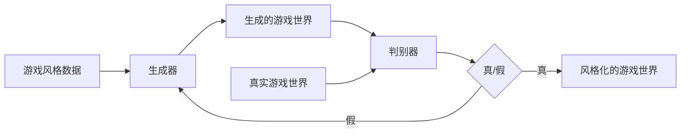

# 基于生成对抗网络的游戏世界风格化生成技术研究

关键词：生成对抗网络、游戏世界、风格化生成、深度学习、计算机图形学

## 1. 背景介绍

### 1.1 问题的由来

随着计算机图形学和游戏技术的快速发展,游戏世界的视觉效果和艺术风格越来越受到重视。传统的游戏世界设计通常需要大量的人工创作和繁琐的资源制作过程,难以快速生成丰富多样、风格独特的游戏场景。如何利用人工智能技术,实现游戏世界的自动风格化生成,成为了一个值得探索的研究课题。

### 1.2 研究现状

近年来,生成对抗网络(Generative Adversarial Networks, GANs)在图像生成领域取得了显著成果。GANs通过生成器和判别器的对抗学习,可以生成逼真的图像。许多研究者将GANs应用于游戏领域,尝试自动生成游戏地图、纹理等游戏资源。然而,目前针对游戏世界整体风格化生成的研究还比较少。

### 1.3 研究意义

研究基于GANs的游戏世界风格化生成技术,有助于提高游戏开发效率,降低游戏制作成本。通过AI自动生成风格多样的游戏世界,可以极大地丰富游戏内容,为玩家带来更加新颖有趣的游戏体验。同时,这项研究也将推动游戏领域与人工智能技术的深度融合,为游戏AI的发展提供新的思路。

### 1.4 本文结构

本文将从以下几个方面展开论述:第2部分介绍GANs的核心概念与游戏世界风格化生成的关联;第3部分详细阐述游戏世界风格化生成的核心算法原理和具体操作步骤;第4部分建立数学模型并推导相关公式,通过案例进行分析讲解;第5部分给出项目实践的代码实例和详细解释说明;第6部分探讨该技术的实际应用场景;第7部分推荐相关的学习资源和开发工具;第8部分总结全文,展望未来发展趋势与挑战;第9部分列举一些常见问题与解答。

## 2. 核心概念与联系

生成对抗网络(GANs)由Goodfellow等人于2014年提出,是一种用于生成模型的深度学习框架。GANs由两个子网络组成:生成器(Generator)和判别器(Discriminator)。生成器的目标是生成尽可能逼真的样本数据,使判别器无法分辨真假;判别器的目标是尽可能准确地判断输入样本是真实数据还是生成器产生的假数据。两个网络在训练过程中不断博弈对抗,最终使生成器能够生成以假乱真的数据。

将GANs应用于游戏世界风格化生成,可以让生成器学习游戏场景的内在规律和艺术风格特征,生成具有特定风格的游戏世界元素,如地形、建筑、植被、天气等。判别器则判断生成的游戏世界是否符合预期风格,并引导生成器不断改进。通过生成器和判别器的对抗学习,最终可以实现游戏世界的自动风格化生成。

下图是GANs在游戏世界风格化生成中的基本架构:



## 3. 核心算法原理 & 具体操作步骤

### 3.1 算法原理概述

游戏世界风格化生成算法的核心是条件生成对抗网络(Conditional GANs, CGANs)。与普通GANs不同,CGANs在生成器和判别器的输入中加入了条件信息,使得生成的数据能够满足特定的条件约束。在游戏世界风格化生成中,条件信息可以是表示游戏风格的标签或特征向量。

### 3.2 算法步骤详解

1. 准备训练数据:收集具有不同风格的游戏世界数据,包括场景图像、深度图、语义分割图等,并对数据进行预处理和增强。

2. 设计生成器和判别器网络结构:生成器采用编码器-解码器架构,以随机噪声和风格条件作为输入,生成风格化的游戏世界图像;判别器采用卷积神经网络,判断输入图像是真实的还是生成的。

3. 定义损失函数:生成器的损失函数包括对抗损失和重构损失,使生成的图像既能欺骗判别器,又能保持内容信息;判别器的损失函数为二分类交叉熵损失,用于判断输入图像的真假。

4. 训练CGANs模型:交替训练生成器和判别器,生成器尽可能生成逼真的风格化游戏世界,判别器尽可能准确地判别生成图像和真实图像,两者互相博弈,不断提升生成质量。

5. 测试和应用:使用训练好的生成器,输入随机噪声和目标风格条件,生成风格化的游戏世界图像,应用于游戏场景的自动生成和风格转换。

### 3.3 算法优缺点

优点:
- 可以生成高质量、多样化的风格化游戏世界图像
- 通过条件控制,实现对生成风格的精细调控
- 生成过程自动化,大大提高游戏世界创建效率

缺点:
- 训练过程需要大量的数据和计算资源
- 生成的图像可能存在一些不自然或错误的细节
- 对于复杂的游戏世界,生成的质量和一致性有待提高

### 3.4 算法应用领域

- 游戏场景自动生成:根据游戏风格自动生成丰富多样的游戏场景
- 游戏素材风格转换:将现有游戏素材转换为新的艺术风格
- 游戏内容个性化:根据玩家喜好生成个性化的游戏世界
- 虚拟环境构建:快速构建具有特定风格的虚拟环境,用于VR/AR等应用

## 4. 数学模型和公式 & 详细讲解 & 举例说明

### 4.1 数学模型构建

CGANs的数学模型可以表示为如下的极小极大博弈问题:

$$\min_G \max_D V(D,G) = \mathbb{E}_{x \sim p_{data}(x)}[\log D(x|y)] + \mathbb{E}_{z \sim p_z(z)}[\log (1 - D(G(z|y)))]$$

其中,$G$表示生成器,$D$表示判别器,$x$表示真实游戏世界数据,$y$表示风格条件,$z$表示随机噪声。生成器$G$尝试最小化目标函数,而判别器$D$尝试最大化目标函数。

### 4.2 公式推导过程

根据CGANs的损失函数定义,生成器$G$和判别器$D$的优化目标可以分别表示为:

生成器的优化目标:
$$\min_G \mathcal{L}_G = \mathbb{E}_{z \sim p_z(z)}[\log (1 - D(G(z|y)))] + \lambda \mathcal{L}_{recon}(G)$$

判别器的优化目标:
$$\max_D \mathcal{L}_D = \mathbb{E}_{x \sim p_{data}(x)}[\log D(x|y)] + \mathbb{E}_{z \sim p_z(z)}[\log (1 - D(G(z|y)))]$$

其中,$\mathcal{L}_{recon}(G)$表示生成器的重构损失,用于保持生成图像与输入图像的内容一致性,$\lambda$为平衡因子。

### 4.3 案例分析与讲解

以生成卡通风格的游戏场景为例。首先准备一批卡通风格的游戏场景图像作为训练数据,并将其标记为正样本。然后随机生成一批噪声图像作为负样本。

在训练过程中,生成器$G$接收随机噪声$z$和卡通风格标签$y$,生成风格化的游戏场景图像$\tilde{x} = G(z|y)$。判别器$D$接收真实的卡通游戏场景图像$x$和生成的图像$\tilde{x}$,输出它们是真实图像的概率。

生成器$G$的目标是生成尽可能逼真的卡通风格游戏场景,使判别器$D$无法分辨真假。判别器$D$的目标是尽可能准确地判断输入图像是真实的还是生成的。

通过不断的训练和优化,生成器$G$最终可以生成高质量的卡通风格游戏场景,实现游戏世界的风格化生成。

### 4.4 常见问题解答

**Q:** CGANs生成的游戏世界质量如何评估?

**A:** 可以从视觉质量、风格一致性、内容完整性等方面评估生成的游戏世界质量。常用的评估指标包括主观评分、Inception Score(IS)、Fréchet Inception Distance(FID)等。此外,还可以通过用户研究和反馈来评估生成游戏世界的实际效果。

**Q:** CGANs训练过程中可能遇到哪些问题?

**A:** CGANs训练过程中可能遇到的问题包括:模式崩溃(Mode Collapse)、梯度消失/爆炸、训练不稳定等。可以通过改进网络结构、使用正则化技术、调整超参数等方法来缓解这些问题。此外,还需要注意数据质量和多样性对训练结果的影响。

## 5. 项目实践：代码实例和详细解释说明

### 5.1 开发环境搭建

- 操作系统:Ubuntu 18.04
- 深度学习框架:PyTorch 1.7
- Python版本:3.7
- CUDA版本:10.1
- 显卡:NVIDIA GeForce RTX 2080 Ti

安装必要的依赖库:
```bash
pip install torch torchvision numpy matplotlib
```

### 5.2 源代码详细实现

以下是使用PyTorch实现CGANs进行游戏世界风格化生成的核心代码:

```python
import torch
import torch.nn as nn
import torch.optim as optim
import torchvision.transforms as transforms
from torch.utils.data import DataLoader
from dataset import GameStyleDataset
from models import Generator, Discriminator

# 超参数设置
latent_dim = 100
style_dim = 10
image_size = 128
batch_size = 64
num_epochs = 200
lr = 0.0002
beta1 = 0.5

# 数据预处理
transform = transforms.Compose([
    transforms.Resize(image_size),
    transforms.CenterCrop(image_size),
    transforms.ToTensor(),
    transforms.Normalize((0.5, 0.5, 0.5), (0.5, 0.5, 0.5))
])

# 加载数据集
dataset = GameStyleDataset(data_path, transform)
dataloader = DataLoader(dataset, batch_size=batch_size, shuffle=True)

# 初始化生成器和判别器
generator = Generator(latent_dim, style_dim).cuda()
discriminator = Discriminator(style_dim).cuda()

# 定义损失函数和优化器
criterion = nn.BCELoss()
optimizer_G = optim.Adam(generator.parameters(), lr=lr, betas=(beta1, 0.999))
optimizer_D = optim.Adam(discriminator.parameters(), lr=lr, betas=(beta1, 0.999))

# 训练循环
for epoch in range(num_epochs):
    for i, (imgs, styles) in enumerate(dataloader):
        # 训练判别器
        real_imgs = imgs.cuda()
        styles = styles.cuda()
        real_labels = torch.ones((batch_size, 1)).cuda()
        fake_labels = torch.zeros((batch_size, 1)).cuda()
        
        z = torch.randn(batch_size, latent_dim).cuda()
        fake_imgs = generator(z, styles)
        
        real_loss = criterion(discriminator(real_imgs, styles), real_labels)
        fake_loss = criterion(discriminator(fake_imgs.detach(), styles), fake_labels)
        d_loss = real_loss + fake_loss
        
        optimizer_D.zero_grad()
        d_loss.backward()
        optimizer_D.step()
        
        # 训练生成器
        z = torch.randn(batch_size, latent_dim).cuda()
        fake_imgs = generator(z, styles)
        g_loss = criterion(discriminator(fake_imgs, styles), real_labels)
        
        optimizer_G.zero_grad()
        g_loss.backward()
        optimizer_G.step()
        
    # 