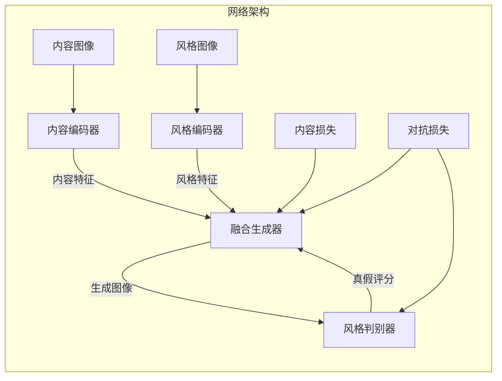

# 基于生成对抗网络的跨域图像风格迁移网络架构设计

## 1. 背景介绍

### 1.1 问题的由来

在计算机视觉和图像处理领域,图像风格迁移一直是一个具有挑战性和重要研究价值的课题。图像风格迁移旨在将一种艺术风格迁移到另一幅图像上,从而赋予目标图像新的视觉效果。传统的图像风格迁移方法通常基于显式特征提取和参数化模型,存在一些局限性,例如难以捕捉复杂的风格细节,且需要大量的人工设计和调参。

随着深度学习技术的发展,基于深度卷积神经网络(CNN)的图像风格迁移方法逐渐兴起,展现出强大的特征提取和表达能力。其中,生成对抗网络(Generative Adversarial Networks, GAN)作为一种新兴的深度生成模型,在图像生成、风格迁移等任务中表现出卓越的性能,受到了广泛关注。

### 1.2 研究现状

基于GAN的图像风格迁移方法通常由生成网络(Generator)和判别网络(Discriminator)组成。生成网络负责将内容图像和风格图像的特征融合,生成具有目标风格的输出图像;而判别网络则评估输出图像与真实风格图像的相似性,引导生成网络产生更加逼真的风格迁移结果。

目前,已有多种基于GAN的图像风格迁移模型被提出,例如CycleGAN、StyleGAN、CartoonGAN等。这些模型在特定领域展现出了良好的风格迁移效果,但也存在一些不足,如缺乏跨域迁移能力、生成图像质量有待提高、训练过程不稳定等。

### 1.3 研究意义

设计一种高效、通用的跨域图像风格迁移网络架构,不仅能够满足不同领域的风格迁移需求,还可以推动计算机视觉、图像处理等相关技术的发展。同时,该架构的研究也将为GAN在图像生成领域的应用提供新的思路和方法。

### 1.4 本文结构

本文将首先介绍跨域图像风格迁移的核心概念和GAN的基本原理,然后详细阐述所设计的网络架构的算法原理、数学模型和实现细节。随后,我们将通过实际案例分析和代码实例,展示该架构在不同领域的应用效果。最后,对该架构的未来发展趋势和面临的挑战进行总结和展望。

## 2. 核心概念与联系

**跨域图像风格迁移(Cross-Domain Image Style Transfer)**是指将一种艺术风格从源域(如油画、素描等)迁移到目标域(如照片、自然场景等)的过程。其核心思想是学习源域和目标域之间的映射关系,从而实现风格的无缝融合。

**生成对抗网络(Generative Adversarial Networks, GAN)**是一种由生成模型和判别模型组成的深度生成模型框架。生成模型旨在从潜在空间中采样,生成逼真的数据样本;而判别模型则评估生成样本的真实性,引导生成模型产生更加逼真的输出。两个模型通过对抗训练的方式相互促进,最终达到生成高质量样本的目标。

在跨域图像风格迁移任务中,GAN可以被用于学习源域和目标域之间的映射关系。生成网络将内容图像和风格图像的特征融合,生成具有目标风格的输出图像;判别网络则评估输出图像与真实风格图像的相似性,引导生成网络产生更加逼真的风格迁移结果。

## 3. 核心算法原理 & 具体操作步骤

### 3.1 算法原理概述

我们设计的基于GAN的跨域图像风格迁移网络架构由以下几个主要组件组成:

1. **内容编码器(Content Encoder)**: 用于从内容图像中提取语义特征,捕捉图像的内容信息。
2. **风格编码器(Style Encoder)**: 用于从风格图像中提取风格特征,捕捉图像的风格信息。
3. **融合生成器(Fusion Generator)**: 将内容特征和风格特征融合,生成具有目标风格的输出图像。
4. **风格判别器(Style Discriminator)**: 评估输出图像与真实风格图像的相似性,引导生成器产生更加逼真的风格迁移结果。
5. **内容损失(Content Loss)**: 用于保持输出图像与原始内容图像的内容一致性。
6. **对抗损失(Adversarial Loss)**: 用于优化生成器和判别器,使生成器产生更加逼真的风格迁移结果。

该架构的核心思想是将内容信息和风格信息分离,通过对抗训练的方式,学习内容特征和风格特征之间的映射关系,从而实现高质量的跨域风格迁移。

### 3.2 算法步骤详解

1. **内容编码器和风格编码器**:
   - 内容编码器通常采用预训练的CNN模型(如VGG、ResNet等),用于从内容图像中提取语义特征。
   - 风格编码器也采用预训练的CNN模型,用于从风格图像中提取风格特征,通常使用Gram矩阵来表示风格特征。

2. **融合生成器**:
   - 将内容特征和风格特征作为输入,通过一系列上采样、卷积和非线性激活操作,融合两种特征,生成具有目标风格的输出图像。
   - 常用的生成器架构包括U-Net、ResNet等,可以根据具体任务进行设计和优化。

3. **风格判别器**:
   - 判别器通常采用CNN分类器架构,用于评估生成图像与真实风格图像的相似性。
   - 判别器的输出是一个实数值,表示输入图像为真实风格图像的概率。

4. **损失函数**:
   - 内容损失:衡量生成图像与原始内容图像在语义特征上的差异,常用的内容损失包括均方误差损失、感知损失等。
   - 对抗损失:引导生成器产生更加逼真的风格迁移结果,常用的对抗损失包括最小二乘损失、Wasserstein损失等。

5. **训练过程**:
   - 生成器和判别器通过对抗训练的方式相互优化,生成器旨在最小化内容损失和对抗损失,产生更加逼真的风格迁移结果;判别器则旨在最大化对抗损失,提高对真实和生成样本的区分能力。
   - 训练过程中,内容编码器和风格编码器的参数通常保持固定,只优化生成器和判别器的参数。

### 3.3 算法优缺点

**优点**:

1. 能够实现高质量的跨域图像风格迁移,生成图像保持了原始内容信息,同时融合了目标风格特征。
2. 通过对抗训练的方式,可以自动学习内容特征和风格特征之间的映射关系,无需大量的人工设计和调参。
3. 具有良好的泛化能力,可以应用于不同领域的风格迁移任务。

**缺点**:

1. 训练过程复杂,需要同时优化生成器和判别器,存在模式崩溃和训练不稳定的风险。
2. 对于复杂的风格迁移任务,可能需要更大的模型容量和更多的训练数据,计算成本较高。
3. 生成图像的质量仍然存在一定局限性,可能出现artifact、模糊等问题。

### 3.4 算法应用领域

基于GAN的跨域图像风格迁移算法可以应用于多个领域,包括但不限于:

1. **艺术创作**: 将不同艺术风格(如油画、素描、漫画等)迁移到照片或自然场景图像上,为艺术家提供创作灵感和辅助工具。

2. **图像增强**: 通过风格迁移,可以为图像添加特殊的视觉效果,提高图像的艺术价值和观赏性。

3. **图像编辑**: 在图像编辑软件中,风格迁移可以作为一种图像处理工具,为用户提供个性化的图像编辑体验。

4. **虚拟现实/增强现实**: 将真实场景图像与虚拟风格相融合,为虚拟现实/增强现实应用带来更加身临其境的体验。

5. **视频处理**: 将风格迁移应用于视频帧,实现视频风格化,为影视制作提供新的视觉效果。

6. **医学影像**: 通过风格迁移,可以为医学影像添加特殊的视觉效果,方便医生观察和诊断。

## 4. 数学模型和公式 & 详细讲解 & 举例说明

在基于GAN的跨域图像风格迁移算法中,数学模型和公式扮演着重要的角色,用于定义和优化网络的损失函数。下面将详细介绍常用的数学模型和公式,并通过案例分析加深理解。

### 4.1 数学模型构建

#### 4.1.1 内容损失

内容损失旨在保持生成图像与原始内容图像在语义特征上的一致性。常用的内容损失包括:

1. **均方误差损失(Mean Squared Error Loss)**:

$$
\mathcal{L}_{\text{content}}(x, y) = \frac{1}{WH} \sum_{i=1}^{W} \sum_{j=1}^{H} (x_{ij} - y_{ij})^2
$$

其中 $x$ 和 $y$ 分别表示生成图像和原始内容图像的特征图, $W$ 和 $H$ 分别表示特征图的宽度和高度。

2. **感知损失(Perceptual Loss)**:

$$
\mathcal{L}_{\text{perceptual}}(x, y) = \frac{1}{N} \sum_{i=1}^{N} \| \phi_i(x) - \phi_i(y) \|_2^2
$$

其中 $\phi_i$ 表示预训练CNN模型(如VGG)的第 $i$ 层特征提取函数, $N$ 表示用于计算损失的层数。感知损失能够更好地捕捉图像的语义信息。

#### 4.1.2 对抗损失

对抗损失用于优化生成器和判别器,使生成器产生更加逼真的风格迁移结果。常用的对抗损失包括:

1. **最小二乘损失(Least Squares Loss)**:

$$
\begin{aligned}
\mathcal{L}_{\text{adv}}^D &= \frac{1}{2} \mathbb{E}_{y \sim p_{\text{data}}(y)}[(D(y) - 1)^2] + \frac{1}{2} \mathbb{E}_{x \sim p_{\text{model}}(x)}[(D(G(x)))^2] \\
\mathcal{L}_{\text{adv}}^G &= \frac{1}{2} \mathbb{E}_{x \sim p_{\text{model}}(x)}[(D(G(x)) - 1)^2]
\end{aligned}
$$

其中 $D$ 表示判别器, $G$ 表示生成器, $p_{\text{data}}$ 和 $p_{\text{model}}$ 分别表示真实数据分布和生成数据分布。

2. **Wasserstein损失(Wasserstein Loss)**:

$$
\begin{aligned}
\mathcal{L}_{\text{adv}}^D &= \mathbb{E}_{y \sim p_{\text{data}}(y)}[D(y)] - \mathbb{E}_{x \sim p_{\text{model}}(x)}[D(G(x))] \\
\mathcal{L}_{\text{adv}}^G &= -\mathbb{E}_{x \sim p_{\text{model}}(x)}[D(G(x))]
\end{aligned}
$$

Wasserstein损失可以提高训练的稳定性和收敛性。

#### 4.1.3 总体损失函数

将内容损失和对抗损失相结合,可以得到总体损失函数:

$$
\mathcal{L}_{\text{total}} = \lambda_1 \mathcal{L}_{\text{content