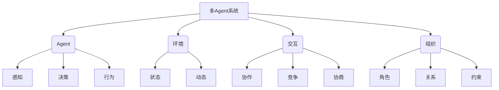
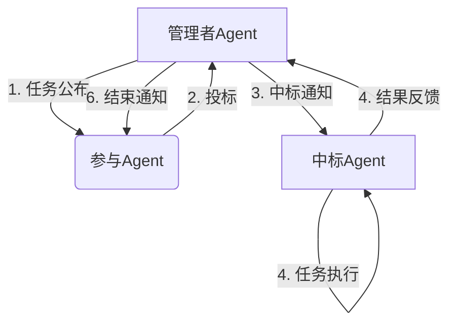
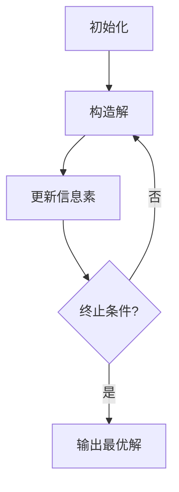

# 多Agent系统(Multi-Agent System)原理与代码实战案例讲解

## 1. 背景介绍

### 1.1 问题的由来

在现实世界中,存在着许多复杂的问题需要多个智能体协同工作来解决。传统的集中式系统在处理这些问题时往往会遇到诸多困难,例如:

- **可扩展性差**: 随着问题规模的增大,集中式系统的计算复杂度会急剧上升,导致性能瓶颈。
- **容错性低**: 集中式系统存在单点故障风险,一旦中心节点发生故障,整个系统将瘫痪。
- **异构性**: 现实问题往往涉及多种异构数据源和计算资源,集中式系统难以有效整合。
- **动态环境**: 现实环境是动态变化的,集中式系统缺乏灵活性,难以适应环境变化。

为了应对这些挑战,多Agent系统(Multi-Agent System, MAS)应运而生。

### 1.2 研究现状

多Agent系统是分布式人工智能(Distributed Artificial Intelligence, DAI)的一个重要分支。自20世纪80年代兴起以来,MAS已经成为人工智能、计算机科学、控制理论等多个学科交叉的研究热点。

目前,MAS已经在众多领域得到了广泛应用,例如:

- **智能交通系统**: 车辆协调、路径规划、拥堵预测等。
- **智能制造**: 工厂调度、过程控制、供应链优化等。
- **电子商务**: 自动化谈判、在线拍卖、推荐系统等。
- **网络管理**: 网络监控、负载均衡、入侵检测等。
- **机器人系统**: 多机器人协作、任务分配、群体控制等。

### 1.3 研究意义

研究MAS不仅有重要的理论价值,也具有广阔的应用前景:

- **理论意义**: MAS融合了分布式计算、人工智能、博弈论、控制论等多个领域的理论和方法,是一个富有挑战的交叉学科。研究MAS有助于推动相关学科的发展,拓展人工智能的应用边界。

- **应用价值**: MAS为解决复杂问题提供了一种全新的分布式智能解决方案。通过多Agent协同,可以提高系统的灵活性、鲁棒性、异构性集成能力和可扩展性,为众多领域的实际应用带来革命性变革。

### 1.4 本文结构

本文将全面介绍多Agent系统的基本原理、核心算法、数学模型、实现技术和应用实践。具体内容安排如下:

- 第2章阐述MAS的核心概念及其内在联系。
- 第3章详细讲解MAS中的核心算法原理和具体操作步骤。
- 第4章构建MAS的数学模型,并推导公式和案例分析。
- 第5章提供MAS的代码实例,并进行源码级解释说明。
- 第6章介绍MAS在不同领域的实际应用场景。
- 第7章推荐相关的学习资源、开发工具和论文。
- 第8章总结MAS的研究成果、发展趋势和面临的挑战。
- 第9章列出常见问题并给出解答。

## 2. 核心概念与联系

在深入探讨MAS的细节之前,我们有必要先理解MAS的核心概念及其内在联系。

### 2.1 Agent

Agent是MAS的基本构造单元,是一种具有自主性的软件或硬件实体。Agent能够感知环境,根据自身的知识库进行决策,并通过执行相应的行为来影响环境。

Agent通常具备以下特性:

- **自主性(Autonomy)**: Agent可以在无人干预的情况下,自主地感知环境、制定计划并执行行为。
- **社会能力(Social Ability)**: Agent可以与其他Agent进行交互,包括协作、竞争和协商等。
- **反应性(Reactivity)**: Agent能够及时感知环境的变化并作出相应反应。
- **主动性(Pro-activeness)**: Agent不仅被动响应环境变化,还能够根据自身的目标和动机主动采取行动。

### 2.2 环境

环境是指Agent所处的外部世界,包括各种物理或虚拟的客观存在。环境具有动态变化的状态,并受到Agent行为的影响。

环境的主要特征包括:

- **可访问性(Accessibility)**: Agent可以通过感知器获取环境的部分状态信息。
- **确定性(Deterministic)**:在给定环境状态和Agent行为的情况下,环境的后续状态是确定的。
- **静态性(Static)**: 环境状态在Agent执行行为之前和之后保持不变。
- **离散性(Discrete)**: 环境的状态、时间、Agent行为都是离散的,而非连续的。

### 2.3 交互

Agent之间通过交互来协调行为和共享信息。交互是MAS中至关重要的一个方面,因为它使得Agent能够形成有组织的集体行为。

Agent之间的交互方式主要包括:

- **协作(Cooperation)**: Agent为了实现共同目标而协调行为。
- **竞争(Competition)**: Agent为了实现自身目标而与其他Agent展开竞争。
- **协商(Negotiation)**: Agent通过相互妥协来解决利益冲突。

### 2.4 组织

组织定义了Agent之间的关系、角色和约束,为Agent的交互提供了一个结构化的框架。合理的组织结构有助于提高MAS的效率和可靠性。

组织的主要组成部分包括:

- **角色(Role)**: 定义了Agent在组织中的职责和权限。
- **关系(Relation)**: 规定了Agent之间的从属、控制等层级关系。
- **约束(Constraint)**: 限制了Agent的行为,确保其遵守组织的规则和目标。

## 3. 核心算法原理 & 具体操作步骤

MAS中涉及了许多核心算法,用于解决Agent决策、协作、任务分配等问题。本节将重点介绍其中两种最为经典和重要的算法。

### 3.1 算法原理概述

#### 3.1.1 Contract Net协议

Contract Net协议是一种著名的分布式任务分配算法,它模拟了市场机制中的招标流程。算法的基本思想是:管理者Agent首先公布一个任务,其他Agent根据自身的能力和偏好对该任务进行投标,管理者Agent再从中选择最合适的Agent来执行任务。

Contract Net协议的主要优点是:

- 分布式和异步执行,不存在单点故障风险。
- 支持动态环境,Agent可以根据情况调整投标策略。
- 具有一定的容错能力,如果某个Agent执行失败,管理者可以重新分配任务。

#### 3.1.2 蚁群算法

蚁群算法是一种用于求解组合优化问题的启发式算法,其灵感来源于蚂蚁在寻找食物路径时的集体行为。

算法的核心思想是:每只蚂蚁在行走过程中会释放出信息素,其他蚂蚁可以嗅到信息素并趋向于选择信息素浓度较高的路径。随着时间推移,越来越多的蚂蚁会选择相同的优质路径,最终收敛到最优解。

蚁群算法的主要优点是:

- 正反馈机制使得算法能够快速收敛到优质解。
- 具有分布式计算和积体智能特性,适合并行计算。
- 算法简单,可以应用于多种组合优化问题。

### 3.2 算法步骤详解

#### 3.2.1 Contract Net协议

1. **任务公布**: 管理者Agent向所有其他Agent广播一个任务公告,包含任务描述、约束条件、报价截止时间等信息。

2. **投标**: 接收到任务公告的Agent根据自身的状态(如:计算能力、剩余资源等)决定是否投标。如果决定投标,则向管理者Agent发送一份投标书,包含完成任务的计划和报价。

3. **中标**: 报价截止时间到后,管理者Agent从所有投标中选择最优者(通常以完成时间和报价作为评判标准),并将中标结果通知给中标Agent。

4. **任务执行**: 中标Agent执行任务,并将结果反馈给管理者Agent。

5. **结果汇总**: 管理者Agent收集所有子任务的结果并进行汇总,完成整个任务。

6. **收尾工作**: 管理者Agent向所有参与投标的Agent发送任务结束通知。

#### 3.2.2 蚁群算法

1. **初始化**:  
    - 随机生成一定数量的蚂蚁(解的搜索实例)
    - 为每只蚂蚁分配初始城市(解的初始部分)
    - 初始化信息素矩阵(解的启发信息)

2. **构造解**:  
    - 对每只蚂蚁,根据信息素浓度和启发函数,选择下一个城市并加入路径
    - 当所有蚂蚁构造完整的路径后,进入下一步

3. **更新信息素**:  
    - 计算每条路径的长度(解的质量)
    - 在较短路径上释放更多信息素,较长路径上信息素逐渐挥发
    - 更新信息素矩阵

4. **判断终止条件**:
    - 如果达到最大迭代次数或收敛到最优解,算法终止
    - 否则,返回步骤2继续迭代

### 3.3 算法优缺点

#### 3.3.1 Contract Net协议

**优点**:

- 分布式和异步执行,具有良好的鲁棒性和容错能力。
- 支持动态环境,Agent可以根据情况调整投标策略。
- 通过市场机制实现任务的高效分配。

**缺点**:

- 存在通信开销,需要频繁发送任务公告和投标信息。
- 中标过程可能会引入一定的时延。
- 需要一个可靠的管理者Agent作为协调者。

#### 3.3.2 蚁群算法

**优点**:

- 正反馈机制使得算法能够快速收敛到优质解。
- 具有分布式计算和集体智能特性,适合并行计算。
- 算法简单,可以应用于多种组合优化问题。

**缺点**:

- 容易陷入局部最优,需要合理设置参数以保证全局搜索能力。
- 对于高维组合优化问题,收敛速度可能较慢。
- 需要对算法进行一定的问题特定调优,以提高性能。

### 3.4 算法应用领域

#### 3.4.1 Contract Net协议

Contract Net协议可以应用于各种需要动态分配任务的分布式系统,例如:

- **智能制造**: 在工厂中分配生产任务、调度机器设备。
- **网格计算**: 在计算网格中分配计算任务和存储任务。
- **机器人系统**: 分配探索、监视、搬运等任务给多个机器人协作完成。
- **电子商务**: 分配运输、配送等任务,优化供应链管理。

#### 3.4.2 蚁群算法

蚁群算法主要用于求解各种组合优化问题,包括但不限于:

- **旅行商问题(TSP)**: 求解给定城市之间的最短周游路径。
- **车辆路径规划**: 求解车辆投送的最优路线。
- **作业调度**: 求解作业在多机器上的最优执行顺序。