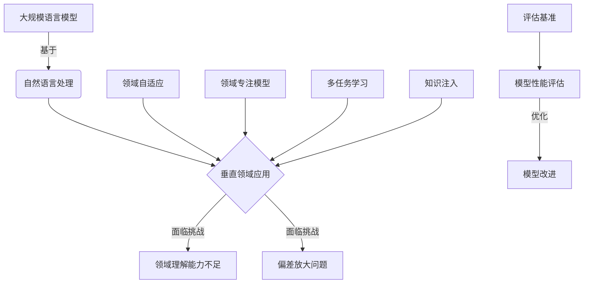

# 大规模语言模型从理论到实践 垂直领域评估

## 1. 背景介绍

### 1.1 问题的由来

随着人工智能技术的快速发展,大规模语言模型(Large Language Models, LLMs)已经成为自然语言处理领域的核心技术之一。这些模型通过在海量文本数据上进行预训练,学习到了丰富的语言知识和上下文理解能力,可以应用于广泛的自然语言处理任务,如机器翻译、问答系统、文本生成等。

然而,现有的大规模语言模型大多是在通用领域的数据上训练的,缺乏对特定垂直领域的深入理解。这导致这些模型在应用于特定领域时,可能会出现性能下降、偏差放大等问题。因此,如何评估和优化大规模语言模型在垂直领域的表现,成为了一个亟待解决的挑战。

### 1.2 研究现状

近年来,一些研究工作致力于探索大规模语言模型在垂直领域的应用。主要的研究方向包括:

1. **领域自适应(Domain Adaptation)**: 通过在通用预训练模型的基础上,利用垂直领域的数据进行进一步微调,来提高模型在特定领域的性能。

2. **领域专注模型(Domain-Specific Models)**: 从头开始训练专注于特定垂直领域的语言模型,以获得更好的领域理解能力。

3. **多任务学习(Multi-Task Learning)**: 在模型训练过程中同时优化多个与垂直领域相关的任务,以提高模型的泛化能力。

4. **知识注入(Knowledge Injection)**: 将外部知识库或领域知识直接注入到语言模型中,增强其对特定领域的理解。

5. **评估基准(Evaluation Benchmarks)**: 构建针对特定垂直领域的评估基准,用于全面评估语言模型的性能表现。

虽然已有一些初步的研究成果,但大规模语言模型在垂直领域的应用仍面临诸多挑战,需要进一步的理论探索和实践验证。

### 1.3 研究意义

评估和优化大规模语言模型在垂直领域的表现,对于推动自然语言处理技术的发展具有重要意义:

1. **提高模型性能**: 通过针对性的优化,可以显著提升语言模型在特定垂直领域的性能表现,为相关应用场景带来更好的用户体验。

2. **减少偏差放大**: 大规模语言模型在通用领域训练时可能会absorb一些潜在的偏差,在垂直领域应用时这些偏差可能会被放大。通过领域适应等方法,可以有效减少这种偏差放大的问题。

3. **促进领域知识传播**: 将领域知识融入语言模型,可以促进特定领域知识的传播和普及,为相关领域的研究和应用提供支持。

4. **拓展应用场景**: 通过提高语言模型在垂直领域的性能,可以拓展其在更多特定场景的应用,释放人工智能技术的潜力。

5. **推动理论创新**: 探索大规模语言模型在垂直领域的应用,需要在模型架构、训练策略、评估方法等多个方面进行理论创新,推动自然语言处理技术的发展。

### 1.4 本文结构

本文将全面探讨大规模语言模型在垂直领域的评估和优化问题。首先介绍相关的核心概念和技术,包括大规模语言模型、垂直领域等。然后深入分析核心算法原理和数学模型,并通过实际案例进行详细讲解。接下来介绍项目实践中的代码实现细节,并展示运行结果。随后探讨大规模语言模型在不同垂直领域的应用场景,并给出工具和资源推荐。最后总结研究成果,展望未来发展趋势和面临的挑战。

## 2. 核心概念与联系

大规模语言模型(LLMs)是自然语言处理领域的核心技术,通过在海量文本数据上进行预训练,学习到丰富的语言知识和上下文理解能力。然而,当将这些通用模型应用于特定的垂直领域时,由于缺乏对该领域的深入理解,可能会导致性能下降、偏差放大等问题。

为了解决这一挑战,研究人员提出了多种方法,包括:

1. **领域自适应(Domain Adaptation)**: 在通用预训练模型的基础上,利用垂直领域的数据进行进一步微调,以提高模型在该领域的性能。

2. **领域专注模型(Domain-Specific Models)**: 从头开始训练专注于特定垂直领域的语言模型,以获得更好的领域理解能力。

3. **多任务学习(Multi-Task Learning)**: 在模型训练过程中同时优化多个与垂直领域相关的任务,提高模型的泛化能力。

4. **知识注入(Knowledge Injection)**: 将外部知识库或领域知识直接注入到语言模型中,增强其对特定领域的理解。

另一个重要的方面是构建针对特定垂直领域的评估基准,用于全面评估语言模型的性能表现。基于评估结果,可以对模型进行进一步优化和改进。

通过上述方法的综合应用,我们可以提高大规模语言模型在垂直领域的性能,减少偏差放大问题,促进领域知识的传播,拓展应用场景,并推动自然语言处理技术的理论创新。

## 3. 核心算法原理 & 具体操作步骤

### 3.1 算法原理概述

针对大规模语言模型在垂直领域的应用,主要的算法原理包括:

1. **领域自适应(Domain Adaptation)**:
   - 原理: 利用垂直领域的数据对通用预训练模型进行进一步微调,使其适应特定领域的语言特征和知识分布。
   - 常见方法: 基于实例的微调、基于特征的微调、对抗训练等。

2. **领域专注模型(Domain-Specific Models)**:
   - 原理: 从头开始训练专注于特定垂直领域的语言模型,使其能够更好地捕捉该领域的语言模式和知识结构。
   - 常见方法: 基于领域语料库的预训练、领域术语注入、知识蒸馏等。

3. **多任务学习(Multi-Task Learning)**:
   - 原理: 在模型训练过程中同时优化多个与垂直领域相关的任务,提高模型在该领域的泛化能力。
   - 常见方法: 硬参数共享、软参数共享、贝叶斯多任务学习等。

4. **知识注入(Knowledge Injection)**:
   - 原理: 将外部知识库或领域知识直接注入到语言模型中,增强其对特定领域的理解。
   - 常见方法: 基于实体链接的知识注入、基于图神经网络的知识注入、基于注意力机制的知识融合等。

5. **评估基准(Evaluation Benchmarks)**:
   - 原理: 构建针对特定垂直领域的评估基准,包括数据集、评估指标和评测流程,用于全面评估语言模型的性能表现。
   - 常见方法: 基于人工标注的数据集构建、基于自动化流程的数据集生成、定制化评估指标设计等。

上述算法原理为大规模语言模型在垂直领域的应用提供了理论基础和技术支撑。下面将对这些核心算法的具体操作步骤进行详细阐述。

### 3.2 算法步骤详解

#### 3.2.1 领域自适应算法

领域自适应算法的主要步骤如下:

1. **数据准备**:
   - 收集与目标垂直领域相关的文本数据,包括领域语料库、知识库等。
   - 对数据进行预处理,如去重、分词、标注等。

2. **模型初始化**:
   - 选择一个通用的大规模预训练语言模型作为基础模型,如BERT、GPT等。
   - 根据任务需求,对模型进行适当的结构调整,如添加任务特定的输出层。

3. **领域自适应训练**:
   - 将准备好的垂直领域数据作为输入,对基础模型进行进一步的微调训练。
   - 根据不同的自适应方法,采用不同的训练策略和损失函数,如基于实例的微调、基于特征的微调、对抗训练等。

4. **模型评估与优化**:
   - 在垂直领域的评估数据集上,评估自适应模型的性能表现。
   - 根据评估结果,调整训练超参数、优化损失函数等,进行多轮迭代训练。

5. **模型部署与应用**:
   - 将优化后的自适应模型部署到实际的应用系统中。
   - 根据实际应用场景的反馈,持续优化和更新模型。

#### 3.2.2 领域专注模型算法

领域专注模型算法的主要步骤如下:

1. **数据准备**:
   - 收集与目标垂直领域相关的大量文本数据,包括领域语料库、知识库等。
   - 对数据进行预处理,如去重、分词、标注等。

2. **模型初始化**:
   - 选择一个适合的语言模型架构,如Transformer、LSTM等。
   - 根据垂直领域的特点,对模型进行适当的结构调整,如添加领域术语嵌入层。

3. **领域专注预训练**:
   - 利用准备好的垂直领域数据,从头开始对模型进行预训练。
   - 采用适合该领域的预训练目标和损失函数,如掩码语言模型、下一句预测等。
   - 可以结合知识蒸馏、术语注入等技术,融入领域知识。

4. **模型评估与优化**:
   - 在垂直领域的评估数据集上,评估专注模型的性能表现。
   - 根据评估结果,调整模型架构、优化训练策略等,进行多轮迭代训练。

5. **模型部署与应用**:
   - 将优化后的专注模型部署到实际的应用系统中。
   - 根据实际应用场景的反馈,持续优化和更新模型。

#### 3.2.3 多任务学习算法

多任务学习算法的主要步骤如下:

1. **任务准备**:
   - 确定与目标垂直领域相关的多个自然语言处理任务,如文本分类、实体识别、关系抽取等。
   - 为每个任务准备相应的训练数据和评估数据。

2. **模型初始化**:
   - 选择一个适合的多任务学习模型架构,如硬参数共享、软参数共享等。
   - 根据任务需求,对模型进行适当的结构调整,如添加任务特定的输出层。

3. **多任务联合训练**:
   - 将多个任务的训练数据合并,对模型进行联合训练。
   - 采用适合的多任务学习策略,如任务权重调节、梯度归一化等。
   - 可以结合元学习、贝叶斯优化等技术,提高模型的泛化能力。

4. **模型评估与优化**:
   - 在每个任务的评估数据集上,分别评估模型的性能表现。
   - 根据评估结果,调整任务权重、优化损失函数等,进行多轮迭代训练。

5. **模型部署与应用**:
   - 将优化后的多任务模型部署到实际的应用系统中。
   - 根据实际应用场景的反馈,持续优化和更新模型。

#### 3.2.4 知识注入算法

知识注入算法的主要步骤如下:

1. **知识准备**:
   - 收集与目标垂直领域相关的知识库、本体库等结构化知识源。
   - 对知识进行预处理和清洗,构建适合注入的