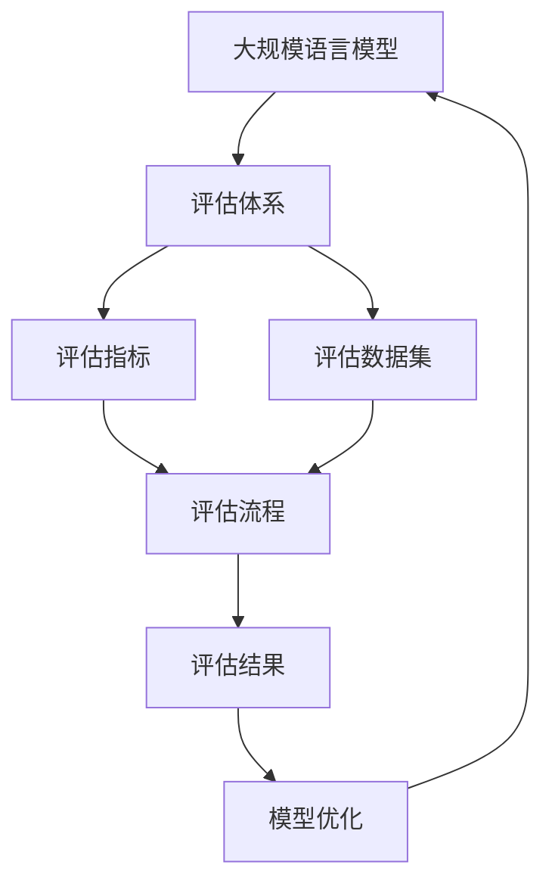

# 大规模语言模型从理论到实践 大语言模型评估体系

## 1. 背景介绍

### 1.1 问题的由来

在过去的几年里,大规模语言模型(Large Language Models, LLMs)取得了令人瞩目的进展,展现出惊人的自然语言理解和生成能力。这些模型通过在大量文本数据上进行预训练,学习到了丰富的语言知识和上下文关联,可以在各种自然语言处理任务上取得出色的表现。

然而,随着模型规模的不断扩大和应用场景的多样化,如何全面、客观地评估这些大规模语言模型的能力和局限性,成为了一个亟待解决的问题。传统的评估方法往往局限于特定的基准测试集,难以全面反映模型在实际应用场景中的表现。此外,大规模语言模型的行为也存在一些潜在的风险和不确定性,如偏见、不一致性、事实错误等,需要更加严格和全面的评估体系来识别和缓解这些问题。

### 1.2 研究现状

目前,针对大规模语言模型的评估,学术界和工业界都在积极探索和尝试。一些主要的研究方向包括:

1. **基准测试集评估**:构建覆盖不同任务和领域的大规模基准测试集,测试模型在各种场景下的表现。例如,SuperGLUE、ANLI、TruthfulQA等基准测试集。

2. **人工评估**:邀请人类评估员对模型输出进行评分和反馈,评估模型的自然语言生成质量、一致性、事实准确性等方面。

3. **对抗性评估**:设计对抗性样本或测试用例,测试模型在遇到adversarial输入时的鲁棒性和安全性。

4. **行为一致性评估**:通过多次查询相同的问题,评估模型输出的一致性和稳定性。

5. **偏差和公平性评估**:分析模型在处理不同人口统计学属性(如年龄、性别、种族等)时是否存在偏差和不公平现象。

6. **能力分析**:深入研究模型在特定能力(如常识推理、多步骤推理、知识一致性等)上的表现。

7. **可解释性分析**:探索模型内部的决策机制,提高模型的可解释性和可信度。

这些研究为构建更加全面和客观的大规模语言模型评估体系奠定了基础。然而,由于大规模语言模型的复杂性和不确定性,构建一个统一、标准化的评估框架仍然是一个巨大的挑战。

### 1.3 研究意义

全面、客观地评估大规模语言模型的能力和局限性,对于促进这一领域的健康发展至关重要。一个完善的评估体系可以带来以下重要意义:

1. **指导模型开发和优化**:通过评估结果,我们可以更好地了解模型的优缺点,从而指导模型架构、训练策略和数据处理的优化。

2. **保障模型的安全性和可靠性**:及时发现和修复模型中存在的偏差、不一致性和事实错误,提高模型在实际应用中的安全性和可靠性。

3. **促进模型的可解释性和可信度**:深入理解模型的内在机制和决策过程,增强模型的透明度和可解释性,从而提高用户对模型的信任度。

4. **推动公平和包容性**:识别和缓解模型在处理不同人口统计学属性时的偏差,促进人工智能系统的公平性和包容性。

5. **规范化模型评估标准**:建立统一的评估框架和标准,方便不同模型之间的对比和选择,推动整个领域的发展。

综上所述,构建一个全面、客观的大规模语言模型评估体系,对于充分发挥这些模型的潜力,并确保其安全、可靠和公平地应用于实际场景,具有重要的理论和实践意义。

### 1.4 本文结构

本文将全面探讨大规模语言模型评估体系的构建,内容安排如下:

1. 背景介绍:阐述研究问题的由来、现状和意义。
2. 核心概念与联系:介绍评估体系中的关键概念及其相互关系。
3. 核心算法原理与具体操作步骤:详细解释评估算法的原理和实现步骤。
4. 数学模型和公式:建立评估体系的数学模型,并推导相关公式。
5. 项目实践:代码实例和详细解释,展示评估体系的实际应用。
6. 实际应用场景:探讨评估体系在不同领域的应用前景。
7. 工具和资源推荐:介绍相关的学习资源、开发工具和参考文献。
8. 总结:总结研究成果,展望未来发展趋势和面临的挑战。
9. 附录:常见问题解答,解决读者的疑惑。

接下来,我们将逐步深入探讨大规模语言模型评估体系的各个方面。

## 2. 核心概念与联系

在构建大规模语言模型评估体系的过程中,有几个核心概念需要了解和掌握,它们之间存在着密切的联系。

### 2.1 大规模语言模型

大规模语言模型(Large Language Models, LLMs)是指通过在大量文本数据上进行预训练,学习到丰富的语言知识和上下文关联的深度神经网络模型。这些模型具有十亿甚至千亿级别的参数,能够在各种自然语言处理任务上展现出惊人的性能。

典型的大规模语言模型包括GPT-3、PaLM、Chinchilla、BLOOM等。它们可以应用于文本生成、问答系统、机器翻译、文本摘要等多种场景。

### 2.2 评估指标

评估指标是衡量模型性能的关键标准。在大规模语言模型评估体系中,常用的评估指标包括:

1. **精确度(Accuracy)**:模型在特定任务上的准确率。
2. **困惑度(Perplexity)**:衡量模型对语言模型的拟合程度。
3. **BLEU分数(Bilingual Evaluation Understudy)**:评估机器翻译质量的指标。
4. **Rouge分数(Recall-Oriented Understudy for Gisting Evaluation)**:评估文本摘要质量的指标。
5. **一致性分数(Consistency Score)**:衡量模型输出在多次查询相同问题时的一致性。
6. **事实一致性分数(Factual Consistency Score)**:评估模型输出与已知事实的一致程度。
7. **偏差分数(Bias Score)**:测量模型在处理不同人口统计学属性时的偏差程度。

不同的评估指标侧重于模型不同的方面,需要根据具体的评估目标和场景进行选择和组合。

### 2.3 评估数据集

评估数据集是用于测试和评估模型性能的数据集合。在大规模语言模型评估体系中,常见的评估数据集包括:

1. **基准测试集**:覆盖多种任务和领域的大规模基准测试集,如SuperGLUE、ANLI、TruthfulQA等。
2. **人工标注数据集**:由人工评估员对模型输出进行标注和评分的数据集。
3. **对抗性数据集**:包含对抗性样本或测试用例的数据集,用于评估模型的鲁棒性和安全性。
4. **行为一致性数据集**:通过多次查询相同问题构建的数据集,用于评估模型输出的一致性。
5. **偏差和公平性数据集**:包含不同人口统计学属性的数据集,用于测试模型在处理这些属性时是否存在偏差。

评估数据集的质量和覆盖面直接影响评估结果的准确性和可靠性,因此构建高质量、多样化的评估数据集是评估体系中的重要环节。

### 2.4 评估流程

评估流程是指将模型输入到评估体系中,并获得评估结果的整个过程。一个典型的评估流程包括以下步骤:

1. **数据预处理**:对评估数据集进行必要的预处理,如分词、标注、过滤等。
2. **模型推理**:将预处理后的数据输入到大规模语言模型中,获取模型的输出结果。
3. **评估计算**:根据预定义的评估指标,计算模型输出与参考答案或标准答案之间的差异或分数。
4. **结果分析**:对评估结果进行深入分析,识别模型的优缺点、偏差和局限性。
5. **反馈优化**:根据评估结果,对模型架构、训练策略或数据处理方式进行优化和改进。

评估流程的自动化和标准化是构建高效、可靠的评估体系的关键。

### 2.5 核心概念关系

上述核心概念之间存在着密切的关联,它们共同构成了大规模语言模型评估体系的基础框架。具体关系如下:

1. 大规模语言模型是评估体系的评估对象。
2. 评估指标提供了衡量模型性能的标准和维度。
3. 评估数据集为评估过程提供了测试数据的来源。
4. 评估流程将模型、评估指标和评估数据集整合在一起,形成了完整的评估过程。
5. 评估结果反馈到模型优化环节,指导模型的持续改进和发展。

这些概念相互依赖、相互影响,共同构建了一个完整的大规模语言模型评估体系。只有将它们有机结合,才能全面、客观地评估模型的能力和局限性,推动整个领域的健康发展。

## 3. 核心算法原理与具体操作步骤

在大规模语言模型评估体系中,核心算法原理和具体操作步骤是实现全面、客观评估的关键。本节将详细阐述这一过程。

### 3.1 算法原理概述

大规模语言模型评估算法的核心思想是将模型输出与参考答案或标准答案进行对比,根据预定义的评估指标计算出一个分数或差异值,从而量化模型的性能表现。

具体来说,评估算法包括以下几个主要步骤:

1. **数据预处理**:对评估数据集进行必要的预处理,如分词、标注、过滤等,以确保数据的质量和一致性。

2. **模型推理**:将预处理后的数据输入到大规模语言模型中,获取模型的输出结果。

3. **输出对齐**:将模型输出与参考答案或标准答案进行对齐,处理格式不一致、顺序不同等问题。

4. **评分计算**:根据预定义的评估指标,计算模型输出与参考答案之间的差异或分数。常用的评估指标包括精确度、困惑度、BLEU分数、Rouge分数等。

5. **结果汇总**:对不同数据样本的评估结果进行汇总和统计,得出模型在整个评估数据集上的综合表现分数。

6. **分析诊断**:深入分析评估结果,识别模型的优缺点、偏差和局限性,为后续的模型优化提供指导。

该算法的优点在于能够量化和客观地评估模型的性能,并且可以根据不同的评估目标和场景灵活选择和组合不同的评估指标。同时,通过分析诊断环节,可以深入理解模型的内在机制和决策过程,提高模型的可解释性和可信度。

### 3.2 算法步骤详解

接下来,我们将详细解释大规模语言模型评估算法的具体实现步骤。

#### 步骤1: 数据预处理

数据预处理是评估算法的第一步,其目的是确保评估数据集的质量和一致性。常见的预处理操作包括:

1. **分词(Tokenization)**:将文本数据分割成词元(token)序列,以便后续的模型输入。
2. **标注(Annotation)**:对数据进行人工或自动标注,如命名实体识别、语义角色标注等,为评估提供参考答案或标准答案。
3. **过滤(