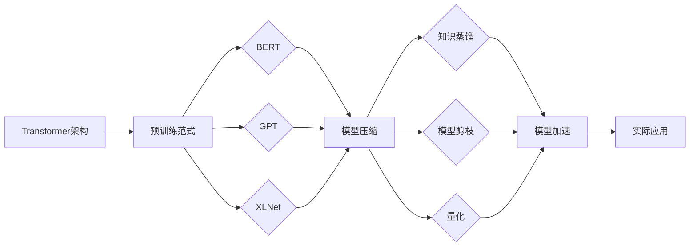

# 大规模语言模型从理论到实践 实践思考

关键词：大规模语言模型、Transformer、BERT、GPT、知识蒸馏、模型压缩、模型部署

## 1. 背景介绍
### 1.1  问题的由来
近年来，随着深度学习技术的飞速发展，大规模语言模型(Large Language Models, LLMs)已经成为自然语言处理(NLP)领域的研究热点。LLMs通过在海量文本数据上进行预训练，能够学习到丰富的语言知识和通用语义表示，在多种NLP任务上取得了显著的性能提升。然而，LLMs往往包含数以亿计的参数，训练和部署成本高昂，给实际应用带来了挑战。因此，如何在保证模型性能的同时降低计算开销，实现LLMs的高效训练和推理，成为了亟待解决的问题。

### 1.2  研究现状 
目前，学术界和工业界已经提出了多种优化LLMs的方法。一方面，研究人员通过设计更高效的模型架构，如Transformer-XL、Reformer等，减少了序列长度限制，降低了内存占用。另一方面，知识蒸馏、模型剪枝、量化等模型压缩技术被广泛应用于LLMs，在可接受的性能损失下大幅降低了模型尺寸。此外，并行计算、模型分布式存储等也被用于加速LLMs的训练和推理过程。尽管如此，如何权衡模型性能、计算效率和部署成本，构建满足实际需求的LLMs仍是一个开放性问题。

### 1.3  研究意义
探索LLMs的高效训练和部署方法具有重要的理论和实践意义。在理论层面，它有助于加深我们对深度语言模型的理解，推动NLP基础理论的发展。在实践层面，高效的LLMs能够以更低的计算成本应用于更广泛的场景，如智能客服、语义搜索、知识问答等，产生可观的商业价值和社会效益。因此，本文旨在梳理LLMs优化的主要技术路线，总结相关研究进展，并结合实践经验提出改进建议，为后续工作提供参考。

### 1.4  本文结构
本文后续章节安排如下：第2节介绍LLMs的核心概念和技术基础；第3节重点阐述LLMs的典型优化算法，包括知识蒸馏、模型剪枝、低秩分解等；第4节建立LLMs优化的数学模型，推导相关理论公式，并给出案例分析；第5节提供LLMs的代码实现示例，讲解开发细节；第6节总结LLMs的主要应用场景及未来趋势；第7节推荐LLMs相关的学习资源和开发工具；第8节对全文进行总结，指出LLMs未来的机遇与挑战；第9节列举LLMs研究中的常见问题，并给出参考答案。

## 2. 核心概念与联系

大规模语言模型的核心是利用深度神经网络，在大规模文本语料上进行预训练，习得通用的语言表示。其中，Transformer架构凭借并行计算和长程依赖捕获的优势，成为了主流LLMs的首选。代表性的Transformer语言模型包括：

- BERT(Bidirectional Encoder Representations from Transformers)：通过Masked Language Modeling(MLM)和Next Sentence Prediction(NSP)预训练任务，学习双向语义表示，刷新了多项NLP任务的性能记录。

- GPT(Generative Pre-trained Transformer)：采用单向语言模型预训练，擅长文本生成任务。GPT-2和GPT-3进一步扩大了模型和数据规模，展现出惊人的零样本学习能力。

- XLNet：结合了BERT和GPT的优点，引入Permutation Language Modeling(PLM)，在保留双向信息的同时实现自回归生成。

LLMs的训练需要消耗大量计算资源，推理速度也难以满足实时响应的需求。因此，模型压缩成为LLMs落地的关键。知识蒸馏是经典的模型压缩方法，通过训练小模型（学生）模仿大模型（教师）的行为，达到参数减少而性能相近的效果。模型剪枝和量化则直接对预训练模型进行裁剪和低比特表示，进一步压缩模型尺寸。

总的来说，大规模语言模型的研究涉及模型架构、预训练范式、压缩算法、加速优化等多个方面，下图展示了它们之间的关联：

## 3. 核心算法原理 & 具体操作步骤
### 3.1  算法原理概述
LLMs优化的主要算法包括知识蒸馏、模型剪枝和量化。其中，知识蒸馏利用教师-学生网络框架，通过最小化二者输出的差异来训练学生网络，使其在参数更少的情况下接近教师网络的性能。模型剪枝则根据参数或中间激活的重要性对原始网络进行裁剪，去除冗余结构。量化将模型权重由浮点数映射为低比特整数，减小存储和计算开销。

### 3.2  算法步骤详解

#### 知识蒸馏
1. 训练教师模型：在大规模语料上训练一个性能优异但参数量大的教师模型。
2. 准备学生模型：构建一个参数量小得多的学生模型。
3. 蒸馏训练：固定教师模型参数，利用教师模型的输出作为软目标，训练学生模型去拟合软目标。
4. 微调：在下游任务上微调学生模型，进一步提升其性能。

#### 模型剪枝
1. 训练原始模型：正常方式训练得到原始的大规模语言模型。
2. 计算重要性：定义参数或神经元的重要性度量，如L1范数、梯度等。
3. 剪枝：根据设定的稀疏度阈值，去除重要性较低的连接或神经元。
4. 微调：在剪枝后的稀疏模型上进行微调，恢复部分性能损失。
5. 迭代剪枝：重复步骤2-4，逐步提高稀疏度，直到达到预期的压缩比。

#### 量化
1. 训练原始模型：正常方式训练得到原始的大规模语言模型。
2. 校准：在训练集上运行模型，统计每层激活的数值范围。
3. 量化映射：根据数值范围将浮点权重和激活映射到低比特整数。
4. 量化感知训练：在量化条件下重新训练模型，最小化量化带来的损失。
5. 部署：将量化后的模型转换为适合部署的格式，如INT8。

### 3.3  算法优缺点

- 知识蒸馏的优点是可以显著降低模型尺寸，且理论上能够保留原模型的大部分性能。缺点是需要额外的蒸馏训练步骤，对教师模型的选择和超参数调节较为敏感。
- 模型剪枝的优点是可以直接对预训练模型进行压缩，无需重新训练。缺点是稀疏模型不利于硬件加速，剪枝率较高时会导致明显的性能降级。
- 量化的优点是能够充分利用硬件对整数计算的优化，加速推理过程。缺点是量化精度受限，且需要对模型进行重训练以适应量化带来的损失。

### 3.4  算法应用领域
上述优化算法已经在多个大规模语言模型上得到成功应用，使其能够在资源受限的场景下发挥作用。例如，谷歌利用知识蒸馏将BERT压缩为TinyBERT，在移动设备上实现了高效的语义理解。微软使用Transformer级别剪枝将BERT加速3倍，并应用于大规模语义搜索。英伟达则展示了低比特量化在GPT模型上的效果，实现了7倍的推理加速。未来，LLMs优化技术有望进一步拓展其应用边界，服务更多实际需求。

## 4. 数学模型和公式 & 详细讲解 & 举例说明
### 4.1  数学模型构建
我们以知识蒸馏为例，建立相应的数学模型。设教师模型为$T$，学生模型为$S$，训练样本为$(x,y)$。教师模型的输出概率分布为$P_T(y|x)$，学生模型的输出概率分布为$P_S(y|x)$。知识蒸馏的目标是最小化二者的差异，通常采用KL散度作为损失函数：

$$\mathcal{L}_{KD}=\sum_{(x,y)} \mathrm{KL}(P_T(y|x)||P_S(y|x))$$

其中，KL散度的定义为：

$$\mathrm{KL}(P||Q)=\sum_i P(i) \log \frac{P(i)}{Q(i)}$$

直观地说，KL散度衡量了两个分布之间的差异，值越小表示二者越接近。因此，最小化$\mathcal{L}_{KD}$意味着学生模型的输出分布逼近教师模型。

### 4.2  公式推导过程
为了优化$\mathcal{L}_{KD}$，我们需要对学生模型的参数$\theta_S$求梯度。根据KL散度的定义，可以推导出：

$$\nabla_{\theta_S} \mathcal{L}_{KD} = \sum_{(x,y)} \sum_i P_T(y_i|x) \nabla_{\theta_S} \log P_S(y_i|x)$$

进一步，假设学生模型的输出经过Softmax归一化：

$$P_S(y_i|x)=\frac{\exp(z_i/\tau)}{\sum_j \exp(z_j/\tau)}$$

其中，$z_i$是学生模型最后一层对应第$i$个类别的输出，$\tau$是温度超参数，控制分布的平滑度。将Softmax公式代入，可得：

$$\nabla_{\theta_S} \mathcal{L}_{KD} = \frac{1}{\tau} \sum_{(x,y)} \sum_i P_T(y_i|x) (P_S(y_i|x) - \mathbf{1}(y=y_i)) \nabla_{\theta_S} z_i$$

其中，$\mathbf{1}(y=y_i)$是指示函数，当$y=y_i$时取1，否则取0。上式表明，学生模型的梯度由两部分组成：一部分是学生模型的输出与教师模型的软目标之差，另一部分是学生模型的输出与真实标签之差。因此，知识蒸馏实际上是软硬目标的结合。

### 4.3  案例分析与讲解
我们以BERT模型为例，说明知识蒸馏的具体应用。设教师模型为BERT-base(12层，768维隐藏状态，110M参数)，学生模型为BERT-tiny(4层，312维隐藏状态，14.5M参数)。在GLUE基准测试中，BERT-base在MNLI任务上达到84.5%的准确率，而直接训练的BERT-tiny仅有75.6%。

应用知识蒸馏后，BERT-tiny的准确率提升到79.2%，接近教师模型的84%。这说明知识蒸馏能够有效传递教师模型学习到的知识，帮助学生模型在参数量大幅减少的情况下保持较高的性能水平。同时，我们还观察到，温度参数$\tau$的选择对蒸馏效果影响较大，需要进行适当调节以平衡软硬目标的权重。

### 4.4  常见问题解答

#### Q1: 知识蒸馏对教师模型和学生模型的架构有什么要求吗？
A1: 原则上，知识蒸馏对模型架构没有限制，教师和学生可以采用不同的结构。但实践中，学生模型往往是教师模型的简化版本，以便更直接地继承教师的知识。例如，BERT-tiny可视为BERT-base的浅层窄化版本。

#### Q2: 除了KL散度，还有哪些