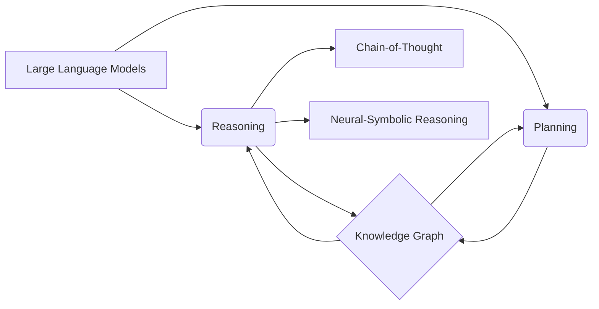

# 大规模语言模型从理论到实践 推理规划

关键词：大规模语言模型、推理规划、自然语言处理、知识表示、深度学习

## 1. 背景介绍
### 1.1  问题的由来
随着自然语言处理技术的飞速发展,大规模语言模型(Large Language Models, LLMs)逐渐成为了研究热点。LLMs 通过在海量文本数据上进行无监督预训练,可以学习到丰富的语言知识和常识,在许多自然语言理解任务上取得了显著的性能提升。然而,LLMs 在推理和规划等高阶认知任务上的表现仍有待提高。如何赋予 LLMs 更强大的推理规划能力,使其能够像人类一样进行逻辑推理、因果分析、多步规划等,是一个亟待解决的问题。

### 1.2  研究现状
目前,学术界已经提出了多种方法来增强 LLMs 的推理规划能力。一类方法是引入外部知识,如将结构化知识图谱与 LLMs 相结合,使其能够利用先验知识进行推理。另一类方法是设计专门的推理架构,如基于 Prompt 的思维链推理(Chain-of-Thought Prompting)和基于语义解析的神经符号推理等。此外,还有学者尝试通过对比学习、强化学习等范式,让 LLMs 在训练过程中学会推理规划技能。尽管取得了一定进展,但现有方法在推理的准确性、泛化性、可解释性等方面仍存在局限。

### 1.3  研究意义 
赋予 LLMs 强大的推理规划能力具有重要意义:
1. 拓展 LLMs 的应用范围,使其能够胜任更多需要逻辑推理和策略规划的任务,如智能问答、决策支持、代码生成等。
2. 探索通用人工智能(AGI)的实现路径。推理规划是人类智能的核心能力之一,研究 LLMs 的推理规划有助于揭示人类认知的奥秘,为构建类人智能系统提供启示。
3. 促进 LLMs 与符号推理系统的融合。将连续的分布式表示与离散的符号推理相结合,有望克服两者各自的不足,实现 1+1>2 的效果。

### 1.4  本文结构
本文将系统阐述如何从理论和实践的角度出发,提升 LLMs 的推理规划能力。第2节介绍相关的核心概念;第3节详细讲解几种代表性的推理规划算法;第4节建立推理规划的数学模型并给出公式推导;第5节通过代码实例演示如何实现推理规划;第6节分析推理规划在实际场景中的应用;第7节推荐相关的学习资源;第8节总结全文并展望未来;第9节列举常见问题与解答。

## 2. 核心概念与联系
- 大规模语言模型(Large Language Models, LLMs):在大规模文本语料上预训练得到的深度学习模型,如 BERT、GPT 等。LLMs 通过自监督学习掌握了丰富的语言知识,在自然语言理解任务上取得了巨大成功。
- 推理(Reasoning):从已知信息出发,遵循一定的逻辑规则,得出新的结论或判断的过程。常见的推理类型包括演绎推理、归纳推理和溯因推理等。
- 规划(Planning):根据目标和约束条件,拟定一系列行动方案以达成预期结果的过程。规划涉及状态表示、动作建模、搜索算法等。
- 知识图谱(Knowledge Graph):以结构化的方式表示实体及其关系的知识库。知识图谱可以为 LLMs 提供外部知识,增强其推理能力。
- 思维链(Chain-of-Thought):一种基于语言的推理形式,通过将复杂问题分解为一系列相关的子问题,逐步得出最终答案。思维链体现了人类的逐步推理过程。
- 神经符号推理(Neural-Symbolic Reasoning):将神经网络的分布式表示与符号逻辑的推理机制相结合的范式。神经符号推理试图兼具神经网络的学习能力和符号系统的可解释性。

这些概念之间密切相关。LLMs 作为基础,通过引入外部知识、思维链推理、神经符号方法等,可以获得更强的推理规划能力。知识图谱为推理提供了结构化的背景知识。推理和规划是相辅相成的,推理产生的结论可以指导规划,而规划的结果又可以作为新的已知条件参与推理。

## 3. 核心算法原理 & 具体操作步骤
### 3.1  算法原理概述
本节重点介绍两类代表性的 LLMs 推理规划算法:基于 Prompt 的思维链推理和基于语义解析的神经符号推理。

思维链推理的核心思想是引导 LLMs 按照人类思维方式,通过多个步骤得出结论。具体而言,通过设计合适的 Prompt,诱导模型生成解题过程中的中间推理步骤,而不是直接给出最终答案。这些中间步骤揭示了模型的推理链,使得结果更加可解释,并能减少推理过程中的错误累积。

神经符号推理则是将神经网络与符号推理系统巧妙地结合起来。一方面利用神经网络(如 LLMs)从原始文本中提取结构化的信息,构建符号化的知识表示;另一方面利用符号推理系统(如基于一阶谓词逻辑的定理证明器)在结构化知识上进行严格的逻辑推理。通过这种"语言-逻辑"映射,神经符号推理可以兼顾神经网络的语义理解能力和符号系统的逻辑推理能力。

### 3.2  算法步骤详解
以下详细介绍思维链推理和神经符号推理的步骤。

思维链推理:
1. 构建 Prompt。根据任务类型,设计引导多步推理的 Prompt 模板。常见的 Prompt 形式包括 "Let's solve this step by step:"、"To answer this, we need to think through the following steps:" 等。
2. 生成推理链。将输入问题填入 Prompt 模板,用 LLMs 生成推理过程。LLMs 会根据 Prompt 的指示,一步步分析问题、列出解题步骤。
3. 执行推理步骤。对于每个生成的推理步骤,再次调用 LLMs 执行该步骤,得到该步骤的输出。
4. 得出最终答案。将各个推理步骤的输出综合起来,得到问题的最终答案。

神经符号推理:
1. 语义解析。利用 LLMs 对自然语言文本进行语义解析,提取其中的实体、关系、逻辑连接词等要素,转换为谓词逻辑表示。
2. 知识库构建。将语义解析得到的逻辑表示组织成结构化的知识库,常见的知识表示形式包括一阶逻辑、描述逻辑、概念图等。
3. 符号推理。在构建好的知识库上,利用符号推理系统进行逻辑推理。推理过程严格遵循形式化的推理规则,如假言推理(modus ponens)、全称量词消除(universal instantiation)等。
4. 结果解释。将符号推理得出的结论重新映射回自然语言,生成可读的解释文本。这一步需要再次用到 LLMs 的自然语言生成能力。

### 3.3  算法优缺点
思维链推理的优点是可解释性强,推理过程清晰易懂,且可以减少错误累积。但其缺点是依赖人工设计的 Prompt,泛化能力有限,且推理深度受到 LLMs 生成长度的限制。

神经符号推理的优点是推理严谨,可以利用现有的符号推理工具,且推理过程可解释。但其缺点是语义解析和知识库构建的质量直接影响推理效果,而当前的语义解析技术还不够完善。此外,符号推理系统的表达能力和效率也有待提高。

### 3.4  算法应用领域
LLMs 的推理规划算法可以应用于以下领域:
- 智能问答:回答需要多步推理的复杂问题,如数学应用题、逻辑谜题等。
- 决策支持:根据多个条件和约束,提供行动建议和解决方案。
- 代码生成:根据需求描述,自动生成符合要求的程序代码。
- 常识推理:利用常识知识进行推理,如时序推理、空间推理等。
- 自然语言交互:使对话系统能够进行上下文相关的推理,提供更加智能、连贯的回复。

## 4. 数学模型和公式 & 详细讲解 & 举例说明
### 4.1  数学模型构建
我们以思维链推理为例,建立其数学模型。设输入问题为 $q$,推理步骤的最大长度为 $N$,第 $i$ 步推理的输出为 $s_i$,最终答案为 $a$。则思维链推理可以表示为:

$$
\begin{aligned}
s_1 &= f_{\text{LLM}}(q, p_1) \\
s_2 &= f_{\text{LLM}}(q, s_1, p_2) \\
&\vdots \\
s_N &= f_{\text{LLM}}(q, s_1, \ldots, s_{N-1}, p_N) \\
a &= g(s_1, s_2, \ldots, s_N)
\end{aligned}
$$

其中,$f_{\text{LLM}}$ 表示 LLMs 的推理步骤生成函数,$p_i$ 表示第 $i$ 步推理的 Prompt,可以是固定的模板,也可以根据之前的推理步骤动态生成。$g$ 表示答案生成函数,用于将各个推理步骤的输出综合为最终答案,可以是简单的拼接,也可以是更复杂的神经网络。

### 4.2  公式推导过程
思维链推理的目标是最大化最终答案的概率,即:

$$
\max_{s_1, \ldots, s_N} P(a|q, s_1, \ldots, s_N)
$$

根据贝叶斯公式,上式可以改写为:

$$
\max_{s_1, \ldots, s_N} \frac{P(s_1, \ldots, s_N|q, a)P(a|q)}{P(s_1, \ldots, s_N|q)}
$$

假设每一步推理只依赖于问题和之前的推理步骤,且最终答案只依赖于最后一步推理,则有:

$$
\begin{aligned}
P(s_1, \ldots, s_N|q, a) &= \prod_{i=1}^N P(s_i|q, s_1, \ldots, s_{i-1}, a) \\
&\approx \prod_{i=1}^N P(s_i|q, s_1, \ldots, s_{i-1}) \\
P(a|q) &\approx P(a|s_N)
\end{aligned}
$$

代入原式,得到:

$$
\max_{s_1, \ldots, s_N} \frac{\prod_{i=1}^N P(s_i|q, s_1, \ldots, s_{i-1})P(a|s_N)}{P(s_1, \ldots, s_N|q)}
$$

进一步假设每一步推理的生成概率服从 LLMs 的输出分布,则优化目标可以简化为:

$$
\max_{s_1, \ldots, s_N} \prod_{i=1}^N P_{\text{LLM}}(s_i|q, s_1, \ldots, s_{i-1}, p_i)
$$

即最大化每一步推理的生成概率之积。在实践中,我们可以通过 Beam Search 等搜索算法来近似求解这一优化问题。

### 4.3  案例分析与讲解
下面我们用一个简单的例子来说明思维链推理的过程。假设输入问题为:

$q$: 小明有 5 个苹果,吃了 2 个又买了 3 个,请问他现在有几个苹果?

经过语义解析,我们可以提取出如下关键信息:
- 小明初始有 5 个苹果
- 小明吃了 2 个苹果
- 小明买