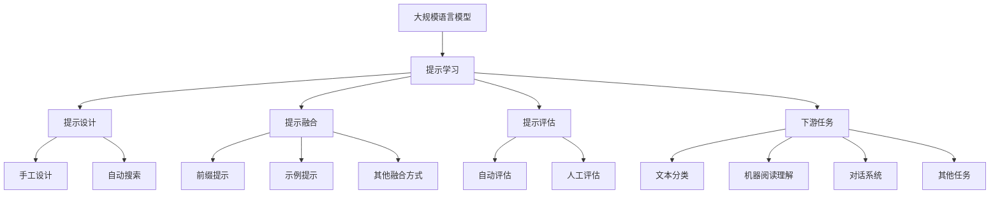

# 大规模语言模型从理论到实践 提示学习

## 1. 背景介绍

### 1.1 问题的由来

近年来,自然语言处理(NLP)领域取得了长足的进步,很大程度上归功于大规模语言模型(Large Language Models, LLMs)的出现和发展。传统的NLP模型通常基于有限的语料库训练,其表现能力受到严重限制。相比之下,LLMs在海量文本数据上进行预训练,能够捕捉丰富的语言知识,从而在下游任务中表现出色。

然而,LLMs也面临着诸多挑战,例如:

1. **数据质量**:预训练语料库中可能存在噪声、偏差和不当内容,这会影响模型的学习效果。
2. **计算资源**:训练大规模模型需要大量的计算资源,对硬件设施和能源消耗提出了很高的要求。
3. **可解释性**:LLMs的内部机理往往是一个"黑箱",难以解释其预测结果的原因。
4. **泛化能力**:尽管在特定领域表现优异,但LLMs在遇到新的任务或领域时,往往需要进行大量的微调(fine-tuning)。

为了应对这些挑战,**提示学习**(Prompt Learning)作为一种新兴的范式,近年来受到了广泛关注。

### 1.2 研究现状

提示学习的核心思想是,通过设计合适的提示(Prompt),将任务信息注入到LLMs中,从而指导模型生成所需的输出。与传统的微调方法相比,提示学习具有以下优势:

1. **高效**:无需对整个模型进行微调,只需设计合适的提示,从而节省了大量的计算资源。
2. **通用性**:同一个LLM可通过不同的提示完成多种任务,提高了模型的泛化能力。
3. **可解释性**:提示本身就是一种任务描述,有助于理解模型的预测过程。

目前,提示学习在NLP领域已取得了一些初步进展,如文本分类、机器阅读理解、对话系统等任务中均有不错的表现。但同时也存在一些挑战,例如提示设计的困难性、提示效果的不确定性等。

### 1.3 研究意义

提示学习为LLMs的应用开辟了新的可能性,有望推动NLP技术在实际场景中的广泛应用。本文将系统地介绍提示学习的理论基础、核心算法、实践案例等内容,旨在为读者提供一个全面的认识,并探讨该领域的未来发展趋势和挑战。

### 1.4 本文结构

本文共分为9个部分:

1. 背景介绍
2. 核心概念与联系
3. 核心算法原理与具体操作步骤
4. 数学模型和公式详细讲解与举例说明
5. 项目实践:代码实例和详细解释说明
6. 实际应用场景
7. 工具和资源推荐
8. 总结:未来发展趋势与挑战
9. 附录:常见问题与解答

## 2. 核心概念与联系

在深入探讨提示学习的细节之前,我们先介绍一些核心概念及它们之间的联系。



1. **大规模语言模型(LLMs)**: 指在海量文本数据上预训练的大型神经网络模型,如GPT、BERT等。这些模型能够捕捉丰富的语言知识,为提示学习奠定了基础。

2. **提示学习(Prompt Learning)**: 一种将任务信息注入LLMs的新范式,通过设计合适的提示来指导模型生成所需的输出。

3. **提示设计(Prompt Design)**: 提示学习的核心环节,包括手工设计和自动搜索两种方式。手工设计需要人工构建提示模板,而自动搜索则利用算法从提示空间中搜索最优提示。

4. **提示融合(Prompt Ensemble)**: 将不同类型的提示(如前缀提示、示例提示等)融合起来,以期获得更好的效果。

5. **提示评估(Prompt Evaluation)**: 评估提示的质量和有效性,可采用自动评估(如针对下游任务的指标)或人工评估的方式。

6. **下游任务(Downstream Tasks)**: 提示学习可应用于多种NLP任务,如文本分类、机器阅读理解、对话系统等。

上述概念相互关联、环环相扣,共同构成了提示学习的理论框架和实践体系。接下来,我们将逐一深入探讨这些概念的细节。

## 3. 核心算法原理与具体操作步骤

### 3.1 算法原理概述

提示学习的核心算法原理可概括为以下三个步骤:

1. **提示设计**: 根据下游任务的特点,设计合适的提示模板或示例。
2. **提示融合**: 将不同类型的提示(如前缀提示、示例提示等)融合起来,以期获得更好的效果。
3. **模型推理**: 将融合后的提示输入到预训练的LLM中,模型基于提示生成所需的输出。

在这个过程中,提示设计是最关键的一环。一个好的提示能够很好地指导模型完成任务,而一个差的提示则可能导致模型失效或产生无关的输出。因此,提示设计方法的选择对最终效果有着重要影响。

### 3.2 算法步骤详解

#### 3.2.1 提示设计

提示设计可分为手工设计和自动搜索两种方式:

**手工设计**

手工设计提示的一般步骤如下:

1. 分析任务特点,确定提示的基本形式(如前缀提示、示例提示等)。
2. 根据任务需求,构建提示模板或示例。
3. 对提示进行迭代优化,直至满意为止。

手工设计的优点是灵活性强,可以充分利用人的经验和直觉。但缺点是工作量大,且效果受人为因素影响。

**自动搜索**

自动搜索提示的一般步骤如下:

1. 定义提示空间,即所有可能的提示集合。
2. 设计搜索算法,在提示空间中搜索最优提示。
3. 将找到的最优提示应用于下游任务。

自动搜索的优点是自动化程度高,可以探索人工难以设计的提示。但缺点是计算开销大,且需要合理定义提示空间和搜索算法。

常见的自动搜索算法包括:

- 基于梯度的搜索算法(如PrefixTuning)
- 基于强化学习的搜索算法(如渲染策略梯度)
- 基于进化算法的搜索算法(如基因编码)

#### 3.2.2 提示融合

提示融合的目的是将不同类型的提示(如前缀提示、示例提示等)融合起来,以期获得更好的效果。常见的融合方式包括:

- 前缀提示 + 示例提示
- 前缀提示 + 其他辅助信息(如任务描述、标签词等)
- 多个示例提示的组合

融合时需要注意提示之间的一致性和冲突问题。一般而言,融合后的提示应该能够清晰地传达任务需求,避免引起模型的困惑。

#### 3.2.3 模型推理

将融合后的提示输入到预训练的LLM中,模型基于提示生成所需的输出。这一步骤通常不需要对模型进行微调,从而节省了大量的计算资源。

不同的LLM可能对提示的响应方式有所差异,因此在具体应用时需要根据使用的模型做出相应的调整和优化。

### 3.3 算法优缺点

提示学习算法的主要优点包括:

1. **高效**:无需对整个模型进行微调,只需设计合适的提示,从而节省了大量的计算资源。
2. **通用性**:同一个LLM可通过不同的提示完成多种任务,提高了模型的泛化能力。
3. **可解释性**:提示本身就是一种任务描述,有助于理解模型的预测过程。

但同时也存在一些缺点和挑战:

1. **提示设计的困难性**:设计高质量的提示需要一定的经验和直觉,对于复杂任务而言,这可能是一个挑战。
2. **提示效果的不确定性**:即使是优秀的提示,其效果在不同的模型和任务上也可能存在差异,缺乏稳定性保证。
3. **缺乏理论支持**:目前提示学习还缺乏完善的理论基础,很多方法都是基于经验和试错得到的。

### 3.4 算法应用领域

提示学习算法可应用于多种NLP任务,包括但不限于:

- 文本分类
- 机器阅读理解
- 文本生成
- 对话系统
- 信息抽取
- 词义消歧
- ...

其中,文本分类和机器阅读理解是目前应用最为广泛的两个领域。在这些任务中,提示学习展现出了与传统微调方法相当或更优的性能表现。

## 4. 数学模型和公式详细讲解与举例说明

### 4.1 数学模型构建

为了量化评估提示的质量,我们可以构建一个数学模型。假设我们有一个语言模型 $M$,一个任务 $T$,以及一个提示 $P$。我们的目标是最大化模型在给定提示 $P$ 下完成任务 $T$ 的性能,可以表示为:

$$\max_{P} \mathcal{L}(M(P), T)$$

其中 $\mathcal{L}$ 是一个衡量模型在任务 $T$ 上性能的损失函数或评估指标。

在实践中,我们通常将提示 $P$ 表示为一个离散的Token序列,即 $P = [t_1, t_2, \ldots, t_n]$。于是上式可以改写为:

$$\max_{t_1, t_2, \ldots, t_n} \mathcal{L}(M([t_1, t_2, \ldots, t_n]), T)$$

这为我们在提示空间中搜索最优提示提供了数学基础。

### 4.2 公式推导过程

接下来,我们将推导一种基于梯度的提示搜索算法。

假设提示 $P$ 中的每个Token $t_i$ 都是可微的,我们可以通过计算损失函数 $\mathcal{L}$ 关于每个Token的梯度,并沿着梯度的反方向更新Token,来最小化损失函数(即最大化模型性能)。具体地,在第 $k$ 步迭代时,我们有:

$$t_i^{(k+1)} = t_i^{(k)} - \eta \frac{\partial \mathcal{L}}{\partial t_i^{(k)}}$$

其中 $\eta$ 是学习率,用于控制更新步长。

将所有Token的更新式组合起来,我们得到:

$$P^{(k+1)} = P^{(k)} - \eta \nabla_{P^{(k)}} \mathcal{L}(M(P^{(k)}), T)$$

这就是一种基于梯度下降的提示搜索算法,我们可以从一个随机初始化的提示 $P^{(0)}$ 开始,不断迭代更新直至收敛,从而获得最优提示。

### 4.3 案例分析与讲解

为了更好地理解上述数学模型和算法,我们来看一个文本分类任务的实例。

假设我们有一个二分类任务,需要判断一段文本是正面评论还是负面评论。我们可以设计一个前缀提示 $P$,其形式为:

```
P = "判断以下评论的情感倾向(正面或负面):"
```

将这个提示连同输入文本 $X$ 一起输入到语言模型 $M$ 中,模型会生成一个输出 $Y$。