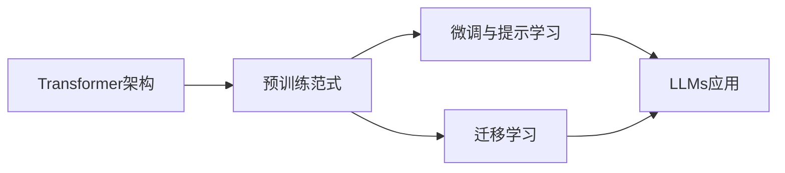

# 大规模语言模型从理论到实践 综合应用框架

关键词：大规模语言模型、Transformer、预训练、微调、迁移学习、BERT、GPT、ChatGPT、综合应用框架

## 1. 背景介绍
### 1.1  问题的由来
近年来,随着深度学习技术的快速发展,尤其是 Transformer 架构的提出,大规模语言模型(Large Language Models, LLMs)取得了突破性进展。从 BERT、GPT 到最新的 ChatGPT,LLMs 展现出了惊人的自然语言理解和生成能力,在问答、对话、文本分类、情感分析等诸多 NLP 任务上取得了 state-of-the-art 的性能表现。然而,如何将这些强大的语言模型从理论研究转化为实际应用,构建一套完整的综合应用框架,仍然是一个巨大的挑战。

### 1.2  研究现状
目前学术界和工业界都在积极探索 LLMs 的应用。谷歌、OpenAI、微软、Meta 等科技巨头纷纷推出自己的大模型并开源,如 BERT、GPT、OPT 等。国内的华为、百度、阿里等公司也在这一领域发力。但多数研究仍集中在模型结构改进、训练优化等理论层面,对于如何将 LLMs 快速应用落地、构建端到端的实际应用系统,尚缺乏成熟完善的解决方案。

### 1.3  研究意义 
LLMs 蕴含着巨大的应用潜力,可以极大提升人机交互体验,释放人力,创造商业价值。研究 LLMs 的综合应用框架,探索从理论到实践的技术路线,对于自然语言处理乃至人工智能的发展具有重要意义。这不仅能推动 LLMs 技术的快速落地应用,也为后续研究指明方向。同时,构建开源的端到端应用框架,降低开发门槛,让更多开发者参与进来,将促进 LLMs 生态的繁荣。

### 1.4  本文结构
本文将系统阐述 LLMs 的理论基础和关键技术,提出一套完整的综合应用框架,并给出具体的实践指南。内容安排如下:
第2部分介绍 LLMs 的核心概念;第3部分详解 LLMs 的关键算法;第4部分建立 LLMs 的数学模型;第5部分通过代码实例演示 LLMs 项目实践;第6部分讨论 LLMs 的实际应用场景;第7部分推荐 LLMs 相关工具和学习资源;第8部分总结全文,展望 LLMs 的未来发展趋势与挑战;第9部分为常见问题解答的附录。

## 2. 核心概念与联系
大规模语言模型的核心概念可以概括为:
- Transformer 架构:LLMs 的主流模型架构,基于 self-attention 机制,能够并行化训练,捕捉长距离依赖。
- 预训练范式:在大规模无标注语料上进行自监督预训练,让模型学习通用语言知识,是 LLMs 的关键。
- 微调与提示学习:在下游任务上微调预训练模型,或设计提示模板引导模型执行任务,是 LLMs 应用的两大范式。
- 迁移学习:将预训练模型应用到新任务,通过少量数据微调实现快速迁移,大幅节省标注成本。

这些概念环环相扣,构成了 LLMs 的理论和应用基础。Transformer 是 LLMs 的核心模型架构,预训练是获取语言知识的关键途径,微调和提示学习是 LLMs 应用的两大范式,迁移学习是 LLMs 的重要应用模式。

## 3. 核心算法原理 & 具体操作步骤
### 3.1  算法原理概述
LLMs 的核心算法可以概括为两大类:基于 Transformer 的预训练算法和基于提示学习的微调算法。

预训练算法以自监督学习为主,通过 mask 语言建模(MLM)、自回归语言建模(CLM)等任务,让模型在大规模无标注语料上学习通用语言知识。以 BERT 为例,它采用双向 Transformer 编码器结构,通过随机 mask 掉部分词,预测这些词的概率来训练模型。

提示学习则是设计一些自然语言提示模板,在输入中加入任务描述,引导模型去执行特定任务。常见的提示方法有:
- 人工设计提示模板(手工提示)
- 从标注数据中自动生成提示(自动提示)
- 将提示模板参数化并通过梯度学习(soft prompt)
- 基于少样本学习的提示方法

### 3.2  算法步骤详解
以 BERT 的预训练为例,其算法步骤可以概括为:
1. 语料预处理:对大规模无标注文本进行 tokenization,然后按照最大长度截断或 padding,构建成模型可以接受的输入格式。 
2. Mask 语言建模:随机 mask 掉每个 sequence 中 15% 的 token,用 [MASK] 符号替换,作为预测目标。
3. Next Sentence Prediction:为每个 sequence 的 [CLS] 位置添加二分类 label,判断两个句子是否相邻。
4. 模型训练:将 MLM 和 NSP 两个任务的 loss 相加,端到端训练整个模型,优化目标是最小化总 loss。
5. 模型评估:在验证集上评估模型的 MLM 准确率和 NSP 准确率,选择最优模型。
6. 模型存储:将训练好的模型权重等信息保存到磁盘,供下游任务使用。

提示学习的微调步骤则是:
1. 构建提示模板:根据任务设计自然语言提示,可以手工设计,也可以自动生成。
2. 融合提示:将提示信息融入到模型输入中,如添加到输入文本前、将提示参数化为 embedding 等。
3. 微调训练:用融合提示后的数据对预训练模型进行微调,一般只需训练几个 epoch。
4. 推理预测:将微调后的模型应用到实际任务中,进行推理预测。

### 3.3  算法优缺点
预训练算法的优点是:
- 通过自监督学习从无标注语料中习得丰富的语言知识,具有很强的通用性和迁移能力。
- 预训练模型可以应用到各种下游任务,大幅减少标注数据的依赖。
- 统一的 Transformer 架构,计算高度并行,训练和推理都很高效。

预训练算法的局限是:
- 对计算资源要求很高,需要大规模分布式训练,成本高昂。  
- 模型参数量巨大,部署时占用存储和内存资源大。
- 训练和推理耗时长,不适合实时响应的场景。

提示学习的优点是:
- 可以不修改预训练模型,仅通过设计提示就将模型应用到新任务。
- 训练简单,通常只需几个 epoch 就可以收敛。
- 可解释性好,提示本身就是对任务的描述。

提示学习的不足是:  
- 性能上限取决于预训练模型,有时难以达到 SOTA 效果。
- 设计优质提示需要领域知识和经验,有一定门槛。
- 对于一些复杂任务,提示可能会很冗长。

### 3.4  算法应用领域
LLMs 可以应用到 NLP 几乎所有任务,主要包括:
- 文本分类:如情感分析、新闻分类、意图识别等。
- 序列标注:如命名实体识别、词性标注、语义角色标注等。 
- 文本匹配:如自然语言推理、语义相似度、问答匹配等。
- 文本生成:如机器翻译、文本摘要、开放域对话生成等。
- 语言理解:如阅读理解、常识问答等。

此外,LLMs 还被应用到知识图谱、信息抽取、文档智能分析等领域,以及一些跨模态任务如图文生成、视频问答等。随着模型不断进化,LLMs 的应用领域也在不断扩展。

## 4. 数学模型和公式 & 详细讲解 & 举例说明
### 4.1  数学模型构建
LLMs 的数学建模主要包括 Transformer 结构建模和预训练目标建模两大部分。

Transformer 的核心是 self-attention 机制,对于一个长度为 $n$ 的输入序列 $X=(x_1,\cdots,x_n)$,其 self-attention 可以表示为:

$$
\begin{aligned}
Q &= XW^Q \\
K &= XW^K \\
V &= XW^V \\
\text{Attention}(Q,K,V) &= \text{softmax}(\frac{QK^T}{\sqrt{d_k}})V
\end{aligned}
$$

其中 $Q,K,V$ 分别是 query、key、value 矩阵,$W^Q,W^K,W^V$ 是对应的投影矩阵,$d_k$ 是 key 向量的维度。

多头注意力(multi-head attention)则是将 $Q,K,V$ 线性投影 $h$ 次,得到 $h$ 组 $Q,K,V$ 矩阵,然后并行计算 $h$ 个 attention,再拼接:

$$
\begin{aligned}
\text{MultiHead}(Q,K,V) &= \text{Concat}(\text{head}_1,\cdots,\text{head}_h)W^O \\
\text{head}_i &= \text{Attention}(QW_i^Q,KW_i^K,VW_i^V) \\
\end{aligned}
$$

Transformer 的 encoder-decoder 结构可以统一表示为:

$$
\begin{aligned}
H^0 &= \text{Embedding}(X) \\
H'^l &= \text{LayerNorm}(H^{l-1} + \text{MultiHead}(H^{l-1},H^{l-1},H^{l-1})) \\  
H^l &= \text{LayerNorm}(H'^l + \text{FFN}(H'^l)) \\
P(y_t|y_{<t},X) &= \text{softmax}(H^L_t W_{vocab})
\end{aligned}
$$

其中 $H^l$ 表示第 $l$ 层的输出,$\text{FFN}$ 是前馈网络,$W_{vocab}$ 是词表嵌入矩阵。对于 encoder,输入 $X$ 就是文本序列;对于 decoder,输入 $X$ 是 shifted right 的目标序列。

预训练目标一般基于极大似然,对于 MLM,其目标是最大化被 mask 词的概率:

$$
\mathcal{L}_{MLM} = -\sum_{i\in \mathcal{M}}\log P(x_i|X_{\setminus \mathcal{M}})
$$

其中 $\mathcal{M}$ 是被 mask 词的下标集合。对于 CLM,其目标是最大化序列的联合概率:

$$
\mathcal{L}_{CLM} = -\sum_{t=1}^n \log P(x_t|x_{<t})
$$

### 4.2  公式推导过程
以上公式的推导过程如下:

对于 self-attention,假设 $Q,K,V$ 的形状都是 $n\times d_k$,则 attention matrix $A$ 的计算过程是:

$$
\begin{aligned}
A &= \frac{QK^T}{\sqrt{d_k}} \\
&= \frac{1}{\sqrt{d_k}}\begin{bmatrix} 
q_1k_1^T & \cdots & q_1k_n^T \\
\vdots & \ddots & \vdots \\
q_nk_1^T & \cdots & q_nk_n^T
\end{bmatrix} \\
&= \frac{1}{\sqrt{d_k}}\begin{bmatrix}
\langle q_1,k_1 \rangle & \cdots & \langle q_1,k_n \rangle \\  
\vdots & \ddots & \vdots \\
\langle q_n,k_1 \rangle & \cdots & \langle q_n,k_n \rangle
\end{bmatrix}
\end{aligned}
$$

其中 $\langle \cdot,\cdot \rangle$ 表示向量内积。可以看出 $A$ 的每个元素 $A_{ij}$ 就是 query $q_i$ 和 key $k_j$ 的相似度得分。除以 