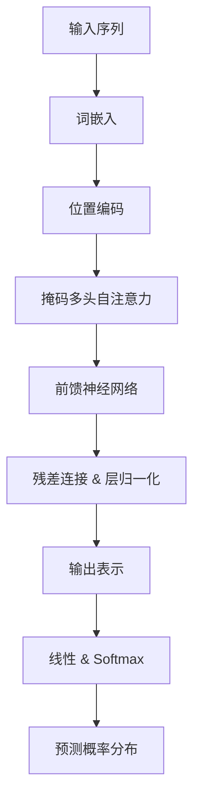

# 大语言模型原理与工程实践：GPT 系列模型的发展

## 1. 背景介绍

### 1.1 问题的由来

在过去几年中，自然语言处理(NLP)领域取得了长足的进步,这主要归功于大型神经网络模型和大规模训练数据的出现。其中,GPT(Generative Pre-trained Transformer)系列模型无疑成为了这一领域的佼佼者。作为一种基于Transformer的大型语言模型,GPT系列模型展现出了令人惊叹的文本生成能力,在机器翻译、问答系统、文本摘要等多个任务中表现出色。

然而,GPT模型的发展过程并非一帆风顺。早期版本存在着参数量有限、训练数据规模较小等问题,使得模型的性能受到一定限制。随着算力和数据量的不断增长,GPT模型也在不断迭代优化,以期获得更加出色的表现。

### 1.2 研究现状

GPT模型的发展大致可以分为三个阶段:

1. **GPT-1**:2018年6月由OpenAI发布,使用Transformer解码器结构,参数量为1.2亿,在书面英语语料库上进行预训练。GPT-1展现出了优秀的文本生成能力,但仍存在一些缺陷,如生成的文本缺乏连贯性、容易产生不当内容等。

2. **GPT-2**:2019年2月发布,参数量增加到15亿,训练语料库扩大到包括网页数据。GPT-2在文本生成质量上有了明显提升,但同时也加剧了潜在的安全隐患,如生成虚假新闻等。

3. **GPT-3**:2020年6月发布,参数量高达1750亿,训练语料库覆盖了互联网上大部分高质量数据。GPT-3在各项任务上表现出色,被誉为"少有的突破性进展"。但巨大的模型规模也带来了可解释性、偏见等新的挑战。

除了OpenAI的GPT系列,其他科技公司如Google、微软等也在积极研发自身的大型语言模型,以期在NLP领域占据一席之地。

### 1.3 研究意义

大型语言模型的发展对于推动自然语言处理技术的进步意义重大。GPT系列模型不仅展现出了强大的文本生成能力,更重要的是其通过自监督学习的方式,掌握了丰富的语言知识,为下游任务提供了强有力的语义表示能力。

研究GPT模型的原理和工程实践,有助于我们深入理解大型神经网络模型的内在机制,把握模型优化的关键点,从而推动模型性能的不断提升。同时,探索GPT模型在不同领域的应用前景,也将为推动人工智能技术的落地提供有益借鉴。

此外,GPT模型所面临的挑战,如偏见、安全隐患等,也值得我们高度重视。只有充分认识到这些风险,并采取有效的缓解措施,才能确保大型语言模型的健康发展,真正造福于人类社会。

### 1.4 本文结构

本文将全面介绍GPT系列模型的原理和工程实践,内容安排如下:

- 第2部分阐述GPT模型的核心概念,包括自注意力机制、Transformer编码器-解码器结构等,并分析这些创新设计对模型性能的影响。

- 第3部分深入探讨GPT模型的核心算法原理,包括自回归语言模型、掩码语言模型等,并详细解释算法的具体操作步骤。

- 第4部分将构建GPT模型的数学基础,包括自注意力机制的计算公式、损失函数等,并结合具体案例进行讲解。

- 第5部分将通过实际代码实例,演示如何基于深度学习框架(如PyTorch)实现GPT模型的训练和推理过程。

- 第6部分探讨GPT模型在文本生成、机器翻译、问答系统等领域的实际应用场景。

- 第7部分为读者推荐相关的学习资源、开发工具和论文,以帮助进一步深入研究。

- 第8部分总结GPT模型的研究成果,并展望其未来的发展趋势和面临的挑战。

- 第9部分列出常见问题及解答,帮助读者消除疑惑。

## 2. 核心概念与联系

在深入探讨GPT模型的算法细节之前,我们有必要先了解一些核心概念,这将为后续内容的理解打下坚实基础。GPT模型的核心思想源自两个重要创新:自注意力(Self-Attention)机制和Transformer架构。

### 2.1 自注意力机制

自注意力机制是一种用于捕获序列内部依赖关系的有效方法。不同于传统的RNN或LSTM,自注意力机制通过计算输入序列中每个元素之间的相关性分数,从而捕获它们之间的长程依赖关系。

在自注意力机制中,每个输入元素都会与其他所有元素进行关联,形成一个注意力分数矩阵。该矩阵能够自动学习到输入序列中哪些位置对当前位置更加重要。通过对注意力分数矩阵进行加权求和,我们就能够获得当前位置的表示向量。

自注意力机制的数学表达式如下:

$$\mathrm{Attention}(Q, K, V) = \mathrm{softmax}(\frac{QK^T}{\sqrt{d_k}})V$$

其中,$Q$表示查询(Query)向量,$K$表示键(Key)向量,$V$表示值(Value)向量。$d_k$是缩放因子,用于防止点积过大导致的梯度消失问题。

相比传统的序列模型,自注意力机制具有以下优势:

1. **并行计算**:自注意力机制不存在递归计算的问题,因此可以高效地并行计算,加快训练速度。

2. **长程依赖捕获**:自注意力机制能够直接捕获任意距离的依赖关系,而不受序列长度的影响。

3. **可解释性**:通过可视化注意力分数矩阵,我们可以直观地观察模型对输入序列的关注程度。

然而,自注意力机制也存在一些缺陷,例如计算复杂度较高、对于长序列可能会产生过多的噪音等。因此,GPT模型采用了Transformer架构,以更好地利用自注意力机制的优势。

### 2.2 Transformer架构

Transformer是一种全新的序列到序列(Seq2Seq)模型架构,它完全基于自注意力机制,摒弃了传统的RNN和LSTM结构。Transformer架构主要由编码器(Encoder)和解码器(Decoder)两个模块组成。

**编码器(Encoder)**的作用是将输入序列映射为一系列连续的表示向量。它由多个相同的层组成,每一层包含两个子层:多头自注意力机制(Multi-Head Self-Attention)和前馈神经网络(Feed-Forward Neural Network)。

**解码器(Decoder)**的作用是根据编码器的输出,生成目标序列。它的结构与编码器类似,不同之处在于除了编码器输入的自注意力子层外,还引入了对编码器输出的注意力机制(Encoder-Decoder Attention),以捕获输入和输出序列之间的依赖关系。

Transformer架构的优势在于:

1. **并行性**:完全基于自注意力机制,可以高效并行计算,加快训练速度。

2. **长程依赖捕获**:自注意力机制能够直接学习任意距离的依赖关系。

3. **位置编码**:通过为序列添加位置编码,使模型能够捕获序列的顺序信息。

4. **残差连接与层归一化**:这些技术的引入有助于加速模型收敛,提高性能。

GPT模型正是基于Transformer解码器(Decoder)的结构,通过掩码自注意力机制(Masked Self-Attention)实现自回归语言模型,从而展现出了强大的文本生成能力。

### 2.3 GPT模型架构

GPT模型的整体架构如下图所示:

可以看出,GPT模型的核心部分包括:

1. **词嵌入(Word Embedding)**: 将输入序列的每个词映射为对应的向量表示。

2. **位置编码(Positional Encoding)**: 为序列中的每个位置添加位置信息,使模型能够捕获序列的顺序。

3. **掩码多头自注意力(Masked Multi-Head Self-Attention)**: 与标准的多头自注意力机制不同,掩码机制确保当前位置的输出只依赖于之前的输入,实现了自回归语言模型。

4. **前馈神经网络(Feed-Forward Neural Network)**: 对注意力输出进行进一步处理和非线性变换。

5. **残差连接(Residual Connection)与层归一化(Layer Normalization)**: 这些技术的引入有助于加速模型收敛,提高性能。

6. **线性层(Linear Layer)与Softmax**: 将模型的输出映射为词汇表上的概率分布,用于预测下一个词。

通过上述模块的协同工作,GPT模型能够基于给定的文本前缀,自回归地生成连贯、富有意义的后续文本。这种强大的文本生成能力使GPT模型在诸多NLP任务中大显身手。

## 3. 核心算法原理 & 具体操作步骤

### 3.1 算法原理概述

在了解了GPT模型的核心概念之后,我们将深入探讨其背后的核心算法原理。GPT模型的核心算法主要包括两个部分:自回归语言模型(Auto-Regressive Language Model)和掩码语言模型(Masked Language Model)。

**自回归语言模型**是GPT模型的主要组成部分,它旨在基于给定的文本前缀,预测下一个最可能出现的词。具体来说,给定一个长度为$n$的文本序列$X=(x_1, x_2, \ldots, x_n)$,自回归语言模型的目标是最大化下式的对数似然:

$$\log P(X) = \sum_{t=1}^n \log P(x_t | x_1, x_2, \ldots, x_{t-1})$$

其中,$P(x_t | x_1, x_2, \ldots, x_{t-1})$表示基于前$t-1$个词预测第$t$个词的条件概率。通过最大化该对数似然函数,模型可以学习到生成连贯自然语言的规律。

**掩码语言模型**则是BERT等模型采用的预训练策略,它的目标是基于给定的上下文,预测被掩码(即被替换为特殊标记[MASK])的词。具体来说,给定一个长度为$n$的文本序列$X=(x_1, x_2, \ldots, x_n)$,以及一个掩码位置集合$\mathcal{M}$,掩码语言模型的目标是最大化下式的对数似然:

$$\log P(X_\mathcal{M} | X_{\backslash \mathcal{M}}) = \sum_{t \in \mathcal{M}} \log P(x_t | X_{\backslash \mathcal{M}})$$

其中,$X_\mathcal{M}$表示被掩码的词,$X_{\backslash \mathcal{M}}$表示未被掩码的上下文词。通过最大化该对数似然函数,模型可以学习到捕获上下文语义信息的能力。

GPT模型主要采用自回归语言模型进行预训练,而BERT等模型则同时使用自回归语言模型和掩码语言模型进行预训练。两种预训练策略各有优劣,具体取决于下游任务的特点。

### 3.2 算法步骤详解

现在,我们来详细解释一下GPT模型自回归语言模型的具体算法步骤。

1. **输入表示**:首先,将输入文本序列$X=(x_1, x_2, \ldots, x_n)$通过词嵌入层映射为对应的向量表示$\boldsymbol{e}_1, \boldsymbol{e}_2, \ldots, \boldsymbol{e}_n$。同时,为每个位置添加位置编码,以捕获序列的顺序信