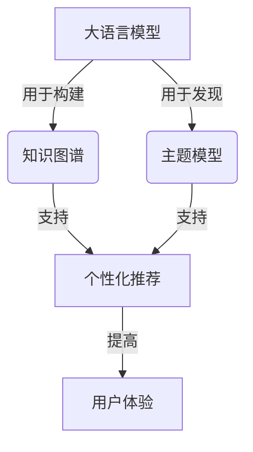

# 大语言模型原理与工程实践：书籍数据

## 1. 背景介绍

### 1.1 问题的由来

在当今信息时代,数据已经成为了推动科技发展的核心动力。无论是互联网巨头还是传统行业,都在积极拥抱数据化转型,以期获得更大的竞争优势。其中,书籍数据作为知识传播的重要载体,对于推动教育事业的发展、促进社会文明进步具有重要意义。

然而,传统的书籍数据存储和管理方式已经无法满足现代化需求。大量书籍数据分散存储在不同的出版社、图书馆和网络平台,数据格式参差不齐,缺乏统一的标准和规范,给数据的整合和利用带来了巨大挑战。此外,海量书籍数据的处理需要强大的计算能力,传统方法已经无法满足实时性和可扩展性的要求。

### 1.2 研究现状

为了解决上述问题,学术界和工业界都在积极探索大数据技术在书籍数据领域的应用。目前,主要的研究方向包括:

1. **数据采集和存储**:通过网络爬虫、OCR识别等技术,从各种渠道采集书籍数据,并将其存储在分布式存储系统(如HDFS)中,实现数据的集中管理。

2. **数据清洗和标准化**:利用自然语言处理、机器学习等技术,对书籍数据进行格式转换、错误修复、实体识别等预处理,提高数据质量。

3. **数据分析和挖掘**:基于大数据分析框架(如Spark)和机器学习算法,对书籍数据进行主题分类、情感分析、知识图谱构建等分析和挖掘,发现隐藏的知识价值。

4. **知识服务应用**:将分析挖掘的结果应用于智能问答、个性化推荐、智能写作辅助等知识服务领域,为用户提供更加智能化的体验。

### 1.3 研究意义

书籍数据的高效管理和智能分析对于知识传播和创新具有重要意义:

1. **促进知识共享**:通过数字化和网络化,书籍知识可以被更广泛地共享和传播,推动知识的民主化和普及化。

2. **提高知识利用效率**:智能分析技术可以帮助用户快速发现感兴趣的知识,提高知识获取和利用的效率。

3. **支持知识创新**:基于大数据分析,可以发现新的知识关联和规律,为创新研究提供新的思路和方向。

4. **保护知识产权**:通过数字化和版权保护技术,可以更好地保护书籍知识产权,维护创作者的合法权益。

### 1.4 本文结构

本文将全面介绍大语言模型在书籍数据领域的原理和工程实践,内容安排如下:

1. 核心概念与联系
2. 核心算法原理与具体操作步骤
3. 数学模型和公式详细讲解与举例说明
4. 项目实践:代码实例和详细解释说明
5. 实际应用场景
6. 工具和资源推荐
7. 总结:未来发展趋势与挑战
8. 附录:常见问题与解答

## 2. 核心概念与联系

在书籍数据处理过程中,涉及多个核心概念,它们之间存在着紧密的联系。下面将对这些概念进行介绍和解释。

### 2.1 大语言模型(Large Language Model)

大语言模型是一种基于深度学习的自然语言处理模型,通过在大量文本数据上进行预训练,学习语言的语义和语法规则。常见的大语言模型包括GPT(Generative Pre-trained Transformer)、BERT(Bidirectional Encoder Representations from Transformers)等。

大语言模型具有以下特点:

- 参数量大(通常超过10亿个参数),能够捕捉丰富的语言知识
- 通过自监督学习方式预训练,无需人工标注数据
- 可以通过微调(Fine-tuning)的方式,将预训练模型应用于下游任务(如文本分类、机器翻译等)

在书籍数据处理中,大语言模型可以用于文本理解、知识表示、智能写作辅助等任务。

### 2.2 知识图谱(Knowledge Graph)

知识图谱是一种结构化的知识表示形式,它将实体(Entity)、概念(Concept)和它们之间的关系(Relation)以图的形式组织起来,形成一个语义网络。知识图谱不仅能够表示显式知识,还可以通过推理发现隐式知识。

在书籍数据处理中,知识图谱可以用于:

- 实体链接(Entity Linking):将文本中的实体链接到知识库中的实体
- 关系抽取(Relation Extraction):从文本中抽取实体之间的语义关系
- 知识推理(Knowledge Reasoning):基于已有知识,推导出新的知识

通过构建书籍知识图谱,可以更好地理解和利用书籍数据中蕴含的知识。

### 2.3 主题模型(Topic Model)

主题模型是一种无监督机器学习模型,它可以从大量文档集合中自动发现潜在的主题(Topic)结构。常见的主题模型包括LDA(Latent Dirichlet Allocation)、BTM(Biterm Topic Model)等。

在书籍数据处理中,主题模型可以用于:

- 文本聚类(Text Clustering):根据主题相似性,将书籍文本聚类到不同主题
- 主题演化(Topic Evolution):分析主题随时间的演化趋势
- 主题可视化(Topic Visualization):直观展示主题分布和主题关联

通过主题模型,可以发现书籍数据中的热点主题和知识结构,为知识服务应用提供支持。

### 2.4 个性化推荐(Personalized Recommendation)

个性化推荐系统是一种基于用户历史行为数据,为用户推荐感兴趣的信息、产品或服务的智能系统。常见的推荐算法包括协同过滤(Collaborative Filtering)、内容过滤(Content-based Filtering)等。

在书籍数据处理中,个性化推荐可以用于:

- 书籍推荐:根据用户的阅读历史和兴趣偏好,推荐合适的书籍
- 知识推荐:推荐用户可能感兴趣的知识主题或知识片段
- 内容推荐:推荐相关的文章、视频等辅助学习资源

通过个性化推荐,可以提高用户的学习体验,激发持续学习的动力。

上述核心概念相互关联、环环相扣,共同构建了大语言模型在书籍数据领域的理论基础和技术框架。

## 3. 核心算法原理与具体操作步骤

### 3.1 算法原理概述

在书籍数据处理过程中,涉及多种核心算法,包括自然语言处理、知识表示学习、主题模型等。这些算法的原理和实现方式对于系统的性能和效果至关重要。

#### 3.1.1 自然语言处理算法

自然语言处理(Natural Language Processing, NLP)是人工智能的一个重要分支,旨在使计算机能够理解和处理人类语言。在书籍数据处理中,常用的NLP算法包括:

1. **词向量表示**(Word Embedding)：将词语映射到连续的向量空间,捕捉词语的语义和句法信息,常用算法有Word2Vec、GloVe等。

2. **命名实体识别**(Named Entity Recognition, NER)：从文本中识别出实体名称,如人名、地名、组织机构名等,常用算法有HMM、CRF、BiLSTM+CRF等。

3. **关系抽取**(Relation Extraction)：从文本中抽取实体之间的语义关系,常用算法有基于模式匹配的方法、基于监督学习的方法(如卷积神经网络)等。

4. **文本分类**(Text Classification)：将文本按照预定义的类别进行分类,常用算法有朴素贝叶斯、支持向量机、循环神经网络等。

5. **文本摘要**(Text Summarization)：自动生成文本的摘要,常用算法有基于提取的方法(如TextRank)、基于生成的方法(如序列到序列模型)等。

6. **机器翻译**(Machine Translation)：将一种语言的文本自动翻译成另一种语言,常用算法有统计机器翻译、基于神经网络的机器翻译等。

这些NLP算法为书籍数据的预处理、结构化表示、语义理解等提供了有力支持。

#### 3.1.2 知识表示学习算法

知识表示学习(Knowledge Representation Learning)旨在将结构化知识(如知识图谱)和非结构化知识(如自然语言文本)融合,学习知识的低维向量表示,以支持知识推理和应用。常用的算法包括:

1. **TransE**：将实体和关系映射到低维向量空间,使得头实体与尾实体的向量关系满足关系向量的约束。

2. **DistMult**：基于对称关系的简化假设,使用双线性运算对实体和关系进行建模。

3. **ComplEx**：通过复数向量表示实体和关系,能够更好地捕捉对称和反对称关系。

4. **RotatE**：引入旋转变换,将关系建模为复平面上的旋转,能够更好地表示复合关系。

5. **基于图神经网络的方法**：利用图神经网络捕捉实体和关系的结构信息,端到端地学习知识表示。

通过知识表示学习算法,可以将书籍数据中的结构化知识和非结构化知识融合,构建统一的知识表示空间,为知识推理和应用奠定基础。

#### 3.1.3 主题模型算法

主题模型(Topic Model)是一种无监督机器学习算法,旨在从大量文档集合中自动发现潜在的主题结构。常用的主题模型算法包括:

1. **LDA**(Latent Dirichlet Allocation)：基于狄利克雷分布和词袋模型假设,通过贝叶斯推断发现文档的主题分布和主题的词分布。

2. **BTM**(Biterm Topic Model)：基于词对(Biterm)而不是单词建模,能够更好地捕捉词与词之间的共现关系。

3. **DMM**(Dirichlet Multinomial Mixture Model)：基于多项分布和狄利克雷分布,通过期望最大化算法估计模型参数。

4. **neural-LDA**：将LDA模型与神经网络相结合,端到端地学习主题表示。

5. **TopicRNN**：利用循环神经网络捕捉文档的语义结构,发现主题和主题演化模式。

通过主题模型算法,可以从海量书籍数据中发现潜在的主题结构,为主题聚类、主题演化分析、主题可视化等应用提供支持。

### 3.2 算法步骤详解

接下来,我们将详细介绍上述核心算法的具体实现步骤。

#### 3.2.1 自然语言处理算法步骤

以关系抽取算法为例,其典型步骤如下:

1. **数据预处理**:对原始文本进行分词、词性标注、命名实体识别等预处理,将文本转换为结构化的形式。

2. **特征工程**:从预处理后的文本中提取相关特征,如词袋(Bag-of-Words)特征、依存语法特征、语义特征等。

3. **模型训练**:基于标注数据,使用监督学习算法(如最大熵模型、条件随机场、神经网络等)训练关系抽取模型。

4. **模型评估**:在测试集上评估模型的性能,常用指标包括精确率(Precision)、召回率(Recall)、F1分数等。

5. **模型优化**:根据评估结果,通过特征选择、参数调优、模型集成等方法优化模型性能。

6. **模型应用**:将训练好的模型应用于实际场景,从书籍文本中抽取实体关系,构建知识图谱。

需要注意的是,不同的NLP任务可能需要调整具