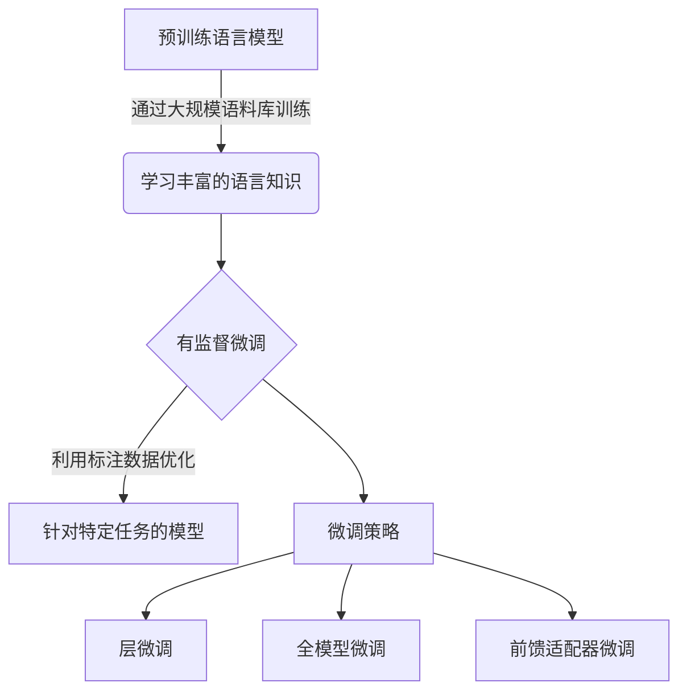

# 大语言模型原理与工程实践：什么是有监督微调

## 1. 背景介绍

### 1.1 问题的由来

在自然语言处理(NLP)领域,大型语言模型(Large Language Models, LLMs)凭借其强大的语言理解和生成能力,引起了广泛关注。这些模型通过在大规模语料库上进行预训练,学习到丰富的语言知识,并可用于各种下游任务。然而,直接使用预训练模型通常无法满足特定任务的需求,因为它们缺乏针对性的优化和微调。

为了解决这一问题,研究人员提出了"有监督微调"(Supervised Fine-tuning)的方法,旨在利用标注数据对预训练模型进行进一步的优化,使其更适应特定的任务。这种方法已被广泛应用于各种NLP任务中,展现出卓越的性能。

### 1.2 研究现状

有监督微调作为一种有效的技术,已经在多个领域得到了广泛应用和研究。以下是一些主要的研究进展:

- **文本分类**: 通过微调预训练模型,可以显著提高文本分类的准确性,如情感分析、新闻分类等。
- **机器翻译**: 微调大型语言模型可以提高机器翻译的质量,特别是在低资源语言对上。
- **问答系统**: 利用有监督微调,可以训练出高性能的问答模型,用于各种场景,如客户服务、医疗问答等。
- **自然语言理解**: 微调技术可以增强模型对自然语言的理解能力,如文本蕴含、关系抽取等任务。

尽管取得了显著进展,但有监督微调仍面临一些挑战,如数据标注成本高、微调不当导致灾难性遗忘等问题,这些问题正是当前研究的重点。

### 1.3 研究意义

有监督微调技术的研究对于提高大型语言模型在特定任务上的性能具有重要意义:

1. **提高模型效果**: 通过微调,可以充分利用预训练模型的语言知识,同时针对特定任务进行优化,从而显著提高模型的性能表现。
2. **降低训练成本**: 相比从头训练,微调预训练模型可以大幅减少所需的计算资源和数据量,降低了训练成本。
3. **促进模型迁移**: 微调技术使得预训练模型可以轻松迁移到新的任务领域,提高了模型的通用性和可扩展性。
4. **推动技术创新**: 微调技术的研究可能会催生出新的模型优化方法,推动NLP领域的技术创新和发展。

### 1.4 本文结构

本文将全面介绍有监督微调的原理、方法和实践。内容安排如下:

1. 阐述有监督微调的核心概念及其与预训练模型、微调的关系。
2. 详细解释有监督微调的核心算法原理和具体操作步骤。
3. 介绍有监督微调的数学模型,并通过公式推导和案例分析加深理解。
4. 提供一个完整的项目实践,包括代码实现、运行结果等,帮助读者掌握实战技能。
5. 探讨有监督微调在不同场景下的应用,并展望其未来发展趋势和面临的挑战。
6. 推荐相关的学习资源、开发工具和论文,为读者提供进一步学习的途径。

## 2. 核心概念与联系

有监督微调是一种利用标注数据对预训练语言模型进行进一步优化的技术,旨在使模型更适应特定的自然语言处理任务。其核心思想是在大规模无监督预训练的基础上,通过有监督的微调来引导模型学习任务相关的知识。

预训练语言模型(如BERT、GPT等)通过在大规模语料库上进行自监督学习,获得了丰富的语言知识。但是,这种通用的语言知识并不能完全满足特定任务的需求。因此,需要利用有监督微调来进一步优化模型,使其专门化于某个任务。

微调过程中,模型的部分或全部参数会在标注数据上进行梯度更新,以最小化任务相关的损失函数。这种有监督学习可以使模型更好地捕捉任务特征,从而提高在该任务上的性能表现。

有监督微调涉及多种策略,如层微调(Layer-wise Fine-tuning)、全模型微调(Full Model Fine-tuning)和前馈适配器微调(Prefix-tuning)等。不同的策略在计算开销、性能和泛化能力上有所权衡。选择合适的微调策略对于获得理想的模型性能至关重要。

总的来说,有监督微调是一种将预训练语言模型的通用语言知识与任务特定知识相结合的有效方法,它在自然语言处理领域发挥着重要作用,并推动了该领域的快速发展。

## 3. 核心算法原理与具体操作步骤

### 3.1 算法原理概述

有监督微调的核心算法原理可以概括为以下三个主要步骤:

1. **预训练模型初始化**: 首先,我们需要选择一个合适的预训练语言模型,如BERT、GPT等,并将其参数作为微调的初始值。这些预训练模型通过在大规模语料库上进行自监督学习,已经获得了丰富的语言知识。

2. **任务特定数据准备**: 接下来,我们需要准备用于微调的任务特定数据集。这些数据集应该是标注好的,并且与目标任务相关。例如,对于文本分类任务,我们需要准备一个包含文本及其对应类别标签的数据集。

3. **微调训练过程**: 最后,我们将预训练模型的参数在任务特定数据集上进行微调。这个过程通常采用监督学习的方式,将模型的输出与数据集中的标签进行比较,并根据损失函数(如交叉熵损失)计算梯度,使用优化算法(如Adam)更新模型参数。微调过程中,我们可以选择微调整个模型或只微调部分层,这取决于具体的微调策略。

通过上述步骤,预训练模型的参数将被调整以更好地适应目标任务,从而提高模型在该任务上的性能表现。

### 3.2 算法步骤详解

有监督微调算法的具体步骤如下:

1. **加载预训练模型**:首先,我们需要加载一个预训练的语言模型,如BERT、GPT等。这些模型通常以PyTorch或TensorFlow等深度学习框架的模型权重文件的形式提供。

2. **准备数据集**:接下来,我们需要准备用于微调的任务特定数据集。这个数据集应该是标注好的,并且与目标任务相关。例如,对于文本分类任务,我们需要准备一个包含文本及其对应类别标签的数据集。通常,我们会将数据集划分为训练集、验证集和测试集。

3. **数据预处理**:由于预训练模型通常需要特定的输入格式,因此我们需要对数据进行预处理。这可能包括标记化(tokenization)、填充(padding)、掩码(masking)等操作。

4. **定义微调策略**:在开始微调之前,我们需要确定采用哪种微调策略。常见的策略包括:
   - 层微调(Layer-wise Fine-tuning):只微调模型的部分层,通常是最后几层。
   - 全模型微调(Full Model Fine-tuning):微调整个模型的所有参数。
   - 前馈适配器微调(Prefix-tuning):在模型中插入可训练的前馈适配器,而不直接微调预训练参数。

5. **设置优化器和损失函数**:根据任务类型,我们需要选择合适的优化器(如Adam)和损失函数(如交叉熵损失)。

6. **微调训练**:开始在任务特定数据集上进行微调训练。这个过程通常采用小批量梯度下降的方式,将模型的输出与数据集中的标签进行比较,计算损失函数,并根据梯度更新模型参数。我们可以设置合适的超参数,如学习率、批次大小等,以获得最佳性能。

7. **模型评估**:在每个训练epoch结束时,我们可以在验证集上评估模型的性能,并根据指标(如准确率、F1分数等)来决定是否继续训练或进行早停(early stopping)。

8. **模型测试**:当模型在验证集上达到满意的性能时,我们可以在测试集上进行最终评估,获得模型在目标任务上的真实表现。

9. **模型保存**:最后,我们可以保存微调后的模型权重,以便将来使用或部署。

通过上述步骤,我们可以成功地对预训练语言模型进行有监督微调,使其更好地适应特定的自然语言处理任务。

### 3.3 算法优缺点

有监督微调算法具有以下优点:

1. **高效利用预训练知识**:微调可以充分利用预训练模型在大规模语料库上学习到的丰富语言知识,从而减少了从头训练的计算开销和数据需求。

2. **提高任务性能**:通过在任务特定数据上进行微调,模型可以更好地捕捉任务相关的特征,从而显著提高在该任务上的性能表现。

3. **灵活性强**:微调算法可以应用于各种自然语言处理任务,如文本分类、机器翻译、问答系统等,展现出良好的通用性和灵活性。

4. **可解释性**:相比于黑盒模型,微调后的模型通常具有更好的可解释性,因为它们是在已知的预训练模型基础上进行优化的。

然而,有监督微调算法也存在一些缺点和挑战:

1. **数据标注成本高**:微调需要大量的标注数据,而数据标注过程通常是昂贵和耗时的,这可能会限制该算法的应用范围。

2. **灾难性遗忘**:在微调过程中,模型可能会过度适应新任务,而遗忘掉预训练阶段学习到的一般语言知识,这被称为"灾难性遗忘"(Catastrophic Forgetting)。

3. **微调不当导致性能下降**:如果微调策略或超参数选择不当,可能会导致模型性能下降,甚至比预训练模型表现更差。

4. **计算资源需求**:虽然比从头训练节省了计算资源,但微调过程仍然需要大量的GPU计算能力,尤其是对于大型模型而言。

5. **领域迁移能力有限**:微调后的模型通常只适用于特定的任务领域,跨领域迁移能力可能会受到限制。

因此,在实际应用中,需要权衡有监督微调算法的优缺点,并根据具体情况选择合适的策略和方法。

### 3.4 算法应用领域

有监督微调算法可以应用于自然语言处理领域的各种任务,包括但不限于:

1. **文本分类**:通过微调,可以训练出高性能的文本分类模型,用于情感分析、新闻分类、垃圾邮件检测等任务。

2. **机器翻译**:微调预训练模型可以显著提高机器翻译的质量,尤其是在低资源语言对上。

3. **问答系统**:利用有监督微调,可以训练出强大的问答模型,用于各种场景,如客户服务、医疗问答等。

4. **自然语言理解**:微调技术可以增强模型对自然语言的理解能力,应用于文本蕴含、关系抽取、事件抽取等任务。

5. **文本摘要**:通过微调,可以训练出高质量的文本摘要模型,用于自动生成文档、新闻、论文等的摘要。

6. **对话系统**:微调预训练模型可以构建出自然、流畅的对话代理,用于客户服务、智能助手等场景。

7. **