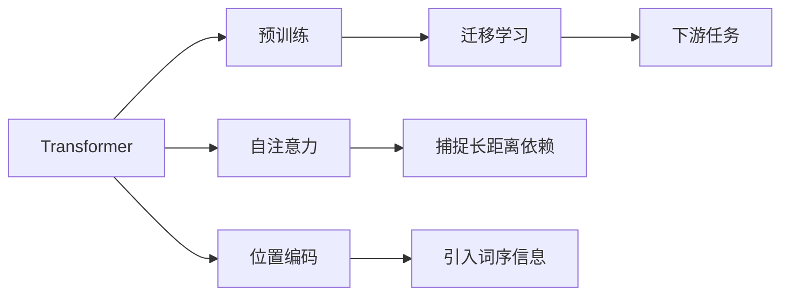

# 大语言模型原理与工程实践：初探大语言模型

关键词：大语言模型、Transformer、自然语言处理、预训练、迁移学习、BERT、GPT、ChatGPT

## 1. 背景介绍
### 1.1 问题的由来
自然语言处理(NLP)是人工智能领域的一个重要分支,旨在让计算机能够理解、生成和处理人类语言。传统的NLP方法主要基于规则和统计模型,难以应对语言的复杂性和多样性。近年来,随着深度学习的发展,大语言模型(Large Language Model, LLM)逐渐成为NLP领域的研究热点和主流技术。

### 1.2 研究现状
大语言模型通过在海量文本数据上进行预训练,学习语言的统计规律和语义表示,再通过迁移学习应用于下游NLP任务,取得了显著的性能提升。代表性的大语言模型包括BERT、GPT、T5、XLNet等。最新的ChatGPT更是在多轮对话、知识问答等任务上展现出接近甚至超越人类的能力,引发了广泛关注。

### 1.3 研究意义
探索大语言模型的原理和实践具有重要意义:
1. 推动NLP技术的发展,提升各类NLP任务的性能
2. 加深对语言本质和机器学习的认识
3. 促进人机交互、知识图谱、智能问答等应用的落地
4. 为通用人工智能的实现奠定基础

### 1.4 本文结构
本文将围绕大语言模型展开,内容安排如下:
- 第2部分介绍大语言模型的核心概念
- 第3部分阐述Transformer等主要算法原理
- 第4部分建立数学模型并推导相关公式
- 第5部分给出代码实例和详细解释
- 第6部分分析大语言模型的应用场景
- 第7部分推荐相关工具和学习资源
- 第8部分总结全文并展望未来
- 第9部分列举常见问题与解答

## 2. 核心概念与联系
大语言模型的核心概念包括:

- 语言模型:通过计算一个句子或词序列出现的概率来评估其合理性的模型,常用条件概率公式表示:
$P(w_1, w_2, ..., w_n) = \prod_{i=1}^n P(w_i | w_1, ..., w_{i-1})$
- Transformer:一种基于自注意力机制的神经网络结构,摒弃了RNN的循环结构,能够并行计算和捕捉长距离依赖。
- 预训练:在大规模无标注语料上训练通用语言模型,学习文本的统计模式和语义表示。常见的预训练任务有语言模型、掩码语言模型等。
- 迁移学习:将预训练模型应用到下游任务,通过微调或提示学习等方式快速适应新任务,避免从零开始训练。
- 自注意力:一种捕捉词与词之间关系的机制,通过计算词之间的注意力权重来聚合上下文信息。
- 位置编码:为每个词添加位置信息,使Transformer能够建模词序信息。

它们之间的联系如下图所示:



## 3. 核心算法原理 & 具体操作步骤
### 3.1 算法原理概述
Transformer是大语言模型的核心算法,其主要原理是:
1. 使用自注意力机制捕捉词与词之间的关系
2. 引入位置编码表示词序信息 
3. 采用编码器-解码器结构,实现端到端的序列建模
4. 使用残差连接和层归一化稳定训练
5. 采用多头注意力增强表示能力

### 3.2 算法步骤详解
以编码器的自注意力层为例,详细步骤如下:
1. 将输入词向量X通过三个线性变换得到Q、K、V:
$$Q = XW^Q, K = XW^K, V = XW^V$$
2. 计算注意力权重矩阵A:
$$A = softmax(\frac{QK^T}{\sqrt{d_k}})$$
3. 根据权重聚合值V得到输出Z:
$$Z = AV$$
4. 将Z与输入X相加作为残差:
$$X^{'} = LayerNorm(Z + X)$$
5. 对X^{'}进行前馈全连接:
$$FFN(X^{'}) = max(0, X^{'}W_1 + b_1)W_2 + b_2$$
6. 再次残差连接并归一化:
$$X^{''} = LayerNorm(FFN(X^{'}) + X^{'})$$

解码器与编码器类似,额外引入了masked self-attention防止看到未来信息,以及与编码器输出的cross attention。

### 3.3 算法优缺点
Transformer的优点有:
- 并行计算,训练和推理速度快
- 捕捉长距离依赖关系
- 模型容量大,表达能力强
- 通用性好,适用于各种NLP任务

缺点包括:
- 计算复杂度随序列长度平方增长,难以处理很长文本
- 预训练成本高,需要大量算力和数据
- 解释性差,内部工作机制仍是黑盒 
- 泛化能力有限,容易过拟合数据中的偏见

### 3.4 算法应用领域  
Transformer已成功应用于以下NLP任务:
- 机器翻译
- 文本分类
- 命名实体识别
- 关系抽取
- 文本摘要
- 问答系统
- 对话生成
- 语言理解与推理

此外,Transformer也被引入到计算机视觉、语音识别、图学习等领域,展现出广泛的适用性。

## 4. 数学模型和公式 & 详细讲解 & 举例说明
### 4.1 数学模型构建
大语言模型本质上是一个条件语言模型,对给定前缀下的下一个词进行概率建模:
$$P(x_t|x_{<t}) = softmax(Wx_{t-1} + b)$$

其中$x_t$为t时刻的词,$x_{<t}$为之前的词序列,$W$和$b$为可学习参数。

Transformer将自注意力作为核心组件,数学表示为将询问Q、键K、值V映射到输出:

$$Attention(Q,K,V) = softmax(\frac{QK^T}{\sqrt{d_k}})V$$

多头注意力则将Q、K、V线性投影h次,并行计算注意力:

$$MultiHead(Q,K,V) = Concat(head_1, ..., head_h)W^O$$
$$head_i = Attention(QW_i^Q, KW_i^K, VW_i^V)$$

其中$W_i^Q \in \mathbb{R}^{d_model \times d_k}, W_i^K \in \mathbb{R}^{d_model \times d_k}, W_i^V \in \mathbb{R}^{d_model \times d_v}, W^O \in \mathbb{R}^{hd_v \times d_model}$为可学习参数。

### 4.2 公式推导过程
以scaled dot-product attention为例,推导如下:

首先将输入Q、K、V分别通过线性变换得到查询、键、值:
$$Q = XW^Q, K = XW^K, V = XW^V$$

然后计算Q与K的点积并除以$\sqrt{d_k}$进行缩放:
$$QK^T/\sqrt{d_k} = (XW^Q)(XW^K)^T/\sqrt{d_k} \in \mathbb{R}^{n \times n}$$

接着对缩放后的点积进行softmax归一化,得到注意力权重矩阵:
$$A = softmax(QK^T/\sqrt{d_k}) \in \mathbb{R}^{n \times n}$$

最后根据注意力权重对值V进行加权求和,得到输出:
$$Attention(Q,K,V) = AV = softmax(QK^T/\sqrt{d_k})V \in \mathbb{R}^{n \times d_v}$$

其中n为序列长度,$d_k$为查询/键的维度,$d_v$为值的维度。

### 4.3 案例分析与讲解
下面以一个简单的例子直观解释自注意力的计算过程。

假设有一个长度为4的输入序列:
$$X = [x_1, x_2, x_3, x_4] \in \mathbb{R}^{4 \times d_{model}}$$

对于位置1的词$x_1$,我们希望通过自注意力聚合上下文信息。首先将输入X通过三个不同的线性变换得到Q、K、V:

$$
\begin{aligned}
Q &= XW^Q = [q_1, q_2, q_3, q_4] \\
K &= XW^K = [k_1, k_2, k_3, k_4] \\
V &= XW^V = [v_1, v_2, v_3, v_4]
\end{aligned}
$$

然后计算$q_1$与所有键$k_i$的点积,得到未归一化的注意力权重:
$$[q_1k_1, q_1k_2, q_1k_3, q_1k_4]/\sqrt{d_k}$$

对上述结果进行softmax归一化,得到注意力分布:
$$a_1 = [a_{11}, a_{12}, a_{13}, a_{14}] = softmax([q_1k_1, q_1k_2, q_1k_3, q_1k_4]/\sqrt{d_k})$$

最后将注意力分布$a_1$与值$v_i$加权求和,得到$x_1$的输出表示$z_1$:
$$z_1 = a_{11}v_1 + a_{12}v_2 + a_{13}v_3 + a_{14}v_4$$

直观理解就是,$x_1$通过自注意力机制,根据与其他词的相关性动态聚合上下文信息,得到一个新的上下文感知表示$z_1$。对序列中的其他位置重复上述过程,即可得到整个序列的自注意力输出。

### 4.4 常见问题解答
Q: 为什么要对点积结果除以$\sqrt{d_k}$?
A: 这是为了缓解点积结果量级过大的问题。当$d_k$较大时,点积的方差会很大,导致softmax函数得到一个非常尖锐的分布,这不利于梯度的反向传播。除以$\sqrt{d_k}$相当于进行了归一化,使得分布更加平滑。

Q: 残差连接和层归一化的作用是什么?
A: 残差连接能够缓解深度网络中的梯度消失问题,使得梯度能够顺利传播到底层。层归一化则有助于稳定训练,加速收敛。它们配合使用,能够训练更深层的Transformer模型。

Q: Transformer能否并行训练?
A: 可以。与RNN不同,Transformer抛弃了循环结构,各个位置的计算可以完全并行。因此Transformer能够充分利用GPU等硬件进行高效训练。

Q: 预训练-微调范式的优势是什么?
A: 预训练阶段在大规模语料上学习通用语言知识,微调阶段在小规模任务数据上快速适应,可以显著减少针对特定任务的数据标注成本,同时缓解小样本学习中的过拟合问题,提升模型的泛化性能。

## 5. 项目实践：代码实例和详细解释说明
### 5.1 开发环境搭建
首先安装PyTorch和Transformers库:
```bash
pip install torch transformers
```

### 5.2 源代码详细实现
下面给出基于Transformers库的BERT微调代码:

```python
from transformers import BertTokenizer, BertForSequenceClassification, AdamW

# 加载预训练模型和分词器
model = BertForSequenceClassification.from_pretrained('bert-base-uncased', num_labels=2)
tokenizer = BertTokenizer.from_pretrained('bert-base-uncased')

# 准备数据
texts = ["This movie is great!", "The film is terrible."]
labels = [1, 0]  

# 将文本转换为模型输入
inputs = tokenizer(texts, padding=True, truncation=True, return_tensors='pt')

# 微调模型
optimizer = AdamW(model.parameters(), lr=1e-5)
model.train()
for _ in range(100):
    optimizer.zero_grad()
    outputs = model(**inputs, labels=torch.tensor(labels))
    loss = outputs.loss
    loss.backward()
    optimizer.step()

# 测试模型
model.eval()
with torch.no_grad():
    outputs = model(**inputs)
    preds = outputs.logits.argmax