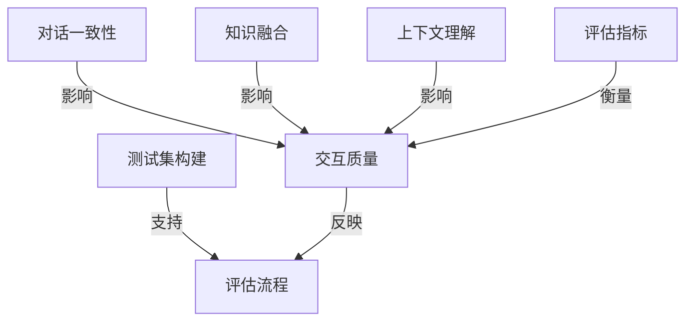

# 大语言模型原理与工程实践：大语言模型的对话能力评测

## 1. 背景介绍

### 1.1 问题的由来

随着人工智能技术的快速发展,大型语言模型(Large Language Models, LLMs)已经成为自然语言处理领域的主导范式。这些模型通过在海量文本数据上进行预训练,学习了丰富的语言知识和上下文信息,展现出了令人惊叹的自然语言理解和生成能力。然而,尽管取得了巨大进展,评估和改进大型语言模型的对话能力仍然是一个巨大的挑战。

对话是人类交流的核心形式,涉及复杂的语义理解、上下文跟踪、知识推理等多个方面。而现有的大型语言模型在处理长时间上下文、维护一致性、融合外部知识等方面仍然存在不足。因此,如何全面、客观地评估大型语言模型的对话能力,并基于评估结果持续优化模型,成为了当前研究的重点课题。

### 1.2 研究现状

目前,学术界和工业界都在积极探索大型语言模型对话能力的评测方法。一些主要的研究方向包括:

1. **人工评估**:邀请人类评估者与语言模型进行对话,并根据对话的流畅性、一致性、信息质量等指标打分。这种方法能够直接反映模型的实际表现,但成本高、效率低。

2. **自动评估**:设计自动化的评估指标和测试集,如对话一致性分数、知识覆盖率等。这种方法高效且可重复,但可能无法全面捕捉对话质量。

3. **交互式评估**:通过构建交互式对话系统,让真实用户与语言模型进行自然对话,并收集用户反馈。这种方法能够模拟真实场景,但数据收集和标注工作量大。

4. **多维度评估**:综合多种评估方法,从不同角度全面评价语言模型的对话能力,如上下文理解、知识融合、情感把握等。

尽管取得了一些进展,但现有的评估方法仍然存在局限性,难以完全解决对话评估的复杂性和主观性问题。因此,设计更加科学、客观、全面的评估体系,成为了提升大型语言模型对话能力的关键。

### 1.3 研究意义

全面评估和优化大型语言模型的对话能力,对于推动自然语言处理技术的发展具有重要意义:

1. **提升人机交互体验**:对话是人机交互的核心形式,优秀的对话能力可以极大改善人机交互的自然性和效率,为智能助手、客服系统等应用带来全新体验。

2. **促进语言理解与推理**:对话涉及复杂的语义理解、上下文跟踪、知识推理等多个方面,改进对话能力有助于提升语言模型的整体理解和推理能力。

3. **拓展应用场景**:强大的对话能力为语言模型开辟了更广阔的应用前景,如智能教育、医疗对话、心理咨询等领域。

4. **推动人工智能发展**:对话是人类智能的核心体现之一,研究对话能力有助于探索通用人工智能的奥秘,推动人工智能技术向更高层次发展。

总的来说,评估和优化大型语言模型的对话能力,不仅可以提升现有应用的性能,更有助于拓展语言模型的应用前景,促进人工智能技术的长远发展。

### 1.4 本文结构

本文将全面探讨大型语言模型对话能力评测的原理和实践。文章首先介绍对话能力评测的背景和研究现状,阐明其重要意义。接下来详细解析对话能力评测的核心概念和方法,包括评估指标、测试集构建、评估流程等。然后深入讨论对话能力评测的数学模型和算法原理,并结合实际案例进行讲解。

此外,文章还将分享一个完整的项目实践案例,展示如何基于开源工具和框架搭建对话能力评测系统,并详细解读核心代码实现。最后,我们将总结对话能力评测的发展趋势和面临的挑战,并对未来的研究方向进行展望。

## 2. 核心概念与联系

评估大型语言模型的对话能力涉及多个核心概念,这些概念相互关联、环环相扣,共同构建了对话能力评测的理论基础和技术体系。让我们逐一探讨这些关键概念:

1. **对话一致性(Conversational Consistency)**:指语言模型在进行多轮对话时,能够保持上下文连贯性,避免产生矛盾和逻辑错误。评估对话一致性需要考虑上下文理解、主题跟踪、信息融合等多个方面。

2. **知识融合(Knowledge Grounding)**:语言模型不仅需要根据上下文生成合理的回复,还需要融合外部知识源(如知识库、网络资源等),以提供更加准确和信息丰富的回答。评估知识融合能力是对话评测的重点之一。

3. **交互质量(Interaction Quality)**:评价语言模型在与人类进行自然对话时的整体表现,包括回复的流畅性、信息质量、情感把握、任务完成度等多个维度。这是对话评测的核心目标。

4. **上下文理解(Context Understanding)**:语言模型需要准确捕捉对话中的上下文信息,包括话语内容、语义关系、情感倾向等,并在此基础上生成恰当的回复。上下文理解能力直接影响对话质量。

5. **评估指标(Evaluation Metrics)**:为了客观、可量化地评价语言模型的对话能力,需要设计一系列评估指标,如对话一致性分数、知识覆盖率、人工评分等。这些指标共同反映了模型的整体对话表现。

6. **测试集构建(Test Set Construction)**:构建高质量的对话测试集是对话能力评测的基础。测试集需要覆盖各种对话场景和难度级别,并提供人工标注的参考答案,以支持自动评估和人工评估。

7. **评估流程(Evaluation Pipeline)**:对话能力评测需要一个完整的评估流程,包括测试集加载、上下文跟踪、模型回复生成、自动评分、人工评分等多个环节,并对评估结果进行综合分析。

上述核心概念相互关联、环环相扣,共同构建了对话能力评测的理论基础和技术体系。掌握这些概念有助于我们全面认识和解决对话评测中的各种挑战。

## 3. 核心算法原理 & 具体操作步骤

### 3.1 算法原理概述

对话能力评测的核心算法原理主要包括以下几个方面:

1. **上下文建模**:准确捕捉对话上下文信息,包括话语内容、语义关系、情感倾向等,是对话评测的基础。常用的上下文建模方法包括基于注意力机制的序列模型、图神经网络等。

2. **知识融合**:将语言模型的生成能力与外部知识源(如知识库、网络资源等)相结合,以提供更加准确和信息丰富的回答。常见的知识融合方法包括检索增强、记忆增强、联合学习等。

3. **一致性检测**:评估语言模型在多轮对话中的一致性,避免产生矛盾和逻辑错误。可以基于规则约束、对比学习、对抗训练等方法来提高一致性。

4. **交互质量评估**:综合考虑回复的流畅性、信息质量、情感把握、任务完成度等多个维度,对语言模型的整体对话表现进行评估。常用的评估方法包括自动评分、人工评分、交互式评估等。

5. **评估指标设计**:设计一系列可量化的评估指标,如对话一致性分数、知识覆盖率、人工评分等,以客观反映语言模型的对话能力。指标设计需要考虑多个评估维度,并权衡各维度的重要性。

6. **测试集构建**:构建高质量的对话测试集,覆盖各种对话场景和难度级别,并提供人工标注的参考答案,是对话能力评测的基础。测试集构建需要大量的人工标注工作。

上述算法原理相互关联、相辅相成,共同构建了对话能力评测的技术体系。在实际应用中,我们需要根据具体场景和需求,灵活选择和组合这些算法模块。

### 3.2 算法步骤详解

对话能力评测的算法步骤可以概括为以下几个主要环节:

1. **上下文表示**

   - 将对话历史信息(包括utterance、speaker、时间戳等)编码为上下文向量表示
   - 常用的编码方式包括基于Transformer的序列模型、图神经网络等

2. **知识检索与融合**

   - 根据上下文向量,从知识源(如知识库、网络资源等)中检索相关知识
   - 将检索到的知识与上下文表示相融合,形成知识增强的上下文表示

3. **回复生成**

   - 基于知识增强的上下文表示,利用语言模型(如GPT、T5等)生成候选回复
   - 可以采用beam search、nucleus sampling等策略生成多个候选回复

4. **一致性约束**

   - 对候选回复进行一致性检测,剔除与上下文存在矛盾或逻辑错误的回复
   - 常用的一致性检测方法包括基于规则的约束、对比学习、对抗训练等

5. **交互质量评估**

   - 对通过一致性检测的候选回复,进行综合的交互质量评估
   - 评估维度包括流畅性、信息质量、情感把握、任务完成度等
   - 可以采用自动评分、人工评分或交互式评估的方式

6. **评估指标计算**

   - 根据质量评估的结果,计算一系列评估指标
   - 常用指标包括对话一致性分数、知识覆盖率、人工评分等
   - 可以对不同指标进行加权求和,得到综合评估分数

7. **结果分析与反馈**

   - 分析评估结果,找出语言模型的优缺点和需要改进的地方
   - 将评估结果反馈到模型训练和优化的环节,形成闭环迭代

上述步骤环环相扣,构成了对话能力评测的完整流程。在实际应用中,我们可以根据具体需求对算法步骤进行调整和优化,以获得更加准确和高效的评估结果。

### 3.3 算法优缺点

对话能力评测算法具有以下优点:

1. **全面性**:综合考虑了上下文理解、知识融合、一致性检测、交互质量评估等多个维度,能够全面评价语言模型的对话能力。

2. **客观性**:通过设计可量化的评估指标和构建标准化的测试集,能够提供客观、可重复的评估结果。

3. **可解释性**:算法步骤清晰,每个环节的输入和输出都具有明确的语义,有助于分析和诊断模型的行为。

4. **可扩展性**:算法模块化设计,可以根据需求灵活调整和扩展各个模块,适应不同的应用场景。

5. **持续优化**:将评估结果反馈到模型训练环节,形成闭环迭代,有助于持续优化语言模型的对话能力。

同时,该算法也存在一些不足之处:

1. **计算开销大**:涉及上下文建模、知识检索、候选生成、一致性检测等多个计算密集型环节,对计算资源的需求较高。

2. **标注成本高**:构建高质量的对话测试集需要大量的人工标注工作,标注成本较高。

3. **评估bias**:自动评估指标和人工评估都可能存在一定的bias,难以完全客观反映模型的真实能力。

4. **知识库依赖**:知识融合