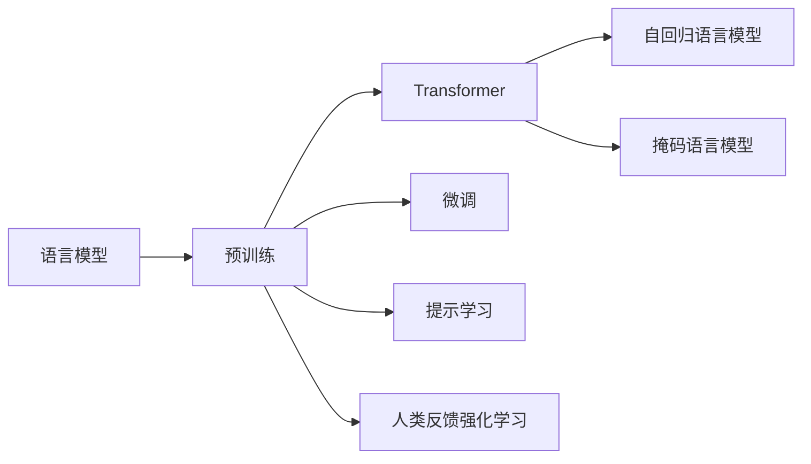
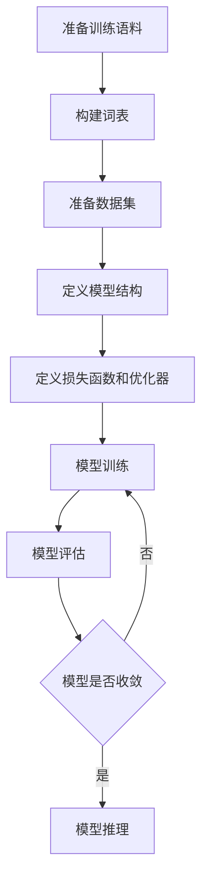

# 大语言模型原理与工程实践：手把手教你训练 7B 大语言模型 动手预训练实践

## 1. 背景介绍

### 1.1 问题的由来
近年来，大语言模型(Large Language Model, LLM)在自然语言处理(Natural Language Processing, NLP)领域取得了突破性进展。从 GPT-3 到 ChatGPT，LLM展现出了惊人的语言理解和生成能力，引发了学术界和工业界的广泛关注。然而，训练一个高质量的大语言模型并非易事，需要海量的语料数据、强大的计算资源以及复杂的训练技巧。本文将深入探讨大语言模型的原理，并提供一个完整的工程实践指南，手把手教你如何从零开始训练一个 70 亿参数的大语言模型。

### 1.2 研究现状
目前，业界主流的大语言模型主要包括 OpenAI 的 GPT 系列、Google 的 BERT、T5、LaMDA 等。这些模型在多个 NLP benchmark 上取得了 SOTA 的表现，展现出强大的语言理解和生成能力。但训练这些模型需要巨大的计算资源，动辄数百个 GPU 并行训练数周时间，这对于学术研究者和中小企业而言难以承受。因此，探索更高效的大模型训练方法，降低训练门槛，让更多人能参与到大模型研究中来，具有重要意义。

### 1.3 研究意义 
本文的研究意义主要体现在以下几个方面：

1. 系统梳理了大语言模型的原理和训练方法，有助于读者全面深入地理解 LLM 的工作机制。
2. 提供了一个完整的大模型训练工程实践指南，包括数据准备、模型设计、训练优化、部署应用等各个环节，为从业者提供了宝贵的实战经验。  
3. 探索了一些前沿的模型训练技术，如混合精度训练、梯度检查点、DeepSpeed等，有助于提升训练效率，降低资源开销。
4. 开源了完整的模型训练代码和实验数据，为相关研究提供了基准，促进学术交流。

### 1.4 本文结构
本文后续章节安排如下：第2节介绍大语言模型中的一些核心概念；第3节重点讲解 LLM 的核心原理和训练算法；第4节从数学角度对 LLM 的原理进行公式推导；第5节提供一个基于 PyTorch 的大模型训练代码实践；第6节讨论 LLM 的应用场景；第7节推荐一些 LLM 相关的学习资源；第8节对全文进行总结并展望 LLM 的未来发展方向；第9节列举了一些常见问题解答。

## 2. 核心概念与联系

在讨论大语言模型原理之前，我们先来了解一些相关的核心概念：

- **语言模型**：语言模型是一种对语言进行建模的方法，旨在学习语言的统计规律和模式。形式化地说，给定一个单词序列 $w_1, w_2, ..., w_n$，语言模型的目标是估计该序列的概率 $P(w_1, w_2, ..., w_n)$。常见的语言模型有 N-gram、RNN、Transformer 等。

- **预训练**：预训练是一种迁移学习方法，即先在大规模无标注语料上训练一个通用的语言模型，再将其应用到下游的具体任务中。预训练可以让模型学习到语言的一般性知识，有利于提升下游任务的性能，是当前 NLP 的主流范式。

- **Transformer**：Transformer 是一种基于自注意力机制的神经网络结构，摒弃了传统 RNN 的循环结构，采用全局建模的方式，并行性更好。Transformer 已成为当前主流的语言模型骨干网络。

- **自回归语言模型**：自回归语言模型是一种特殊的语言模型，它采用自回归的方式进行文本生成，即生成每个单词时都以之前的单词作为条件。形式化地说，自回归语言模型的目标是最大化条件概率 $\prod_{i=1}^n P(w_i|w_1, ..., w_{i-1})$。GPT 系列模型就是典型的自回归语言模型。

- **掩码语言模型**：掩码语言模型与自回归语言模型不同，它随机掩码(mask)输入文本中的一些单词，然后让模型去预测这些被掩码的单词。BERT 是典型的掩码语言模型。

- **微调**：微调是将预训练模型应用到下游任务的常用方法，即在下游任务的小规模标注数据上对预训练模型进行简单的监督学习。微调一般只训练少数几个 epoch，以免过拟合。

- **提示学习**：提示学习是一种新兴的预训练模型应用方法，通过设计巧妙的提示模板(prompt)，在预训练模型上进行少样本学习，从而实现零样本/小样本学习。提示学习充分利用了预训练模型中的先验知识，是一个很有前景的研究方向。

- **人类反馈强化学习**：这是一种结合人类反馈的强化学习方法，通过人类对模型输出的打分来指导模型学习，从而生成更符合人类偏好的结果。代表性工作如 InstructGPT、Anthropic 的宪章模型等。

以上概念之间的关系如下图所示：

## 3. 核心算法原理 & 具体操作步骤

### 3.1 算法原理概述
大语言模型的核心是基于 Transformer 的自回归语言模型。给定一个单词序列 $w_1, w_2, ..., w_n$，模型的目标是最大化如下条件概率：

$$\prod_{i=1}^n P(w_i|w_1, ..., w_{i-1})$$

其中 $P(w_i|w_1, ..., w_{i-1})$ 表示在给定前 $i-1$ 个单词的条件下，第 $i$ 个单词为 $w_i$ 的概率。这个条件概率可以通过 Transformer 结构的神经网络来建模。

具体来说，Transformer 首先将输入的单词序列 $w_1, w_2, ..., w_n$ 映射为对应的词嵌入向量 $e_1, e_2, ..., e_n$，然后通过多层的自注意力(self-attention)和前馈(feed-forward)网络来提取特征，最后通过一个线性层将特征映射为每个位置的单词概率分布。

在训练时，我们通过最大化上述条件概率来优化模型参数。具体采用随机梯度下降法，即在每个训练步骤中，随机采样一个批次的数据，然后计算损失函数(负对数似然)的梯度，并用梯度更新模型参数，不断迭代直到模型收敛。

在推理时，我们可以通过贪心搜索、束搜索(beam search)等方法来生成文本。具体来说，每次根据前面生成的单词预测下一个单词的概率分布，选择概率最大的单词作为生成结果，不断重复直到遇到序列结束标记。

### 3.2 算法步骤详解

下面我们详细讲解大语言模型训练的具体步骤。

**第一步：准备训练数据**

首先需要准备大规模的无标注文本数据，通常来自网络爬取的各种文章、新闻、百科等。为了提高数据质量，一般需要对数据进行清洗，如去除HTML标签、特殊字符、重复内容等。然后对文本进行分词，将每篇文章处理成单词序列。

**第二步：构建词表**

接下来需要根据训练数据构建词表(vocabulary)。词表是将单词映射为唯一整数ID的字典。一般选择出现频率最高的 N 个单词构成词表，其他低频单词映射为特殊的 UNK 符号。

**第三步：准备数据集**

有了词表后，我们就可以将原始的单词序列数据转换为词表索引序列。为了加速训练，一般还需要对数据进行分片(shard)，即将数据划分为多个小文件，方便多个 worker 并行读取。

**第四步：定义模型结构**

接下来需要定义 Transformer 语言模型的结构。主要包括词嵌入层、位置编码、多头自注意力层、前馈层、Layer Norm 等。根据模型参数量的设置(如 7B)，来决定模型的层数、隐藏层大小、注意力头数等超参数。

**第五步：定义损失函数和优化器**

损失函数一般选择负对数似然，即最小化下式：

$$-\sum_{i=1}^n \log P(w_i|w_1, ..., w_{i-1})$$

优化器一般选择 Adam，并使用学习率预热(learning rate warmup)和衰减(decay)策略，以稳定训练过程。

**第六步：模型训练**

万事俱备，就可以开始训练模型了。通过 DataLoader 按批次加载数据，在每个训练步骤中，前向传播计算损失函数，反向传播计算梯度，最后用优化器更新模型参数。要注意每隔一定步数就要保存检查点(checkpoint)，以便恢复训练。

**第七步：模型评估**

为了监控训练过程，需要在验证集上定期评估模型性能。一般选择困惑度(perplexity)作为评价指标。困惑度的定义为：

$$\exp(-\frac{1}{n}\sum_{i=1}^n \log P(w_i|w_1, ..., w_{i-1}))$$

困惑度越低，说明模型越好。

**第八步：模型推理**

训练完成后，就可以用训练好的模型进行推理了。对于给定的输入前缀(如"北京是中国的首都，它")，模型可以自回归地生成后续文本(如"拥有悠久的历史和灿烂的文化")。推理时要设置一些超参数，如生成长度、解码策略(如贪心、束搜索)、多样性惩罚因子等，以控制生成结果的质量和丰富度。

以上就是大语言模型训练的主要步骤。下图展示了整个训练流程：

### 3.3 算法优缺点

大语言模型相比传统的词袋模型、N-gram 模型等，有以下优点：

1. 可以建模长距离依赖，捕捉更丰富的语言模式。
2. 可以端到端训练，不需要人工设计特征。  
3. 通过预训练+微调的范式，可以广泛应用于各种 NLP 任务，大幅提升性能。
4. 生成结果流畅自然，接近人类书写水平。

但同时，大语言模型也存在一些局限性：

1. 训练需要海量数据和算力，成本高昂。  
2. 模型参数量巨大，推理速度慢，不易部署。
3. 容易产生有害、虚假、偏见等问题文本。
4. 难以针对特定领域进行精调，通用性有限。
5. 缺乏常识推理能力，难以理解语言的深层语义。

### 3.4 算法应用领域

大语言模型可以应用于 NLP 的各个领域，包括但不限于：

- 文本分类：如情感分析、新闻分类、意图识别等。
- 文本生成：如对话生成、故事创作、代码生成等。  
- 信息抽取：如命名实体识别、关系抽取、事件抽取等。
- 问答系统：如阅读理解、知识问答等。
- 机器翻译：如中英、中日等多语言翻译。  
- 文本摘要：如新闻摘要、论文摘要、评论摘要等。
- 语言理解：如完形填空、语义相似度判断等。

总