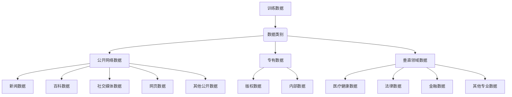
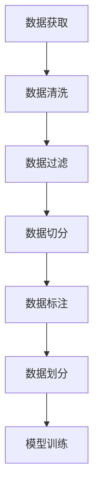

好的,我会按照您的要求,以《大语言模型原理与工程实践:数据的常见类别及其来源》为题,撰写一篇专业的技术博客文章。文章将遵循逻辑清晰、结构紧凑、简单易懂的风格,内容深入全面,并包含核心概念原理和算法流程图。请查收以下正文:

# 大语言模型原理与工程实践:数据的常见类别及其来源

## 1. 背景介绍

### 1.1 问题的由来

在当今的人工智能时代,大型语言模型已经成为各大科技公司的基础设施和核心竞争力。这些模型通过学习海量文本数据,掌握了丰富的语言知识和世界知识,可以被应用于自然语言处理的各种任务中,如机器翻译、问答系统、文本摘要、内容创作等。

然而,训练一个优秀的大型语言模型需要消耗大量的计算资源和存储资源,其中最关键的一个环节就是获取高质量、多样化的训练数据。不同类型的数据对语言模型的表现有着深远的影响,因此如何收集、清洗和利用各种数据源就成为了一个亟待解决的核心问题。

### 1.2 研究现状  

目前,主流的大型语言模型通常使用网络爬虫从互联网上采集大规模文本数据,包括新闻、百科、社交媒体等。这些公开可获取的数据源虽然数量庞大,但存在质量参差不齐、主题分布不均等问题。

一些头部公司和研究机构也开始探索使用版权数据、专有数据等高质量数据源进行模型训练。但获取这些数据需要付出高昂的费用,并且面临数据使用许可、隐私保护等法律合规性挑战。

此外,针对不同的下游任务,往往需要从特定领域收集相关数据,如医疗健康、法律等专业领域数据。这些垂直领域数据的获取和处理也面临一些新的挑战。

### 1.3 研究意义

优质的训练数据是构建高性能大型语言模型的关键。通过深入研究数据的常见类别及来源,并探索数据获取、清洗、过滤等最佳实践,可以为语言模型的训练提供更好的数据基础,进而提升模型的性能表现。

同时,对于特定领域和应用场景,挖掘相关的数据源并进行有针对性的数据处理,将有助于训练出领域特定的语言模型,为相关领域的自然语言处理任务提供更精准的解决方案。

因此,系统梳理和总结数据的常见类别及来源,对于指导大型语言模型的训练实践具有重要的理论意义和应用价值。

### 1.4 本文结构

本文将从以下几个方面全面介绍大型语言模型训练数据的常见类别及来源:

- 首先阐述核心概念,梳理数据的常见分类及特点
- 然后深入探讨核心算法原理,包括数据获取、清洗、过滤等处理流程
- 介绍相关的数学模型和公式,如数据质量评估指标等
- 分享项目实践经验,提供详细的代码示例和说明
- 讨论实际应用场景,如特定领域的语言模型训练
- 推荐相关工具和学习资源
- 最后总结发展趋势和面临的挑战

## 2. 核心概念与联系

大型语言模型的训练数据可以分为三大类:

1. **公开网络数据**: 这是最常见和最容易获取的数据来源,包括网络新闻、百科、社交媒体数据、网页数据等。这些数据数量庞大,主题覆盖面广,但质量参差不齐。

2. **专有数据**: 一些机构或公司拥有版权或内部专有数据,这些数据质量较高,但获取成本较高,并且使用往往受到许可限制。

3. **垂直领域数据**: 针对特定领域如医疗健康、法律、金融等,需要收集相关的专业数据。这些数据质量较高,但获取和处理难度较大。

不同类型的数据在质量、主题分布、隐私合规性等方面存在显著差异,对语言模型的训练效果也会产生不同的影响。因此,根据具体需求合理选择和利用各种数据源,并进行相应的数据处理,是构建高质量语言模型的关键。

## 3. 核心算法原理与具体操作步骤

### 3.1 算法原理概述

训练大型语言模型所需的数据处理过程可以概括为以下几个核心步骤:

1. **数据获取**: 从各种数据源收集原始数据,如网络爬虫、API调用、数据采购等。

2. **数据清洗**: 对原始数据进行格式规范化、去重、去噪等基础处理,提高数据质量。

3. **数据过滤**: 根据特定目标,使用规则或模型对数据进行有针对性的过滤,如主题过滤、质量过滤等。

4. **数据切分**: 将文本数据切分为适合模型训练的形式,如句子/段落切分等。

5. **数据标注**(可选): 为数据添加标签,如命名实体识别、语义角色标注等,用于监督学习任务。

6. **数据划分**: 将处理后的数据划分为训练集、验证集、测试集。

7. **模型训练**: 使用处理后的训练数据对语言模型进行预训练或微调训练。

这些步骤环环相扣,对语言模型的最终性能至关重要。下面将对每个步骤的核心算法思想和具体操作步骤进行详细阐述。

### 3.2 算法步骤详解

#### 3.2.1 数据获取

**算法思想**:

数据获取的主要目标是从各种数据源高效、合规地收集所需的原始数据。常见的数据获取方式包括:

- **网络爬虫**: 使用爬虫程序从互联网上自动采集公开数据。
- **API调用**: 通过调用数据提供商的API获取数据,如新闻API、社交媒体API等。
- **数据采购**: 向数据供应商购买所需的数据集,如版权数据、专业领域数据等。
- **数据共享**: 从合作伙伴或开放数据源获取数据,如政府开放数据等。

**具体步骤**:

1. **确定数据需求**: 根据语言模型的预期应用场景和目标,明确所需数据的类型、主题、质量要求等。

2. **寻找数据源**: 搜索并评估各种潜在的数据源,包括公开网络数据源、数据供应商、合作伙伴等。

3. **获取数据**: 针对不同数据源,采用合适的方式获取原始数据,如编写网络爬虫、调用API、购买数据等。

4. **存储数据**: 将获取的原始数据存储到本地或云端,以备后续处理使用。

5. **遵守法律法规**: 在数据获取过程中,注意遵守相关的法律法规,如版权、隐私保护等。

#### 3.2.2 数据清洗

**算法思想**:

数据清洗的目标是提高原始数据的质量和一致性,为后续处理和模型训练奠定基础。常见的数据清洗技术包括:

- **格式规范化**: 将数据转换为统一的格式,如文本编码、日期格式等。
- **去重**: 识别并删除重复的数据条目。
- **去噪**: 移除无用或低质量的数据,如HTML标签、垃圾信息等。
- **错误修复**: 检测并修复数据中的拼写错误、语法错误等。
- **缺失值处理**: 对缺失的数据进行填充、插值或删除等处理。

**具体步骤**:

1. **分析数据质量**: 对原始数据进行质量分析,识别常见的质量问题,如重复、噪声、错误、缺失值等。

2. **设计清洗规则**: 根据数据质量分析结果,设计合适的清洗规则和流程,确定需要使用的清洗技术。

3. **实施清洗流程**: 使用编程或工具对原始数据执行清洗操作,包括格式规范化、去重、去噪、错误修复、缺失值处理等。

4. **质量检查**: 对清洗后的数据进行质量检查,确保满足预期要求。

5. **迭代优化**: 根据质量检查结果,对清洗规则和流程进行优化和调整,重复执行上述步骤,直至达到满意的数据质量。

#### 3.2.3 数据过滤

**算法思想**:

数据过滤的目标是从大量数据中筛选出与目标任务相关、高质量的数据子集。常见的数据过滤方法包括:

- **基于规则的过滤**: 使用预定义的规则,如关键词、正则表达式等,对数据进行过滤。
- **基于模型的过滤**: 使用机器学习模型(如分类器)对数据进行打分或分类,保留高分或特定类别的数据。
- **主题过滤**: 识别数据的主题,保留与目标主题相关的数据。
- **质量过滤**: 评估数据质量,过滤低质量的数据。

**具体步骤**:

1. **确定过滤目标**: 根据语言模型的应用场景和数据需求,明确过滤的目标,如特定主题、质量阈值等。

2. **选择过滤方法**: 根据过滤目标和数据特征,选择合适的过滤方法,如基于规则、基于模型等。

3. **构建过滤器**: 针对选定的过滤方法,构建相应的过滤器,如编写规则、训练模型等。

4. **执行过滤**: 使用构建的过滤器对数据进行过滤,生成满足要求的数据子集。

5. **评估过滤效果**: 对过滤结果进行评估,检查是否满足预期目标,如主题覆盖率、数据质量等。

6. **迭代优化**: 根据评估结果,对过滤目标、方法或参数进行调整,重复执行上述步骤,直至达到满意效果。

#### 3.2.4 数据切分

**算法思想**:

数据切分的目标是将文本数据转换为适合语言模型训练的形式,通常是将长文本切分为句子或段落等短序列。常见的数据切分算法包括:

- **基于规则的切分**: 使用预定义的规则,如标点符号、换行符等,将文本切分为短序列。
- **基于统计的切分**: 使用统计模型(如n-gram、HMM等)对文本进行切分。
- **基于语义的切分**: 利用语义信息(如句法分析、话题模型等)对文本进行切分。

**具体步骤**:

1. **确定切分粒度**: 根据语言模型的输入形式,确定需要将文本切分为句子、段落还是其他粒度。

2. **选择切分算法**: 根据数据特征和切分要求,选择合适的切分算法,如基于规则、基于统计或基于语义等。

3. **构建切分器**: 针对选定的切分算法,构建相应的切分器,如编写规则、训练统计模型等。

4. **执行切分**: 使用构建的切分器对文本数据进行切分,生成短序列数据。

5. **质量评估**: 对切分结果进行质量评估,检查是否满足预期要求,如序列长度分布、语义完整性等。

6. **迭代优化**: 