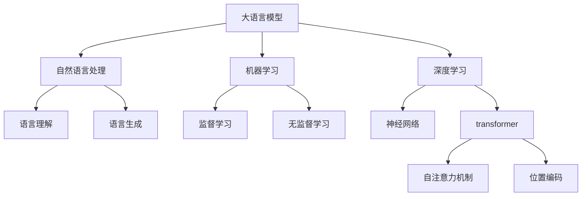

# 大语言模型原理与工程实践：百科数据

## 1. 背景介绍

### 1.1 问题的由来

在当今信息时代,海量的数据被不断产生和积累。如何高效地处理和利用这些海量数据,成为了一个亟待解决的问题。传统的数据处理方法往往效率低下,难以满足现代应用的需求。因此,需要一种新的范式来处理这些数据。

大语言模型(Large Language Model,LLM)作为一种新兴的人工智能技术,凭借其强大的语言理解和生成能力,为解决这一问题提供了新的思路。LLM可以从海量的文本数据中学习知识,并以自然语言的形式输出,为人类提供有价值的信息和见解。

然而,训练一个高质量的大语言模型需要消耗大量的计算资源和存储空间。特别是当训练数据集规模达到百科全书级别时,这个挑战就变得更加严峻。如何在有限的资源约束下,高效地训练出性能卓越的大语言模型,成为了一个亟待解决的关键问题。

### 1.2 研究现状

目前,已有多个科技公司和研究机构投入了大量资源研究大语言模型。例如,OpenAI的GPT-3模型使用了1750亿个参数,训练数据集包含约5,000亿个token;谷歌的PaLM模型使用了5,400亿个参数,训练数据集包含了780亿个token。这些大语言模型展现出了惊人的性能,但同时也面临着巨大的计算和存储开销。

为了解决这一问题,研究人员提出了多种优化策略,包括模型压缩、分布式训练、混合精度训练等。然而,这些方法往往需要复杂的工程实现,或者会导致模型性能下降。因此,如何在不牺牲模型性能的情况下,降低训练和推理的计算开销,仍然是一个具有挑战性的问题。

### 1.3 研究意义

高效训练大语言模型对于充分利用海量数据,提高人工智能系统的性能至关重要。成功解决这一问题,不仅可以推动自然语言处理、知识图谱构建等领域的发展,还将为其他领域的人工智能应用提供有力支持。

此外,高效的大语言模型训练方法也有助于降低计算资源的消耗,从而减少对环境的影响,促进人工智能技术的可持续发展。

### 1.4 本文结构

本文将全面介绍大语言模型的原理和工程实践,重点关注如何利用百科数据高效训练大语言模型。文章将从以下几个方面进行阐述:

1. 核心概念与联系
2. 核心算法原理与具体操作步骤
3. 数学模型和公式详细讲解与案例分析
4. 项目实践:代码实例和详细解释
5. 实际应用场景和未来展望
6. 工具和资源推荐
7. 总结:未来发展趋势与挑战
8. 附录:常见问题与解答

接下来,我们将逐一探讨这些内容。

## 2. 核心概念与联系

在深入讨论大语言模型的原理和实践之前,我们需要先了解一些核心概念及其之间的联系。

1. **大语言模型(LLM)**: 一种基于深度学习的自然语言处理模型,旨在从海量文本数据中学习语言知识,并能够进行语言理解和生成任务。

2. **自然语言处理(NLP)**: 研究计算机处理和分析人类语言的理论和方法,包括语言理解和语言生成两个主要任务。

3. **机器学习(ML)**: 赋予计算机从数据中自动学习和改进的能力,包括监督学习和无监督学习两种主要范式。

4. **深度学习(DL)**: 基于人工神经网络的一种机器学习方法,能够从数据中自动学习多层次特征表示。

5. **Transformer**: 一种革命性的深度学习模型架构,广泛应用于自然语言处理任务,其核心是自注意力机制和位置编码。

大语言模型是自然语言处理、机器学习和深度学习等多个领域交叉融合的产物。它利用深度学习中的Transformer架构,从海量文本数据中学习语言知识,从而实现语言理解和生成等自然语言处理任务。

## 3. 核心算法原理与具体操作步骤

### 3.1 算法原理概述

训练大语言模型的核心算法是**掩码语言模型(Masked Language Model, MLM)**,它是一种自监督学习算法。MLM的基本思想是:在输入序列中随机掩蔽部分词元(token),然后让模型基于上下文预测被掩蔽的词元。通过这种方式,模型可以学习到丰富的语言知识,而无需人工标注的监督数据。

MLM算法的训练过程可以概括为以下三个主要步骤:

1. **数据预处理**: 将原始文本数据转换为模型可以处理的格式,包括分词、词元化、构建词表等。

2. **掩码采样**: 在输入序列中随机选择一定比例的词元进行掩码,即用特殊的掩码标记[MASK]替换这些词元。

3. **模型训练**: 使用掩码后的序列作为输入,训练Transformer模型预测被掩码的词元。模型的目标是最大化被掩码词元的预测概率。

通过上述步骤,大语言模型可以从海量的文本数据中学习丰富的语言知识,而无需人工标注的监督数据。这种自监督学习方式大大降低了数据标注的成本,使得大语言模型可以在更大规模的数据集上进行训练。

### 3.2 算法步骤详解

接下来,我们将详细介绍MLM算法的具体实现步骤。

#### 3.2.1 数据预处理

数据预处理是MLM算法的第一步,目的是将原始文本数据转换为模型可以处理的格式。主要包括以下几个步骤:

1. **分词**: 将连续的文本序列分割成一个个单词或词元。常用的分词工具包括基于规则的分词器和基于统计模型的分词器。

2. **词元化**: 将单词映射为模型的词表中的索引,即将单词转换为词元(token)。通常会添加一些特殊词元,如[PAD]用于填充、[UNK]表示未知词等。

3. **构建词表**: 统计语料库中所有不同的词元,构建一个词表(vocabulary),为每个词元分配一个唯一的索引。

4. **数据切分**: 将预处理后的数据切分为多个长度固定的序列块,作为模型的输入。

通过上述步骤,原始文本数据就转换为了一系列数字序列,可以输入到Transformer模型中进行训练。

#### 3.2.2 掩码采样

掩码采样是MLM算法的核心步骤,它决定了模型将学习到什么样的语言知识。常见的掩码采样策略包括:

1. **随机采样**: 在输入序列中随机选择一定比例(通常为15%)的词元进行掩码。

2. **连续采样**: 除了随机采样单个词元,还可以采样连续的n-gram词元序列。这样可以让模型学习到更多的上下文信息。

3. **特殊词元保留**: 对于一些特殊词元(如标点符号、数字等),可以选择不进行掩码,以保留它们的语义信息。

4. **不同掩码策略**: 除了使用特殊的[MASK]标记,还可以尝试其他掩码策略,如用随机词元替换、用特殊标记替换等。

掩码采样的目标是在输入序列中引入适度的噪声,从而让模型学习到更加鲁棒的语言表示。不同的采样策略会影响模型学习到的语言知识,因此需要根据具体任务进行调整和优化。

#### 3.2.3 模型训练

经过数据预处理和掩码采样后,我们就可以开始训练Transformer模型了。模型训练的目标是最大化被掩码词元的预测概率。

具体的训练过程如下:

1. **输入编码**: 将掩码后的序列输入到Transformer的编码器(encoder)中,获得序列的上下文表示。

2. **掩码预测**: 使用编码器的输出,通过一个分类器(classifier)预测被掩码词元的概率分布。

3. **损失计算**: 计算预测概率分布与真实标签(被掩码的词元)之间的交叉熵损失。

4. **梯度更新**: 使用优化算法(如Adam)计算损失对模型参数的梯度,并更新模型参数。

在训练过程中,我们可以采用一些技巧来提高模型的性能和训练效率,如:

- **预训练和微调**: 先在大规模无标注数据上进行预训练,再在特定任务的有标注数据上进行微调。

- **混合精度训练**: 使用16位或8位浮点数代替32位浮点数进行计算,可以加速训练并节省内存。

- **梯度累积**: 将多个小批次的梯度累积起来,再进行一次参数更新,可以模拟使用更大的批次大小。

通过上述步骤,大语言模型可以从海量的文本数据中学习到丰富的语言知识,为下游的自然语言处理任务提供强大的语言表示能力。

### 3.3 算法优缺点

MLM算法作为训练大语言模型的核心算法,具有以下优缺点:

**优点**:

1. **自监督学习**: MLM算法属于自监督学习范式,无需人工标注的监督数据,可以从大规模的无标注文本数据中学习语言知识。

2. **通用性强**: MLM算法学习到的语言知识是通用的,可以应用于多种自然语言处理任务,如文本分类、机器翻译、问答系统等。

3. **性能优异**: MLM算法训练的大语言模型在多项自然语言处理任务上展现出了优异的性能,超越了传统的监督学习模型。

4. **可解释性**: MLM算法的训练目标是预测被掩码的词元,这种方式具有一定的可解释性,有助于理解模型学习到的语言知识。

**缺点**:

1. **计算资源消耗大**: 训练大规模的大语言模型需要消耗大量的计算资源和存储空间,对硬件设施要求较高。

2. **数据质量要求高**: MLM算法对训练数据的质量要求较高,低质量的数据可能会导致模型学习到错误或无用的知识。

3. **长期依赖问题**: MLM算法训练的模型可能存在长期依赖问题,即对于较长的序列,模型难以捕捉到远程的依赖关系。

4. **缺乏明确的目标**: MLM算法的训练目标是预测被掩码的词元,这种目标相对简单,可能无法完全捕捉语言的复杂性。

总的来说,MLM算法是一种高效的自监督学习方法,适合训练大规模的大语言模型。但它也存在一些缺陷,需要通过优化算法、改进模型架构等方式来加以解决。

### 3.4 算法应用领域

MLM算法训练的大语言模型可以广泛应用于多个自然语言处理领域,包括但不限于:

1. **文本生成**: 利用大语言模型生成连贯、流畅的自然语言文本,可应用于新闻写作、创作写作、对话系统等场景。

2. **机器翻译**: 将大语言模型应用于机器翻译任务,可以显著提高翻译质量,尤其是在低资源语言对之间的翻译上。

3. **文本摘要**: 使用大语言模型对长文本进行摘要,生成简洁、信息丰富的摘要文本。

4. **问答系统**: 基于大语言模型构建智能问答系统,可以从海量文本中