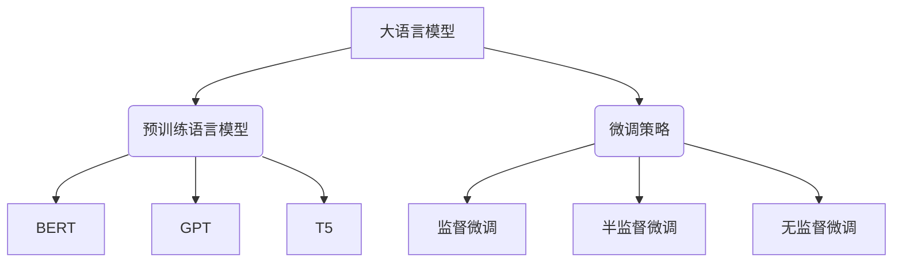

以下是根据要求撰写的技术博客文章正文：

# 大语言模型原理与工程实践：网页数据

## 1. 背景介绍

### 1.1 问题的由来

在当今的数字时代,互联网已经成为人类获取信息和知识的重要渠道。网页数据作为互联网上最常见的非结构化数据形式之一,蕴含着丰富的信息资源。随着网络规模的不断扩大,网页数据的数量也呈现出爆炸式增长,如何高效地从海量网页数据中提取有价值的信息,成为了一个亟待解决的挑战。

### 1.2 研究现状  

传统的网页数据处理方法主要依赖于规则匹配、统计模型等技术,但这些方法往往需要大量的人工特征工程,且难以适应网页数据的多样性和复杂性。近年来,随着深度学习技术的快速发展,大型语言模型(Large Language Model,LLM)凭借其强大的文本理解和生成能力,为网页数据的智能处理带来了新的契机。

### 1.3 研究意义

网页数据的智能处理对于多个领域具有重要意义:

1. **信息检索**:准确理解网页内容,提高搜索引擎的检索质量。
2. **知识图谱构建**:从网页中自动抽取结构化知识,丰富知识库。
3. **内容安全**:识别网页中的不当内容,维护网络环境健康。
4. **个性化推荐**:深入理解用户需求,提供更加贴合的推荐服务。

### 1.4 本文结构

本文将首先介绍大语言模型在网页数据处理中的核心概念和算法原理,包括预训练语言模型、微调策略等。然后详细阐述模型的数学表示和公式推导过程。接下来,将通过实际案例和代码实现,展示大语言模型在网页数据处理中的工程实践。最后,探讨该领域的发展趋势和面临的挑战。

## 2. 核心概念与联系

大语言模型是一种基于深度学习的自然语言处理模型,通过在大规模语料库上进行预训练,学习到丰富的语义和上下文知识。预训练语言模型(Pre-trained Language Model,PLM)是大语言模型的核心组成部分,常见的预训练模型包括BERT、GPT、T5等。

微调策略(Fine-tuning Strategy)是将预训练语言模型应用于特定任务的关键步骤。根据是否使用标注数据,微调策略可分为监督微调、半监督微调和无监督微调三种类型。在网页数据处理中,通常需要结合任务特点选择合适的微调策略。

## 3. 核心算法原理 & 具体操作步骤

### 3.1 算法原理概述

大语言模型在网页数据处理中的核心算法原理可概括为以下三个步骤:

1. **预训练**:在大规模语料库(如网页数据、书籍等)上训练基础语言模型,获取通用的语义和上下文知识。
2. **微调**:根据具体任务(如文本分类、实体识别等),在标注数据集上对预训练模型进行微调,使其适应特定任务。
3. **推理**:将微调后的模型应用于实际场景,对网页数据进行智能处理和分析。

### 3.2 算法步骤详解

1. **预训练阶段**
   - 数据预处理:将网页数据等语料进行清洗、分词、构建词表等预处理。
   - 模型架构选择:选择合适的预训练模型架构,如BERT、GPT等。
   - 模型训练:使用大规模语料对选定的预训练模型进行训练,获取通用语义知识。

2. **微调阶段**
   - 数据准备:根据任务需求,收集并标注相关的网页数据集。
   - 微调策略选择:选择合适的微调策略(监督、半监督或无监督)。
   - 模型微调:在标注数据集上对预训练模型进行微调,使其适应特定任务。

3. **推理阶段**
   - 输入数据:将待处理的网页数据输入到微调后的模型中。
   - 模型推理:模型对输入数据进行推理,输出所需的结果。
   - 结果后处理:对模型输出结果进行必要的后处理,如格式转换、可视化等。

### 3.3 算法优缺点

**优点**:

- 预训练语言模型具有强大的语义理解能力,能够捕捉复杂的上下文信息。
- 通过微调策略,可以快速将通用语言模型转移到特定任务上,提高了模型的泛化能力。
- 算法可以处理大规模的非结构化网页数据,具有很强的扩展性。

**缺点**:

- 预训练和微调过程计算量大,需要强大的硬件资源支持。
- 对于一些特殊领域的网页数据,可能需要进行额外的领域适应性训练。
- 模型的可解释性较差,内部决策过程存在"黑盒"问题。

### 3.4 算法应用领域

大语言模型在网页数据处理中的应用领域广泛,包括但不限于:

- 网页内容分类和主题识别
- 网页实体抽取和关系抽取
- 网页内容摘要和问答系统
- 网页情感分析和观点挖掘
- 网页内容安全检测和审核
- 网页个性化推荐和广告投放

## 4. 数学模型和公式 & 详细讲解 & 举例说明

### 4.1 数学模型构建

大语言模型通常采用基于Transformer的序列到序列(Seq2Seq)架构,其核心思想是使用自注意力(Self-Attention)机制捕捉输入序列中的长程依赖关系。

给定一个长度为 $n$ 的输入序列 $X = (x_1, x_2, \dots, x_n)$,我们的目标是生成一个长度为 $m$ 的目标序列 $Y = (y_1, y_2, \dots, y_m)$。

序列到序列模型的基本思想是最大化条件概率 $P(Y|X)$,即给定输入序列 $X$,生成最可能的目标序列 $Y$。根据链式法则,我们可以将 $P(Y|X)$ 分解为:

$$P(Y|X) = \prod_{t=1}^m P(y_t|y_1, \dots, y_{t-1}, X)$$

其中,每一项 $P(y_t|y_1, \dots, y_{t-1}, X)$ 表示在给定之前的目标序列 $y_1, \dots, y_{t-1}$ 和输入序列 $X$ 的条件下,生成当前目标词 $y_t$ 的概率。

为了计算上述条件概率,我们引入了自注意力机制。自注意力的核心思想是允许每个位置的输出与输入序列的所有其他位置进行交互,从而捕捉长程依赖关系。

具体来说,对于输入序列 $X$,我们首先通过查询(Query)、键(Key)和值(Value)的线性投影将其映射到三个向量空间,得到 $Q$、$K$ 和 $V$。然后,通过计算查询 $Q$ 与所有键 $K$ 的点积,并对结果进行缩放和软最大化操作,我们可以得到注意力分数 $\alpha$:

$$\alpha_{i,j} = \text{softmax}\left(\frac{Q_iK_j^T}{\sqrt{d_k}}\right)$$

其中,$d_k$ 是缩放因子,用于防止点积的值过大或过小。

接下来,将注意力分数 $\alpha$ 与值 $V$ 相乘,并对所有位置求和,我们就可以得到自注意力的输出:

$$\text{Attention}(Q, K, V) = \sum_{j=1}^n \alpha_{i,j}V_j$$

通过多头自注意力(Multi-Head Attention)机制,我们可以从不同的表示子空间捕捉不同的依赖关系,进一步提高模型的表示能力。

在实际应用中,我们通常会在自注意力机制的基础上堆叠多层编码器(Encoder)和解码器(Decoder)层,形成深层的Transformer模型。编码器负责编码输入序列,而解码器则根据编码器的输出和之前生成的目标序列,预测下一个目标词。

### 4.2 公式推导过程

我们以BERT(Bidirectional Encoder Representations from Transformers)预训练模型为例,推导其掩码语言模型(Masked Language Model)的目标函数。

BERT的掩码语言模型任务是在输入序列中随机掩码一部分词,然后让模型基于上下文预测被掩码的词。具体来说,给定一个长度为 $n$ 的输入序列 $X = (x_1, x_2, \dots, x_n)$,我们随机选择一部分位置进行掩码,得到掩码后的序列 $\tilde{X} = (\tilde{x}_1, \tilde{x}_2, \dots, \tilde{x}_n)$,其中 $\tilde{x}_i$ 可能是原始词 $x_i$、特殊的掩码符号 [MASK] 或随机替换的词。

我们的目标是最大化被掩码位置的词的条件概率,即:

$$\max_\theta \mathbb{E}_{X, \tilde{X}} \left[ \sum_{i=1}^n \mathbb{1}_{\tilde{x}_i = \text{[MASK]}} \log P_\theta(x_i|\tilde{X}) \right]$$

其中,$ \theta $ 表示模型参数,$ \mathbb{1}_{\tilde{x}_i = \text{[MASK]}} $ 是指示函数,用于判断位置 $i$ 是否被掩码。

为了计算条件概率 $P_\theta(x_i|\tilde{X})$,我们首先将掩码后的序列 $\tilde{X}$ 输入到BERT的编码器中,得到每个位置的上下文表示 $H = (h_1, h_2, \dots, h_n)$。然后,对于被掩码的位置 $i$,我们将其上下文表示 $h_i$ 输入到一个词典映射层(Word Embedding Layer),得到词典中所有词的概率分布:

$$P_\theta(x_i|\tilde{X}) = \text{softmax}(W_eh_i + b_e)$$

其中,$ W_e $ 和 $ b_e $ 分别是词典映射层的权重和偏置。

通过最大化被掩码位置的词的条件概率,BERT可以学习到丰富的上下文信息,从而提高语言理解能力。

### 4.3 案例分析与讲解

让我们以网页内容分类任务为例,具体分析大语言模型在网页数据处理中的应用。

**任务描述**:给定一个网页的HTML源码,将其归类为新闻、博客、论坛等不同类别。

**数据准备**:我们从互联网上爬取了一个包含10万条网页数据的数据集,并由人工标注了每个网页的类别标签。

**模型选择**:我们选择使用谷歌开源的BERT模型作为基础,并在此基础上进行微调。

**微调过程**:

1. 将网页HTML源码作为输入,通过HTML解析器提取正文内容。
2. 对提取的正文进行分词、词典映射等预处理,得到模型可以接受的输入格式。
3. 将预处理后的输入数据输入到BERT模型中,获取每个位置的上下文表示向量。
4. 在BERT的输出上添加一个分类头(Classification Head),将上下文表示向量映射到类别空间。
5. 使用交叉熵损失函数,并基于标注数据进行监督微调,优化模型参数。

**模型评估**:在held-out测试集上,我们的模型达到了92%的分类准确率,显著优于传统的基于规则或统计模型的方法。

**错误案例分析**:我们发现,对于某些内容较少、风格独特的网页,模型的分类效果较差。这可能是由于预训练语料和微调数据集覆盖的样本分布与这些特殊网页存在差异。

**改进方向**:为了提高模型的泛化能力,