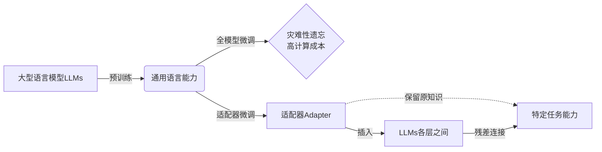

好的,我会严格遵循约束条件,以专业的技术语言写一篇关于"大语言模型原理与工程实践:适配器微调"的深度博客文章。

# 大语言模型原理与工程实践:适配器微调

## 1. 背景介绍

### 1.1 问题的由来

随着人工智能和自然语言处理技术的快速发展,大型语言模型(Large Language Models,LLMs)已经成为当前研究的热点和焦点。传统的语言模型通常基于n-gram统计或神经网络,但存在参数量有限、泛化能力较差等缺陷。相比之下,LLMs凭借其巨大的参数量和海量训练语料,展现出了强大的语言理解、生成和推理能力,在自然语言处理的诸多任务中取得了卓越的表现。

然而,LLMs也面临着一些挑战和限制。首先,训练这种大规模模型需要消耗大量计算资源,成本高昂。其次,预训练后的LLMs是通用的,需要针对特定任务进行微调(fine-tuning),但全模型微调会破坏原有知识,导致灾难性遗忘。此外,LLMs的黑箱特性也使得它们缺乏可解释性和可控性。

### 1.2 研究现状  

为解决上述问题,研究人员提出了适配器(Adapter)的概念,通过训练少量新增参数来适配LLMs,避免了全模型微调的缺陷。适配器微调保留了LLMs原有的知识,同时允许高效地将模型适配到特定任务,大大降低了计算成本。此外,适配器模块的可插拔性也为LLMs提供了更好的可解释性和可控性。

目前,适配器微调已成为LLMs微调的主流方法之一,在自然语言理解、生成、推理等多个领域展现出优异的性能。但适配器的设计、训练和应用仍然是一个活跃的研究方向,存在诸多有待解决的问题和挑战。

### 1.3 研究意义

本文对适配器微调的原理、方法和工程实践进行深入探讨,旨在为读者提供全面的理解和实践指导。具体来说,研究意义如下:

1. 系统介绍适配器微调的基本原理、关键概念和核心算法,为读者建立理论基础。

2. 详细讲解适配器的数学模型、公式推导和案例分析,加深对核心机制的理解。

3. 提供完整的工程实践指南,包括环境搭建、代码实现、运行结果等,帮助读者动手实践。

4. 总结适配器微调在自然语言处理等领域的实际应用场景,展望未来发展趋势和挑战。

5. 推荐相关的学习资源、工具和论文,为读者提供进一步探索的路径。

### 1.4 本文结构

本文共分为9个部分:

1. 背景介绍:阐述问题由来、研究现状和意义。
2. 核心概念与联系:介绍适配器微调的关键概念及其相互关系。
3. 核心算法原理与具体操作步骤:详细讲解适配器微调算法的原理、步骤、优缺点和应用领域。
4. 数学模型和公式详细讲解与案例分析:构建适配器的数学模型,推导公式并结合案例进行讲解。
5. 项目实践:代码实例和详细解释说明:提供完整的代码实现,并对关键部分进行解读和分析。
6. 实际应用场景:总结适配器微调在自然语言处理等领域的应用,并展望未来应用前景。  
7. 工具和资源推荐:推荐相关的学习资源、开发工具、论文等。
8. 总结:未来发展趋势与挑战:总结研究成果,展望发展趋势并分析面临的挑战。
9. 附录:常见问题与解答:列出常见问题并给出解答。

接下来,我们将逐一深入探讨上述各个部分的内容。

## 2. 核心概念与联系

在深入讨论适配器微调的算法原理和数学模型之前,我们需要先介绍一些核心概念,为后续内容建立基础。这些概念包括:

### 2.1 大型语言模型(LLMs)

大型语言模型指的是具有数十亿甚至上百亿参数的巨大神经网络模型,通过在大规模语料库上进行预训练而获得通用的语言理解和生成能力。典型的LLMs包括GPT、BERT、T5等,它们展现出了强大的自然语言处理性能,但也面临着高计算成本、灾难性遗忘和缺乏可解释性等问题。

### 2.2 微调(Fine-tuning)

微调是指在预训练模型的基础上,使用特定任务的数据对模型进行进一步训练,以适应该任务的需求。传统的微调方式是直接对整个预训练模型的所有参数进行更新,这种全模型微调虽然能够获得良好的性能,但也会破坏模型原有的知识,导致灾难性遗忘,且计算成本很高。

### 2.3 适配器(Adapter)

适配器是一种轻量级的模块,通过在预训练模型的不同层之间插入少量新增参数,来适配模型以满足特定任务的需求。与全模型微调相比,适配器微调只需要训练新增的少量参数,从而保留了原模型的知识,降低了计算成本,并提高了模型的可解释性和可控性。

### 2.4 残差连接(Residual Connection)

残差连接是一种常见的神经网络设计技巧,它通过将输入直接传递到输出,并与主网络的输出相加,从而构建了一条"捷径"。在适配器微调中,残差连接用于将适配器模块的输出与原始层的输出相加,以保持原模型的基本表现。

上图使用Mermaid流程图展示了这些核心概念之间的关系。大型语言模型LLMs通过预训练获得了通用的语言能力,但全模型微调会导致灾难性遗忘和高计算成本。相比之下,适配器微调通过在LLMs各层之间插入适配器模块,并使用残差连接将其输出与原始层输出相加,从而在保留原模型知识的同时,高效地将模型适配到特定任务。

## 3. 核心算法原理与具体操作步骤

### 3.1 算法原理概述

适配器微调算法的核心思想是:在预训练的大型语言模型中插入一些小的可训练模块(即适配器),使用特定任务的数据来训练这些适配器模块,从而将原模型适配到该任务,而无需更新整个大模型的参数。具体来说,适配器微调包括以下几个关键步骤:

1. **插入适配器模块**:在预训练模型的每一层之间插入一个小的适配器模块,该模块包含少量可训练参数。

2. **前向传播**:在前向传播时,输入先通过原始层的计算,然后将输出与适配器模块的输出相加(残差连接)。

3. **反向传播**:在反向传播时,只更新适配器模块中的参数,而预训练模型的参数保持不变。

4. **任务微调**:使用特定任务的数据,反复执行前向传播和反向传播,训练适配器模块的参数。

通过这种方式,预训练模型的知识得以保留,同时适配器模块能够学习到特定任务的知识,使模型适配到该任务。与全模型微调相比,适配器微调只需训练少量新增参数,大大降低了计算成本,且避免了灾难性遗忘的问题。

### 3.2 算法步骤详解

接下来,我们将详细介绍适配器微调算法的具体实现步骤:

1. **预训练模型加载**:首先加载一个预训练的大型语言模型,如BERT、GPT等。

2. **适配器模块设计**:设计适配器模块的结构和参数量。常见的适配器模块包括前馈适配器、自注意力适配器等。

3. **适配器模块插入**:将设计好的适配器模块插入到预训练模型的每一层之间。

4. **残差连接设置**:在每个适配器模块的输出端设置残差连接,将其输出与原始层输出相加。

5. **数据准备**:准备用于微调的特定任务数据集,如文本分类、机器翻译等。

6. **损失函数定义**:根据任务类型定义适当的损失函数,如交叉熵损失、均方误差等。

7. **优化器选择**:选择合适的优化算法和超参数,如Adam、学习率等。

8. **模型训练**:使用任务数据集训练适配器模块的参数,通过前向传播、损失计算、反向传播和参数更新的循环进行多轮迭代。

9. **模型评估**:在验证集上评估微调后模型的性能,根据需要进行超参数调整。

10. **模型保存**:保存微调好的模型,包括预训练模型参数和适配器模块参数。

11. **模型应用**:将微调后的模型应用到特定任务中,如文本分类、语义理解等。

通过上述步骤,我们可以高效地将大型语言模型适配到特定的自然语言处理任务,同时保留了原模型的知识,降低了计算成本。

### 3.3 算法优缺点

适配器微调算法相比传统的全模型微调方法,具有以下优点:

1. **保留原模型知识**:适配器只训练少量新增参数,而不更新原模型参数,因此能够很好地保留预训练模型的知识。

2. **降低计算成本**:由于只需训练少量新增参数,适配器微调的计算成本远低于全模型微调。

3. **提高模型可解释性**:适配器模块的可插拔性使得模型更具可解释性和可控性。

4. **避免灾难性遗忘**:不会像全模型微调那样导致对预训练知识的遗忘。

5. **高效多任务适配**:适配器模块可以针对不同任务进行插拔和组合,实现高效的多任务适配。

然而,适配器微调也存在一些缺点和局限性:

1. **性能上限**:由于只训练少量新增参数,适配器微调的性能上限可能低于全模型微调。

2. **参数增长**:随着适配的任务数量增加,新增参数也会快速增长,可能导致参数膨胀。

3. **模型复杂度**:适配器模块的插入会增加模型的复杂度,给部署和优化带来一定挑战。

4. **任务冲突**:不同任务的适配器模块之间可能存在冲突,需要特殊处理。

5. **超参数选择**:适配器模块的结构、参数量等超参数的选择对性能影响较大,需要进行大量试验。

总的来说,适配器微调为大型语言模型的高效适配提供了一种有效的解决方案,但也需要权衡其优缺点,并根据具体场景进行合理选择和设计。

### 3.4 算法应用领域

由于其高效性和灵活性,适配器微调已被广泛应用于自然语言处理的多个领域,包括但不限于:

1. **文本分类**:将大型语言模型适配到文本分类任务中,如新闻分类、情感分析等。

2. **机器翻译**:通过适配器微调,将预训练模型适配到特定语言对的翻译任务。

3. **问答系统**:使用适配器微调,将LLMs应用于开放域问答、阅读理解等问答任务。

4. **对话系统**:将LLMs适配到对话生成任务,用于构建对话机器人、虚拟助手等。

5. **文本生成**:利用适配器微调,将LLMs应用于文本续写、创作、摘要等生成任务。

6. **关系抽取**:将预训练模型适配到关系抽取任务