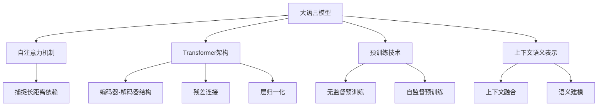

# 大语言模型原理基础与前沿 上下文学习

## 1. 背景介绍

### 1.1 问题的由来

在自然语言处理领域,传统的语言模型通常基于n-gram或神经网络,捕捉单词之间的局部关系。然而,这种方法存在一些固有的局限性,无法很好地理解上下文和语义信息。随着深度学习技术的飞速发展,大型语言模型(Large Language Model, LLM)应运而生,旨在通过学习海量文本数据来捕捉上下文语义,从而更好地理解和生成自然语言。

大语言模型的出现极大地推动了自然语言处理技术的发展,但同时也带来了新的挑战。如何高效地学习和表示上下文语义,如何解决长序列问题,如何处理多模态数据等,都是亟待解决的关键问题。

### 1.2 研究现状

目前,主流的大语言模型主要包括Transformer、BERT、GPT、XLNet等,它们采用了自注意力机制、预训练等技术来捕捉上下文语义。这些模型在各种自然语言处理任务上取得了卓越的成绩,如机器翻译、文本生成、阅读理解等。

然而,现有的大语言模型也存在一些不足,比如对长序列的处理能力有限、对多模态数据的支持不足、计算资源消耗巨大等。因此,如何进一步提高大语言模型的性能、效率和泛化能力,成为当前研究的重点方向。

### 1.3 研究意义

大语言模型的研究对于推动自然语言处理技术的发展具有重要意义。通过深入探索上下文语义学习的原理和方法,我们可以更好地理解和模拟人类的语言能力,从而为智能系统的构建提供有力支持。

此外,大语言模型的应用前景广阔,涉及机器翻译、对话系统、智能写作辅助、知识图谱构建等多个领域。提高大语言模型的性能和泛化能力,将直接推动这些应用领域的进步,为人工智能技术在实际场景中的落地提供坚实基础。

### 1.4 本文结构

本文将全面系统地介绍大语言模型的基础理论和前沿发展,内容包括:

1. 核心概念与联系
2. 核心算法原理及具体操作步骤
3. 数学模型和公式详细讲解及举例说明
4. 项目实践:代码实例和详细解释说明
5. 实际应用场景
6. 工具和资源推荐
7. 总结:未来发展趋势与挑战
8. 附录:常见问题与解答

## 2. 核心概念与联系

上图展示了大语言模型的核心概念及其相互联系:

1. **大语言模型(LLM)**: 旨在通过学习海量文本数据来捕捉上下文语义,从而更好地理解和生成自然语言。
2. **自注意力机制**: 允许模型直接捕捉输入序列中任意两个位置之间的依赖关系,有效解决了长距离依赖问题。
3. **Transformer架构**: 基于自注意力机制构建的编码器-解码器模型,是大语言模型的核心架构。
4. **预训练技术**: 包括无监督预训练和自监督预训练,通过学习大规模语料库获得通用的语言表示能力。
5. **上下文语义表示**: 大语言模型的目标是学习上下文语义表示,通过上下文融合和语义建模来理解和生成自然语言。

这些核心概念相互关联、相辅相成,共同推动了大语言模型技术的发展。

## 3. 核心算法原理 & 具体操作步骤

### 3.1 算法原理概述

大语言模型的核心算法原理主要包括以下几个方面:

1. **自注意力机制**: 通过计算查询向量(Query)与所有键向量(Key)的相似性,获得对应的值向量(Value)的加权和,从而捕捉输入序列中任意两个位置之间的依赖关系。

2. **Transformer架构**: 基于自注意力机制构建的编码器-解码器模型,编码器捕捉输入序列的上下文语义表示,解码器根据编码器的输出和目标序列生成预测结果。

3. **残差连接和层归一化**: 用于解决深度神经网络的梯度消失和梯度爆炸问题,提高模型的训练稳定性和收敛速度。

4. **预训练技术**: 通过无监督或自监督的方式,在大规模语料库上预训练模型,获得通用的语言表示能力,然后在下游任务上进行微调。

5. **上下文融合和语义建模**: 通过自注意力机制和深层神经网络,融合输入序列中的上下文信息,建模语义表示,从而理解和生成自然语言。

### 3.2 算法步骤详解

以Transformer模型为例,其核心算法步骤如下:

1. **输入嵌入**: 将输入序列(源语言或目标语言)转换为嵌入向量表示。

2. **位置编码**: 为每个位置添加位置信息,使模型能够捕捉序列的位置依赖关系。

3. **编码器自注意力**: 在编码器中,对输入序列进行自注意力计算,获得上下文语义表示。

4. **解码器自注意力**: 在解码器中,对已生成的目标序列进行自注意力计算。

5. **编码器-解码器注意力**: 解码器根据编码器的输出和目标序列,进行编码器-解码器注意力计算。

6. **前馈神经网络**: 对注意力输出进行非线性变换,提取高级语义特征。

7. **残差连接和层归一化**: 应用残差连接和层归一化,stabilize训练过程。

8. **预测输出**: 根据解码器的输出,预测下一个目标词。

9. **损失计算和优化**: 计算预测输出与真实目标序列之间的损失,并通过反向传播优化模型参数。

### 3.3 算法优缺点

**优点**:

- 自注意力机制能够有效捕捉长距离依赖关系,解决了传统序列模型的局限性。
- 并行计算能力强,可以充分利用GPU/TPU等硬件加速训练。
- 预训练技术大幅提高了模型的泛化能力,在下游任务上取得了卓越的性能。
- 模型架构简洁,易于扩展和优化。

**缺点**:

- 计算资源消耗巨大,训练大型模型需要昂贵的硬件设备和大量计算资源。
- 对长序列的处理能力有限,需要采用特殊技术(如稀疏注意力)来缓解长序列问题。
- 缺乏对多模态数据(如图像、视频等)的有效支持。
- 存在一定的安全隐患,如生成有害内容、隐私泄露等。

### 3.4 算法应用领域

大语言模型及其核心算法已被广泛应用于多个自然语言处理领域,包括但不限于:

- **机器翻译**: 使用编码器-解码器架构,将源语言转换为目标语言。
- **文本生成**: 根据给定的提示或上下文,生成连贯、流畅的自然语言文本。
- **阅读理解**: 理解给定的文本内容,回答相关问题。
- **对话系统**: 根据上下文,生成自然的对话响应。
- **文本摘要**: 自动生成文本的摘要或概括。
- **情感分析**: 分析文本中的情感倾向,如正面、负面等。
- **实体识别和关系抽取**: 从文本中识别实体并抽取实体之间的关系。

此外,大语言模型还可以应用于知识图谱构建、智能写作辅助、问答系统等多个领域,展现出广阔的应用前景。

## 4. 数学模型和公式 & 详细讲解 & 举例说明

### 4.1 数学模型构建

大语言模型的核心数学模型是基于自注意力机制和Transformer架构构建的。我们首先定义输入序列 $X = (x_1, x_2, \dots, x_n)$,其中 $x_i$ 表示第 $i$ 个位置的输入词嵌入向量。

#### 4.1.1 缩放点积注意力

缩放点积注意力是自注意力机制的基础,其数学表达式如下:

$$\mathrm{Attention}(Q, K, V) = \mathrm{softmax}\left(\frac{QK^T}{\sqrt{d_k}}\right)V$$

其中:
- $Q$: 查询向量(Query)
- $K$: 键向量(Key)
- $V$: 值向量(Value)
- $d_k$: 缩放因子,用于防止内积过大导致的梯度饱和

通过计算查询向量 $Q$ 与所有键向量 $K$ 的相似性(点积),获得注意力权重,然后将注意力权重与值向量 $V$ 相乘,得到加权和作为注意力输出。

#### 4.1.2 多头注意力

为了捕捉不同的子空间表示,引入了多头注意力机制:

$$\mathrm{MultiHead}(Q, K, V) = \mathrm{Concat}(head_1, \dots, head_h)W^O$$
$$\text{where } head_i = \mathrm{Attention}(QW_i^Q, KW_i^K, VW_i^V)$$

其中:
- $h$: 注意力头数
- $W_i^Q, W_i^K, W_i^V$: 投影矩阵,用于将 $Q, K, V$ 投影到不同的子空间
- $W^O$: 输出线性变换矩阵

多头注意力机制允许模型从不同的子空间捕捉不同的依赖关系,提高了模型的表示能力。

### 4.2 公式推导过程

我们以缩放点积注意力为例,推导其数学表达式。

首先,我们定义查询向量 $Q \in \mathbb{R}^{n \times d_k}$,键向量 $K \in \mathbb{R}^{n \times d_k}$,值向量 $V \in \mathbb{R}^{n \times d_v}$,其中 $n$ 表示序列长度, $d_k$ 和 $d_v$ 分别表示键向量和值向量的维度。

注意力分数矩阵 $S$ 可以通过查询向量 $Q$ 与键向量 $K$ 的点积计算得到:

$$S = QK^T$$

为了防止内积过大导致的梯度饱和,我们对注意力分数矩阵进行缩放:

$$S' = \frac{S}{\sqrt{d_k}}$$

然后,我们对缩放后的注意力分数矩阵 $S'$ 应用 softmax 函数,获得注意力权重矩阵 $A$:

$$A = \mathrm{softmax}(S') = \mathrm{softmax}\left(\frac{QK^T}{\sqrt{d_k}}\right)$$

最后,将注意力权重矩阵 $A$ 与值向量 $V$ 相乘,得到注意力输出:

$$\mathrm{Attention}(Q, K, V) = AV = \mathrm{softmax}\left(\frac{QK^T}{\sqrt{d_k}}\right)V$$

这就是缩放点积注意力的完整数学表达式。

### 4.3 案例分析与讲解

为了更好地理解自注意力机制,我们以一个简单的机器翻译案例进行分析和讲解。

假设我们要将英文句子 "I love playing football" 翻译成中文。输入序列为 $X = (x_1, x_2, x_3, x_4)$,其中 $x_1$ 表示 "I"、$x_2$ 表示 "love"、$x_3$ 表示 "playing"、$x_4$ 表示 "football"。

在编码器的自注意力层中,我们计算每个位置与其他所有位置之间的注意力权重,从