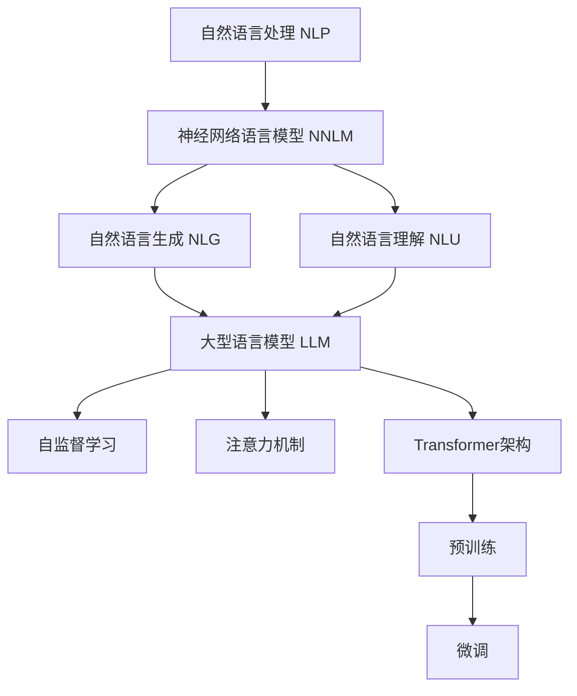

以下是题为《大语言模型原理基础与前沿 世界模型》的技术博客文章正文部分：

# 大语言模型原理基础与前沿 世界模型

## 1. 背景介绍

### 1.1 问题的由来

在过去的几年中,大型语言模型(Large Language Models, LLMs)在自然语言处理(NLP)领域取得了令人瞩目的进展。传统的NLP系统通常依赖于手工设计的规则和特征,需要大量的人工干预和领域知识。而LLMs则是通过在大规模语料库上进行自监督预训练,自动学习文本中蕴含的语义和语法知识,从而能够泛化到各种下游NLP任务。

随着计算能力和数据量的不断增长,LLMs的规模也在不断扩大。从2018年发布的Transformer模型,到2020年的GPT-3,再到2022年的PaLM、Chinchilla和AlphaFold等,模型参数规模已经达到了惊人的数十亿到数万亿量级。这些大规模模型展现出了强大的语言理解和生成能力,在机器翻译、文本摘要、问答系统等多个领域取得了人类水平的性能。

### 1.2 研究现状  

虽然大型语言模型取得了巨大的成功,但它们的内部机理和工作原理仍然是一个未解之谜。目前的研究主要集中在以下几个方面:

1. **模型可解释性**:探索LLMs内部参数和表示的语义属性,揭示它们如何捕获和编码语言知识。
2. **模型鲁棒性**:研究LLMs对于噪声、对抗样本和不确定输入的鲁棒性,以及如何提高它们的可靠性。
3. **模型效率**:设计更高效的模型架构和训练算法,降低训练和推理的计算开销。
4. **模型可控性**:探索控制LLMs输出的方法,使其符合特定的属性或约束,如无偏见、无毒性等。
5. **模型可解释性**:赋予LLMs更强的推理和解释能力,使其不仅能生成高质量的输出,还能解释其背后的原因和逻辑。

此外,一些研究人员也在探索LLMs在自然语言理解、常识推理、多模态等更广泛的人工智能领域中的应用前景。

### 1.3 研究意义

深入理解大型语言模型的工作原理和内在机制,对于推动自然语言处理和人工智能技术的发展至关重要。它不仅能够帮助我们设计出更高效、更鲁棒、更可控的语言模型,还能为探索通用人工智能奠定基础。此外,揭示LLMs内部语言知识的表示方式,也有助于我们更好地理解人类语言的本质。

### 1.4 本文结构  

本文将从以下几个方面深入探讨大型语言模型的原理和前沿技术:

1. 核心概念与联系
2. 核心算法原理与具体操作步骤
3. 数学模型和公式详细讲解与案例分析  
4. 项目实践:代码实例和详细解释说明
5. 实际应用场景
6. 工具和学习资源推荐
7. 总结:未来发展趋势与挑战
8. 附录:常见问题与解答

## 2. 核心概念与联系

在深入探讨大型语言模型的细节之前,我们先介绍一些核心概念,为后续内容做好铺垫。

### 2.1 自然语言处理(NLP)

自然语言处理(Natural Language Processing, NLP)是人工智能的一个分支,旨在使计算机能够理解和生成人类语言。它涉及多个子领域,如机器翻译、文本摘要、问答系统、情感分析等。传统的NLP系统通常依赖于手工设计的规则和特征,需要大量的人工干预和领域知识。

### 2.2 神经网络语言模型

神经网络语言模型(Neural Network Language Model, NNLM)是NLP领域的一种基于深度学习的技术。与传统的基于统计的n-gram语言模型不同,NNLM能够自动从大量语料中学习词与词之间的上下文关系,并对句子或文本的概率分布进行建模。这种方法避免了传统方法中特征工程的瓶颈,展现出了强大的语言理解和生成能力。

### 2.3 自然语言生成(NLG)

自然语言生成(Natural Language Generation, NLG)是NLP的一个重要分支,旨在自动生成可读、流畅、符合语法和语义规范的自然语言文本。它广泛应用于对话系统、自动文本写作、报告生成等场景。大型语言模型正是NLG领域的核心技术之一。

### 2.4 自然语言理解(NLU)  

自然语言理解(Natural Language Understanding, NLU)是NLP的另一个重要分支,旨在使计算机能够理解人类语言的含义和上下文。它包括词法分析、句法分析、语义分析、指代消解、关系抽取等多个子任务。大型语言模型展现出了强大的语言理解能力,能够在多个NLU任务上取得人类水平的性能。

### 2.5 自监督学习

自监督学习(Self-Supervised Learning)是一种无需人工标注的机器学习范式。在NLP领域,自监督学习通常采用"遮蔽语言模型"(Masked Language Model)的形式,即在输入文本中随机遮蔽部分词语,然后训练模型去预测被遮蔽的词语。通过这种方式,模型能够从大量未标注语料中自动学习语言的语义和语法知识。

### 2.6 注意力机制

注意力机制(Attention Mechanism)是一种用于捕获长距离依赖关系的神经网络技术。它允许模型在编码输入序列时,对不同位置的元素赋予不同的权重,从而更好地捕获全局信息。自注意力(Self-Attention)是注意力机制的一种变体,它使模型能够同时关注输入序列中的所有位置,从而更好地建模序列内部的依赖关系。注意力机制是大型语言模型(如Transformer)的核心组件之一。

### 2.7 Transformer架构

Transformer是一种全新的基于注意力机制的序列到序列(Seq2Seq)模型架构,最初被提出用于机器翻译任务。它完全摒弃了传统的循环神经网络(RNN)和卷积神经网络(CNN)结构,而是使用多头自注意力层和前馈网络层构建编码器和解码器。Transformer架构具有并行计算的优势,能够更好地捕获长距离依赖关系,因此被广泛应用于大型语言模型的构建。

### 2.8 预训练与微调

预训练(Pre-training)是一种将大型语言模型在大规模语料库上进行通用训练的范式,使模型能够学习到通用的语言知识。而微调(Fine-tuning)则是在预训练模型的基础上,使用特定任务的少量标注数据进行进一步训练,从而将通用语言知识转移到特定的下游任务。这种预训练加微调的范式能够极大地提高模型的性能和泛化能力。

### 2.9 Mermaid 流程图

上图展示了大型语言模型(LLM)与自然语言处理(NLP)、神经网络语言模型(NNLM)、自然语言生成(NLG)、自然语言理解(NLU)、自监督学习、注意力机制、Transformer架构、预训练和微调等核心概念之间的关系。LLM是近年来NLP领域的一个重大突破,它集成了多种前沿技术,展现出了强大的语言理解和生成能力。

## 3. 核心算法原理与具体操作步骤

### 3.1 算法原理概述

大型语言模型的核心算法原理可以概括为三个关键步骤:

1. **自监督预训练**: 在大规模语料库上使用自监督学习的方式(如遮蔽语言模型)对模型进行预训练,使其学习到通用的语言知识。
2. **Transformer编码**: 使用Transformer编码器对输入文本进行编码,捕获单词之间的上下文依赖关系。
3. **生成与微调**: 根据下游任务的目标,使用Transformer解码器生成输出序列;或在特定任务上使用少量标注数据对预训练模型进行微调,将通用语言知识转移到特定任务。

下面我们将详细介绍这三个步骤的具体算法细节。

### 3.2 算法步骤详解

#### 3.2.1 自监督预训练

自监督预训练阶段的主要目标是使模型学习到通用的语言知识,为后续的下游任务做好准备。最常用的自监督预训练目标是"遮蔽语言模型"(Masked Language Model, MLM),其具体步骤如下:

1. 从语料库中随机采样一个序列(如一个句子或段落)。
2. 在序列中随机选择15%的词语,并用特殊的"[MASK]"标记替换它们。
3. 将被遮蔽的序列输入到Transformer编码器中,得到每个位置的上下文表示。
4. 对于被遮蔽的位置,将其上下文表示输入到一个双层感知机(Two-Layer Perceptron)中,预测该位置最可能是哪个词语。
5. 使用交叉熵损失函数计算预测值与真实值之间的差异,并使用优化算法(如Adam)对模型参数进行更新。

通过上述步骤,模型可以学习到词语与上下文之间的关系,从而获得通用的语言理解能力。除了MLM,一些模型还会使用"下一句预测"(Next Sentence Prediction, NSP)作为辅助目标,以捕获更长距离的依赖关系。

#### 3.2.2 Transformer编码

在自监督预训练阶段,输入序列需要通过Transformer编码器进行编码,以获得每个位置的上下文表示。Transformer编码器的核心是多头自注意力(Multi-Head Self-Attention)机制,它允许模型同时关注输入序列中的所有位置,捕获长距离依赖关系。

具体来说,对于长度为n的输入序列$X = (x_1, x_2, \ldots, x_n)$,Transformer编码器首先将每个词语$x_i$映射为一个向量表示$\mathbf{e}_i$,然后进行如下计算:

$$\begin{aligned}
\mathbf{Q}_i &= \mathbf{e}_i \mathbf{W}^Q \\
\mathbf{K}_i &= \mathbf{e}_i \mathbf{W}^K \\
\mathbf{V}_i &= \mathbf{e}_i \mathbf{W}^V
\end{aligned}$$

其中$\mathbf{W}^Q, \mathbf{W}^K, \mathbf{W}^V$分别是查询(Query)、键(Key)和值(Value)的投影矩阵。

接下来,计算注意力权重:

$$\text{Attention}(\mathbf{Q}_i, \mathbf{K}, \mathbf{V}) = \text{softmax}\left(\frac{\mathbf{Q}_i \mathbf{K}^\top}{\sqrt{d_k}}\right) \mathbf{V}$$

其中$d_k$是缩放因子,用于防止点积过大导致的梯度饱和问题。

最后,对所有注意力头的结果进行拼接和线性投影,得到该位置的上下文表示:

$$\mathbf{z}_i = \text{Concat}(\text{head}_1, \ldots, \text{head}_h) \mathbf{W}^O$$

其中$\text{head}_i = \text{Attention}(\mathbf{Q}_i, \mathbf{K}, \mathbf{V})$,表示第$i$个注意力头的输出;$\mathbf{W}^O$是输出投影矩阵。

通过上述计算,Transformer编码器能够为