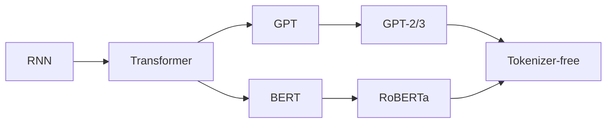

# 大语言模型原理基础与前沿 无分词器

关键词：大语言模型、Transformer、自注意力机制、无分词器、预训练、微调、迁移学习

## 1. 背景介绍
### 1.1 问题的由来
随着互联网的飞速发展,海量的文本数据呈爆炸式增长。如何从这些海量数据中挖掘出有价值的信息,成为了自然语言处理(NLP)领域的重要课题。传统的NLP方法主要基于人工特征工程,需要耗费大量的人力物力,且泛化能力较差。近年来,深度学习技术的兴起为NLP领域带来了革命性的变革,其中最具代表性的就是大语言模型(Large Language Model, LLM)。

### 1.2 研究现状
目前,大语言模型已经在机器翻译、文本分类、问答系统、对话生成等多个NLP任务上取得了state-of-the-art的表现。谷歌的BERT、OpenAI的GPT系列、微软的Megatron-Turing NLG等大语言模型不断刷新着NLP领域的记录。这些模型都采用了Transformer架构和自注意力机制,并在超大规模语料上进行了预训练。然而,当前大语言模型的训练和推理都需要消耗大量的算力资源,模型参数动辄上百亿,给实际应用带来了挑战。

### 1.3 研究意义 
如何在保证模型性能的同时降低资源消耗,成为了大语言模型领域的重要研究方向。无分词器(Tokenizer-free)作为一种新兴的预训练范式,通过直接对字符建模,摆脱了对分词器的依赖,大大降低了模型参数量和计算复杂度。同时,无分词器模型展现出了更强的语言理解和生成能力,有望成为大语言模型的新范式。因此,深入研究无分词器大语言模型的原理和方法,对于推动NLP技术的发展具有重要意义。

### 1.4 本文结构
本文将围绕无分词器大语言模型的原理和前沿进展展开深入探讨。第2部分介绍大语言模型的核心概念和发展脉络。第3部分重点阐述无分词器模型的核心算法原理和具体操作步骤。第4部分给出无分词器模型涉及的数学模型和公式,并结合案例进行详细讲解。第5部分通过代码实例和详细注释,展示如何实现一个无分词器大语言模型。第6部分分析无分词器模型的实际应用场景和未来前景。第7部分推荐相关的学习资源、开发工具和前沿文献。第8部分对全文进行总结,并展望无分词器大语言模型的未来发展趋势和挑战。

## 2. 核心概念与联系

大语言模型本质上是一种基于海量无标注语料进行自监督预训练的语言模型。通过学习语言数据的内在规律和隐藏模式,LLM可以建立起对语言的深层理解,从而实现更加智能化的自然语言处理。

LLM的发展大致经历了以下几个阶段:

1. 基于循环神经网络(RNN)的语言模型,代表工作有ELMo等。RNN善于捕捉序列数据的长距离依赖,但是训练不稳定,难以处理超长文本。 

2. 基于Transformer的语言模型,代表工作有GPT、BERT等。Transformer引入了自注意力机制,可以高效地对任意长度的文本序列进行编码,成为了当前主流的语言模型架构。

3. 基于自回归的生成式预训练语言模型,代表工作有GPT-2、GPT-3等。通过自回归的方式对下一个token进行预测,可以生成流畅、连贯的文本序列。 

4. 基于自编码的双向语言模型,代表工作有BERT、RoBERTa等。通过掩码语言建模(MLM)和下一句预测(NSP)的多任务学习,可以学习到更加通用的语言表示。

5. 基于无分词器的语言模型,代表工作有CANINE、ByT5等。通过直接对字符建模,无需依赖预定义的词表和分词器,大幅降低了模型复杂度。

从左到右依次是RNN、Transformer、GPT、BERT、Tokenizer-free等不同类型语言模型之间的演进关系:

可以看出,无分词器语言模型融合了GPT和BERT的优点,是当前LLM技术发展的前沿方向。接下来,我们将重点介绍无分词器语言模型的核心原理和算法。

## 3. 核心算法原理 & 具体操作步骤
### 3.1 算法原理概述
传统的语言模型都需要预先定义一个固定大小的词表,并基于词表构建分词器将文本切分成词或子词单元。与之不同,无分词器语言模型直接在字符级别上建模,无需进行文本预处理和分词操作。

具体来说,无分词器模型包含三个关键组件:

1. 字符编码器(Character Encoder):将输入文本转化为字符ID序列。字符包括字母、数字、标点等,可以覆盖任意语言。

2. 字符嵌入层(Character Embedding):将字符ID映射为稠密向量表示,作为模型的输入。 

3. 语言建模层(Language Modeling):在字符嵌入的基础上,通过堆叠Transformer的编码器或解码器模块,学习文本的上下文表示。

相比传统的语言模型,无分词器模型具有以下优势:

- 参数量更少:无需存储庞大的词表和嵌入矩阵,显著降低了模型参数量。
- 泛化能力更强:可以处理词表之外的新词、生僻字等,提高了模型的适应性。  
- 语言无关:不依赖特定语言的分词工具,可以轻松应用到不同语言任务中。
- 可解释性更好:每个字符的注意力权重都可以直接映射回原文本,便于分析模型行为。

### 3.2 算法步骤详解
无分词器语言模型的训练过程可以分为以下几个步骤:

**Step 1: 构建字符词表**

扫描语料库中的所有文本,提取出现过的字符构成字符词表。字符词表通常很小,包含100~1000个字符。

**Step 2: 文本转换为字符ID序列**

将每篇文章转化为字符ID的序列。比如"Hello world"转化为[17,4,21,21,24,0,32,24,27,21,5]。

**Step 3: 生成训练样本**  

将字符ID序列划分为固定长度(如1024)的子序列,作为模型的输入。子序列之间可以重叠,以增加数据多样性。

**Step 4: 字符嵌入**

通过嵌入矩阵将字符ID映射为固定维度(如768)的稠密向量,作为Transformer的输入。这一步可以捕捉字符之间的相似性。

**Step 5: 位置编码**

在字符嵌入的基础上加入位置编码向量,引入字符在序列中的位置信息。位置编码可以帮助模型区分相同字符在不同位置的语义差异。

**Step 6: Transformer编码**

将位置编码后的字符向量序列输入到Transformer的编码器中,通过自注意力机制和前馈网络学习上下文表示。Transformer编码器可以堆叠多层,提取不同粒度的语义信息。

**Step 7: 预训练任务**

在Transformer编码器的最后一层添加特定的预训练任务层,如掩码语言建模(MLM)、全词遮罩(WWM)等。MLM随机遮罩一部分字符,让模型根据上下文预测被遮罩的字符。WWM将同一个词的字符作为一个整体进行遮罩,引入词汇知识。

**Step 8: 损失函数与优化**

根据预训练任务定义损失函数,如MLM对应交叉熵损失。使用Adam等优化器最小化损失函数,更新模型参数。

**Step 9: 模型微调与评估**

在下游任务数据上对预训练模型进行微调,并在验证集和测试集上评估模型性能。根据任务类型添加相应的输出层,如分类、序列标注等。

### 3.3 算法优缺点
无分词器语言模型的优点包括:

- 降低了模型复杂度,加速了训练和推理过程。
- 增强了模型的语言适应性和鲁棒性。
- 提高了模型的可解释性和可调试性。
- 实现了语言无关的通用语言理解。

但是,无分词器模型也存在一些局限性:

- 字符序列通常比词序列长,增加了计算开销。 
- 字符级建模难以显式地利用词汇和语法知识。
- 模型的长距离建模能力有待进一步提高。

### 3.4 算法应用领域
无分词器语言模型已经在多个NLP任务上取得了良好的效果,主要应用领域包括:

- 机器翻译:将源语言文本直接映射到目标语言字符,实现端到端的翻译模型。
- 文本分类:在字符级别上对文本语义建模,可以处理任意长度和风格的文本。  
- 信息抽取:通过字符级别的命名实体识别和关系抽取,提高了抽取的灵活性。
- 问答系统:将问题和文章都编码为字符序列,生成自然流畅的答案。
- 对话生成:学习对话历史的字符级表示,生成贴近人类语言习惯的对话响应。

随着无分词器模型的不断发展,其应用领域也将不断扩展,为NLP技术带来新的突破。

## 4. 数学模型和公式 & 详细讲解 & 举例说明
### 4.1 数学模型构建
无分词器语言模型的核心是基于字符级别的Transformer架构。我们以CANINE模型为例,介绍其涉及的关键数学模型。

首先,定义字符词表$V=\{v_1,v_2,...,v_N\}$,其中$N$为字符类型数。给定一篇长度为$T$的文章,表示为字符序列$X=(x_1,x_2,...,x_T)$,其中$x_t \in V$。

字符编码器将字符$x_t$映射为one-hot向量$\mathbf{e}_t \in \mathbb{R}^N$。字符嵌入层通过嵌入矩阵$\mathbf{W}_e \in \mathbb{R}^{D \times N}$将$\mathbf{e}_t$转化为$D$维嵌入向量$\mathbf{h}_t^0$:

$$\mathbf{h}_t^0 = \mathbf{W}_e \mathbf{e}_t, \quad t=1,2,...,T$$

其中$D$为嵌入维度,通常取768。位置编码函数$\mathbf{p}_t \in \mathbb{R}^D$引入字符位置信息,与$\mathbf{h}_t^0$相加得到最终的字符嵌入表示$\mathbf{z}_t^0$:

$$\mathbf{z}_t^0 = \mathbf{h}_t^0 + \mathbf{p}_t, \quad t=1,2,...,T$$

Transformer编码器包含$L$个相同的层,每一层由多头自注意力(Multi-head Self-attention)和前馈网络(Feed-forward Network)组成。第$l$层的输出表示为$\mathbf{z}_t^l, t=1,2,...,T$。

多头自注意力将$\mathbf{z}_t^{l-1}$线性映射为查询矩阵$\mathbf{Q}^h$、键矩阵$\mathbf{K}^h$和值矩阵$\mathbf{V}^h$,然后计算注意力权重$\alpha_{ij}^h$:

$$\alpha_{ij}^h = \frac{\exp(\mathbf{q}_i^h \cdot \mathbf{k}_j^h / \sqrt{d})}{\sum_{j=1}^T \exp(\mathbf{q}_i^h \cdot \mathbf{k}_j^h / \sqrt{d})}, \quad i,j=1,2,...,T$$

其中$h=1,2,...,H$为注意力头数,$d=D/H$为每个头