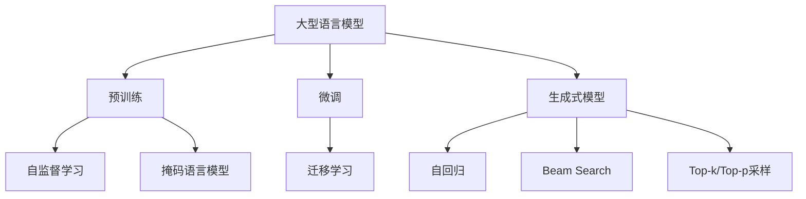

以下是对《大语言模型原理基础与前沿评估》这一主题的技术博客文章正文内容：

# 大语言模型原理基础与前沿评估

## 1. 背景介绍

### 1.1 问题的由来

近年来,大型语言模型(Large Language Models, LLMs)在自然语言处理(NLP)领域取得了令人瞩目的成就。这些模型通过在大规模语料库上进行预训练,学习了丰富的语言知识和上下文信息,从而在下游任务中表现出了强大的泛化能力。

随着计算能力和数据量的不断增长,LLMs的规模也在不断扩大。从2018年发布的GPT模型,到2020年的GPT-3,再到2022年的PaLM、Chinchilla等,模型参数规模已经从数十亿增长到数万亿。这种"越大越好"的趋势催生了一系列突破性的语言能力,但同时也带来了一些新的挑战和问题。

### 1.2 研究现状

目前,大型语言模型在自然语言理解、生成、推理、问答等多个领域展现出了强大的性能,在某些任务上甚至超过了人类水平。然而,这些模型也存在一些明显的缺陷,如缺乏常识推理能力、容易受到偏见影响、存在不一致性等。

此外,大规模语言模型的训练和推理过程也面临着巨大的计算和存储开销,给模型的部署和应用带来了挑战。因此,如何提高大型语言模型的性能、可解释性和效率,成为了当前研究的热点问题。

### 1.3 研究意义 

大型语言模型不仅是自然语言处理领域的重要研究对象,也是探索人工智能通用能力的重要途径之一。深入研究大型语言模型的原理和特性,不仅有助于我们更好地理解和利用这一强大的技术,也将为推动人工智能的发展做出重要贡献。

此外,大型语言模型在诸多应用领域都展现出了巨大的潜力,如智能对话系统、自动文本摘要和生成、机器翻译、知识问答等。通过深入研究和持续改进,我们有望进一步释放大型语言模型的能力,为各个领域带来革命性的变革。

### 1.4 本文结构

本文将从以下几个方面全面介绍和评估大型语言模型:

1. 核心概念与联系
2. 核心算法原理与具体操作步骤
3. 数学模型和公式详细讲解与案例分析  
4. 项目实践:代码实例和详细解释说明
5. 实际应用场景分析
6. 相关工具和学习资源推荐
7. 总结未来发展趋势与挑战
8. 常见问题解答

接下来,我们将逐一深入探讨上述内容。

## 2. 核心概念与联系

在深入探讨大型语言模型的细节之前,我们有必要先了解一些核心概念及它们之间的联系。这将为后续内容的理解打下基础。

1. **大型语言模型(LLMs)**: 指通过在大规模语料库上进行预训练而获得的巨大神经网络模型,旨在捕获丰富的语言知识和上下文信息。

2. **预训练(Pre-training)**: 是指在没有任何人工标注的大规模文本语料库上训练语言模型的过程,目的是让模型学习通用的语言表示。

3. **微调(Fine-tuning)**: 是指在完成预训练后,将预训练的模型在特定任务的标注数据上进行进一步训练,以适应该任务的需求。

4. **生成式模型(Generative Models)**: 与判别式模型不同,生成式模型旨在直接学习数据的联合概率分布,从而能够生成新的、类似于训练数据的样本。

5. **自监督学习(Self-supervised Learning)**: 指在无需人工标注的数据上,通过设计合理的预训练目标(如掩码语言模型),让模型自主学习有用的表示。

6. **掩码语言模型(Masked Language Modeling)**: 一种常见的预训练目标,通过随机掩码输入序列中的一些词元,然后让模型预测被掩码的词元。

7. **迁移学习(Transfer Learning)**: 指将在一个领域或任务上训练好的模型,应用到另一个相关但不同的领域或任务上。微调就是一种常见的迁移学习方式。

8. **自回归(Autoregressive)**: 指模型生成序列时,每个时间步的预测都依赖于之前时间步的输出,通过这种方式逐个生成词元。

9. **Beam Search**: 一种常用的序列生成策略,通过维护多个候选序列并对它们进行打分和剪枝,以获得更高质量的输出。

10. **Top-k/Top-p采样**: 另一种常见的序列生成策略,通过对模型输出的概率分布进行采样,以增加生成序列的多样性。

这些概念相互关联、环环相扣,共同构建了大型语言模型的理论和实践基础。理解它们对于掌握后续内容至关重要。

## 3. 核心算法原理与具体操作步骤

### 3.1 算法原理概述

大型语言模型的核心算法原理主要基于**transformer**结构和**自注意力机制(Self-Attention)**。

1. **输入嵌入(Input Embeddings)**: 将原始的文本序列(如词元或子词)映射到连续的向量空间,作为模型的输入。

2. **多头自注意力(Multi-Head Self-Attention)**: 模型的核心组件,允许每个位置的词元与输入序列的其他位置建立直接的联系,捕获长距离依赖关系。

3. **前馈神经网络(Feed-Forward Neural Network)**: 对自注意力层的输出进行进一步的非线性变换,提取更高层次的特征表示。

4. **残差连接(Residual Connection)**: 将输入直接传递到下一层,有助于梯度的传播和模型的收敛。

5. **层规范化(Layer Normalization)**: 对每一层的输出进行归一化处理,提高训练的稳定性。

6. **编码器/解码器层堆叠(Encoder/Decoder Stacks)**: 通过堆叠多个编码器层或编码器-解码器层,构建深层次的模型结构。

7. **输出(Output)**: 根据任务的不同,输出可以是文本分类、序列生成等形式。

这种transformer结构和自注意力机制的设计,使得大型语言模型能够有效地捕获长距离依赖关系,并通过堆叠多层结构来提取更加复杂的语义表示。

### 3.2 算法步骤详解

大型语言模型的训练和使用过程可以概括为以下几个主要步骤:

1. **语料预处理**: 首先需要对大规模的文本语料进行预处理,包括文本清洗、分词、构建词表等。

2. **输入表示**: 将预处理后的文本序列映射到连续的向量空间,作为模型的输入嵌入。

3. **掩码语言模型预训练**: 在大规模语料库上训练掩码语言模型,让模型学习通用的语言表示。这是预训练的核心步骤。

4. **模型微调(可选)**: 根据具体的下游任务,在相应的标注数据上对预训练模型进行进一步的微调,以提高任务性能。

5. **序列生成(推理阶段)**: 对于生成类任务,模型将根据输入的上下文,自回归地生成新的文本序列。常用的生成策略包括Beam Search、Top-k/Top-p采样等。

6. **结果评估**: 针对不同的任务,使用相应的评估指标(如困惑度、BLEU分数等)来衡量模型的性能表现。

7. **模型部署**: 将训练好的模型部署到实际的应用系统中,为终端用户提供服务。

这些步骤环环相扣,共同构建了大型语言模型的完整生命周期。根据具体的任务需求,上述步骤可能会有所调整和改进。

### 3.3 算法优缺点

大型语言模型基于transformer和自注意力机制的算法设计,具有以下优缺点:

**优点**:

1. **长距离依赖捕获**: 自注意力机制允许每个位置的词元直接关注到输入序列的其他位置,从而有效捕获长距离依赖关系。

2. **并行计算**: transformer的结构设计使得模型可以高度并行化,加快了训练和推理的速度。

3. **灵活性**: 该算法架构可以应用于多种不同的NLP任务,如机器翻译、文本生成、问答等。

4. **可解释性**: 通过可视化注意力权重,可以在一定程度上解释模型的内部工作机制。

**缺点**:

1. **计算开销大**: 自注意力机制需要计算每个位置与所有其他位置的注意力权重,计算复杂度较高,尤其是对于长序列输入。

2. **缺乏归纳偏置**: 与一些更具归纳偏置的架构(如卷积神经网络)相比,transformer架构缺乏针对序列数据的先验结构。

3. **长序列性能下降**: 对于非常长的序列输入,由于自注意力需要捕获全局依赖关系,模型的性能可能会受到影响。

4. **缺乏常识推理能力**: 尽管大型语言模型具有强大的语言理解和生成能力,但它们缺乏真正的常识推理和因果推理能力。

5. **可能存在偏见**: 由于预训练语料的限制,大型语言模型可能会学习和放大一些社会偏见和有害内容。

总的来说,transformer和自注意力机制为大型语言模型带来了卓越的性能,但也存在一些需要进一步改进的缺陷。研究人员正在不断探索新的算法和架构,以克服这些缺点。

### 3.4 算法应用领域

基于transformer和自注意力机制的大型语言模型算法,已经在多个自然语言处理领域取得了卓越的成绩,主要包括但不限于:

1. **机器翻译**: 通过预训练和微调,大型语言模型可以用于高质量的机器翻译任务。

2. **文本生成**: 利用模型的自回归生成能力,可以生成高质量的连续文本,如新闻文章、小说、诗歌等。

3. **文本摘要**: 通过理解原文语义,模型能够生成准确、简洁的文本摘要。

4. **对话系统**: 大型语言模型可以作为对话代理,进行自然、流畅的人机对话交互。

5. **问答系统**: 模型能够基于大量的背景知识,回答各种形式的问题。

6. **情感分析**: 通过捕获语义和情感信息,模型可以对文本进行情感分类和情感识别。

7. **实体识别和关系抽取**: 模型能够从文本中识别出实体并抽取它们之间的关系。

8. **语音识别**: 结合其他模块,大型语言模型可以用于提高语音识别的性能。

9. **代码生成**: 通过预训练,模型能够学习编程语言的语法和语义,从而辅助代码生成和代码理解。

10. **知识图谱构建**: 利用模型的关系抽取能力,可以从文本中自动构建知识图谱。

这些只是大型语言模型算法的一小部分应用场景,随着模型性能的不断提高和新算法的涌现,其应用范围还将进一步扩大。

## 4. 数学模型和公式详细讲解与举例说明

### 4.1 数学模型构建

大型语言模型的核心数学模型是基于**transformer架构**和**自注