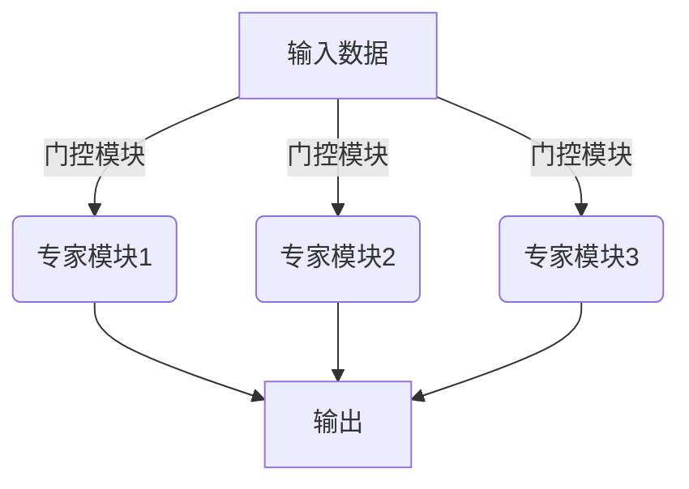

# 大语言模型原理基础与前沿 高效的MoE架构

## 1. 背景介绍

### 1.1 问题的由来

随着深度学习技术的不断发展,大型神经网络模型在自然语言处理、计算机视觉等领域展现出了卓越的性能。然而,训练这些庞大的模型需要消耗大量的计算资源,并且推理过程也需要巨大的内存和计算能力。为了解决这一问题,研究人员提出了一种称为"Mixture of Experts (MoE)"的架构,旨在提高大型模型的效率和可扩展性。

### 1.2 研究现状

MoE架构最初由Jacobs等人在1991年提出,用于解决机器学习中的"富人更富"问题。近年来,随着深度学习模型规模的不断扩大,MoE架构再次引起了研究人员的关注。谷歌在2017年发表的论文"Outrageously Large Neural Networks"中,提出了一种基于MoE的语言模型架构,展示了其在提高计算效率和降低内存占用方面的优势。

### 1.3 研究意义

MoE架构的引入为训练和部署大型神经网络模型提供了一种高效的解决方案。通过将模型分解为多个专家模块,MoE架构可以有效地利用计算资源,提高模型的可扩展性。此外,MoE架构还能够捕捉输入数据的不同特征,从而提高模型的性能和泛化能力。

### 1.4 本文结构

本文将全面介绍MoE架构的基础理论和前沿发展。首先,我们将探讨MoE架构的核心概念和原理。接下来,详细阐述MoE架构的核心算法原理和具体操作步骤。然后,我们将讨论MoE架构的数学模型和公式推导过程,并通过案例分析进行详细说明。此外,我们还将介绍MoE架构在实际项目中的应用,包括代码实现和运行结果展示。最后,我们将总结MoE架构的实际应用场景,未来发展趋势和面临的挑战。

## 2. 核心概念与联系

MoE架构的核心思想是将一个庞大的神经网络模型分解为多个专家模块(Experts)和一个门控模块(Gating Network)。每个专家模块负责处理输入数据的特定方面,而门控模块则决定将输入数据路由到哪些专家模块进行处理。

在上图中,输入数据首先通过门控模块进行路由,然后被分配到不同的专家模块进行处理。每个专家模块都是一个独立的神经网络,专门处理输入数据的特定方面。最后,各个专家模块的输出被组合起来,形成最终的模型输出。

MoE架构的优势在于,它可以有效地利用计算资源,提高模型的可扩展性。由于每个输入样本只需要激活部分专家模块,因此可以避免对所有专家模块进行计算,从而节省了计算资源。此外,MoE架构还能够捕捉输入数据的不同特征,提高模型的性能和泛化能力。

## 3. 核心算法原理 & 具体操作步骤

### 3.1 算法原理概述

MoE架构的核心算法原理可以概括为以下三个步骤:

1. **门控模块(Gating Network)**: 门控模块接收输入数据,并根据某种策略决定将输入数据路由到哪些专家模块进行处理。门控模块的输出是一组权重,表示每个专家模块对于当前输入数据的重要性。

2. **专家模块(Experts)**: 每个专家模块都是一个独立的神经网络,专门处理输入数据的特定方面。根据门控模块的输出,只有部分专家模块会被激活,对输入数据进行处理。

3. **组合输出(Combination)**: 各个专家模块的输出根据门控模块的权重进行加权组合,形成最终的模型输出。

### 3.2 算法步骤详解

1. **门控模块(Gating Network)**

   门控模块的作用是决定将输入数据路由到哪些专家模块进行处理。常见的门控策略包括:

   - **基于相似度的门控(Similarity-based Gating)**: 门控模块根据输入数据与每个专家模块的相似度来决定路由权重。相似度可以通过内积或其他距离度量来计算。
   - **基于任务的门控(Task-based Gating)**: 门控模块根据输入数据所属的任务类型来决定路由权重。例如,在机器翻译任务中,可以根据源语言和目标语言来选择不同的专家模块。
   - **基于聚类的门控(Cluster-based Gating)**: 门控模块将输入数据划分为多个聚类,每个聚类对应一个专家模块。

   门控模块的实现通常采用一个小型的神经网络,输入为当前输入数据,输出为每个专家模块的路由权重。

2. **专家模块(Experts)**

   每个专家模块都是一个独立的神经网络,专门处理输入数据的特定方面。根据门控模块的输出,只有部分专家模块会被激活,对输入数据进行处理。

   专家模块的实现可以采用各种神经网络架构,如卷积神经网络(CNN)、循环神经网络(RNN)、Transformer等。专家模块的选择和设计取决于具体的任务和数据特征。

3. **组合输出(Combination)**

   各个专家模块的输出根据门控模块的权重进行加权组合,形成最终的模型输出。组合方式通常采用加权求和:

   $$
   \text{Output} = \sum_{i=1}^{N} w_i \cdot \text{Expert}_i(\text{Input})
   $$

   其中,$ \text{Output} $表示最终的模型输出,$ N $表示专家模块的数量,$ w_i $表示第$ i $个专家模块的权重(由门控模块决定),$ \text{Expert}_i $表示第$ i $个专家模块。

### 3.3 算法优缺点

**优点**:

- **高效利用计算资源**: 由于每个输入样本只需要激活部分专家模块,因此可以避免对所有专家模块进行计算,从而节省了计算资源。
- **提高模型可扩展性**: MoE架构允许模型规模的灵活扩展,只需要增加专家模块的数量,而不需要改变整个模型的架构。
- **捕捉输入数据的不同特征**: 每个专家模块专门处理输入数据的特定方面,因此能够更好地捕捉输入数据的不同特征,提高模型的性能和泛化能力。

**缺点**:

- **门控模块的设计挑战**: 门控模块的设计对模型性能有重要影响,但门控策略的选择和优化仍然是一个挑战。
- **专家模块之间的通信开销**: 在某些情况下,专家模块之间可能需要进行通信和信息交换,这会增加额外的计算开销。
- **训练困难**: MoE架构的训练过程比传统的神经网络模型更加复杂,需要解决专家模块之间的竞争和协作问题。

### 3.4 算法应用领域

MoE架构可以应用于各种机器学习任务,尤其是那些需要处理大规模数据和复杂模型的任务。以下是一些典型的应用领域:

- **自然语言处理(NLP)**: MoE架构可以应用于机器翻译、文本生成、语言模型等NLP任务。
- **计算机视觉(CV)**: MoE架构可以应用于图像分类、目标检测、语义分割等CV任务。
- **推荐系统**: MoE架构可以用于构建大规模的个性化推荐系统,捕捉用户的不同偏好。
- **多任务学习**: MoE架构可以用于解决多任务学习问题,不同的专家模块可以专门处理不同的任务。

## 4. 数学模型和公式 & 详细讲解 & 举例说明

### 4.1 数学模型构建

MoE架构的数学模型可以表示为:

$$
y = \sum_{i=1}^{N} g_i(x) \cdot f_i(x)
$$

其中:

- $x$ 表示输入数据
- $y$ 表示模型输出
- $N$ 表示专家模块的数量
- $f_i(x)$ 表示第 $i$ 个专家模块的输出
- $g_i(x)$ 表示门控模块为第 $i$ 个专家模块分配的权重

门控模块的作用是学习一个函数 $g(x)$,将输入数据 $x$ 映射到一组权重 $\{g_1(x), g_2(x), \ldots, g_N(x)\}$,满足:

$$
\sum_{i=1}^{N} g_i(x) = 1 \quad \text{and} \quad g_i(x) \geq 0, \forall i
$$

这保证了权重的非负性和归一化性。

### 4.2 公式推导过程

我们可以将 MoE 架构的输出 $y$ 看作是对专家模块输出 $f_i(x)$ 的加权求和:

$$
y = \sum_{i=1}^{N} g_i(x) \cdot f_i(x)
$$

在训练过程中,我们需要最小化一个损失函数 $\mathcal{L}(y, y^*)$,其中 $y^*$ 表示期望的输出。损失函数可以是均方误差、交叉熵等,取决于具体的任务。

为了优化模型参数,我们可以采用反向传播算法计算参数的梯度。对于门控模块的参数 $\theta_g$,梯度为:

$$
\frac{\partial \mathcal{L}}{\partial \theta_g} = \sum_{i=1}^{N} \frac{\partial \mathcal{L}}{\partial y} \cdot \frac{\partial y}{\partial g_i(x)} \cdot \frac{\partial g_i(x)}{\partial \theta_g}
$$

对于第 $i$ 个专家模块的参数 $\theta_i$,梯度为:

$$
\frac{\partial \mathcal{L}}{\partial \theta_i} = \frac{\partial \mathcal{L}}{\partial y} \cdot \frac{\partial y}{\partial f_i(x)} \cdot \frac{\partial f_i(x)}{\partial \theta_i}
$$

通过计算这些梯度,我们可以使用优化算法(如随机梯度下降)来更新模型参数,从而最小化损失函数。

### 4.3 案例分析与讲解

为了更好地理解 MoE 架构的工作原理,我们以一个简单的二分类问题为例进行分析。

假设我们有一个二维输入数据 $x = (x_1, x_2)$,需要将其分类为正类或负类。我们构建一个包含两个专家模块的 MoE 架构,每个专家模块都是一个简单的线性模型:

$$
f_1(x) = w_{11} x_1 + w_{12} x_2 + b_1 \\
f_2(x) = w_{21} x_1 + w_{22} x_2 + b_2
$$

门控模块也是一个线性模型,输出两个权重 $g_1(x)$ 和 $g_2(x)$:

$$
g_1(x) = \sigma(v_{11} x_1 + v_{12} x_2 + c_1) \\
g_2(x) = 1 - g_1(x)
$$

其中 $\sigma$ 是 Sigmoid 函数,用于将门控模块的输出映射到 $(0, 1)$ 区间。

最终的模型输出为:

$$
y = g_1(x) \cdot f_1(x) + g_2(x) \cdot f_2(x)
$$

通过训练,我们希望第一个专家模块 $f_1(x)$ 能够专门处理正类样本,第二个专家模块 $f_2(x)$ 能够专门处理负类样本。门控模块的作用是根据输入数据的特征,决定激活哪个专家模块。

在训练过程中,我们可以使用交叉熵损失函数,并通过反向传播算法计算参数的梯度,然后使用优化算法(如随机梯度下降)更新参数。经过多次迭代,模型将逐渐学习到合适的参数值,实现对输入