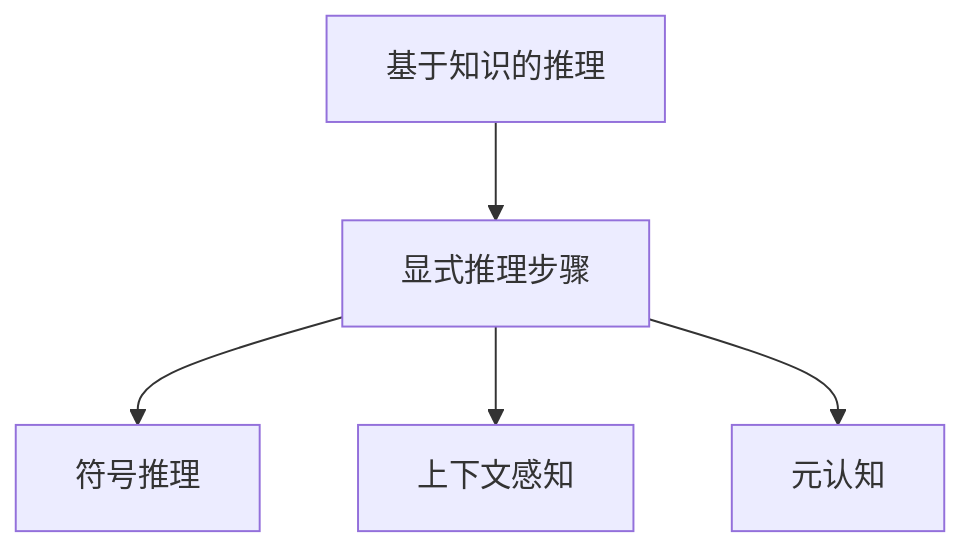

# 大语言模型应用指南：Algorithm-of-Tought

作者：禅与计算机程序设计艺术 / Zen and the Art of Computer Programming

## 1. 背景介绍

### 1.1 问题的由来

随着人工智能技术的飞速发展，大语言模型(Large Language Models, LLMs)已经成为自然语言处理(Natural Language Processing, NLP)领域的研究热点。LLMs 通过在海量文本数据上进行预训练，能够学习到丰富的语言知识和常识，在许多 NLP 任务上取得了令人瞩目的成果。然而，如何更好地应用 LLMs 来解决实际问题，仍然是一个亟待探索的课题。

### 1.2 研究现状

目前，业界已经提出了多种利用 LLMs 的方法，如提示工程(Prompt Engineering)、上下文学习(Context Learning)、思维链(Chain-of-Thought)等。其中，思维链方法通过引导 LLMs 生成中间推理步骤，能够显著提升模型在复杂推理任务上的表现。但思维链的构建仍然比较依赖人工设计的模板，泛化能力有限。

### 1.3 研究意义

本文提出了一种新的 LLMs 应用范式——Algorithm-of-Thought(AoT)，旨在进一步增强 LLMs 的推理和决策能力。AoT 的核心思想是将显式算法思维与 LLMs 的隐式知识相结合，通过模仿人类解题过程中的逻辑推理步骤，引导模型形成连贯、可解释的思维链。这不仅能提高模型的准确性和鲁棒性，还能赋予其一定的常识推理和因果推断能力，使其在开放域对话、问答、决策等任务中表现出色。

### 1.4 本文结构

本文将从以下几个方面展开论述：

- 第2部分介绍 AoT 涉及的核心概念及其内在联系
- 第3部分详细阐述 AoT 的算法原理和具体操作步骤
- 第4部分建立 AoT 的数学模型，并通过公式推导和案例分析加以说明
- 第5部分给出 AoT 的代码实现，并解读关键代码片段 
- 第6部分探讨 AoT 在实际场景中的应用，展望其未来发展前景
- 第7部分推荐 AoT 相关的学习资源、开发工具和文献
- 第8部分总结全文，分析 AoT 面临的机遇与挑战
- 第9部分列举 AoT 的常见问题，并给出解答

## 2. 核心概念与联系

Algorithm-of-Thought 的提出源于对人类思维过程的模拟。它的核心概念包括：

- **基于知识的推理(Knowledge-based Reasoning)**：利用 LLMs 学到的海量知识进行推理，而不是单纯的模式匹配。
- **显式推理步骤(Explicit Reasoning Steps)**：将复杂问题分解为一系列简单的、可执行的原子操作，逐步求解。
- **符号推理(Symbolic Reasoning)**：引入符号表示，增强模型对逻辑、数理运算等方面的理解和处理能力。  
- **上下文感知(Context Awareness)**：根据上下文动态调整推理步骤和策略，体现一定的适应性。
- **元认知(Metacognition)**：对自身思维过程进行监控和反思，以发现和纠正错误。

这些概念相辅相成，共同构成了 AoT 的理论基础。基于知识的推理是 AoT 的先决条件，为后续推理提供了丰富的背景知识。显式推理步骤是 AoT 的核心，它模拟了人类解决问题时的逐步求精过程。引入符号推理则进一步提升了模型对逻辑语义的理解。而上下文感知和元认知则反映了 AoT 的动态性和自省性，使其能够根据具体情况灵活调整策略。下图描述了这些概念之间的关系：

## 3. 核心算法原理 & 具体操作步骤

### 3.1 算法原理概述

AoT 的核心是将复杂问题转化为一系列可执行的原子操作，通过显式推理步骤逐步求解。这个过程可以用下面的公式来表示：

$$Solution = AoT(Problem, Knowledge)$$

其中，$Problem$ 表示待解决的问题，$Knowledge$ 表示 LLMs 学到的背景知识，$Solution$ 表示问题的解。算法的关键是如何设计原子操作，以及如何搜索最优的操作序列。

### 3.2 算法步骤详解

AoT 的具体步骤如下：

1. **问题理解**：对输入问题进行分析，提取关键信息，确定求解目标。这一步需要利用 LLMs 的语言理解能力和常识知识。

2. **问题分解**：将原问题分解为若干子问题。分解的粒度和方式取决于问题的类型和复杂度。对于简单问题，可以直接映射到一个原子操作；对于复杂问题，需要递归地进行分解，直到每个子问题都可以用原子操作求解。

3. **原子操作映射**：将每个子问题映射到一个原子操作。原子操作的设计需要兼顾通用性和可解释性。一些常见的原子操作包括：信息检索、关系推理、数值计算、逻辑判断等。原子操作的执行可以利用 LLMs 的知识或外部工具。

4. **操作序列搜索**：对原子操作进行组合，搜索最优的执行序列。这可以看作一个启发式搜索问题。评估一个操作序列的好坏需要考虑其逻辑连贯性、中间结果的质量等因素。搜索过程中，可以利用 beam search 等策略平衡效率和效果。

5. **结果生成**：根据选定的操作序列，逐步执行每个原子操作，并综合中间结果，得到最终答案。答案的生成需要对中间结果进行转化和整合，使其满足人类可读的格式。

6. **过程反思**：对推理过程进行评估，分析可能存在的错误和改进空间。这一步体现了 AoT 的元认知能力，有助于算法的迭代优化。

### 3.3 算法优缺点

AoT 的主要优点包括：

- 增强了 LLMs 的推理和决策能力，使其在开放域任务中表现更加出色。
- 推理过程透明、可解释，有助于人类对模型行为的理解和信任。
- 可以利用外部知识和工具，扩展模型的认知边界。
- 引入元认知机制，使模型能够自我监控和改进。

但 AoT 也存在一些局限性：

- 原子操作的设计需要大量人工参与，存在主观性和工程量大的问题。
- 对于开放域问题，完备的原子操作集合是难以穷举的。
- 搜索空间随问题复杂度呈指数增长，搜索效率有待提高。
- 中间结果的质量评估和综合仍然是一个挑战。

### 3.4 算法应用领域

AoT 可以应用于以下领域：

- 智能问答：回答开放域的复杂问题，提供连贯、可信的解释。
- 对话系统：增强对话系统的逻辑一致性和上下文连贯性。
- 决策支持：协助人类进行复杂决策，提供多角度的分析和论证。
- 教育辅助：引导学生进行逻辑推理和批判性思考。

## 4. 数学模型和公式 & 详细讲解 & 举例说明

### 4.1 数学模型构建

我们可以用一个五元组来形式化描述 AoT 的数学模型：

$$AoT = (P, K, A, S, R)$$

其中：

- $P$ 表示问题空间，包含所有可能的问题。
- $K$ 表示知识库，包含 LLMs 学到的背景知识。
- $A$ 表示原子操作集合，每个操作都是一个函数，接受问题和知识作为输入，产生一个中间结果。
- $S$ 表示搜索算法，用于在操作空间中寻找最优序列。
- $R$ 表示结果生成器，将中间结果转化为最终答案。

### 4.2 公式推导过程

对于一个问题 $p \in P$，AoT 的目标是找到一个最优操作序列 $a_1, a_2, ..., a_n$，使得：

$$R(a_n(...a_2(a_1(p, K)))) = argmax_{a_1, ..., a_n} Score(a_1, ..., a_n | p, K)$$

其中，$Score$ 是一个评分函数，用于衡量操作序列的质量。它可以基于序列的逻辑连贯性、中间结果的置信度等因素来设计。

假设每个原子操作 $a_i$ 都有一个置信度 $c_i$，表示其产生的中间结果的可信程度。我们可以用加权几何平均来定义 $Score$：

$$Score(a_1, ..., a_n) = (\prod_{i=1}^n c_i^{w_i})^{\frac{1}{\sum_{i=1}^n w_i}}$$

其中，$w_i$ 是操作 $a_i$ 的权重，反映了其在推理链中的重要性。

搜索算法 $S$ 的目标是找到 $Score$ 最大的操作序列。一种常见的策略是 beam search，即在每一步保留 top-k 个得分最高的候选序列，直到达到终止条件。

### 4.3 案例分析与讲解

下面我们以一道简单的数学应用题为例，演示 AoT 的求解过程。

> 问题：小明有 5 个苹果，小红有 3 个苹果，小刚有 2 个苹果。平均每人有几个苹果？

AoT 求解该问题的步骤如下：

1. 问题理解：
   - 目标：求平均每人有几个苹果
   - 已知条件：小明 5 个，小红 3 个，小刚 2 个
   
2. 问题分解：
   - 子问题1：求苹果总数
   - 子问题2：求人数
   - 子问题3：计算平均数

3. 原子操作映射：
   - 子问题1 -> 加法操作：$a_1(p, K) = 5 + 3 + 2 = 10$
   - 子问题2 -> 计数操作：$a_2(p, K) = 3$
   - 子问题3 -> 除法操作：$a_3(p, K) = 10 / 3 = 3.33$

4. 操作序列搜索：
   - 由于问题比较简单，操作序列是确定的：$a_1 \rightarrow a_2 \rightarrow a_3$

5. 结果生成：
   - $R(a_3(a_2(a_1(p, K)))) = 3.33$
   - 自然语言答案："平均每人有 3.33 个苹果。"

6. 过程反思：
   - 推理过程逻辑清晰，得到了正确答案。
   - 除法结果保留了两位小数，符合常识。

在实际应用中，AoT 面临的问题往往要复杂得多。但核心思路是一致的，即将复杂问题分解为简单的原子操作，并寻找最优的操作组合策略。

### 4.4 常见问题解答

**Q**: AoT 是否适用于所有类型的问题？

**A**: 理论上，任何可以用算法求解的问题都可以用 AoT 建模。但在实践中，AoT 更适合那些可以分解为多个步骤、需要逻辑推理的问题，如数学应用题、代数题、物理题等。对于事实查询、观点陈述等问题，AoT 的优势不明显。

**Q**: AoT 的原子操作是如何设计的？

**A**: 原子操作的设计需要综合考虑以下因素：
1. 覆盖面：操作集合要尽可能覆盖问题空间，使大多数问题都能用它们的组合来表示。
2. 粒度：操作粒度要合适，既不能太粗放（导致表达能力不足），也不能太细碎（导致搜索空间过大）。
3. 可解释性：每个操作都应该有明