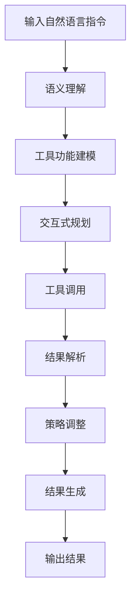

# 大语言模型应用指南：Toolformer

## 1. 背景介绍

### 1.1 问题的由来

在过去几年中,大型语言模型(Large Language Models, LLMs)在自然语言处理(NLP)领域取得了令人瞩目的成就。这些模型通过在海量文本数据上进行预训练,学习了丰富的语言知识和上下文信息,展现出了强大的语言理解和生成能力。然而,尽管取得了卓越的成绩,但现有的大型语言模型在实际应用中仍然面临着一些挑战和局限性。

首先,大多数语言模型都是基于文本的,缺乏对结构化数据(如表格、图像等)的理解和处理能力。这严重限制了它们在现实世界中的应用场景,因为很多任务都需要同时处理文本和其他形式的数据。

其次,现有的语言模型通常是通用的,缺乏针对特定任务和领域的专门设计和优化。这导致它们在特定领域的性能并不理想,无法满足一些专业领域的需求。

最后,大型语言模型的训练和推理过程通常需要消耗大量的计算资源,这不仅增加了成本,也带来了环境影响。如何在保持模型性能的同时,降低计算资源的需求,是一个亟待解决的问题。

### 1.2 研究现状

为了解决上述挑战,研究人员提出了一种新型的大语言模型架构,被称为Toolformer。Toolformer的核心思想是将语言模型与各种工具(tools)相结合,从而赋予模型处理结构化数据的能力,并针对特定任务和领域进行优化和定制。

目前,已有多个研究小组在探索Toolformer的理论和实践。例如,OpenAI的InstructGPT就是一种Toolformer模型,它可以与各种外部工具(如Web搜索、计算器等)进行交互,从而增强了模型的能力。DeepMind的AlphaCode也采用了类似的架构,将语言模型与代码编辑器相结合,用于辅助编程任务。

除了顶尖的科技公司,一些学术机构也在积极开展Toolformer的研究。例如,斯坦福大学的一个研究小组提出了一种名为"钻床"(Grist)的Toolformer架构,旨在将语言模型与表格数据处理工具相结合。而麻省理工学院则在探索如何将Toolformer应用于医疗健康领域。

### 1.3 研究意义

Toolformer架构具有重要的理论和实践意义。从理论上讲,它为大型语言模型的发展开辟了一条新的道路,有望突破当前模型的局限性,实现更强大、更通用的人工智能系统。同时,Toolformer也为语言模型与其他领域的知识和技术(如数据库、计算机视觉等)的融合提供了一种有效的范式。

从实践角度来看,Toolformer有潜力为各个领域带来革命性的应用。通过与特定工具相结合,Toolformer模型可以为相关领域提供强大的智能辅助,提高工作效率和决策质量。例如,在软件开发领域,Toolformer可以辅助编程、代码审查和调试;在医疗健康领域,它可以协助诊断、治疗方案制定和患者沟通;在商业领域,Toolformer则可以用于智能分析、决策支持等。

此外,Toolformer架构还有望帮助降低大型语言模型的计算资源需求。通过将一些计算密集型任务外包给专门的工具,Toolformer可以减轻语言模型的计算负担,从而提高效率和可持续性。

### 1.4 本文结构

本文将全面介绍Toolformer的核心概念、算法原理、数学模型、实际应用等方面的内容。具体来说,第2部分将阐述Toolformer的核心思想和与传统语言模型的区别;第3部分将详细解释Toolformer的核心算法,包括原理、步骤和特点;第4部分将介绍Toolformer的数学模型及相关公式推导;第5部分将通过代码实例,展示如何开发和应用Toolformer;第6部分将探讨Toolformer在不同领域的实际应用场景;第7部分将推荐一些有用的工具和学习资源;最后,第8部分将总结Toolformer的发展趋势和面临的挑战。

## 2. 核心概念与联系

Toolformer是一种创新的大型语言模型架构,它将语言模型与各种外部工具(tools)相结合,赋予模型处理结构化数据和执行特定任务的能力。与传统的文本生成型语言模型不同,Toolformer更像是一个智能代理(intelligent agent),它可以根据任务需求,与不同的工具进行交互和协作,完成复杂的任务。

Toolformer的核心思想可以概括为三个关键点:

1. **模块化设计**:Toolformer由语言模型和多个工具模块组成。语言模型负责理解输入,规划行动策略;而工具模块则负责执行具体的计算或数据处理任务。通过这种模块化设计,Toolformer可以灵活地集成各种工具,并根据需求进行定制和扩展。

2. **交互式决策**:Toolformer的工作过程是一个交互式的决策过程。语言模型首先根据输入,规划出一系列行动策略;然后选择合适的工具执行相应的操作;工具的输出结果会反馈给语言模型,语言模型再根据这些结果调整后续的策略,如此循环,直至完成整个任务。

3. **语义理解与推理**:Toolformer不仅需要理解自然语言输入,还需要对工具的功能、输入输出格式等进行理解和推理,从而正确地调用和利用各种工具。这对语言模型的语义理解和推理能力提出了更高的要求。

基于上述核心思想,Toolformer架构可以看作是将语言模型、工具集成和交互式决策有机结合的一种新型人工智能系统。它突破了传统语言模型的局限性,将模型的能力从纯文本领域扩展到了结构化数据和特定任务领域。

Toolformer与其他一些相关概念和技术也存在一些联系,例如:

- 语义解析(Semantic Parsing):将自然语言指令解析为可执行的形式化表示,是Toolformer实现的基础。
- 程序合成(Program Synthesis):自动生成可执行程序代码,与Toolformer调用和组合工具的过程有相似之处。
- 机器人规划(Robot Planning):制定行动策略以完成特定任务,与Toolformer的交互式决策过程类似。
- 多智能体系统(Multi-Agent Systems):由多个智能体协作完成任务,与Toolformer的模块化设计思路相通。

总的来说,Toolformer架构集成了多个领域的理念和技术,是一种创新的大型语言模型范式,有望推动人工智能系统向更加通用和强大的方向发展。

## 3. 核心算法原理 & 具体操作步骤

### 3.1 算法原理概述

Toolformer的核心算法原理可以概括为以下几个关键点:

1. **语义理解与表示**:首先,Toolformer需要对输入的自然语言进行深度理解,将其转换为适当的语义表示形式。这通常需要进行词法分析、句法分析、语义分析等NLP基础任务。

2. **工具功能建模**:其次,Toolformer需要对可用工具的功能、输入输出格式等进行建模和表示,以便于后续的推理和调用。这可以通过预定义的模板或基于数据的学习方式来实现。

3. **交互式规划**:根据任务目标和当前状态,Toolformer需要规划出一系列行动策略,决定调用哪些工具、以何种顺序调用、如何组合工具的输出等。这是一个交互式的过程,需要不断根据工具执行的中间结果来调整策略。

4. **工具调用与结果解析**:按照规划的策略,Toolformer需要正确地调用相应的工具,并解析工具的输出结果,将其转换为适当的语义表示形式,作为下一步决策的输入。

5. **结果生成与呈现**:最后,根据完成的任务,Toolformer需要将最终结果转换为自然语言或其他适当的形式,并呈现给用户。

这个过程可以看作是一个马尔可夫决策过程(Markov Decision Process, MDP),其中语言模型作为智能体(agent),通过与环境(工具集)交互,最大化给定任务的累积奖励(完成度)。算法的核心在于如何高效地规划行动策略,并在策略执行过程中根据反馈进行调整。

### 3.2 算法步骤详解

更具体地,Toolformer算法可以分为以下几个主要步骤:



1. **输入自然语言指令**:用户通过自然语言的形式输入任务指令,例如"根据这份财务报表,计算出公司的净利润"。

2. **语义理解**:Toolformer首先需要对输入的自然语言进行语义理解,将其转换为适当的语义表示形式。这可以通过词法分析、句法分析、语义分析等NLP技术来实现。例如,上述指令可以表示为:
```
Goal: Calculate net profit
Data: Financial report (table format)
```

3. **工具功能建模**:接下来,Toolformer需要对可用工具的功能、输入输出格式等进行建模和表示。例如,它可能会识别出有一个名为"表格计算器"的工具,能够对表格数据进行计算和查询操作。

4. **交互式规划**:根据任务目标和当前状态,Toolformer需要规划出一系列行动策略。例如,对于上述任务,它可能会规划出如下策略:
   1) 使用"文件读取器"工具读取财务报表文件
   2) 使用"表格计算器"工具对报表数据进行处理,计算净利润
   3) 将计算结果格式化为自然语言输出

5. **工具调用**:按照规划的策略,Toolformer调用相应的工具并提供必要的输入。例如,它首先调用"文件读取器"读取报表文件,将其解析为表格数据格式。

6. **结果解析**:Toolformer解析工具的输出结果,并将其转换为适当的语义表示形式,作为下一步决策的输入。例如,它可能会将表格数据表示为一个数据框(DataFrame)对象。

7. **策略调整**:根据工具执行的中间结果,Toolformer可以对之前的规划策略进行调整和优化。例如,如果发现表格数据中缺少某些必要的列,它可能需要先使用"数据预处理"工具对数据进行处理。

8. **结果生成**:按照完成的任务,Toolformer将最终结果转换为自然语言或其他适当的形式。例如,它可以输出"根据财务报表,公司的净利润为X万美元"。

9. **输出结果**:将生成的结果呈现给用户。

需要注意的是,第4-7步可能会循环多次,直到任务完成。在这个过程中,Toolformer需要不断根据工具执行的中间结果来调整策略,这就需要具备强大的语义理解、推理和决策能力。

### 3.3 算法优缺点

Toolformer算法相比传统的语言模型,具有以下一些优点:

1. **能力扩展**:通过与各种工具相结合,Toolformer可以突破纯文本领域的局限,处理结构化数据、执行特定任务等,大大扩展了语言模型的能力范围。

2. **模块化与可扩展性**:Toolformer采用了模块化设计,语言模型和工具是相对解耦的,可以相对独立地进行开发和优化。这使得Toolformer具有很强的可扩展性,可以方便地集成新的工具模块。

3. **高效利用现有资源**:Toolformer可以充分利用现有的各种工具和系统,避免了重复"发明轮子"的低效情况。它