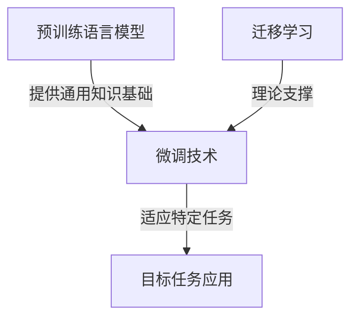

# 大语言模型应用指南：基于微调的工具

## 1. 背景介绍

### 1.1 问题的由来

在过去几年中,自然语言处理(NLP)领域取得了长足的进步,很大程度上归功于大型语言模型(LLM)的出现和广泛应用。这些模型通过在大规模语料库上进行预训练,学习了丰富的语言知识和上下文信息,展现出令人惊叹的语言生成和理解能力。

然而,尽管取得了巨大成就,但通用语言模型在特定领域和任务上的表现仍有待提高。由于预训练数据的普遍性和任务的多样性,这些模型可能无法完全满足特定应用场景的需求。为了更好地利用大型语言模型的强大能力,同时提高其在特定任务上的性能,微调(fine-tuning)技术应运而生。

### 1.2 研究现状

微调是一种广为人知的技术,旨在通过对预训练模型进行进一步训练,使其适应特定任务或领域的需求。这种方法已被证明在多个NLP任务中非常有效,如文本分类、机器翻译、问答系统等。

目前,已有许多研究和实践探索了微调技术在不同场景下的应用。一些研究侧重于改进微调算法本身,以提高模型的收敛速度和性能。另一些研究则关注如何更好地利用微调技术来解决特定的NLP任务或应用。

然而,尽管取得了一定进展,但微调技术仍面临一些挑战。例如,微调过程可能会导致灾难性遗忘(catastrophic forgetting),即模型在学习新任务时,会忘记之前学习的知识。此外,微调也可能引入新的偏差,影响模型的泛化能力。

### 1.3 研究意义

本文旨在为读者提供一个全面的指南,介绍如何有效地利用微调技术来应用大型语言模型,解决实际问题。我们将深入探讨微调的核心概念和算法原理,并提供详细的操作步骤和代码示例。此外,我们还将分析微调在不同应用场景中的实践,并讨论相关的挑战和未来发展趋势。

通过本文,读者将能够:

1. 理解微调的基本概念和工作原理
2. 掌握微调的核心算法和实现细节
3. 了解微调在不同应用场景中的实践
4. 获取相关的工具和资源推荐
5. 认识到微调技术的局限性和未来发展方向

总的来说,本文将为读者提供一个全面的视角,帮助他们更好地理解和应用微调技术,从而充分发挥大型语言模型的潜力,解决实际问题。

### 1.4 本文结构

本文的结构安排如下:

1. 背景介绍
2. 核心概念与联系
3. 核心算法原理与具体操作步骤
4. 数学模型和公式详细讲解与举例说明
5. 项目实践:代码实例和详细解释说明
6. 实际应用场景
7. 工具和资源推荐
8. 总结:未来发展趋势与挑战
9. 附录:常见问题与解答

## 2. 核心概念与联系

在深入探讨微调技术之前,我们需要先了解一些核心概念和它们之间的联系。

### 2.1 预训练语言模型

预训练语言模型(Pre-trained Language Model,PLM)是指在大规模语料库上训练的大型神经网络模型。这些模型旨在学习通用的语言知识和上下文信息,而不是针对特定的任务进行优化。常见的预训练语言模型包括BERT、GPT、T5等。

预训练语言模型通常采用自监督学习(Self-Supervised Learning)的方式进行训练,例如掩码语言模型(Masked Language Modeling)和下一句预测(Next Sentence Prediction)等任务。通过这种方式,模型可以从大量的语料中学习到丰富的语言表示,并捕捉到语义和上下文信息。

### 2.2 微调

微调(Fine-tuning)是一种将预训练语言模型应用于特定任务的技术。它通过在目标任务的数据集上进行进一步训练,使模型适应特定任务的需求。

在微调过程中,预训练模型的大部分参数将被冻结(固定),只有最后几层的参数会被微调。这种方式可以保留模型在预训练阶段学习到的通用语言知识,同时使模型在目标任务上获得更好的性能。

微调通常需要较少的数据和计算资源,因为它利用了预训练模型已经学习到的丰富语言表示。这使得微调成为一种高效且实用的技术,可以快速将大型语言模型应用于各种NLP任务。

### 2.3 迁移学习

迁移学习(Transfer Learning)是一种机器学习范式,旨在利用在一个领域或任务中学习到的知识,来帮助解决另一个相关但不同的领域或任务。

微调技术可以被视为迁移学习在NLP领域的一种具体应用。通过在大规模语料库上预训练模型,模型可以学习到通用的语言知识和表示。然后,通过在目标任务的数据集上进行微调,模型可以将这些通用知识迁移并应用到特定的任务中。

迁移学习的核心思想是利用已有的知识,减少在新任务上从头开始训练的需求,从而提高学习效率和模型性能。在NLP领域,由于数据标注的成本较高,迁移学习和微调技术显得尤为重要。

### 2.4 概念关系总结

以上三个核心概念之间的关系可以总结如下:

1. 预训练语言模型是通过自监督学习在大规模语料库上训练得到的,它学习到了通用的语言知识和表示。
2. 微调是一种将预训练语言模型应用于特定任务的技术,通过在目标任务数据集上进一步训练,使模型适应特定任务的需求。
3. 微调可以被视为迁移学习在NLP领域的一种具体应用,它利用了预训练模型学习到的通用知识,并将其迁移到目标任务中。

这三个概念紧密相连,共同构成了基于大型语言模型的应用框架。预训练语言模型提供了通用的语言知识基础,微调技术则使模型能够适应特定任务,而迁移学习则是其背后的理论支撑。

## 3. 核心算法原理与具体操作步骤

### 3.1 算法原理概述

微调算法的核心思想是在预训练语言模型的基础上,通过进一步训练使模型适应特定任务的需求。这个过程可以分为以下几个关键步骤:

1. **初始化**: 将预训练语言模型的参数作为微调过程的初始参数。
2. **数据准备**: 准备目标任务的训练数据集,并进行必要的预处理和格式转换。
3. **模型微调**: 在目标任务的训练数据集上,对预训练模型进行进一步的微调训练。通常只有模型的最后几层参数会被微调,而大部分参数保持冻结状态。
4. **模型评估**: 在目标任务的验证数据集上评估微调后模型的性能,并根据需要进行超参数调整。
5. **模型应用**: 将微调后的模型应用于目标任务的测试数据集或实际场景中。

在微调过程中,通常会采用与预训练阶段类似的训练目标和优化策略,如掩码语言模型(Masked Language Modeling)和下一句预测(Next Sentence Prediction)等。但与预训练不同的是,微调过程侧重于特定任务,因此会使用与该任务相关的损失函数和评估指标。

### 3.2 算法步骤详解

下面我们将详细介绍微调算法的具体步骤:

#### 3.2.1 初始化

微调算法的第一步是初始化预训练语言模型的参数。这通常包括以下几个步骤:

1. 加载预训练模型的权重和配置文件。
2. 根据目标任务的需求,对模型进行必要的修改和调整,如添加或删除特定的层或模块。
3. 设置模型的训练配置,如学习率、批大小、优化器等。

在这个阶段,我们还需要决定哪些参数应该被微调,哪些参数应该保持冻结状态。通常情况下,只有模型的最后几层参数会被微调,而底层的参数保持冻结,以保留预训练阶段学习到的通用语言知识。

#### 3.2.2 数据准备

接下来,我们需要准备目标任务的训练数据集。这个过程通常包括以下几个步骤:

1. 收集和清理原始数据。
2. 将数据划分为训练集、验证集和测试集。
3. 对数据进行必要的预处理,如分词、标记化、填充等。
4. 将预处理后的数据转换为模型可接受的输入格式,如张量或数据加载器。

数据准备是一个非常重要的步骤,因为它直接影响模型的训练效果。高质量的数据集和适当的预处理可以帮助模型更好地学习目标任务的特征和模式。

#### 3.2.3 模型微调

准备好数据后,我们就可以开始模型的微调训练了。这个过程通常包括以下几个步骤:

1. 定义模型的训练目标和损失函数。对于不同的任务,我们需要使用不同的损失函数,如交叉熵损失函数用于分类任务,平方损失函数用于回归任务等。
2. 选择合适的优化器和学习率调度策略。常用的优化器包括Adam、AdamW等,学习率调度策略可以帮助模型更好地收敛。
3. 设置训练的超参数,如批大小、训练轮数、早停等。
4. 开始训练过程,在每个训练轮次中,模型会在训练数据集上进行前向传播和反向传播,并根据损失函数更新参数。
5. 在验证数据集上评估模型的性能,并根据需要调整超参数或提前停止训练。

在微调过程中,我们需要密切监控模型的训练过程,并根据验证集上的性能进行适当的调整。一旦模型达到预期的性能水平,我们就可以停止训练并保存模型权重,以便后续的应用和部署。

#### 3.2.4 模型评估

训练完成后,我们需要在测试数据集上评估微调后模型的性能。这个过程通常包括以下几个步骤:

1. 加载保存的模型权重。
2. 在测试数据集上进行前向传播,获取模型的预测结果。
3. 根据任务类型选择合适的评估指标,如准确率、F1分数、平均绝对误差等。
4. 计算评估指标的值,并与基线模型或其他模型进行比较。
5. 分析模型的优缺点,并探索进一步改进的方向。

模型评估是一个非常重要的步骤,因为它可以帮助我们全面了解模型的实际性能,并发现潜在的问题和改进空间。良好的评估实践可以确保我们开发出高质量和可靠的模型。

#### 3.2.5 模型应用

一旦模型通过评估并达到预期的性能水平,我们就可以将其应用于实际场景中。这个过程通常包括以下几个步骤:

1. 将模型部署到生产环境中,如云服务器、边缘设备等。
2. 集成模型到现有的应用程序或系统中。
3. 监控模型的运行状态和性能,并进行必要的维护和更新。
4. 收集用户反馈,并根据需要进行模型的进一步微调或重新训练。

在模型应用的过程中,我们需要注意一些潜在的问题和挑战,如模型的可解释性、公平性、隐私和安全性等。这些问题将在后面的章节中进一步探讨。

### 3.3 算法优缺点

微调算法具有以下优点:

1. **高效性**: 与从头开始训练相比,微调需要较少的数据和计算