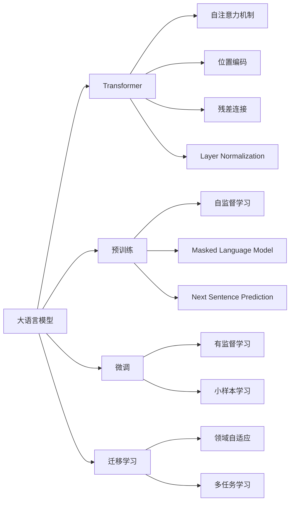

# 大语言模型应用指南：机器学习的过程

关键词：大语言模型, 机器学习, 预训练, 微调, 迁移学习, Transformer, 自然语言处理, 深度学习, 人工智能

## 1. 背景介绍
### 1.1 问题的由来
近年来，随着深度学习技术的飞速发展，自然语言处理(NLP)领域取得了突破性进展。其中，大语言模型(Large Language Models, LLMs)的出现，更是掀起了NLP领域的一场革命。大语言模型以其强大的语言理解和生成能力，在机器翻译、对话系统、文本摘要、问答系统等诸多任务上取得了瞩目的成绩，引起了学术界和工业界的广泛关注。

### 1.2 研究现状
目前，业界主流的大语言模型如GPT系列[1]、BERT[2]、XLNet[3]等，都采用了基于Transformer[4]的预训练-微调范式。这些模型首先在大规模无标注语料上进行自监督预训练，学习通用的语言表征；然后在下游任务的标注数据上进行微调，完成特定任务。这种范式大大降低了任务特定模型的训练成本，提高了模型的泛化能力和鲁棒性。

### 1.3 研究意义
尽管大语言模型取得了巨大成功，但对于广大开发者和研究者而言，如何将其应用到实际任务中仍然存在不小的挑战。这主要体现在以下几个方面：

1. 大语言模型的训练和部署对算力和存储有很高的要求，给中小型团队和个人开发者带来了门槛。
2. 针对特定领域和任务进行模型微调需要较多的领域知识和调参经验，对非专业人士而言难度较大。  
3. 大语言模型的内在机制仍不够透明，存在偏见、幻觉等问题，应用中需要谨慎评估和处理。

因此，系统地总结大语言模型的应用流程和最佳实践，对于推动其在各领域的落地应用具有重要意义。

### 1.4 本文结构
本文将从机器学习的视角，系统阐述大语言模型的应用流程。全文分为9个章节：

第1章介绍研究背景和意义；第2章梳理大语言模型应用相关的核心概念；第3章讲解模型训练的核心算法原理和操作步骤；第4章介绍模型训练背后的数学理论基础；第5章通过代码实例演示模型训练和应用的完整过程；第6章探讨大语言模型的实际应用场景；第7章推荐相关的学习资源和开发工具；第8章总结全文并展望未来；第9章列举常见问题与解答。

## 2. 核心概念与联系

在讨论大语言模型的应用之前，我们首先需要厘清其中涉及的一些核心概念。图1总结了大语言模型应用相关的核心概念及其联系。

图1 大语言模型应用的核心概念

- 大语言模型：以Transformer为主干网络，在大规模语料上预训练得到的语言模型，具有强大的语言理解和生成能力。代表模型有BERT、GPT、XLNet等。

- Transformer：大语言模型的核心架构，基于自注意力机制和前馈神经网络，能够高效地建模长距离依赖关系。Transformer包含编码器和解码器两部分，分别用于特征提取和语言生成。

- 预训练：利用无监督或自监督的方式，在大规模无标注语料上训练语言模型，学习通用的语言表征。预训练任务包括语言模型、Masked Language Model、Next Sentence Prediction等。预训练使模型能够从海量语料中习得丰富的语言知识。

- 微调：在预训练的基础上，利用任务特定的标注数据对模型进行进一步训练，使其适应特定任务。微调一般采用有监督学习，通过反向传播调整模型参数。微调使模型能够将通用语言知识迁移到具体任务中。

- 迁移学习：将源领域学习到的知识迁移到目标领域，提高目标领域的学习效率和效果。大语言模型的预训练-微调范式本质上就是一种迁移学习。此外，还可以通过领域自适应、多任务学习等技术，进一步提高模型的迁移能力。

理解了这些核心概念，我们就可以更好地把握大语言模型的应用流程和原理。接下来，我们将详细讲解模型训练的算法和数学理论。

## 3. 核心算法原理 & 具体操作步骤
### 3.1 算法原理概述
大语言模型的训练主要分为两个阶段：预训练和微调。预训练阶段采用自监督学习，在大规模无标注语料上训练模型；微调阶段采用有监督学习，在任务特定的标注数据上训练模型。两个阶段的核心算法都是基于梯度的优化算法，如随机梯度下降(SGD)及其变体。

### 3.2 算法步骤详解
1. 预训练阶段
   - 准备大规模无标注语料，进行必要的清洗和预处理
   - 构建自监督学习任务，如Masked Language Model(MLM)、Next Sentence Prediction(NSP)等
   - 将语料转换为模型输入格式，如token化、添加特殊标记、padding等
   - 初始化模型参数，一般采用预训练的词向量或随机初始化
   - 设置优化器和学习率调度策略，如AdamW优化器和线性学习率warmup
   - 循环执行以下步骤直到收敛：
     - 从语料中采样一个batch的数据
     - 前向传播计算损失函数，如MLM的交叉熵损失
     - 反向传播计算梯度并更新模型参数
     - 评估模型在验证集上的性能，必要时进行早停和模型选择
   - 保存预训练的模型参数，用于后续的微调

2. 微调阶段
   - 准备任务特定的标注数据，划分为训练集、验证集和测试集
   - 加载预训练的模型参数作为初始化
   - 根据任务类型，在预训练模型的基础上添加任务特定的输出层，如分类层、生成层等
   - 设置优化器和学习率调度策略，一般采用较小的学习率
   - 循环执行以下步骤直到收敛：
     - 从训练集中采样一个batch的数据
     - 前向传播计算损失函数，如分类任务的交叉熵损失
     - 反向传播计算梯度并更新模型参数
     - 评估模型在验证集上的性能，必要时进行早停和模型选择
   - 在测试集上评估模型的最终性能
   - 保存微调后的模型参数，用于实际部署

### 3.3 算法优缺点
大语言模型的预训练-微调范式具有以下优点：
- 通过在大规模语料上预训练，模型可以学习到丰富的语言知识，具有很强的语言理解和生成能力
- 预训练得到的通用语言表征可以迁移到各种下游任务，大大减少了任务特定数据的需求
- 微调阶段只需要训练很少的参数，计算开销小，训练速度快

同时，这种范式也存在一些局限性：
- 预训练需要大量的计算资源和时间，对中小型团队和个人开发者不太友好
- 模型体积庞大，推理速度较慢，不易部署到资源受限的环境中
- 预训练语料可能存在偏见，导致模型产生有偏的输出
- 模型是黑盒的，缺乏可解释性，应用中需要谨慎评估其行为

### 3.4 算法应用领域
得益于其强大的语言理解和生成能力，大语言模型已经在NLP的各个任务上取得了state-of-the-art的结果，应用领域包括但不限于：
- 机器翻译：将一种语言的文本翻译成另一种语言，如谷歌翻译
- 文本分类：将文本划分到预定义的类别中，如情感分析、垃圾邮件检测等
- 命名实体识别：从文本中识别出人名、地名、机构名等命名实体
- 关系抽取：从文本中抽取实体之间的关系，如人物关系、因果关系等
- 问答系统：根据问题从大规模知识库中检索答案，如智能客服
- 对话系统：与人进行多轮对话，如聊天机器人、虚拟助手等
- 文本摘要：将长文本压缩成简短的摘要，提取关键信息
- 文本生成：根据输入的文本生成连贯的续写，如写作助手、广告文案生成等

随着大语言模型的不断发展，其应用领域还在不断扩展。未来，大语言模型有望在更多领域发挥重要作用，如知识图谱构建、逻辑推理、代码生成等。

## 4. 数学模型和公式 & 详细讲解 & 举例说明
### 4.1 数学模型构建
大语言模型的核心是Transformer架构，其数学模型可以用以下公式表示：

编码器：
$$
\begin{aligned}
\mathbf{Q},\mathbf{K},\mathbf{V} &= \mathbf{X}\mathbf{W}^Q,\mathbf{X}\mathbf{W}^K,\mathbf{X}\mathbf{W}^V \\
\text{Attention}(\mathbf{Q},\mathbf{K},\mathbf{V}) &= \text{softmax}(\frac{\mathbf{Q}\mathbf{K}^T}{\sqrt{d_k}})\mathbf{V} \\
\mathbf{Z} &= \text{LayerNorm}(\mathbf{X} + \text{Attention}(\mathbf{Q},\mathbf{K},\mathbf{V})) \\
\mathbf{H} &= \text{LayerNorm}(\mathbf{Z} + \text{FFN}(\mathbf{Z}))
\end{aligned}
$$

解码器：
$$
\begin{aligned}
\mathbf{Q},\mathbf{K},\mathbf{V} &= \mathbf{Y}\mathbf{W}^Q,\mathbf{Y}\mathbf{W}^K,\mathbf{Y}\mathbf{W}^V \\
\text{MaskedAttention}(\mathbf{Q},\mathbf{K},\mathbf{V}) &= \text{softmax}(\frac{\mathbf{Q}\mathbf{K}^T}{\sqrt{d_k}} + \mathbf{M})\mathbf{V} \\
\mathbf{Z} &= \text{LayerNorm}(\mathbf{Y} + \text{MaskedAttention}(\mathbf{Q},\mathbf{K},\mathbf{V})) \\
\mathbf{Q},\mathbf{K},\mathbf{V} &= \mathbf{Z}\mathbf{W}^Q,\mathbf{H}\mathbf{W}^K,\mathbf{H}\mathbf{W}^V \\
\text{CrossAttention}(\mathbf{Q},\mathbf{K},\mathbf{V}) &= \text{softmax}(\frac{\mathbf{Q}\mathbf{K}^T}{\sqrt{d_k}})\mathbf{V} \\
\mathbf{C} &= \text{LayerNorm}(\mathbf{Z} + \text{CrossAttention}(\mathbf{Q},\mathbf{K},\mathbf{V})) \\
\mathbf{O} &= \text{LayerNorm}(\mathbf{C} + \text{FFN}(\mathbf{C}))
\end{aligned}
$$

其中，$\mathbf{X}$表示编码器的输入，$\mathbf{Y}$表示解码器的输入，$\mathbf{H}$表示编码器的输出，$\mathbf{O}$表示解码器的输出。$\mathbf{W}^Q,\mathbf{W}^K,\mathbf{W}^V$是注意力机制的权重矩阵，$\mathbf{M}$是解码器自注意力的掩码矩阵，