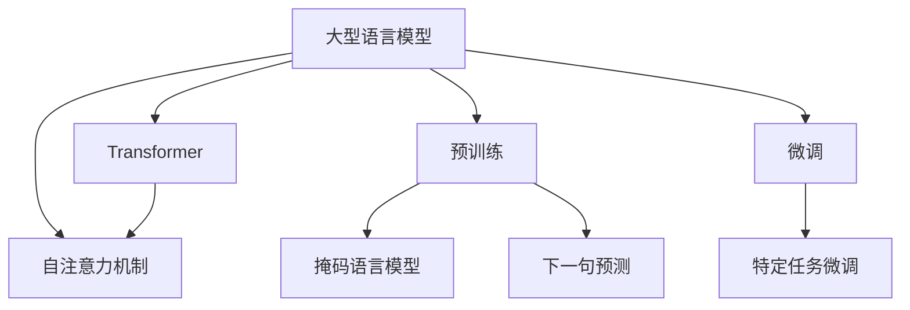

以下是题为《大语言模型应用指南：神经网络的三要素》的技术博客文章正文部分：

# 大语言模型应用指南：神经网络的三要素

## 1. 背景介绍

### 1.1 问题的由来

随着人工智能技术的不断发展,大型神经网络模型在自然语言处理、计算机视觉等领域展现出了惊人的能力。特别是自2018年以来,Transformer模型的出现使得大型语言模型(Large Language Model,LLM)的性能得到了飞跃式提升,在机器翻译、文本生成、问答系统等任务中表现出色。

然而,训练和部署这些庞大的模型却面临诸多挑战。它们通常包含数十亿甚至上百亿个参数,对计算资源和存储空间的需求极为庞大。此外,确保模型的准确性、一致性和可解释性也是一个巨大的挑战。因此,如何高效地训练、优化和部署大型语言模型,成为当前研究的热点问题。

### 1.2 研究现状

目前,主流的大型语言模型主要包括GPT(Generative Pre-trained Transformer)系列、BERT(Bidirectional Encoder Representations from Transformers)系列、XLNet、RoBERTa等。这些模型通过在海量文本数据上进行预训练,学习到丰富的语义和上下文知识,从而在下游任务中表现出优异的泛化能力。

研究人员一直在探索提高大型语言模型性能的各种方法,包括模型压缩、知识蒸馏、参数高效编码、模型并行化等。同时,也有研究关注模型的可解释性、公平性和安全性等问题,以期在提高模型性能的同时,确保其行为可控和可解释。

### 1.3 研究意义

大型语言模型的研究对于推动人工智能技术的发展至关重要。它们不仅在自然语言处理领域发挥着关键作用,而且对于构建通用人工智能(Artificial General Intelligence,AGI)也具有重要意义。通过研究大型语言模型的训练、优化和部署方法,我们可以更好地利用现有的计算资源,提高模型的性能和可用性。

此外,探索大型语言模型的可解释性和可控性,也有助于建立人类对人工智能系统的信任,促进人工智能技术在各个领域的应用和发展。

### 1.4 本文结构

本文将从三个方面深入探讨大型语言模型的应用:模型训练、模型优化和模型部署。我们将介绍各个环节的核心概念、算法原理、数学模型,并通过实际案例和代码示例,帮助读者全面理解大型语言模型的训练、优化和部署流程。

最后,我们还将讨论大型语言模型在实际应用中的场景,以及未来可能面临的挑战和发展趋势。

## 2. 核心概念与联系

在深入探讨大型语言模型的训练、优化和部署之前,我们先介绍一些核心概念及它们之间的联系。

- **大型语言模型(LLM)**: 指包含数十亿甚至上百亿参数的大型神经网络模型,用于自然语言处理任务。
- **Transformer**: 一种基于自注意力机制的序列到序列模型,是当前大型语言模型的核心架构。
- **自注意力机制**: 允许模型捕捉输入序列中任意两个位置之间的依赖关系,是Transformer的关键创新。
- **预训练**: 在大规模文本语料上训练语言模型,使其学习到丰富的语义和上下文知识。常用的预训练目标包括掩码语言模型和下一句预测等。
- **微调**: 在特定下游任务上进行进一步训练,将预训练模型知识迁移到目标任务。

上述概念相互关联、环环相扣。Transformer架构和自注意力机制奠定了大型语言模型的基础;预训练使模型获得通用语言知识,而微调则将其应用到具体任务中。这种"预训练+微调"的范式是当前主流的大型语言模型训练方法。

## 3. 核心算法原理 & 具体操作步骤 

### 3.1 算法原理概述

大型语言模型的训练过程可以概括为以下三个主要步骤:

1. **预训练**: 在大规模文本语料上训练模型,使其学习通用的语言表示。
2. **微调**: 在特定下游任务的数据上继续训练模型,将通用语言知识迁移到目标任务。
3. **推理**: 使用训练好的模型对新的输入进行预测和生成。

其中,预训练和微调都采用了自监督学习的思想。在预训练阶段,模型通过掩码语言模型(Masked Language Model, MLM)和下一句预测(Next Sentence Prediction, NSP)等任务目标,学习文本的语义和上下文信息。而在微调阶段,模型则在有监督的任务数据上进行进一步训练,将通用语言知识应用到特定任务中。

### 3.2 算法步骤详解

#### 3.2.1 预训练

预训练阶段的核心是让模型在大规模语料上学习通用的语言表示。常用的预训练目标包括:

1. **掩码语言模型(MLM)**: 随机掩码输入序列中的一些Token,模型需要预测被掩码的Token。这样可以让模型学习到双向的语境信息。

2. **下一句预测(NSP)**: 给定两个句子A和B,模型需要预测B是否为A的下一句。这个目标有助于捕捉句子之间的关系和逻辑连贯性。

3. **因果语言模型(Causal LM)**: 给定序列的前缀,模型需要预测下一个Token。这与传统语言模型的目标类似,但使用Transformer编码器-解码器架构。

以BERT为例,其预训练过程包括以下步骤:

1. 从语料库中采样句子对作为输入
2. 对输入进行TokenID化,并引入特殊Token [MASK]随机替换词元
3. 将输入输入到BERT模型,并最小化MLM和NSP目标的损失函数
4. 使用梯度下降算法更新BERT的参数

经过大规模语料的预训练后,BERT就学习到了通用的语义和上下文知识,为后续的微调做好了准备。

#### 3.2.2 微调

微调阶段的目标是将预训练模型中的通用语言知识迁移到特定的下游任务中。常见的微调方法包括:

1. **特征提取器微调**: 将预训练模型的输出作为特征,训练一个小的任务特定模型进行预测。
2. **模型微调**: 在预训练模型的基础上,对全部或部分参数进行进一步训练,使其适应目标任务。
3. **提示微调**: 通过设计任务相关的提示(Prompt),引导预训练模型生成所需的输出。

以BERT的序列分类任务微调为例,步骤如下:

1. 准备标注好的序列分类数据集
2. 将输入序列输入到BERT模型,获取特殊Token [CLS]的输出作为序列表示
3. 将序列表示输入到一个小的分类头网络,预测序列的类别标签
4. 最小化分类损失函数,并使用梯度下降算法微调BERT和分类头的参数

通过微调,BERT模型将其在预训练时学习到的语言知识应用到了序列分类任务中,从而取得了很好的性能表现。

### 3.3 算法优缺点

大型语言模型的"预训练+微调"范式具有以下优缺点:

**优点**:

1. **通用知识迁移**: 预训练使模型学习到丰富的语义和上下文知识,这些知识可以通过微调迁移到各种下游任务中,提高泛化能力。
2. **数据高效利用**: 预训练可以利用大规模的未标注语料,而微调只需要相对较少的任务数据,从而高效利用现有数据资源。
3. **简化任务建模**: 通过微调的方式,我们可以将复杂的任务分解为预训练和微调两个相对简单的步骤。

**缺点**:

1. **计算资源需求大**: 训练大型语言模型需要大量的计算资源,包括GPU、TPU等昂贵的硬件设备。
2. **存储空间占用高**: 大型模型通常包含数十亿甚至上百亿个参数,存储和部署这些模型需要大量的存储空间。
3. **可解释性较差**: 大型语言模型的内部机理较为复杂,缺乏可解释性,存在潜在的安全和公平性风险。

### 3.4 算法应用领域

大型语言模型及其"预训练+微调"范式已经在自然语言处理的多个领域取得了卓越的应用成果,包括但不限于:

1. **机器翻译**: 将一种自然语言转换为另一种语言,如谷歌翻译、微软翻译等。
2. **文本生成**: 根据给定的提示或上下文,生成连贯、流畅的自然语言文本,如新闻、小说、诗歌等。
3. **对话系统**: 与人类进行自然语言对话交互,如智能助手、客服机器人等。
4. **文本摘要**: 自动生成文本的摘要或概括,提高信息获取的效率。
5. **问答系统**: 根据给定的问题,从知识库中检索相关信息并生成自然语言回答。
6. **情感分析**: 判断给定文本的情感极性(正面、负面等),用于舆情监控、用户反馈分析等。
7. **实体识别**: 从文本中识别出人名、地名、组织机构名等实体信息。

除了自然语言处理领域,大型语言模型在计算机视觉、多模态等其他人工智能领域也展现出了广阔的应用前景。

## 4. 数学模型和公式 & 详细讲解 & 举例说明

### 4.1 数学模型构建

大型语言模型的核心是基于Transformer的自注意力机制。我们首先介绍一下Transformer的基本架构:

```mermaid
graph LR
    A[Embedding] --> B[Multi-Head Attention]
    B --> C[Feed Forward]
    C --> D[Add & Norm]
    D --> E[N x Encoder]
    E --> F[Encoder Output]
    F --> G[Decoder Input]
    G --> H[Masked Multi-Head Attention] 
    H --> I[Multi-Head Attention]
    I --> J[Feed Forward]
    J --> K[Add & Norm]
    K --> L[N x Decoder]
    L --> M[Decoder Output]
    M --> N[Linear & Softmax]
    N[Output Probabilities]
```

Transformer由编码器(Encoder)和解码器(Decoder)两部分组成。编码器将输入序列编码为高维向量表示,解码器则根据编码器的输出生成目标序列。两者的核心都是多头自注意力(Multi-Head Attention)和前馈神经网络(Feed Forward Neural Network)的子层。

自注意力机制可以用数学公式表示为:

$$\mathrm{Attention}(Q, K, V) = \mathrm{softmax}\left(\frac{QK^T}{\sqrt{d_k}}\right)V$$

其中 $Q$ 为查询(Query)向量, $K$ 为键(Key)向量, $V$ 为值(Value)向量。通过计算查询和所有键的点积,并对点积结果进行软最大值缩放,我们可以获得每个值向量对应的注意力权重。最后,将注意力权重与值向量相乘并求和,即可得到加权后的输出向量。

多头注意力则是将注意力机制扩展到多个"头"(Head),每个头对输入序列进行不同的线性投影,从而捕捉不同的依赖关系:

$$\mathrm{MultiHead}(Q, K, V) = \mathrm{Concat}(\mathrm{head_1}, \dots, \mathrm{head_h})W^O$$
$$\mathrm{head_i} = \mathrm{Attention}(QW_i^Q, KW_i^K, VW_i^V)$$

其中 $W_i^Q$、$W_i^K$、$W_i^V$ 和 $W^O$ 都是可学习的线性投影参数。