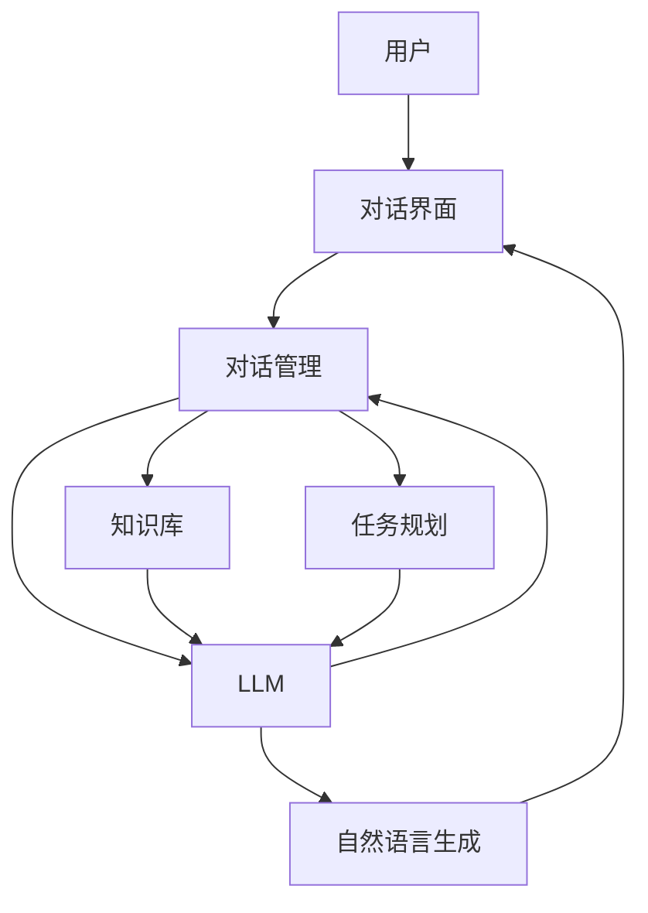

# 大语言模型应用指南：自主Agent系统案例分析（一）

## 1. 背景介绍
### 1.1  问题的由来
随着人工智能技术的飞速发展,大语言模型(Large Language Model, LLM)在自然语言处理领域取得了突破性进展。LLM能够从海量文本数据中学习语言知识,具备强大的语言理解和生成能力。这使得构建具有自主性、智能性的对话Agent系统成为可能。

然而,如何利用LLM来设计和开发高质量的自主Agent系统,仍面临诸多挑战。Agent需要具备连贯的对话能力、领域知识、推理决策等多方面智能。这需要我们在LLM的基础上,探索创新的架构设计和训练范式。

### 1.2  研究现状
近年来,学术界和工业界围绕LLM的自主Agent系统开展了广泛研究。微软的DialoGPT、谷歌的Meena、OpenAI的GPT-3等工作,展示了LLM在构建对话系统方面的潜力。一些研究尝试引入外部知识增强LLM的领域适应能力。还有工作探索Few-shot Learning等范式,提升LLM的学习效率。

尽管取得了可喜进展,但现有方法仍存在局限性。比如生成内容的连贯性有待加强,知识利用的准确性有待提高,Agent的主动性和目标导向性有待增强。这些问题的解决,需要在算法、模型、系统等层面进行系统性创新。

### 1.3  研究意义
自主Agent系统是人工智能走向应用的重要方向,具有广阔的应用前景。高质量的Agent系统能够为用户提供个性化、智能化的交互服务,在客服、教育、医疗等领域发挥重要作用。

本文旨在梳理LLM驱动的自主Agent系统的核心技术,剖析其内在机理,总结典型的案例经验。这将为相关研究提供系统性的参考,推动Agent系统的技术创新和产业应用。同时,也为非专业读者提供一个全面了解LLM应用形态的视角。

### 1.4  本文结构
本文将分为三个部分展开论述：
- 第一部分介绍LLM自主Agent系统的核心概念和总体架构
- 第二部分重点剖析几个代表性的技术方案,包括算法原理、数学建模、代码实现等
- 第三部分总结LLM自主Agent系统的发展趋势和挑战,并给出未来的展望

## 2. 核心概念与联系

在探讨LLM自主Agent系统之前,我们有必要明确几个核心概念：

- 大语言模型(LLM): 以Transformer为主流架构,在大规模语料上训练的语言模型,具备强大的语言理解和生成能力,代表模型有GPT、BERT、T5等。

- 自主Agent: 能够主动感知环境,自主进行推理决策,执行任务并优化目标的智能体。它们一般具有感知、推理、决策、执行等模块构成的认知架构。

- 对话系统: 以多轮对话的形式,与用户进行自然语言交互,完成问答、任务协作等功能的系统。常见的有闲聊型、任务型、知识问答型等。

LLM、自主Agent、对话系统三者之间有着紧密联系。LLM为构建自主Agent的对话系统提供了语言理解和生成的基础能力。我们可以将LLM视为Agent的"语言大脑",赋予其感知理解用户意图,组织语言回复的能力。

同时,Agent的认知架构也为LLM的应用提供了顶层框架。通过在LLM之上设计目标管理、知识库、对话管理等模块,我们可以让Agent具备更强的主动性、连贯性和任务导向性。

下图展示了一个典型的LLM驱动的自主Agent系统的总体架构:

可以看到,LLM作为核心模块,承担了语言理解和生成的重任。知识库为其提供了必要的背景知识,任务规划模块引导对话的主题和目标。对话管理模块协调各部分,控制对话流程。这样,多个模块协同工作,最终呈现给用户连贯、智能的对话体验。

## 3. 核心算法原理 & 具体操作步骤
### 3.1  算法原理概述
LLM驱动的自主Agent系统,其核心算法可以概括为两大类:语言模型和认知架构。

语言模型如GPT-3,采用Transformer的编码器-解码器结构。编码器负责将输入文本编码为隐空间表示,解码器根据隐表示生成目标文本。通过自回归和自注意力机制的巧妙结合,使得模型能够建模长程依赖,生成连贯、相关的文本。

认知架构则为Agent赋予了推理、规划等高层智能。一种典型方法是基于神经符号推理(Neural Symbolic Reasoning)。该方法将符号化的知识表示与神经网络相结合,使得Agent能够在语言理解的基础上,进行逻辑推理、因果分析,制定任务计划。

### 3.2  算法步骤详解
下面我们以GPT-3的Transformer模型为例,详细说明其工作步骤:

**Step1: 输入表示**
给定输入文本序列 $X=(x_1,\ldots,x_n)$,首先通过Embedding层将每个token映射为稠密向量。再叠加位置编码向量,引入词序信息。

$$H^0 = \text{Embedding}(X) + \text{PositionEncoding}(X)$$

**Step2: 编码器自注意力**
$L$ 个编码器层堆叠而成。每一层先通过多头自注意力(Multi-head Self-attention)聚合上下文信息:

$$\text{Attention}(Q,K,V) = \text{softmax}(\frac{QK^T}{\sqrt{d_k}})V$$

$Q,K,V$ 分别是上一层输出 $H^{l-1}$ 经线性变换得到的查询、键、值矩阵。多头注意力将 $H^{l-1}$ 划分为 $h$ 个部分,分别计算注意力,再拼接:

$$\text{MultiHead}(H^{l-1}) = \text{Concat}(\text{head}_1,\ldots,\text{head}_h)W^O$$

$$\text{head}_i = \text{Attention}(H^{l-1}W_i^Q, H^{l-1}W_i^K, H^{l-1}W_i^V)$$

其中 $W^O, W_i^Q, W_i^K, W_i^V$ 是可学习的参数矩阵。

**Step3: 前馈网络**
自注意力的输出经过两层前馈网络(Feed-Forward Network,FFN),引入非线性变换增强表达能力:

$$\text{FFN}(x)=\max(0, xW_1 + b_1) W_2 + b_2$$

**Step4: 层归一化和残差连接**
对FFN的输出进行层归一化(Layer Normalization),并与输入残差连接,得到编码器的最终输出:

$$H^l = \text{LayerNorm}(H^{l-1} + \text{FFN}(\text{MultiHead}(H^{l-1})))$$

**Step5: 解码器**
解码器与编码器结构类似,但在自注意力之前加入了masked self-attention,防止在生成某个token时"偷看"后面的token。此外,在FFN之前通过多头注意力聚合编码器的输出。

**Step6: 语言模型输出**
解码器输出经过线性变换和softmax归一化,得到下一个token的概率分布:

$$P(x_{t+1}|x_{\leq t}) = \text{softmax}(H^L W_{vocab}^T)$$

其中 $H^L$ 是解码器最后一层的输出。

以上就是GPT-3的Transformer模型的主要步骤。通过海量语料的预训练,模型习得了强大的语言理解和生成能力。在此基础上,我们可以针对Agent系统的需求,在GPT-3上进行适应性微调,如引入外部知识、加入任务规划模块等,从而打造出更加智能、可控的自主Agent。

### 3.3  算法优缺点
Transformer语言模型的优点在于:
- 自注意力机制能够高效建模长程依赖,生成连贯、相关的文本
- 大规模预训练使其具备海量语言知识,语言理解和生成能力强大
- 模型结构简洁优雅,易于并行化训练,适合工程落地

但其也存在一些局限性:
- 模型参数量巨大,训练和推理成本高昂
- 语言生成缺乏可控性,难以保证内容的准确性、安全性
- 缺乏显式的知识表示和推理能力,难以处理复杂任务

针对这些问题,研究者们提出了一系列改进方案,如知识增强、可控生成、推理增强等,以进一步提升LLM在自主Agent系统中的应用效果。

### 3.4  算法应用领域
LLM驱动的自主Agent系统在多个领域展现出应用潜力,例如:

- 智能客服:通过对话了解用户需求,提供个性化服务,如产品推荐、问题解答等。
- 教育助手:为学生提供学习辅导,答疑解惑,激发学习兴趣。
- 医疗助理:协助医生进行病情分析,提供诊断建议,普及医学知识。
- 金融顾问:根据客户的财务状况,提供投资理财建议。
- 生活助手:如智能音箱,提供日程管理、信息查询等便捷服务。

未来,随着技术的不断发展,LLM自主Agent系统有望在更广泛的领域发挥智能助手的作用,为人们的工作和生活带来便利。

## 4. 数学模型和公式 & 详细讲解 & 举例说明
### 4.1  数学模型构建
自主Agent系统涉及多个模块,每个模块都可建立相应的数学模型。这里我们重点介绍对话管理模块的马尔可夫决策过程(Markov Decision Process, MDP)模型。

MDP由四元组 $(S,A,P,R)$ 定义:
- 状态空间 $S$:对话的所有可能状态的集合,每个状态 $s$ 包含当前对话历史、用户意图等信息。
- 动作空间 $A$:Agent可执行的所有动作的集合,每个动作 $a$ 对应一个对话行为,如询问、澄清、回答等。
- 状态转移概率 $P$:从状态 $s$ 执行动作 $a$ 后转移到状态 $s'$ 的概率,即 $P(s'|s,a)$。
- 奖励函数 $R$:在状态 $s$ 下执行动作 $a$ 后获得的即时奖励,即 $R(s,a)$,反映该动作的效果。

MDP的目标是寻找一个最优策略 $\pi^*:S\rightarrow A$,使得Agent能够最大化累积奖励:

$$\pi^* = \arg\max_{\pi} \mathbb{E}[\sum_{t=0}^{\infty} \gamma^t R(s_t,\pi(s_t))]$$

其中 $\gamma\in[0,1]$ 是折扣因子,用于平衡即时奖励和长期奖励。

### 4.2  公式推导过程
为了求解最优策略 $\pi^*$,我们引入价值函数 $V^{\pi}(s)$ 和动作价值函数 $Q^{\pi}(s,a)$:

$$V^{\pi}(s) = \mathbb{E}[\sum_{t=0}^{\infty} \gamma^t R(s_t,\pi(s_t))|s_0=s]$$

$$Q^{\pi}(s,a) = \mathbb{E}[\sum_{t=0}^{\infty} \gamma^t R(s_t,\pi(s_t))|s_0=s,a_0=a]$$

$V^{\pi}(s)$ 表示从状态 $s$ 开始,遵循策略 $\pi$ 能获得的期望累积奖励。$Q^{\pi}(s,a)$ 表示从状态 $s$ 开始,先执行动作 $a$,再遵循策略 $\pi$ 能获得的期望累积奖励。

两者满足贝尔曼方程