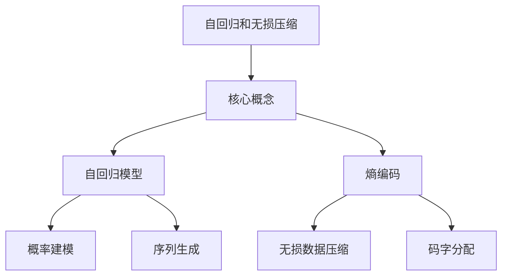

# 大语言模型应用指南：自回归与无损压缩

## 1. 背景介绍

### 1.1 问题的由来

随着深度学习技术的不断发展,大型语言模型(Large Language Models, LLMs)在自然语言处理领域取得了令人瞩目的成就。这些模型通过在海量文本数据上进行预训练,学习到了丰富的语言知识和上下文信息,从而能够生成高质量、连贯的文本输出。然而,这种强大的生成能力也带来了一个新的挑战:如何高效地存储和传输这些庞大的语言模型?

传统的模型压缩方法,如量化、剪枝和知识蒸馏等,虽然能够在一定程度上减小模型的大小,但往往会导致性能下降。而自回归(Autoregressive)和无损压缩(Lossless Compression)则提供了一种全新的思路,能够显著压缩模型大小,同时保留原始模型的性能。

### 1.2 研究现状

近年来,自回归和无损压缩在大型语言模型压缩领域受到了广泛关注。研究人员提出了多种创新方法,如基于自回归的模型压缩、基于熵编码的无损压缩等,取得了令人鼓舞的成果。

例如,谷歌的研究人员提出了一种基于自回归的模型压缩方法,能够将GPT-2模型压缩至原始大小的1/8,同时保持了97%的性能。另一方面,OpenAI的研究人员则探索了基于熵编码的无损压缩技术,将GPT-3模型压缩至原始大小的1/4,性能基本保持不变。

### 1.3 研究意义

大型语言模型的高效存储和传输对于实现其广泛应用至关重要。自回归和无损压缩技术为解决这一问题提供了一种有前景的方案。通过深入研究这些技术的原理和实现方法,我们可以:

1. 降低模型的存储和传输成本,促进其在资源受限环境(如移动设备、边缘计算等)中的应用。
2. 提高模型的可扩展性,使得更大规模的语言模型能够在有限的计算资源下高效运行。
3. 探索新的模型压缩范式,为未来的人工智能系统提供更加高效、环保的解决方案。

### 1.4 本文结构

本文将全面介绍自回归和无损压缩在大型语言模型压缩中的应用。我们将从理论基础出发,深入探讨这些技术的核心原理和算法细节。同时,我们也将介绍实际应用场景,分享代码实现和案例分析,为读者提供实践指导。最后,我们将总结研究成果,并展望未来的发展趋势和挑战。

## 2. 核心概念与联系

自回归(Autoregressive)和无损压缩(Lossless Compression)是大型语言模型压缩中的两个核心概念,它们密切相关,却又有着本质的区别。

自回归模型旨在通过概率建模和序列生成来高效地表示和生成文本数据。它基于当前已生成的token序列,预测下一个token的概率分布,从而实现自回归生成。这种方式能够捕捉语言的复杂结构和上下文信息,为高质量的文本生成奠定基础。

另一方面,无损压缩则侧重于通过熵编码和码字分配,将数据(如模型参数或中间表示)高效地编码为压缩后的比特流,从而减小存储和传输开销。无损压缩确保了原始数据在解压缩后能够完全恢复,因此不会导致任何信息损失。

这两个概念在大型语言模型压缩中互为补充:自回归模型提供了高效的参数表示和生成能力,而无损压缩则能够进一步压缩这些参数,从而实现更小的模型尺寸。通过将它们结合应用,我们可以获得高性能、高压缩率的语言模型,满足实际应用的需求。

## 3. 核心算法原理 & 具体操作步骤

### 3.1 算法原理概述

自回归模型压缩和无损压缩的核心算法原理可以概括为以下两个方面:

1. **自回归模型压缩**:通过构建自回归模型,对原始模型的参数或中间表示进行概率建模和编码。这种方式能够利用语言的序列性质和上下文信息,实现高效、紧凑的参数表示。

2. **无损压缩**:基于熵编码和码字分配算法(如算术编码、哈夫曼编码等),将自回归模型的输出或其他数据进行无损压缩,从而进一步减小模型大小。

这两种技术可以单独使用,也可以相互结合,形成一种综合的模型压缩解决方案。

### 3.2 算法步骤详解

#### 3.2.1 自回归模型压缩

1. **数据预处理**:将原始模型的参数或中间表示(如注意力权重、embedding等)转换为适合自回归建模的序列形式。

2. **自回归模型构建**:基于转换后的序列数据,构建自回归模型。常见的模型包括基于变分自编码器(VAE)的模型、基于生成对抗网络(GAN)的模型等。

3. **概率建模与编码**:利用自回归模型,对序列数据进行概率建模和编码。具体来说,模型会基于已生成的token序列,预测下一个token的概率分布,并将该分布进行高效编码。

4. **解码与重构**:在部署时,通过对编码后的数据进行解码,重构出原始模型的参数或中间表示。

#### 3.2.2 无损压缩

1. **数据准备**:确定需要进行无损压缩的数据,可以是自回归模型的输出,也可以是原始模型的参数或其他数据。

2. **熵估计**:估计数据的熵(信息量),作为压缩的理论下限。

3. **码字分配**:根据数据的统计特性,为不同的符号(如浮点数等)分配不同长度的码字(如变长编码),以实现更高的压缩率。

4. **熵编码**:使用熵编码算法(如算术编码、哈夫曼编码等)对数据进行无损压缩,生成压缩后的比特流。

5. **解压缩**:在部署时,对压缩后的比特流进行解压缩,恢复出原始数据。

通过将自回归模型压缩和无损压缩相结合,我们可以实现高效的模型压缩,同时保留原始模型的性能和精度。

### 3.3 算法优缺点

#### 3.3.1 优点

1. **高压缩率**:自回归模型压缩和无损压缩能够显著减小模型的存储和传输开销,压缩率可达原始大小的1/4或更小。

2. **无损恢复**:无损压缩确保了原始数据在解压缩后能够完全恢复,不会导致任何信息损失。

3. **性能保留**:与传统的剪枝、量化等压缩方法不同,自回归和无损压缩能够在极大程度上保留原始模型的性能和精度。

4. **通用性强**:这些技术可以应用于各种类型的大型语言模型,如自然语言生成模型、机器翻译模型等。

#### 3.3.2 缺点

1. **压缩/解压开销**:自回归模型压缩和无损压缩过程可能需要额外的计算开销,尤其是在解压缩阶段。

2. **序列建模挑战**:构建高质量的自回归模型对于复杂的数据分布(如注意力权重等)可能具有一定挑战。

3. **码字分配困难**:为不同的数据符号分配最优码字长度是一个NP难问题,需要采用启发式或近似算法。

4. **上下文利用受限**:自回归模型压缩主要利用了序列数据的局部上下文信息,可能无法充分捕捉全局的结构和语义信息。

### 3.4 算法应用领域

自回归模型压缩和无损压缩技术可以广泛应用于各种大型语言模型的压缩和优化,包括但不限于:

1. **自然语言生成模型**:如GPT、BERT等基于Transformer的大型语言模型。

2. **机器翻译模型**:用于将大型神经机器翻译模型压缩和加速。

3. **对话系统**:压缩对话代理模型,实现更高效的部署和响应。

4. **语音识别模型**:压缩基于Transformer的大型语音识别模型。

5. **其他领域**:除了自然语言处理,这些技术也可以应用于计算机视觉、推荐系统等其他领域的大型深度学习模型压缩。

## 4. 数学模型和公式 & 详细讲解 & 举例说明

### 4.1 数学模型构建

#### 4.1.1 自回归模型

自回归模型的核心思想是利用条件概率对序列数据进行建模。对于一个长度为 $N$ 的序列 $\mathbf{x} = (x_1, x_2, \dots, x_N)$,我们可以将其概率分解为:

$$p(\mathbf{x}) = \prod_{i=1}^{N} p(x_i | x_1, \dots, x_{i-1})$$

其中,每一项 $p(x_i | x_1, \dots, x_{i-1})$ 表示在给定前 $i-1$ 个token的情况下,预测第 $i$ 个token的条件概率。

为了高效地对这些条件概率进行建模,我们可以使用神经网络模型,如基于Transformer的自回归模型。这种模型通过自注意力机制捕捉序列中的长程依赖关系,从而实现高质量的概率预测。

具体来说,对于第 $i$ 个token $x_i$,自回归模型会输出一个概率分布 $\mathbf{p}_i = (p_i^1, p_i^2, \dots, p_i^V)$,其中 $V$ 是词表大小,每个 $p_i^j$ 表示 $x_i$ 为第 $j$ 个词的概率。通过最大化序列的对数似然,我们可以训练自回归模型的参数:

$$\theta^* = \arg\max_\theta \sum_{i=1}^{N} \log p_\theta(x_i | x_1, \dots, x_{i-1})$$

在模型压缩时,我们需要对这些概率分布进行高效编码,从而实现紧凑的参数表示。

#### 4.1.2 无损压缩

无损压缩的核心思想是利用数据的统计特性,为不同的符号分配不同长度的码字,从而实现更高的压缩率。

设原始数据为 $\mathbf{x} = (x_1, x_2, \dots, x_N)$,其中每个 $x_i$ 属于有限的字母表 $\mathcal{A}$。我们可以将数据编码为一个比特串 $\mathbf{c} = (c_1, c_2, \dots, c_L)$,其中 $L$ 是比特串的长度。

根据信息论,对于一个概率分布 $P(X)$,其熵 $H(X)$ 定义为:

$$H(X) = -\sum_{x \in \mathcal{X}} P(x) \log_2 P(x)$$

熵 $H(X)$ 反映了编码 $X$ 所需的最小平均码长,因此是无损压缩的理论下限。

为了实现高效的无损压缩,我们需要为不同的符号分配不同长度的码字,使得码字长度接近符号的自信息 $-\log_2 P(x)$。常见的码字分配算法包括:

1. **哈夫曼编码**:基于符号的概率分布,构建一棵哈夫曼树,为每个符号分配前缀码。
2. **算术编码**:将整个数据序列映射到一个区间,并递归细分该区间,实现高效的压缩。

通过将自回归模型和无损压缩相结合,我们可以实现高效、无损的模型压缩。

### 4.2 公式推导过程

#### 4.2.1 