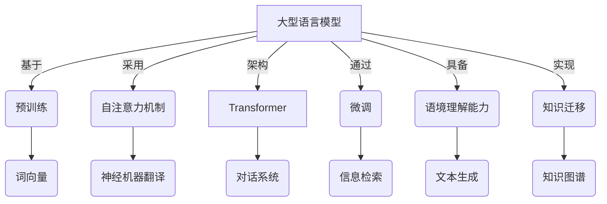

# 大语言模型应用指南：达特茅斯会议

## 1. 背景介绍

### 1.1 问题的由来

随着人工智能技术的不断发展,大型语言模型(Large Language Models, LLMs)已经成为当前人工智能领域最炙手可热的研究热点之一。这些模型通过在海量文本数据上进行预训练,能够掌握人类语言的丰富知识和语义信息,并可以应用于各种自然语言处理任务,展现出令人惊叹的能力。

然而,尽管大型语言模型已经取得了令人瞩目的进展,但它们在实际应用中仍然面临着诸多挑战和局限性。例如,它们可能会产生不合理、不一致或有偏差的输出;缺乏对语境的理解和推理能力;存在安全隐患和潜在的不当用途等。因此,如何更好地理解和应用这些模型,最大限度地发挥它们的潜力,同时规避其局限性和风险,成为了当前亟待解决的重要课题。

### 1.2 研究现状

为了应对大型语言模型面临的挑战,学术界和工业界都在积极开展相关研究和探索。一些主要的研究方向包括:

- 模型优化和微调:通过对预训练模型进行进一步优化和针对特定任务的微调,提高模型的性能和泛化能力。
- 模型解释和可解释性:探索模型内部的工作机制,增强模型的透明度和可解释性,从而更好地理解和控制模型的行为。
- 模型评估和测试:制定更加全面和严格的评估标准,全面评估模型的能力和局限性,并发现其中存在的偏差和不足。
- 模型安全和伦理:研究模型可能带来的安全隐患和伦理风险,制定相应的规范和约束机制,确保模型的安全和负责任的使用。
- 模型应用和集成:探索将大型语言模型应用于不同领域的方法,并与其他技术(如计算机视觉、知识图谱等)进行集成,拓展模型的应用场景。

### 1.3 研究意义

大型语言模型的研究和应用具有重要的理论意义和实践价值。从理论层面来看,它有助于我们更好地理解人类语言的本质,揭示语言学习和理解的内在机制,推动人工智能技术的发展。从实践层面来看,大型语言模型可以为各种自然语言处理任务提供强大的支持,为诸多领域带来革命性的变革,如机器翻译、问答系统、文本生成、信息检索等。

此外,大型语言模型还可以促进人机协作,提高工作效率,为人类提供智能助手和决策支持。它们还可以应用于教育、医疗、法律等领域,为相关领域的发展注入新的动力。因此,深入研究和合理应用大型语言模型,对于推动科技进步和社会发展都具有重要意义。

### 1.4 本文结构

本文将全面探讨大型语言模型的应用指南,内容包括:

1. 介绍大型语言模型的核心概念和原理,阐明它们与其他自然语言处理技术的联系。
2. 详细解释大型语言模型的核心算法原理和具体操作步骤,分析其优缺点和适用领域。
3. 构建数学模型,推导公式,并通过案例分析进行详细讲解,解答常见问题。
4. 提供项目实践的代码实例,详细解释代码实现,展示运行结果。
5. 探讨大型语言模型在各个领域的实际应用场景,并展望未来的应用前景。
6. 推荐相关的学习资源、开发工具、论文等,为读者提供进一步学习和研究的支持。
7. 总结研究成果,分析未来发展趋势和面临的挑战,并对未来的研究方向进行展望。
8. 附录部分解答常见问题,帮助读者更好地理解和掌握相关知识。

通过全面而深入的探讨,本文旨在为读者提供一份全面的大型语言模型应用指南,帮助读者掌握相关知识,了解最新进展,并为实际应用提供指导和建议。

## 2. 核心概念与联系

大型语言模型(Large Language Models, LLMs)是一种基于深度学习的自然语言处理模型,通过在海量文本数据上进行预训练,学习到丰富的语言知识和语义信息。这些模型具有强大的语言理解和生成能力,可以应用于各种自然语言处理任务,如机器翻译、文本摘要、问答系统、文本生成等。

大型语言模型的核心概念包括:

1. **预训练(Pre-training)**: 在大规模文本语料库上进行无监督训练,学习到通用的语言知识和语义表示。这是大型语言模型的关键特征之一。

2. **自注意力机制(Self-Attention Mechanism)**: 通过计算输入序列中每个元素与其他元素的相关性,捕获长距离依赖关系,从而更好地理解和表示语言。

3. **Transformer架构**: 一种基于自注意力机制的序列到序列模型架构,广泛应用于大型语言模型中。它能够有效地处理长序列,并具有并行计算的优势。

4. **微调(Fine-tuning)**: 在预训练模型的基础上,针对特定任务进行进一步的监督训练,以提高模型在该任务上的性能。

5. **语境理解(Contextual Understanding)**: 大型语言模型能够根据上下文信息,理解语言的含义和语义关系,从而产生更加准确和自然的输出。

6. **知识迁移(Knowledge Transfer)**: 预训练模型所学习到的通用语言知识可以转移到下游任务中,减少了从头开始训练的需求,提高了训练效率和模型性能。

大型语言模型与自然语言处理领域的其他技术密切相关,例如:

- **词向量(Word Embeddings)**: 将词语映射到连续的向量空间,捕获词与词之间的语义关系,是大型语言模型的基础技术之一。

- **神经机器翻译(Neural Machine Translation)**: 利用序列到序列模型实现机器翻译,大型语言模型可以作为其中的核心组件。

- **对话系统(Dialogue Systems)**: 大型语言模型可以用于构建对话代理,进行自然语言交互和问答。

- **信息检索(Information Retrieval)**: 通过语义匹配和相关性排序,大型语言模型可以提高信息检索的效果。

- **文本生成(Text Generation)**: 大型语言模型擅长生成自然、流畅的文本,可应用于诸如新闻写作、故事创作等领域。

- **知识图谱(Knowledge Graphs)**: 将大型语言模型与知识图谱相结合,可以增强模型的知识理解和推理能力。

总的来说,大型语言模型是一种通用的自然语言处理技术,它与许多其他技术紧密相连,相互促进,共同推动着自然语言处理领域的发展。

## 3. 核心算法原理 & 具体操作步骤

### 3.1 算法原理概述

大型语言模型的核心算法原理是基于自注意力机制和Transformer架构。自注意力机制允许模型捕获输入序列中任意两个位置之间的依赖关系,而Transformer架构则提供了一种高效的方式来并行计算自注意力。

在训练过程中,大型语言模型会在海量文本数据上进行无监督预训练,学习到通用的语言知识和语义表示。预训练通常采用掩码语言模型(Masked Language Modeling)和下一句预测(Next Sentence Prediction)两种任务。前者要求模型根据上下文预测被掩码的词,后者则需要判断两个句子是否相关。

通过预训练,模型可以获得丰富的语言理解能力,并且所学习到的知识可以转移到下游任务中,提高模型的性能和泛化能力。为了适应特定任务,通常需要对预训练模型进行微调,即在预训练的基础上,针对目标任务进行进一步的监督训练。

在推理阶段,大型语言模型可以根据输入的文本,生成自然、流畅的文本输出,或者回答相关的问题。模型会综合考虑输入文本的上下文信息,捕获词与词之间的语义关系,从而产生准确、一致的输出。

### 3.2 算法步骤详解

大型语言模型的训练和推理过程可以概括为以下几个主要步骤:

1. **数据预处理**:
   - 收集和清洗大规模的文本语料库
   - 对文本进行标记化(tokenization)和编码(encoding)
   - 构建词表(vocabulary)和词向量(word embeddings)

2. **模型初始化**:
   - 设计和初始化Transformer模型架构
   - 初始化模型参数

3. **预训练**:
   - 采用掩码语言模型(Masked Language Modeling)任务
     - 随机选择输入序列中的部分词,用特殊的掩码符号[MASK]替换
     - 模型需要根据上下文预测被掩码的词
   - 采用下一句预测(Next Sentence Prediction)任务
     - 给定两个句子,判断它们是否相关
   - 使用大规模语料库进行无监督训练
   - 优化模型参数,学习到通用的语言知识和语义表示

4. **微调(可选)**:
   - 针对特定的下游任务(如机器翻译、问答等)
   - 在预训练模型的基础上进行进一步的监督训练
   - 优化模型参数,提高在目标任务上的性能

5. **推理**:
   - 输入文本,经过标记化和编码
   - 将编码后的输入传递给预训练模型(或微调后的模型)
   - 模型根据输入和上下文信息生成输出
   - 对输出进行解码和后处理,得到最终结果

在整个过程中,自注意力机制和Transformer架构发挥着关键作用。自注意力机制允许模型捕获输入序列中任意两个位置之间的依赖关系,而Transformer架构则提供了一种高效的方式来并行计算自注意力,从而提高了模型的计算效率和处理能力。

### 3.3 算法优缺点

大型语言模型算法具有以下优点:

1. **强大的语言理解和生成能力**:通过预训练,模型可以学习到丰富的语言知识和语义表示,具备出色的语言理解和生成能力。

2. **泛化性强**:预训练所学习到的知识可以转移到各种下游任务中,提高了模型的泛化能力。

3. **高效的并行计算**:Transformer架构和自注意力机制支持高效的并行计算,提高了模型的计算效率。

4. **长距离依赖捕获**:自注意力机制能够有效捕获输入序列中任意两个位置之间的依赖关系,克服了传统序列模型的局限性。

5. **可解释性**:通过分析注意力权重,可以一定程度上解释模型的决策过程,提高了模型的可解释性。

然而,大型语言模型算法也存在一些缺点和局限性:

1. **计算资源需求高**:训练大型语言模型需要巨大的计算资源,包括GPU、内存和存储空间。

2. **数据饥渴**:模型需要大量的训练数据才能发挥最佳性能,数据的质量和多样性也至关重要。

3. **缺乏常识推理能力**:尽管模型可以捕获语言的统计规律,但缺乏对真实世界的常识理解和推理能力。

4. **存在偏差和不一致性**:模型的输出可能存在偏差、不一致或不合理的情况,需要进一步的控制和优化。

5. **安全和隐私风险**