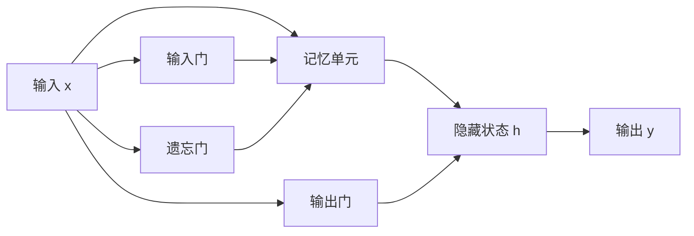

# 大语言模型应用指南：长短期记忆

关键词：大语言模型、长短期记忆、LSTM、RNN、序列建模、自然语言处理

## 1. 背景介绍
### 1.1  问题的由来
随着人工智能技术的飞速发展,自然语言处理(NLP)领域也取得了巨大的进步。其中,大语言模型(Large Language Model, LLM)作为 NLP 的核心技术之一,在机器翻译、文本摘要、对话系统等任务中发挥着至关重要的作用。然而,传统的语言模型如 N-gram 模型存在着上下文利用不足、数据稀疏等问题,难以捕捉语言中的长距离依赖关系。为了克服这些局限性,研究者们提出了基于神经网络的语言模型,其中长短期记忆(Long Short-Term Memory, LSTM)网络以其强大的建模能力脱颖而出。

### 1.2  研究现状
目前,基于 LSTM 的大语言模型已经在学术界和工业界得到了广泛的应用。例如,Google 的 BERT、OpenAI 的 GPT 系列模型都采用了 Transformer 结构,而 Transformer 中的编码器和解码器则大量使用了 LSTM 单元。这些大语言模型在多个 NLP 任务上取得了 state-of-the-art 的性能,展现了 LSTM 在建模长序列数据方面的优势。同时,LSTM 也被应用于语音识别、时间序列预测等其他领域,成为了序列建模的标准构件。

### 1.3  研究意义
深入研究 LSTM 在大语言模型中的应用,对于推动 NLP 技术的进一步发展具有重要意义。一方面,通过分析 LSTM 的内部机制,我们可以更好地理解语言的内在规律和表示方法,为构建更加智能的对话系统、知识图谱等应用奠定基础。另一方面,优化 LSTM 的结构和训练方法,有助于提高大语言模型的性能和效率,降低计算资源的消耗,使其能够更好地服务于实际应用场景。

### 1.4  本文结构
本文将围绕 LSTM 在大语言模型中的应用展开深入探讨。第二部分将介绍 LSTM 的核心概念以及与其他神经网络结构的联系。第三部分将详细阐述 LSTM 的算法原理和具体操作步骤。第四部分将给出 LSTM 的数学模型和公式推导过程,并结合实例进行讲解。第五部分将展示基于 LSTM 的大语言模型的代码实现和详细解释。第六部分将讨论 LSTM 在实际应用场景中的案例。第七部分将推荐相关的学习资源和开发工具。最后,第八部分将总结 LSTM 的研究现状,展望其未来的发展趋势和面临的挑战。

## 2. 核心概念与联系
长短期记忆网络(LSTM)是一种特殊类型的循环神经网络(Recurrent Neural Network, RNN),它能够学习长期依赖关系。与传统的 RNN 相比,LSTM 引入了门控机制和显式的记忆单元,使其能够更好地捕捉序列数据中的长距离依赖,避免了梯度消失和梯度爆炸问题。

LSTM 的核心思想是通过门控机制来控制信息的流动。具体来说,LSTM 包含三种类型的门:输入门(input gate)、遗忘门(forget gate)和输出门(output gate)。这些门的作用如下:

- 输入门:控制当前时间步的输入信息有多少保存到记忆单元中
- 遗忘门:控制上一时间步的记忆信息有多少被遗忘
- 输出门:控制记忆单元中的信息有多少输出到当前时间步的隐藏状态

通过这三个门的协同工作,LSTM 能够在序列的不同位置学习到不同的信息,并将重要的信息长时间保存在记忆单元中,从而建立起长期依赖关系。

除了门控机制,LSTM 还引入了显式的记忆单元(memory cell),用于存储长期的信息。记忆单元中的值可以在序列的不同时间步之间传递和更新,使得 LSTM 能够在较长的上下文中捕捉到相关的信息。

下图展示了 LSTM 的基本结构:

LSTM 与其他神经网络结构的联系如下:

- LSTM 是 RNN 的一种变体,它继承了 RNN 处理序列数据的能力,同时通过门控机制和记忆单元解决了 RNN 的局限性。
- LSTM 可以与其他神经网络结构如卷积神经网络(CNN)、注意力机制(Attention)等结合,形成更加强大的模型。例如,在图像描述任务中,CNN 可以提取图像特征,LSTM 则根据图像特征生成对应的文本描述。
- LSTM 是构建大语言模型的重要组件。例如,Transformer 结构中的编码器和解码器都大量使用了 LSTM 单元,使其能够建模长距离依赖关系,生成连贯且语义丰富的文本。

## 3. 核心算法原理 & 具体操作步骤
### 3.1  算法原理概述
LSTM 的核心算法可以分为三个主要步骤:门控单元计算、记忆单元更新和隐藏状态计算。下面我们将详细介绍每个步骤的原理。

### 3.2  算法步骤详解
**步骤1:门控单元计算**

首先,我们需要计算输入门、遗忘门和输出门的值。这三个门的计算方式类似,都是将当前时间步的输入 $x_t$ 和上一时间步的隐藏状态 $h_{t-1}$ 进行拼接,然后通过一个线性变换和 sigmoid 激活函数得到门的值。公式如下:

$$
\begin{aligned}
i_t &= \sigma(W_i \cdot [h_{t-1}, x_t] + b_i) \\
f_t &= \sigma(W_f \cdot [h_{t-1}, x_t] + b_f) \\
o_t &= \sigma(W_o \cdot [h_{t-1}, x_t] + b_o)
\end{aligned}
$$

其中,$i_t$、$f_t$ 和 $o_t$ 分别表示输入门、遗忘门和输出门的值,$W_i$、$W_f$ 和 $W_o$ 是对应的权重矩阵,$b_i$、$b_f$ 和 $b_o$ 是偏置项,$\sigma$ 表示 sigmoid 激活函数。

**步骤2:记忆单元更新**

接下来,我们需要更新记忆单元的值。首先,计算候选记忆单元的值 $\tilde{C}_t$,公式如下:

$$
\tilde{C}_t = \tanh(W_c \cdot [h_{t-1}, x_t] + b_c)
$$

然后,使用遗忘门和输入门来更新记忆单元的值,公式如下:

$$
C_t = f_t * C_{t-1} + i_t * \tilde{C}_t
$$

其中,$C_t$ 表示当前时间步的记忆单元值,$C_{t-1}$ 表示上一时间步的记忆单元值,$*$ 表示逐元素相乘。

**步骤3:隐藏状态计算**

最后,我们需要计算当前时间步的隐藏状态 $h_t$。首先,将记忆单元的值通过 tanh 激活函数进行变换,然后与输出门的值相乘,公式如下:

$$
h_t = o_t * \tanh(C_t)
$$

至此,我们完成了一个时间步的 LSTM 前向计算过程。将这个过程循环应用于序列的每个时间步,就可以得到整个序列的隐藏状态序列。

### 3.3  算法优缺点
LSTM 算法的优点包括:

- 能够建立长期依赖关系,捕捉序列数据中的长距离信息。
- 通过门控机制和记忆单元,有效地缓解了梯度消失和梯度爆炸问题。
- 可以处理可变长度的序列数据,具有较强的灵活性。

LSTM 算法的缺点包括:

- 计算复杂度较高,训练时间较长。
- 对于较短的序列,LSTM 可能会过拟合,性能不如简单的模型。
- LSTM 的解释性较差,难以直观地理解模型的内部工作机制。

### 3.4  算法应用领域
LSTM 算法在以下领域有广泛的应用:

- 自然语言处理:机器翻译、文本摘要、情感分析等
- 语音识别:将语音信号转化为文本
- 时间序列预测:股票价格预测、天气预报等
- 推荐系统:基于用户历史行为进行个性化推荐
- 视频理解:视频描述、行为识别等

## 4. 数学模型和公式 & 详细讲解 & 举例说明
### 4.1  数学模型构建
为了更好地理解 LSTM 的工作原理,我们需要建立其数学模型。LSTM 的数学模型可以用以下几个关键的状态变量和计算公式来描述:

- 输入门:$i_t = \sigma(W_i \cdot [h_{t-1}, x_t] + b_i)$
- 遗忘门:$f_t = \sigma(W_f \cdot [h_{t-1}, x_t] + b_f)$
- 输出门:$o_t = \sigma(W_o \cdot [h_{t-1}, x_t] + b_o)$
- 候选记忆单元:$\tilde{C}_t = \tanh(W_c \cdot [h_{t-1}, x_t] + b_c)$
- 记忆单元:$C_t = f_t * C_{t-1} + i_t * \tilde{C}_t$
- 隐藏状态:$h_t = o_t * \tanh(C_t)$

其中,$W_i$、$W_f$、$W_o$ 和 $W_c$ 是权重矩阵,$b_i$、$b_f$、$b_o$ 和 $b_c$ 是偏置项,$\sigma$ 表示 sigmoid 激活函数,$\tanh$ 表示双曲正切激活函数,$*$ 表示逐元素相乘。

### 4.2  公式推导过程
下面我们以输入门的计算公式为例,详细推导其数学形式。

输入门的作用是控制当前时间步的输入信息有多少保存到记忆单元中。其计算公式为:

$$
i_t = \sigma(W_i \cdot [h_{t-1}, x_t] + b_i)
$$

展开上式,可以得到:

$$
i_t = \sigma(W_{ih} \cdot h_{t-1} + W_{ix} \cdot x_t + b_i)
$$

其中,$W_{ih}$ 和 $W_{ix}$ 分别表示隐藏状态和输入数据的权重矩阵。

将 sigmoid 函数的定义代入,可以得到:

$$
i_t = \frac{1}{1 + e^{-(W_{ih} \cdot h_{t-1} + W_{ix} \cdot x_t + b_i)}}
$$

这就是输入门的完整数学形式。遗忘门、输出门和候选记忆单元的推导过程类似,这里不再赘述。

### 4.3  案例分析与讲解
为了更直观地理解 LSTM 的工作原理,我们以一个简单的情感分析任务为例进行说明。

假设我们有一个电影评论的数据集,每个样本由一段文本和对应的情感标签(正面或负面)组成。我们的目标是训练一个 LSTM 模型,根据评论文本预测其情感倾向。

首先,我们将每个评论文本转化为词向量序列 $[x_1, x_2, ..., x_T]$,其中 $x_t$ 表示第 $t$ 个单词的词向量。然后,我们将这个序列输入到 LSTM 模型中。

对于序列中的每个时间步 $t$,LSTM 会根据当前的输入 $x_t$ 和上一时间步的隐藏状态 $h_{t-1}$ 计算输入门、遗忘门和输出门的值,并更新记忆单元和隐藏状态。这个过程可以用以下公式表示:

$$