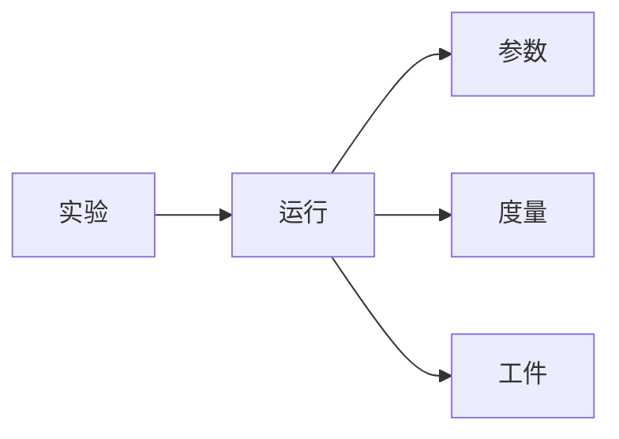

# 实验跟踪与实验管理原理与代码实战案例讲解

关键词：实验跟踪、实验管理、代码实战、机器学习、深度学习、人工智能

## 1. 背景介绍
### 1.1 问题的由来
在人工智能、机器学习和深度学习等领域,实验是非常关键的一个环节。通过实验,我们可以验证算法的有效性,对比不同模型的性能,调试和优化模型。但是,随着实验数量和复杂度的增加,如何有效地管理和跟踪实验过程与结果,成为一个亟待解决的问题。无论是在学术研究还是工业界应用中,实验管理与跟踪都是一个重要课题。

### 1.2 研究现状
目前,针对实验管理与跟踪,已经有一些成熟的工具和平台,比如MLflow、TensorBoard、Sacred等。这些工具提供了实验结果记录、可视化、代码版本管理等功能,在一定程度上方便了实验的管理。但是,现有工具仍然存在一些局限性,比如:
1. 缺乏对实验全流程的管理,从实验设计到结果分析,没有统一的管理方案。
2. 实验数据管理混乱,没有统一的标准和规范。
3. 缺乏实验分析和对比的工具,难以洞察实验结果背后的规律。

因此,亟需一种全面的实验管理方案,来指导和规范实验全流程。

### 1.3 研究意义
研究实验管理与跟踪有以下重要意义:
1. 提高实验效率,减少重复劳动。通过规范实验流程和管理方式,可以避免不必要的重复实验,节约时间和计算资源。
2. 加强实验结果的可复现性。通过详细记录实验过程和环境,其他研究者可以准确复现实验结果,验证结论的可靠性。
3. 便于实验结果的管理和分享。规范的实验管理使得实验数据和代码可以得到有效组织,方便不同研究者之间的分享与协作。
4. 洞察实验规律,指导算法优化。通过分析和对比大量实验数据,可以总结实验背后的规律,为算法改进提供有价值的见解。

### 1.4 本文结构
本文将全面阐述实验管理与跟踪的原理和方法,主要内容包括:
- 第2部分：介绍实验管理的核心概念,以及不同概念之间的联系。
- 第3部分：详细讲解实验管理的核心算法原理,给出具体操作步骤。 
- 第4部分：介绍实验管理中常用的数学模型,推导相关公式,并举例说明。
- 第5部分：通过代码实例,演示如何实现一个完整的实验管理系统。
- 第6部分：讨论实验管理在实际场景中的应用,展望未来发展方向。
- 第7部分：推荐实验管理相关的工具、资源,方便读者进一步学习和实践。
- 第8部分：总结全文,分析实验管理未来的发展趋势和面临的挑战。
- 第9部分：以附录形式,回答实验管理中的常见问题。

## 2. 核心概念与联系
在实验管理中,有几个核心概念需要理解:
- 实验(Experiment):一次完整的试验过程,包括数据准备、模型训练、结果评估等环节。
- 运行(Run):实验中的一次试运行,是实验的基本组成单位。
- 参数(Parameter):模型训练中的超参数和配置选项,如学习率、批大小等。
- 度量(Metric):评估模型性能的指标,如准确率、召回率等。
- 工件(Artifact):实验过程中产生的数据文件,如训练日志、模型权重等。

下面是这几个概念的关系图:



可以看出,实验由多次运行组成,每次运行都有独立的参数配置,会产生一组度量结果和工件。实验管理的目标就是组织和管理这些概念,使实验过程清晰可控。

## 3. 核心算法原理 & 具体操作步骤
### 3.1 算法原理概述
实验管理的核心算法可以分为两类:
1. 数据版本管理:对实验数据进行管理,记录数据的版本变化,保证数据可追溯。
2. 实验流程管理:对实验流程进行抽象和建模,通过有向无环图(DAG)等方式描述实验的执行过程和依赖关系。

### 3.2 算法步骤详解
数据版本管理的主要步骤如下:
1. 数据集注册:将数据集元信息录入系统,包括数据集名称、格式、存储位置等。
2. 数据版本记录:每次数据集更新时,记录下版本号、修改人、修改时间、修改内容等信息。 
3. 数据版本回滚:当需要使用历史版本数据时,可以根据版本号快速定位和恢复数据。

实验流程管理的主要步骤如下:
1. 实验流程定义:设计实验的执行流程,明确各个步骤的输入输出。
2. DAG构建:将实验流程转换为有向无环图表示,节点表示实验步骤,边表示步骤间的依赖关系。
3. 调度执行:根据DAG,合理调度实验步骤在计算资源上执行,可采用串行、并行等方式。
4. 结果记录:实验产生的日志、模型等工件,都要以规范化的格式持久化存储,便于追踪和分析。

### 3.3 算法优缺点
数据版本管理的优点是:
- 数据可追溯,实验结果可复现
- 方便共享数据,减少存储开销

缺点是:
- 版本管理粒度难以权衡,过细会增加维护成本,过粗则追溯不够精准 
- 对于大规模数据集,版本管理会带来存储和计算压力

实验流程管理的优点是:
- 清晰定义实验流程,减少错误
- 自动调度,提高资源利用率
- 可复用实验模块,减少重复劳动

缺点是:
- 实验流程图构建需要一定工作量
- 复杂实验的流程图可能难以理解和维护
- 缺乏灵活性,对于探索性实验支持不足

### 3.4 算法应用领域
实验管理算法主要应用于以下领域:
- 机器学习平台:帮助数据科学家管理海量实验,提高效率。
- 学术研究:规范实验流程,提升学术研究质量和可重复性。
- A/B测试:管理不同算法和模型的在线评测,选择最优配置。
- 强化学习:管理大规模强化学习实验,追踪环境、策略、奖励等信息。

## 4. 数学模型和公式 & 详细讲解 & 举例说明
### 4.1 数学模型构建
实验管理中的一个关键问题是如何评估不同实验配置的优劣。我们可以建立如下数学模型:

令$x_i$表示一组实验参数,$y_i$表示该参数下的实验评估指标,如准确率。我们希望找到最优参数$x^*$,使得评估指标最大化:

$$
x^* = \arg\max_{x} y(x)
$$

但是,由于实验次数有限,我们无法穷举所有参数。因此,需要建立参数与指标之间的映射关系$f$:

$$
y = f(x) + \epsilon
$$

其中$\epsilon$为随机噪声。我们可以通过回归、神经网络等方法来学习这个映射关系,从而预测未知参数的性能。

### 4.2 公式推导过程
对于线性模型,我们可以用最小二乘法来估计参数。假设映射关系为:

$$
f(x) = w^T x + b
$$

其中$w$和$b$分别为权重向量和偏置项。最小二乘估计就是要最小化误差平方和:

$$
\min_{w,b} \sum_{i=1}^n (y_i - w^T x_i - b)^2
$$

令误差平方和对$w$和$b$的导数为0,可以得到最优解的闭式表达:

$$
\begin{aligned}
w^* &= (X^T X)^{-1} X^T (y-\bar{y}) \\
b^* &= \bar{y} - w^{*T} \bar{x}
\end{aligned}
$$

其中$X$为实验参数矩阵,$y$为评估指标向量,$\bar{x}$和$\bar{y}$分别为参数和指标的均值。

### 4.3 案例分析与讲解
下面我们以一个简单例子来说明如何用数学模型指导实验管理。

假设我们要优化一个二分类模型,评估指标为准确率。我们控制两个实验参数:L2正则化系数$\alpha$和学习率$\eta$。我们先进行少量初探实验,得到不同参数下的准确率:

| $\alpha$ | $\eta$  | 准确率   |
|----------|---------|---------|
| 0.01     | 0.001   | 0.75    |
| 0.01     | 0.01    | 0.78    |
| 0.01     | 0.1     | 0.73    |
| 0.1      | 0.001   | 0.74    |
| 0.1      | 0.01    | 0.80    |
| 0.1      | 0.1     | 0.76    |

利用这些数据,我们可以训练一个参数到准确率的映射模型:

$$
\text{Acc} = 0.7 + 0.1 \log_{10} \alpha + 0.5 \log_{10} \eta - 0.3 (\log_{10} \eta)^2
$$

有了映射关系,我们可以预测出更多参数组合的性能,而无需真正运行实验。比如,我们预测$\alpha=0.05,\eta=0.02$时的准确率为0.791,可以作为下一个有希望的实验参数。

这个例子说明,数学建模可以帮助我们理解实验参数和评估指标之间的关系,指导后续实验,减少盲目搜索,提高实验效率。

### 4.4 常见问题解答
问:数学建模对实验管理有什么局限性?

答:数学建模的局限主要有:
1. 模型假设可能过于简单,难以准确刻画复杂的参数-指标关系。
2. 需要一定的初始实验数据,而这些实验本身可能是低效的。
3. 对于高维参数空间,建模的难度会急剧增加。
4. 有些参数如批大小、模型结构等,难以量化建模。

因此,数学建模只能作为实验管理的辅助工具,而不能完全取代人工调参。建模与专家经验应该结合,才能达到事半功倍的效果。

## 5. 项目实践：代码实例和详细解释说明
### 5.1 开发环境搭建
我们以Python为例,介绍如何搭建实验管理的开发环境。

首先,安装实验管理工具MLflow:

```sh
pip install mlflow
```

MLflow提供了记录实验、管理模型、展示结果等功能,是一个非常全面的实验管理平台。

接下来,我们创建一个新的Python文件,导入MLflow:

```python
import mlflow
```

### 5.2 源代码详细实现
下面,我们用MLflow实现一个完整的实验管理流程。

首先,设置实验名称和实验参数:

```python
experiment_name = "classification_experiment"
params = {"alpha": 0.1, "eta": 0.01}
```

创建一个新的实验:

```python
mlflow.set_experiment(experiment_name)
```

开始一次新的实验运行:

```python
with mlflow.start_run():
    # 记录实验参数
    mlflow.log_params(params)
    
    # 模型训练代码
    model = train_model(params)
    
    # 模型评估代码 
    metrics = evaluate_model(model)
    
    # 记录评估指标
    mlflow.log_metrics(metrics)
    
    # 保存训练好的模型
    mlflow.sklearn.log_model(model, "model")
```

`train_model`和`evaluate_model`分别表示模型训练和评估的代码,在此省略具体实现。

在实验运行过程中,我们用`mlflow.log_params`记录了实验参数,用`mlflow.log_metrics`记录了评估指标