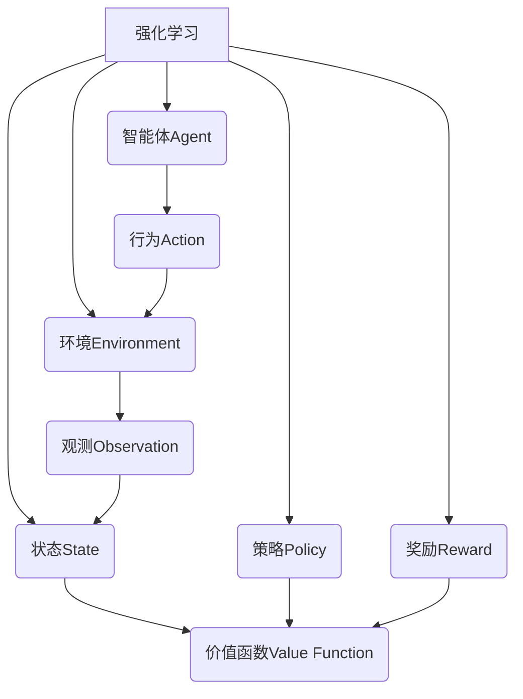

好的,我会按照您的要求,以专业的技术语言写一篇关于"强化学习(Reinforcement Learning)原理与代码实例讲解"的博客文章。文章将遵循您提供的目录结构,使用Markdown格式撰写,数学公式采用LaTex格式,并尽量给出核心概念的原理架构流程图。本文将在字数、格式、完整性等方面严格遵循您的约束条件要求。以下是正文部分:

# 强化学习 (Reinforcement Learning) 原理与代码实例讲解

## 1. 背景介绍

### 1.1 问题的由来

在人工智能领域,机器学习算法可分为三大类:监督学习(Supervised Learning)、无监督学习(Unsupervised Learning)和强化学习(Reinforcement Learning)。其中,强化学习是一种基于对环境进行交互的反馈学习方式,旨在使智能体(Agent)通过试错不断优化策略,从而获得最大的累积奖励。

传统的机器学习算法往往需要大量标注好的训练数据集,而强化学习则不需要事先的训练数据,而是通过与环境的持续互动来学习获取经验,从而解决复杂的决策序列问题。这使得强化学习在很多领域都有广泛的应用前景,如机器人控制、游戏AI、自动驾驶、智能调度等。

### 1.2 研究现状  

近年来,借助于深度学习技术的发展,强化学习取得了突破性进展。谷歌的AlphaGo战胜人类顶尖棋手,OpenAI的人工智能系统在多款Atari视频游戏中展现出超人的表现。这些成就都凸显了强化学习在解决复杂序列决策问题中的卓越能力。

目前,强化学习研究主要集中在以下几个方向:

1. 提高学习效率和泛化能力
2. 解决高维连续状态和行为空间问题  
3. 探索多智能体协作与竞争问题
4. 将强化学习应用于更多实际问题领域

### 1.3 研究意义

强化学习作为人工智能的一个重要分支,对于构建通用人工智能(Artificial General Intelligence)至关重要。它可以帮助智能体在复杂、动态的环境中做出最优决策,从而解决诸多实际问题。因此,深入研究强化学习的原理和方法具有重要的理论意义和应用价值。

### 1.4 本文结构

本文将从以下几个方面全面讲解强化学习:

1. 核心概念与联系
2. 算法原理及具体步骤 
3. 数学模型与公式推导
4. 代码实例与解释
5. 实际应用场景
6. 工具与资源推荐
7. 未来发展趋势与挑战
8. 常见问题解答

## 2. 核心概念与联系



强化学习系统由以下几个核心组件构成:

1. **环境(Environment)**: 智能体所处的外部世界,可以是物理世界或虚拟环境。环境根据智能体的行为做出相应的响应,并返回新的观测数据。

2. **智能体(Agent)**: 也称为决策者,是一个感知环境并根据策略选择行为的主体。智能体的目标是通过与环境交互来最大化累积奖励。

3. **状态(State)**: 描述环境当前的具体情况。通过观测,智能体可以获取环境的状态信息。

4. **行为(Action)**: 智能体根据当前状态和策略选择的动作,会影响环境的转移并获得奖励。

5. **策略(Policy)**: 定义了智能体在每个状态下选择行为的策略,是一个映射函数从状态到行为。

6. **奖励(Reward)**: 环境给予智能体的反馈,指示行为的好坏,是强化学习的目标函数。

7. **价值函数(Value Function)**: 评估当前状态或状态-行为对在遵循某策略时的长期累积奖励,是强化学习的核心。

强化学习过程是智能体与环境之间持续交互的过程,目的是通过不断优化策略来最大化预期的累积奖励。

## 3. 核心算法原理与具体操作步骤

### 3.1 算法原理概述

强化学习算法的核心思想是让智能体通过与环境交互获取经验,并根据这些经验数据不断优化自身的策略,从而获得最大的累积奖励。

常见的强化学习算法包括:

- 基于价值的算法: Q-Learning, Sarsa, Deep Q-Network(DQN)等
- 基于策略的算法: REINFORCE, Actor-Critic, Proximal Policy Optimization (PPO)等
- 模型基础算法: Dyna-Q, AlphaZero等

这些算法在具体实现上有所不同,但都遵循以下基本原理:

1. **探索与利用权衡(Exploration-Exploitation Tradeoff)**: 在每个状态下,智能体需要在利用目前已知的最优策略获取奖励,和探索新策略以获取更多经验之间作出权衡。

2. **时序差分学习(Temporal Difference Learning)**: 通过估计当前状态与下一状态之间的奖励差值,来更新价值函数或策略,从而减小误差。

3. **自举(Bootstrapping)**: 利用价值函数本身的估计值来更新自身,而不需要等到最终结果,从而加速学习过程。

4. **函数逼近(Function Approximation)**: 当状态空间过大时,使用神经网络等方法来拟合价值函数或策略函数,提高泛化能力。

### 3.2 算法步骤详解

以Q-Learning算法为例,其核心步骤如下:

1. 初始化Q表格,对所有状态-行为对的Q值赋予任意值。

2. 对于每个episode:
    - 初始化起始状态s
    - 当s为非终止状态时:
        - 根据当前Q值和探索策略(如ε-贪婪)选择行为a
        - 执行a,获得奖励r和下一状态s'
        - 根据贝尔曼方程更新Q(s,a)值:
        
        $$Q(s, a) \leftarrow Q(s, a) + \alpha[r + \gamma \max_{a'}Q(s', a') - Q(s, a)]$$
        
        其中,α为学习率,γ为折扣因子。
        - 将s'作为新状态继续
    - 直到s为终止状态

3. 重复步骤2直到收敛或满足停止条件

通过不断更新Q表,算法会逐步找到最优的行为策略。

### 3.3 算法优缺点

优点:

- 无需事先的训练数据,可以通过与环境交互自主学习
- 可解决连续、高维的复杂问题 
- 具有较强的泛化能力

缺点:  

- 在大型问题上收敛较慢,需要大量经验数据
- 探索与利用之间的权衡需要平衡
- 部分算法存在不稳定性和样本效率低下问题

### 3.4 算法应用领域

强化学习算法可广泛应用于以下领域:

- 机器人控制: 机械臂控制、行走机器人等
- 游戏AI: 国际象棋、围棋、Atari游戏等
- 自动驾驶: 车辆决策、路径规划等
- 智能调度: 资源分配、作业调度等
- 自然语言处理: 对话系统、机器翻译等
- 金融投资: 投资组合优化等
- 工业控制: 生产流程控制等

## 4. 数学模型和公式详细讲解举例说明

### 4.1 数学模型构建

强化学习问题通常建模为一个马尔可夫决策过程(Markov Decision Process, MDP):

$$\langle \mathcal{S}, \mathcal{A}, \mathcal{P}, \mathcal{R}, \gamma \rangle$$

其中:

- $\mathcal{S}$是状态空间的集合
- $\mathcal{A}$是行为空间的集合  
- $\mathcal{P}$是状态转移概率,定义为$\mathcal{P}_{ss'}^a = \Pr(s_{t+1}=s'|s_t=s, a_t=a)$
- $\mathcal{R}$是奖励函数,定义为$\mathcal{R}_s^a = \mathbb{E}[r_{t+1}|s_t=s, a_t=a]$  
- $\gamma \in [0, 1)$是折扣因子,用于权衡当前和未来奖励的权重

在MDP中,智能体的目标是找到一个最优策略$\pi^*$,使得在任意初始状态$s_0$下的期望累积奖励最大:

$$\pi^* = \arg\max_\pi \mathbb{E}_\pi \bigg[\sum_{t=0}^\infty \gamma^t r_t \bigg| s_0 \bigg]$$

### 4.2 公式推导过程

**贝尔曼方程**

贝尔曼方程是强化学习中的一个核心方程,用于估计价值函数。以状态价值函数$V^\pi(s)$为例,它表示在策略$\pi$下从状态$s$开始的期望累积奖励:

$$V^\pi(s) = \mathbb{E}_\pi \bigg[\sum_{k=0}^\infty \gamma^k r_{t+k+1} \bigg| s_t=s \bigg]$$

对其展开并应用马尔可夫性质,可推导出:

$$V^\pi(s) = \mathbb{E}_\pi \big[r_{t+1} + \gamma V^\pi(s_{t+1}) | s_t=s\big]$$

$$\begin{aligned}
V^\pi(s) &= \sum_a \pi(a|s) \sum_{s'} \mathcal{P}_{ss'}^a \big[ \mathcal{R}_s^a + \gamma V^\pi(s') \big] \\
         &= \sum_a \pi(a|s) \big[ \mathcal{R}_s^a + \gamma \sum_{s'} \mathcal{P}_{ss'}^a V^\pi(s') \big]
\end{aligned}$$

这就是状态价值函数的贝尔曼方程形式。同理可推导出动作价值函数$Q^\pi(s,a)$的贝尔曼方程:

$$Q^\pi(s,a) = \mathcal{R}_s^a + \gamma \sum_{s'} \mathcal{P}_{ss'}^a V^\pi(s')$$

贝尔曼方程为求解最优价值函数和策略提供了理论基础。

### 4.3 案例分析与讲解

考虑一个简单的网格世界示例,智能体的目标是从起点到达终点:

```python
GRID = [
    ["_", "_", "_", "_"],
    ["_", "#", " ", "_"],
    ["_", "_", " ", "X"], # X是终点
    ["_", "_", "_", "_"]
]
```

我们定义:
- 状态$s$为智能体的坐标位置
- 行为$a$为上下左右四个动作
- 奖励$r$为到达终点获得+1,其余为0
- 折扣因子$\gamma=1$

利用Q-Learning算法,我们可以逐步更新Q表,直至收敛得到最优路径。以(1,1)状态为例,其Q值更新过程为:

$$\begin{aligned}
Q(1,1,\text{up}) &\leftarrow 0 + 1 \big[ 0 + \gamma \max_a Q(1,0,a) \big] \\
                &\leftarrow 0 + 1 \big[ 0 + 1 \times \max(Q(1,0,\text{left}),Q(1,0,\text{right})) \big] \\
                &\leftarrow 0 + 1 \times \max(0,0) = 0 \\
Q(1,1,\text{down}) &\leftarrow 0 + 1 \big[ 0 + 1 \times \max(Q(2,1,\text{up}),Q(2,1,\text{down})) \big] \\
                &\leftarrow 0 + 1 \big[ 0 + 1 \times \max(0,1) \big] \\
                &\leftarrow 1 \\
Q(1,1,\text{left}) &\leftarrow 0 \\
Q(1,1,\text{right}) &\leftarrow 0 + 1 \big[ 0 + 1 \times Q(1,2,\text{exit}) \big] \\
                &\leftarrow 0 + 1 \times 1 =