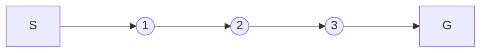

# 强化学习(Reinforcement Learning) - 原理与代码实例讲解

关键词：强化学习、马尔可夫决策过程、Q-Learning、深度强化学习、OpenAI Gym

## 1. 背景介绍
### 1.1 问题的由来
在人工智能领域,我们希望开发出能够自主学习和决策的智能体。传统的监督学习和非监督学习方法在许多场景下难以实现所需的自主性。强化学习作为一种全新的机器学习范式,为解决这一问题提供了崭新的思路和方法。
### 1.2 研究现状
近年来,强化学习取得了长足的进步。从AlphaGo战胜人类围棋冠军,到OpenAI Five击败Dota 2职业玩家,再到DeepMind的AlphaFold在蛋白质结构预测上的突破,强化学习展现出了惊人的潜力。越来越多研究者投身于这一领域,推动了理论和应用的飞速发展。
### 1.3 研究意义 
通过研究强化学习,我们可以让机器掌握自主学习的能力,使其能够在复杂多变的环境中做出最优决策。这不仅有助于构建更加智能的系统,也为认知科学和神经科学等领域的研究提供了新的视角。同时,强化学习在自动驾驶、智能控制、金融投资等诸多领域都有广阔的应用前景。
### 1.4 本文结构
本文将首先介绍强化学习的核心概念,并阐述其与其他学习范式的联系。然后,我们将重点讲解几种经典的强化学习算法,分析其数学原理并给出详细的推导过程。接着,通过Python代码实例,演示如何利用OpenAI Gym环境构建强化学习项目。最后,我们总结强化学习的研究现状,展望其未来发展趋势和面临的挑战。

## 2. 核心概念与联系
强化学习的核心思想是:智能体(Agent)通过与环境(Environment)的交互,学习最优策略(Policy)以获得最大累积奖励(Reward)。这一过程可以用马尔可夫决策过程(Markov Decision Process, MDP)来描述:
- 状态(State): 环境的当前状况
- 动作(Action): 智能体可执行的行为
- 转移概率(Transition Probability): 在某状态下执行某动作后,环境转移到下一状态的概率
- 奖励函数(Reward Function): 智能体执行动作后,环境给出的即时反馈
- 折扣因子(Discount Factor): 平衡即时奖励和长期奖励的权重

相比监督学习和非监督学习,强化学习的特点在于:
- 没有预先给定的标签数据,智能体需要通过探索(Exploration)来发现最优行为
- 奖励信号往往是稀疏和延迟的,很难直接指导学习过程
- 决策依赖于状态,需要考虑长期累积奖励而非即时奖励

因此,强化学习本质上是一个序列决策问题。智能体的目标是学习一个最优策略 $\pi^*$,使得在策略 $\pi$ 下的期望累积奖励 $J(\pi)$ 最大化:

$$
\pi^* = \arg\max_{\pi} J(\pi) = \mathbb{E}[\sum_{t=0}^{\infty} \gamma^t r_t | \pi] 
$$

其中, $r_t$ 表示在时刻 $t$ 获得的即时奖励, $\gamma \in [0,1]$ 为折扣因子。

## 3. 核心算法原理 & 具体操作步骤
### 3.1 算法原理概述
强化学习有多种算法,主要分为基于价值(Value-based)、基于策略(Policy-based)和基于模型(Model-based)三大类。下面我们重点介绍几种经典算法:
- Q-Learning: 一种无模型、异策略的时序差分学习算法,通过迭代更新动作-价值函数(Q函数)来逼近最优策略
- SARSA: 一种无模型、同策略的时序差分学习算法,与Q-Learning类似但使用当前策略进行探索
- Policy Gradient: 一种基于策略的算法,直接对策略函数的参数进行梯度上升,找到最优策略
- Actor-Critic: 一种结合价值和策略的算法,用Actor学习策略,用Critic估计价值函数,两者互相促进
- AlphaGo: DeepMind开发的围棋AI,融合了深度学习、蒙特卡洛树搜索、强化学习等多种技术
### 3.2 算法步骤详解
以Q-Learning为例,其核心是通过不断更新Q函数来逼近最优动作-价值函数 $Q^*(s,a)$。Q函数定义为在状态 $s$ 下选择动作 $a$ 能获得的期望累积奖励:

$$
Q^\pi(s,a) = \mathbb{E}[\sum_{k=0}^{\infty} \gamma^k r_{t+k} | S_t=s, A_t=a, \pi]
$$

最优Q函数满足贝尔曼最优方程(Bellman Optimality Equation):

$$
Q^*(s,a) = \mathbb{E}[r + \gamma \max_{a'} Q^*(s',a') | s, a]
$$

Q-Learning的更新公式为:

$$
Q(s,a) \leftarrow Q(s,a) + \alpha [r + \gamma \max_{a'} Q(s',a') - Q(s,a)]
$$

其中, $\alpha \in (0,1]$ 为学习率。算法的具体步骤如下:
1. 初始化Q函数(通常为全0)
2. 重复下述步骤直到收敛:
   1. 根据 $\epsilon$-贪婪策略选择动作 $a$,即以 $\epsilon$ 的概率随机探索,否则选择Q值最大的动作
   2. 执行动作 $a$,观察奖励 $r$ 和下一状态 $s'$
   3. 根据上述更新公式更新 $Q(s,a)$
   4. $s \leftarrow s'$
3. 输出最优策略 $\pi^*(s) = \arg\max_{a} Q(s,a)$
### 3.3 算法优缺点
Q-Learning的优点在于:
- 简单易实现,适用于离散状态和动作空间
- 收敛性有理论保证,只需访问每个状态-动作对无穷多次
- 可在不了解环境动力学的情况下学习最优策略

但它也存在一些局限:
- 难以处理连续状态和动作空间
- 容易受到状态维度灾难(Curse of Dimensionality)的影响
- 探索-利用困境(Exploration-Exploitation Dilemma)难以平衡
### 3.4 算法应用领域
Q-Learning在众多领域得到了广泛应用,例如:
- 智能体寻路问题,如迷宫寻宝、机器人路径规划等
- 博弈问题,如井字棋、四子棋等
- 资源管理问题,如电梯调度、缓存替换等
- 推荐系统,如电商推荐、广告投放等

此外,将Q-Learning与深度学习结合,就得到了深度Q网络(Deep Q-Network, DQN),进一步拓展了其应用范围,如Atari视频游戏、围棋等。

## 4. 数学模型和公式 & 详细讲解 & 举例说明
### 4.1 数学模型构建
马尔可夫决策过程为强化学习提供了理论基础。一个MDP由五元组 $\mathcal{M} = \langle \mathcal{S}, \mathcal{A}, \mathcal{P}, \mathcal{R}, \gamma \rangle$ 定义:
- 状态空间 $\mathcal{S}$: 有限或无限集合,表示环境可能处于的所有状态
- 动作空间 $\mathcal{A}$: 有限或无限集合,表示智能体在每个状态下可采取的所有动作
- 转移概率 $\mathcal{P}$: $\mathcal{S} \times \mathcal{A} \times \mathcal{S} \to [0,1]$,表示在状态 $s$ 下执行动作 $a$ 后转移到状态 $s'$ 的概率,即 $\mathcal{P}_{ss'}^a = P(S_{t+1}=s'|S_t=s, A_t=a)$
- 奖励函数 $\mathcal{R}$: $\mathcal{S} \times \mathcal{A} \to \mathbb{R}$,表示在状态 $s$ 下执行动作 $a$ 后获得的即时奖励的期望,即 $\mathcal{R}_s^a = \mathbb{E}[R_{t+1}|S_t=s, A_t=a]$
- 折扣因子 $\gamma \in [0,1]$: 平衡即时奖励和未来奖励的相对重要性

MDP满足马尔可夫性质,即下一状态只取决于当前状态和动作,与之前的历史无关:

$$
P(S_{t+1}|S_t, A_t, S_{t-1}, A_{t-1}, \ldots, S_0, A_0) = P(S_{t+1}|S_t, A_t)
$$

在MDP中,策略 $\pi$ 定义为在每个状态下选择动作的概率分布,即 $\pi(a|s) = P(A_t=a|S_t=s)$。我们的目标是寻找最优策略 $\pi^*$ 以最大化期望累积奖励。
### 4.2 公式推导过程
为了推导Q-Learning的更新公式,我们首先定义价值函数:
- 状态价值函数 $V^\pi(s)$: 在状态 $s$ 下遵循策略 $\pi$ 的期望累积奖励

$$
V^\pi(s) = \mathbb{E}[\sum_{k=0}^{\infty} \gamma^k R_{t+k+1} | S_t=s, \pi]
$$

- 动作-价值函数 $Q^\pi(s,a)$: 在状态 $s$ 下选择动作 $a$,然后遵循策略 $\pi$ 的期望累积奖励

$$
Q^\pi(s,a) = \mathbb{E}[\sum_{k=0}^{\infty} \gamma^k R_{t+k+1} | S_t=s, A_t=a, \pi]
$$

两者满足如下关系:

$$
V^\pi(s) = \sum_{a \in \mathcal{A}} \pi(a|s) Q^\pi(s,a)
$$

$$
Q^\pi(s,a) = \mathcal{R}_s^a + \gamma \sum_{s' \in \mathcal{S}} \mathcal{P}_{ss'}^a V^\pi(s')
$$

根据贝尔曼最优方程,最优价值函数满足:

$$
V^*(s) = \max_{a \in \mathcal{A}} Q^*(s,a)
$$

$$
Q^*(s,a) = \mathcal{R}_s^a + \gamma \sum_{s' \in \mathcal{S}} \mathcal{P}_{ss'}^a V^*(s')
$$

将两式合并可得:

$$
Q^*(s,a) = \mathcal{R}_s^a + \gamma \sum_{s' \in \mathcal{S}} \mathcal{P}_{ss'}^a \max_{a'} Q^*(s',a')
$$

这就是Q-Learning试图逼近的目标。根据随机梯度下降法,每次更新Q函数:

$$
Q(s,a) \leftarrow Q(s,a) + \alpha [r + \gamma \max_{a'} Q(s',a') - Q(s,a)]
$$

其中 $r$ 是从 $\mathcal{R}_s^a$ 中采样得到的即时奖励。重复以上更新,Q函数最终会收敛到 $Q^*$。
### 4.3 案例分析与讲解
考虑一个简单的网格世界环境,如下图所示:

智能体的目标是从起点S出发,尽快到达终点G。每一步的即时奖励为-1,到达终点后奖励为0。

我们用Q-Learning来学习最优策略。状态空间为 $\mathcal{S}=\{1,2,3\}$,动作空间为 $\mathcal{A}=\{left, right\}$。令折扣因子 $\gamma=1$,学习率 $\alpha=0.5$。

初始化Q函数为全0:

|   | Left | Right |
|:-:|:----:|:-----:|
| 1 |  0   |   0   |
| 2 |  0   |   0   |
| 3 |  0   |   0   |

假设第一轮智能体执行动作序列 $\{right, right, right\}$,得到轨迹:

$$
1 \stackrel{right}