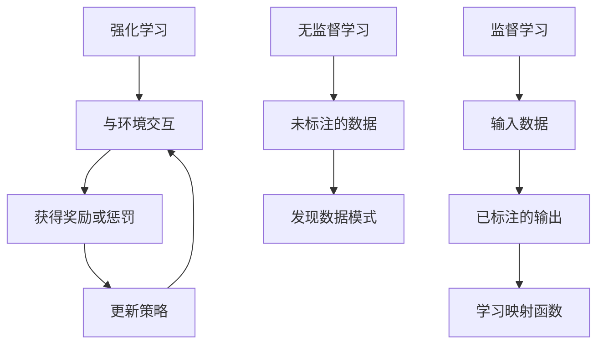

以下是对《强化学习：在电子游戏中的应用》这一主题的深入探讨和分析：

# 强化学习：在电子游戏中的应用

## 1. 背景介绍

### 1.1 问题的由来

游戏一直是人工智能研究的热门领域之一。早在20世纪60年代,就有研究人员尝试开发能够下国际象棋的计算机程序。随着计算能力和算法的不断进步,人工智能在游戏方面取得了长足的进展,但大多数传统方法依赖于预先定义的规则和评估函数,难以应对复杂动态环境。

强化学习(Reinforcement Learning)作为机器学习的一个重要分支,为解决此类问题提供了新的思路。它通过与环境的互动来学习,无需事先的规则知识,使智能体能够自主获取经验并优化决策,从而在复杂的决策过程中作出明智的选择。

### 1.2 研究现状  

近年来,强化学习在电子游戏领域取得了令人瞩目的成就。2013年,DeepMind的研究人员使用深度强化学习算法让智能体学会了玩经典游戏"Atari 2600"。2016年,AlphaGo战胜了世界顶尖的围棋职业选手,震惊了全球。2019年,OpenAI的人工智能系统在对抗性游戏《Dota 2》中战胜了世界冠军战队,展现了强化学习在复杂环境中的卓越表现。

### 1.3 研究意义

将强化学习应用于电子游戏不仅可以推动游戏人工智能的发展,还能为解决现实世界中的复杂决策问题提供借鉴。游戏环境通常具有高度动态性、不确定性和对抗性,与现实世界中的决策场景有着内在的相似性。因此,在游戏环境中训练出的强化学习智能体,其决策能力和策略也可能对其他领域产生启发和指导作用。

### 1.4 本文结构

本文将首先介绍强化学习的核心概念,阐述其与监督学习和无监督学习的区别。然后详细解释强化学习在电子游戏中的应用,包括算法原理、数学模型、代码实现等多个方面。最后,探讨强化学习在游戏领域的实际应用场景,并对其未来发展趋势和面临的挑战进行展望。

## 2. 核心概念与联系

强化学习是一种基于奖赏或惩罚的学习方式,它模拟了人类和动物通过试错和奖惩来学习的过程。与监督学习和无监督学习不同,强化学习没有明确的输入输出对,而是通过与环境的交互来学习。

在强化学习中,智能体(Agent)与环境(Environment)进行交互,根据当前状态(State)选择一个动作(Action),然后环境会根据这个动作转移到下一个状态,并给出相应的奖励或惩罚(Reward)。智能体的目标是通过不断尝试,学习一个最优策略(Policy),使得在给定状态下选择的动作序列能够最大化预期的累积奖励。

强化学习的核心要素包括:

- 状态(State):描述当前环境的状况
- 动作(Action):智能体可以采取的行为
- 奖励(Reward):对智能体行为的反馈,用于指导学习
- 策略(Policy):智能体根据状态选择动作的策略
- 值函数(Value Function):评估当前状态或状态-动作对的预期回报

强化学习算法通常分为基于价值迭代(Value Iteration)和基于策略迭代(Policy Iteration)两大类,前者先求解最优值函数,再导出最优策略;后者直接对策略进行优化。常见的算法有Q-Learning、Sarsa、Policy Gradient等。

## 3. 核心算法原理 & 具体操作步骤

### 3.1 算法原理概述

强化学习算法的核心思想是通过与环境的交互,不断尝试不同的行为策略,根据获得的奖励信号来更新策略,使其趋向于最优。其中,Q-Learning算法是最典型和最广泛使用的算法之一。

Q-Learning算法的主要思路是:

1. 初始化Q表(Q-table),用于存储每个状态-动作对的Q值(预期回报)
2. 对于每个时间步:
    - 根据当前状态,选择一个动作(基于探索-利用权衡)
    - 执行该动作,获得奖励和新的状态
    - 更新Q表中相应的Q值
3. 重复上述过程,直到Q值收敛

Q值的更新公式为:

$$Q(s_t, a_t) \leftarrow Q(s_t, a_t) + \alpha \big[r_t + \gamma \max_a Q(s_{t+1}, a) - Q(s_t, a_t)\big]$$

其中:
- $\alpha$是学习率,控制新信息对Q值的影响程度
- $\gamma$是折现因子,表示对未来奖励的衰减程度
- $r_t$是执行动作$a_t$后获得的即时奖励
- $\max_a Q(s_{t+1}, a)$是在新状态下可获得的最大预期回报

通过不断更新Q值,算法最终会收敛到一个最优的Q函数,从而得到最优策略。

### 3.2 算法步骤详解

1. **初始化**
    - 创建一个Q表,其中的每个元素$Q(s, a)$初始化为0或一个较小的常数值
    - 设置学习率$\alpha$和折现因子$\gamma$的值,通常$\alpha$在0.1~0.5之间,$\gamma$在0.9~0.99之间

2. **选择动作**
    - 对于当前状态$s_t$,根据$\epsilon$-贪婪策略选择动作$a_t$
    - 以概率$\epsilon$随机选择一个动作(探索),否则选择当前状态下Q值最大的动作(利用)

3. **执行动作并获取反馈**
    - 执行选择的动作$a_t$,观察环境的反馈
    - 获得立即奖励$r_t$和新的状态$s_{t+1}$

4. **更新Q值**
    - 根据下式更新Q表中$(s_t, a_t)$对应的Q值:
    $$Q(s_t, a_t) \leftarrow Q(s_t, a_t) + \alpha \big[r_t + \gamma \max_a Q(s_{t+1}, a) - Q(s_t, a_t)\big]$$

5. **重复步骤2~4**
    - 将$s_{t+1}$设为新的当前状态$s_t$
    - 重复选择动作、执行动作、获取反馈和更新Q值的过程,直到达到终止条件(如最大回合数或达到目标状态)

6. **确定最优策略**
    - 对于每个状态$s$,选择Q值最大的动作作为最优策略:
    $$\pi^*(s) = \arg\max_a Q(s, a)$$

在实际应用中,可以根据具体问题对算法进行适当的改进和优化,如引入神经网络来近似Q函数(Deep Q-Network),或使用策略梯度算法直接优化策略等。

### 3.3 算法优缺点

**优点:**

- 无需事先的规则知识,可以通过与环境交互自主学习
- 具有较强的通用性,可应用于多种不同类型的问题
- 理论上能够找到最优策略,在有限的马尔可夫决策过程中收敛性可被证明
- 算法相对简单,易于理解和实现

**缺点:**

- 在高维状态空间和动作空间中,Q表会变得非常庞大,存储和计算代价很高(维数灾难)
- 算法收敛速度较慢,需要大量的训练时间和样本数据
- 存在探索与利用之间的权衡,需要合理设置探索策略
- 无法直接应用于连续状态和动作空间的问题

### 3.4 算法应用领域

强化学习算法在诸多领域都有广泛的应用,包括但不限于:

- 游戏AI:训练智能体玩各种电子游戏、棋类游戏等
- 机器人控制:训练机器人完成各种运动控制任务
- 自动驾驶:训练智能体进行车辆导航和决策
- 智能系统优化:优化数据中心冷却系统、交通信号控制等
- 金融投资:进行自动化交易策略优化
- 自然语言处理:对话系统策略学习、机器翻译等
- 计算机系统:作业调度、网络路由等

总的来说,强化学习擅长解决序列决策问题,在存在延迟奖励的复杂环境中具有独特的优势。

## 4. 数学模型和公式 & 详细讲解 & 举例说明

### 4.1 数学模型构建

强化学习问题通常建模为一个马尔可夫决策过程(Markov Decision Process, MDP)。MDP是一个五元组$\langle\mathcal{S}, \mathcal{A}, \mathcal{P}, \mathcal{R}, \gamma\rangle$,其中:

- $\mathcal{S}$是有限的状态集合
- $\mathcal{A}$是有限的动作集合
- $\mathcal{P}$是状态转移概率函数,定义为$\mathcal{P}_{ss'}^a = \Pr(s_{t+1}=s'|s_t=s, a_t=a)$
- $\mathcal{R}$是奖励函数,定义为$\mathcal{R}_s^a = \mathbb{E}[r_{t+1}|s_t=s, a_t=a]$
- $\gamma \in [0, 1)$是折现因子,用于权衡即时奖励和长期回报

在MDP中,智能体的目标是学习一个最优策略$\pi^*$,使得在任意初始状态$s_0$下,按照该策略选择动作序列$\{a_t\}$所获得的期望累积折现奖励最大化:

$$\pi^* = \arg\max_\pi \mathbb{E}_\pi\Big[\sum_{t=0}^\infty \gamma^t r_{t+1} \Big| s_0\Big]$$

为了求解最优策略,我们可以定义状态值函数$V^\pi(s)$和状态-动作值函数$Q^\pi(s, a)$:

$$V^\pi(s) = \mathbb{E}_\pi\Big[\sum_{t=0}^\infty \gamma^t r_{t+1} \Big| s_0=s\Big]$$

$$Q^\pi(s, a) = \mathbb{E}_\pi\Big[\sum_{t=0}^\infty \gamma^t r_{t+1} \Big| s_0=s, a_0=a\Big]$$

这两个函数分别表示在策略$\pi$下,从状态$s$开始,或从状态$s$执行动作$a$开始,之后遵循$\pi$所能获得的期望累积折现奖励。

最优状态值函数$V^*(s)$和最优状态-动作值函数$Q^*(s, a)$可以通过下式递推计算:

$$V^*(s) = \max_a Q^*(s, a)$$

$$Q^*(s, a) = \mathcal{R}_s^a + \gamma \sum_{s'\in\mathcal{S}} \mathcal{P}_{ss'}^a V^*(s')$$

一旦求得$Q^*$函数,最优策略$\pi^*$就可以通过在每个状态$s$选择使$Q^*(s, a)$最大的动作$a$来获得:

$$\pi^*(s) = \arg\max_a Q^*(s, a)$$

基于这一理论框架,我们可以设计出各种强化学习算法来近似求解最优值函数和策略。

### 4.2 公式推导过程

我们来推导一下Q-Learning算法中Q值更新公式的由来。

假设在时间步$t$,智能体处于状态$s_t$,执行动作$a_t$,获得即时奖励$r_t$,并转移到新状态$s_{t+1}$。根据贝尔曼最优性方程:

$$Q^*(s_t, a_t) = r_t + \gamma \max_{a'} Q^*(s_{t+1}, a')$$

其中,$\max