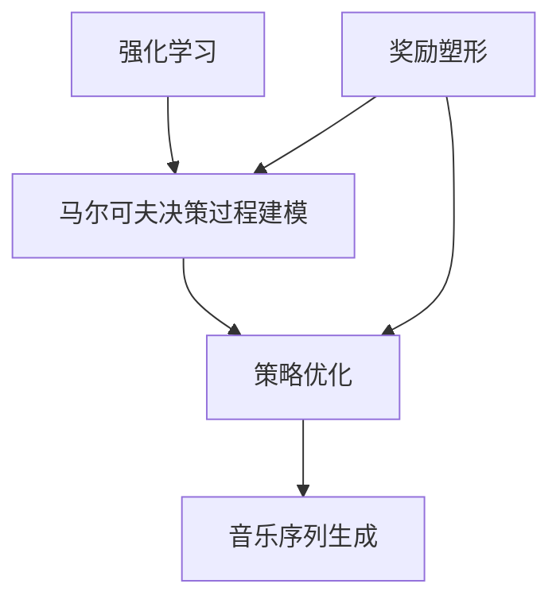

# 强化学习：在音乐生成中的应用

## 1. 背景介绍

### 1.1 问题的由来

音乐一直是人类文化和艺术表达的重要形式之一。随着人工智能技术的不断发展,人们开始尝试利用计算机系统来生成音乐作品。传统的音乐生成方法主要依赖于人工编码的规则和算法,但这些方法往往缺乏创造力和多样性。强化学习作为一种有前景的机器学习方法,近年来在音乐生成领域引起了广泛关注。

### 1.2 研究现状  

目前,已有多项研究探索了将强化学习应用于音乐生成的可能性。例如,有研究人员尝试使用强化学习训练智能体生成符合某些音乐规则和风格的旋律。另一些研究则侧重于利用强化学习优化音乐的和声、节奏等方面。然而,由于音乐生成是一个极具挑战的问题,现有的方法还存在一些局限性,如生成的音乐缺乏长期结构和连贯性、难以捕捉人类音乐的丰富情感等。

### 1.3 研究意义

将强化学习应用于音乐生成具有重要的理论和实践意义。从理论层面上,它可以推动人工智能在艺术创作领域的发展,探索智能系统生成有意义和高质量作品的新方法。从实践角度来看,成功的音乐生成系统可以为作曲家提供灵感和辅助工具,促进音乐创作的效率和多样性。此外,这一领域的研究成果还可以在其他艺术形式的生成(如视觉艺术、文学等)中发挥作用。

### 1.4 本文结构

本文将全面介绍将强化学习应用于音乐生成的相关理论和实践。首先阐述强化学习在音乐生成中的核心概念和挑战。然后详细解释核心算法原理、数学模型及公式推导。接下来通过代码实例展示具体的项目实践。之后探讨强化学习音乐生成的实际应用场景。最后总结该领域的发展趋势和面临的挑战。

## 2. 核心概念与联系

在将强化学习应用于音乐生成之前,我们需要理解以下几个核心概念:

1. **强化学习(Reinforcement Learning)**: 强化学习是机器学习的一个重要分支,它关注于如何基于环境反馈来学习执行一系列行为的策略,以最大化预期的长期回报。在音乐生成中,智能体(如神经网络模型)需要学习生成令人满意的音乐序列,而环境则提供对生成音乐质量的反馈。

2. **马尔可夫决策过程(Markov Decision Process, MDP)**: 这是强化学习问题的数学形式化表示。一个MDP由状态集合、行为集合、状态转移概率和奖励函数组成。在音乐生成中,状态可以表示当前已生成的音乐片段,行为则对应于选择下一个音符或和弦,奖励函数用于评估生成音乐的质量。

3. **策略(Policy)和价值函数(Value Function)**: 策略定义了在给定状态下智能体应该采取的行为。价值函数则估计了遵循某一策略时,从特定状态开始能获得的预期长期回报。强化学习的目标是找到一个最优策略,使得价值函数最大化。

4. **序列生成(Sequence Generation)**: 音乐生成可以看作是一个序列生成问题,即根据已有的音乐片段,生成新的音符或和弦序列。这与自然语言处理中的文本生成问题有些类似,但音乐数据的结构和特征更加复杂。

5. **奖励塑形(Reward Shaping)**: 由于音乐质量的主观性,设计一个合理的奖励函数是音乐生成中的一大挑战。奖励塑形技术旨在通过人工干预或自动方法,构建出能够正确引导智能体行为的奖励信号。

这些概念之间存在紧密的联系。强化学习为音乐生成提供了一种全新的方法,将其建模为一个马尔可夫决策过程,并通过策略优化来生成高质量的音乐序列。同时,奖励塑形等技术有助于更好地量化音乐质量,指导强化学习过程。

## 3. 核心算法原理 & 具体操作步骤  

### 3.1 算法原理概述

将强化学习应用于音乐生成的核心思想是:将音乐生成建模为一个马尔可夫决策过程,并使用强化学习算法来学习一个最优策略,使得生成的音乐序列能最大化预期的长期奖励(即音乐质量)。

常见的强化学习算法包括Q-Learning、Sarsa、策略梯度等。其中,策略梯度算法直接对策略函数进行优化,因此在处理连续动作空间(如音乐生成)时更为合适。我们将重点介绍基于策略梯度的强化学习算法在音乐生成中的应用。

策略梯度算法的基本思路是:使用一个可微分的策略模型(通常是神经网络),根据累积奖励对该模型的参数进行调整,使得模型更倾向于生成高质量的音乐序列。具体来说,算法会沿着累积奖励的梯度方向,更新策略模型的参数。

### 3.2 算法步骤详解

1. **初始化**:初始化一个可微分的策略模型(如循环神经网络),该模型将输入当前的音乐片段,输出下一个音符或和弦的概率分布。
2. **采样行为**:根据策略模型的输出概率分布,采样选择下一个音符或和弦的行为。
3. **执行行为并获取奖励**:将选定的行为执行到环境中(即将新的音符或和弦添加到音乐序列),并根据奖励函数计算获得的即时奖励。
4. **累积奖励**:将当前获得的即时奖励累加到之前的奖励之上,得到累积奖励。
5. **更新策略模型**:计算累积奖励相对于策略模型参数的梯度,并沿着该梯度方向调整模型参数,使模型更倾向于生成获得高累积奖励的音乐序列。
6. **重复步骤2-5**:重复执行上述步骤,直到生成完整的音乐序列或达到预设的最大步数。

该算法的关键在于设计合理的奖励函数,以正确引导策略模型的优化方向。常见的奖励函数包括:基于音乐理论规则的奖励、基于人工评分的奖励、基于对抗生成网络的奖励等。

### 3.3 算法优缺点

**优点**:

1. 端到端学习:策略梯度算法能够直接从数据中学习生成音乐的策略,无需人工设计复杂的规则。
2. 连续控制:算法可以很好地处理连续的动作空间(如音符、和弦的选择),适合音乐生成这一连续控制问题。
3. 长期规划:通过累积奖励的方式,算法能够考虑到生成音乐序列的长期结构和连贯性。

**缺点**:

1. 样本效率低:强化学习算法通常需要大量的探索和试错,训练过程往往低效。
2. 奖励函数设计困难:合理设计奖励函数是一个巨大的挑战,需要很强的领域知识。
3. 收敛性问题:策略梯度算法可能会遇到收敛性问题,需要一些技巧(如基线减去、优势估计等)来提高稳定性。

### 3.4 算法应用领域

除了音乐生成之外,基于策略梯度的强化学习算法还可以应用于其他序列生成问题,如:

- 自然语言生成:生成具有语义连贯性的文本序列。
- 机器人控制:控制机器人执行一系列动作以完成特定任务。
- 策略优化:在复杂环境中寻找最优的决策序列。

## 4. 数学模型和公式 & 详细讲解 & 举例说明

### 4.1 数学模型构建

将音乐生成建模为一个马尔可夫决策过程(MDP),其中:

- 状态 $s_t$ 表示当前已生成的音乐片段
- 行为 $a_t$ 表示选择的下一个音符或和弦
- 状态转移概率 $P(s_{t+1}|s_t, a_t)$ 给定当前状态和行为,转移到下一状态的概率
- 奖励函数 $R(s_t, a_t)$ 评估在状态 $s_t$ 执行行为 $a_t$ 所获得的即时奖励

我们的目标是找到一个最优策略 $\pi^*(a_t|s_t)$,使得沿着该策略生成的音乐序列能最大化预期的长期回报:

$$J(\pi) = \mathbb{E}_\pi \left[ \sum_{t=0}^\infty \gamma^t R(s_t, a_t) \right]$$

其中 $\gamma \in [0, 1]$ 是折现因子,用于权衡即时奖励和长期奖励的重要性。

### 4.2 公式推导过程

根据策略梯度定理,我们可以直接对策略函数 $\pi_\theta(a_t|s_t)$ 的参数 $\theta$ 进行优化,使目标函数 $J(\pi_\theta)$ 最大化:

$$\nabla_\theta J(\pi_\theta) = \mathbb{E}_{\pi_\theta} \left[ \sum_{t=0}^\infty \nabla_\theta \log \pi_\theta(a_t|s_t) Q^{\pi_\theta}(s_t, a_t) \right]$$

其中 $Q^{\pi_\theta}(s_t, a_t)$ 是在策略 $\pi_\theta$ 下,从状态 $s_t$ 执行行为 $a_t$ 开始,能获得的预期长期回报。

为了估计 $Q^{\pi_\theta}(s_t, a_t)$,我们可以使用一个基线函数 $b(s_t)$,将其重写为:

$$Q^{\pi_\theta}(s_t, a_t) = r(s_t, a_t) + \gamma \mathbb{E}_{s_{t+1} \sim P} [V^{\pi_\theta}(s_{t+1})] - b(s_t)$$

其中 $V^{\pi_\theta}(s_t) = \mathbb{E}_{a_t \sim \pi_\theta} [Q^{\pi_\theta}(s_t, a_t)]$ 是状态值函数,表示在策略 $\pi_\theta$ 下从状态 $s_t$ 开始能获得的预期长期回报。

将上式代入策略梯度公式,我们得到:

$$\nabla_\theta J(\pi_\theta) = \mathbb{E}_{\pi_\theta} \left[ \sum_{t=0}^\infty \nabla_\theta \log \pi_\theta(a_t|s_t) \left( Q^{\pi_\theta}(s_t, a_t) - b(s_t) \right) \right]$$

这个公式给出了如何根据累积奖励 $Q^{\pi_\theta}(s_t, a_t) - b(s_t)$ 来更新策略参数 $\theta$ 的梯度方向。在实践中,我们可以使用一个神经网络来拟合状态值函数 $V^{\pi_\theta}(s_t)$,并将其作为基线函数 $b(s_t)$,从而减小梯度估计的方差。

### 4.3 案例分析与讲解

为了更好地理解上述数学模型和公式,我们将通过一个简单的例子进行说明。

假设我们正在生成一段简单的旋律序列,状态 $s_t$ 表示当前已生成的音符序列,行为 $a_t$ 表示选择下一个音符。我们定义奖励函数 $R(s_t, a_t)$ 为:如果新加入的音符 $a_t$ 与当前旋律 $s_t$ 协调,则奖励为 1,否则为 -1。

现在,我们已经生成了一个状态序列 $s_0, s_1, s_2, \dots, s_t$,并执行了对应的行为序列 $a_0, a_1