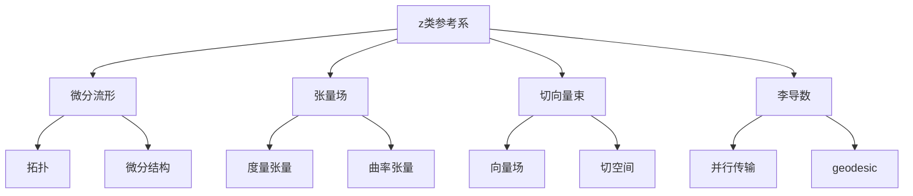

# 微分几何入门与广义相对论：z类参考系

## 1. 背景介绍

### 1.1 问题的由来

在广义相对论中，描述时空几何的一个关键概念是参考系。传统的参考系通常是基于笛卡尔坐标系或球坐标系等，但在处理一些复杂的时空几何问题时，这些参考系往往显得力不从心。因此，需要一种更加通用和灵活的参考系来描述时空几何,这就是z类参考系的由来。

### 1.2 研究现状

z类参考系是近年来在微分几何和广义相对论领域兴起的一种新型参考系。它由著名物理学家约翰·惠勒(John Archibald Wheeler)于1964年首次提出,旨在为时空几何提供一种更加一般化和抽象的描述方式。

目前,z类参考系在黑洞、宇宙学和量子引力等领域已经得到了广泛的应用和研究。许多著名的理论物理学家,如斯蒂芬·霍金(Stephen Hawking)、罗杰·彭罗斯(Roger Penrose)等,都在自己的研究中使用了z类参考系。

### 1.3 研究意义

z类参考系的引入为描述复杂的时空几何提供了一种新的视角和工具。它不仅在理论上拓展了微分几何和广义相对论的研究领域,而且在实际应用中也展现出了巨大的潜力。例如,在黑洞物理学中,z类参考系能够更好地描述黑洞附近的极端时空几何;在宇宙学中,它有助于研究宇宙的起源和演化;在量子引力领域,z类参考系为探索量子重力理论提供了新的数学框架。

### 1.4 本文结构

本文将从微分几何的角度出发,系统地介绍z类参考系的基本概念、数学原理和应用。文章将分为以下几个部分:

1. 背景介绍
2. 核心概念与联系
3. 核心算法原理与具体操作步骤
4. 数学模型和公式详细讲解与举例说明
5. 项目实践:代码实例和详细解释说明
6. 实际应用场景
7. 工具和资源推荐
8. 总结:未来发展趋势与挑战
9. 附录:常见问题与解答

## 2. 核心概念与联系

z类参考系是一种抽象的数学对象,它建立在微分流形、张量场、切向量束和李导数等微分几何概念之上。下面将详细介绍这些核心概念及其相互关系:

1. **微分流形(Differentiable Manifold)**: 微分流形是z类参考系的基础,它是一种拓扑空间,在局部上等同于欧几里得空间,并赋予了微分结构。微分流形为时空几何提供了一种连续的数学模型。

2. **张量场(Tensor Field)**: 张量场是定义在微分流形上的一种几何对象,它可以描述物理量的性质和变换规律。度量张量和曲率张量是两种重要的张量场,分别描述了时空的度规和曲率。

3. **切向量束(Tangent Vector Bundle)**: 切向量束是附着在微分流形上的一个向量丛,它由所有切向量组成。切向量表示微分流形上的切线方向,是描述运动和变化的基本工具。切向量束包含了向量场和切空间等重要概念。

4. **李导数(Lie Derivative)**: 李导数是一种在微分流形上定义的导数运算,它描述了张量场沿着向量场的变化率。李导数在研究时空几何的变换性质时扮演着关键角色,并与并行传输和geodesic等概念密切相关。

上述概念相互关联、相互渗透,共同构建了z类参考系的理论框架。微分流形提供了时空几何的基础模型;张量场描述了时空中的物理量;切向量束捕捉了时空的运动和变化;而李导数则揭示了时空几何在变换下的行为。z类参考系将这些概念有机地结合起来,为描述复杂的时空几何提供了一种强大的数学工具。

## 3. 核心算法原理与具体操作步骤

### 3.1 算法原理概述

z类参考系的核心算法原理是基于微分几何中的一些基本概念和运算,包括:

1. **微分流形的构造**: 首先需要构造一个适当的微分流形,作为描述时空几何的基础模型。这通常涉及到拓扑空间的选择、坐标系的引入以及微分结构的赋予。

2. **张量场的定义**: 在微分流形上定义适当的张量场,如度量张量和曲率张量,以描述时空的几何性质。这需要利用张量代数和微分形式的知识。

3. **切向量束的建立**: 构造切向量束,引入向量场和切空间等概念,用于描述时空中的运动和变化。

4. **李导数的计算**: 利用李导数,研究张量场沿着向量场的变化率,揭示时空几何在变换下的行为。

5. **并行传输和geodesic**: 通过并行传输和geodesic等概念,研究时空中的运动轨迹和粒子的运动规律。

6. **方程求解**: 根据具体的物理问题,建立相应的微分方程或张量方程,并求解这些方程以获得时空几何的具体描述。

这些步骤相互关联、环环相扣,构成了z类参考系算法的核心原理。通过这些步骤,我们可以利用微分几何的工具和方法,对复杂的时空几何进行精确的数学描述和分析。

### 3.2 算法步骤详解

下面将详细阐述z类参考系算法的具体操作步骤:

1. **选择适当的微分流形**

   首先需要选择一个适当的微分流形,作为描述时空几何的基础模型。常见的选择包括:

   - 欧几里得空间 $\mathbb{R}^n$
   - 球面 $\mathbb{S}^n$
   - 旋转曲面
   - 黎曼曲面

   选择微分流形时,需要考虑问题的具体背景和对称性,以确保流形具有足够的灵活性和适用性。

2. **引入坐标系和微分结构**

   在选定的微分流形上,引入适当的坐标系 $(x^1, x^2, \ldots, x^n)$,并赋予微分结构。通常可以利用切空间和切向量束来定义微分结构。

3. **定义张量场**

   在微分流形上定义描述时空几何性质的张量场,如度量张量 $g_{\mu\nu}$ 和曲率张量 $R_{\mu\nu\rho\sigma}$。这些张量场可以通过坐标基张量或基本张量场的线性组合来构造。

4. **计算李导数**

   利用李导数 $\mathcal{L}_X$,研究张量场沿着向量场 $X$ 的变化率。李导数的计算公式为:

   $$\mathcal{L}_X T^{\alpha_1\ldots\alpha_r}_{\beta_1\ldots\beta_s} = X^\mu \partial_\mu T^{\alpha_1\ldots\alpha_r}_{\beta_1\ldots\beta_s} + \sum_{i=1}^r T^{\alpha_1\ldots\alpha_{i-1}\mu\alpha_{i+1}\ldots\alpha_r}_{\beta_1\ldots\beta_s} \partial_\mu X^{\alpha_i} - \sum_{j=1}^s T^{\alpha_1\ldots\alpha_r}_{\beta_1\ldots\beta_{j-1}\mu\beta_{j+1}\ldots\beta_s} \partial_\mu X^{\beta_j}$$

   通过计算李导数,可以研究时空几何在变换下的行为,如切向量场和度量张量的变换性质。

5. **建立并行传输和geodesic**

   引入并行传输的概念,研究向量场沿曲线的平移规律。并行传输满足:

   $$\nabla_X Y^\mu = X^\nu \partial_\nu Y^\mu + \Gamma^\mu_{\nu\rho} X^\nu Y^\rho$$

   其中 $\Gamma^\mu_{\nu\rho}$ 是切向量束上的联络,描述了并行传输的规则。

   进一步定义geodesic,描述自由粒子在时空中的运动轨迹。geodesic满足方程:

   $$\frac{d^2x^\mu}{d\lambda^2} + \Gamma^\mu_{\nu\rho} \frac{dx^\nu}{d\lambda} \frac{dx^\rho}{d\lambda} = 0$$

   通过研究并行传输和geodesic,可以揭示时空几何对粒子运动的影响。

6. **建立微分方程或张量方程**

   根据具体的物理问题,建立描述时空几何的微分方程或张量方程,如爱因斯坦场方程:

   $$R_{\mu\nu} - \frac{1}{2}g_{\mu\nu}R = \frac{8\pi G}{c^4}T_{\mu\nu}$$

   这些方程将时空的几何性质与物质分布和能量动量张量 $T_{\mu\nu}$ 联系起来。

7. **求解方程**

   最后,利用数值分析、解析方法或近似理论等手段,求解建立的微分方程或张量方程,获得时空几何的具体描述。

通过上述步骤,我们可以利用z类参考系算法,将微分几何的理论和工具应用于广义相对论中,对复杂的时空几何进行精确的数学描述和分析。

### 3.3 算法优缺点

z类参考系算法具有以下优点:

1. **通用性强**: z类参考系算法建立在微分几何的基础之上,可以处理各种复杂的时空几何,不受特定坐标系或对称性的限制。

2. **描述精确**: 利用张量场、切向量束和李导数等概念,z类参考系算法能够精确地描述时空几何的各种性质,如曲率、并行传输和geodesic等。

3. **理论自洽**: z类参考系算法的各个步骤相互关联、环环相扣,构成了一个完整的理论框架,具有很强的内在逻辑一致性。

4. **应用广泛**: z类参考系算法不仅在广义相对论中有重要应用,在其他物理领域如量子场论、弦论等也有着广泛的应用前景。

然而,z类参考系算法也存在一些缺点和挑战:

1. **数学抽象**: z类参考系算法涉及到大量的抽象数学概念,如微分流形、张量场和李导数等,对于初学者来说,理解和掌握这些概念存在一定的挑战。

2. **计算复杂**: 在实际应用中,z类参考系算法往往需要进行大量的张量计算和微分方程求解,计算量可能会非常庞大,对计算资源的要求也相当高。

3. **理论局限**:尽管z类参考系算法提供了一种描述时空几何的强有力工具,但它仍然建立在广义相对论的基础之上,无法解决广义相对论理论本身的一些局限性和悖论。

4. **实验验证困难**: z类参考系算法所描述的时空几何往往存在于极端条件下,如黑洞附近或宇宙早期,因此很难通过直接的实验观测来验证理论的准确性。

总的来说,z类参考系算法是一种强大的数学工具,为描述和研究复杂的时空几何提供了新的视角和方法。但同时,它也面临着一些挑战和局限性,需要进一步的理论发展和实践应用来不断完善和拓展。

### 3.4 算法应用领域

z类参考系算法在广义相对论和相关领域有着广泛的应用,主要包括:

1. **黑洞物理学**

   在研究黑洞附近的极端时空几何时,z类参考系算法展现出了独特的优势。它能够精确描述黑洞事件视界附近的时空曲率,揭示黑洞的奇异性和热辐射等现象。著名的黑洞