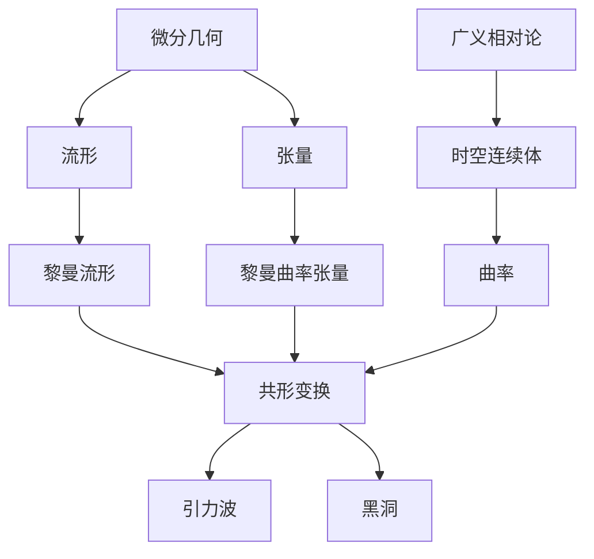

# 微分几何入门与广义相对论：共形变换

## 1. 背景介绍

### 1.1 问题的由来

在现代物理学和数学中,微分几何和广义相对论理论是两个密切相关的基础理论。微分几何为广义相对论提供了必要的数学工具,而广义相对论则是微分几何在物理世界中的具体应用。共形变换作为一种特殊的坐标变换,在这两个领域都扮演着重要的角色。

在广义相对论中,时空的本质是一种四维的时空连续体,其内部的物质分布决定了时空的曲率。而微分几何则为描述和研究这种时空曲率提供了强有力的数学工具。共形变换作为一种特殊的坐标变换,能够保持角度不变,因此在研究时空几何时具有独特的作用。

### 1.2 研究现状

目前,微分几何和广义相对论在理论物理和数学领域都有着广泛的应用。许多科学家和数学家都在努力探索这两个领域的更深层次联系,以期获得对宇宙本质的更深刻理解。

共形变换作为一种特殊的坐标变换,在这两个领域都有重要应用。在微分几何中,共形变换被用于研究流形的内在几何结构,特别是在研究黎曼流形时。而在广义相对论中,共形变换则被用于研究时空的性质,例如引力波的传播和黑洞的性质等。

### 1.3 研究意义

深入理解微分几何和广义相对论之间的联系,对于揭示宇宙本质和发展具有重要意义。通过共形变换这一特殊的坐标变换,我们可以更好地理解时空的本质,并探索引力和物质之间的相互作用。

此外,共形变换在数学和物理学的其他领域也有广泛应用,例如量子场论、弦论和共形场论等。因此,研究共形变换在微分几何和广义相对论中的作用,不仅有助于我们更好地理解这两个基础理论,也有助于推动相关领域的发展。

### 1.4 本文结构

本文将首先介绍微分几何和广义相对论的基本概念,以及共形变换在这两个领域中的作用。接下来,我们将详细探讨共形变换的数学原理和物理意义,包括它在描述时空曲率和引力波传播中的应用。

此外,本文还将介绍共形变换在其他相关领域的应用,例如量子场论和弦论等。最后,我们将总结共形变换在微分几何和广义相对论中的重要性,并展望其在未来研究中的发展方向。

## 2. 核心概念与联系

在深入探讨共形变换在微分几何和广义相对论中的作用之前,我们需要先了解一些核心概念和它们之间的联系。

### 2.1 微分几何

微分几何是研究流形及其内在几何结构的数学分支。流形是一种抽象的几何对象,可以看作是局部欧几里德空间的推广。在微分几何中,我们通常研究流形上的张量场、曲率等概念。

### 2.2 黎曼流形

黎曼流形是一种特殊的流形,在其上定义了一个内部乘积,即度量张量。这个度量张量决定了流形上的距离和角度。黎曼流形是广义相对论中时空连续体的数学表述。

### 2.3 共形变换

共形变换是一种特殊的坐标变换,它能够保持角度不变,但可以改变长度的比例尺度。在微分几何中,共形变换被用于研究流形的内在几何结构,特别是黎曼流形。

### 2.4 张量

张量是微分几何中的一个基本概念,它是一种多线性函数,可以描述流形上的各种几何对象,如向量场、度量张量等。张量在广义相对论中也扮演着重要角色,用于描述时空连续体的性质。

### 2.5 黎曼曲率张量

黎曼曲率张量是一种特殊的张量,它描述了黎曼流形的内在曲率。在广义相对论中,黎曼曲率张量描述了时空连续体的曲率,这种曲率由物质分布决定。

### 2.6 广义相对论

广义相对论是由爱因斯坦提出的一种描述引力的理论。在这个理论中,时空被看作是一种四维的时空连续体,其曲率由物质分布决定。引力就是这种时空曲率对物体运动的影响。

### 2.7 时空连续体

时空连续体是广义相对论中对时空的数学描述,它是一种四维的黎曼流形,具有一定的曲率。物质分布决定了这种曲率,而曲率又决定了物体在时空中的运动轨迹。

### 2.8 曲率

曲率是描述时空连续体弯曲程度的一个量,它由黎曼曲率张量表示。在广义相对论中,曲率由物质分布决定,反过来也影响着物质的运动。

### 2.9 引力波

引力波是广义相对论预言的一种现象,它是时空曲率的扰动在真空中以波的形式传播。引力波的存在和性质与时空连续体的曲率密切相关,因此共形变换在研究引力波时扮演着重要角色。

### 2.10 黑洞

黑洞是广义相对论中一种极端的时空曲率现象。在黑洞内部,时空曲率变得如此强烈,以至于任何物质和辐射都无法逃逸。共形变换可以用于研究黑洞的性质,例如它们的视界半径和奇异性等。

通过上述概念,我们可以看到微分几何和广义相对论之间存在着密切的联系。微分几何为广义相对论提供了描述时空连续体的数学工具,而广义相对论则是微分几何在物理世界中的具体应用。共形变换作为一种特殊的坐标变换,在这两个领域都扮演着重要的角色。

## 3. 核心算法原理与具体操作步骤

### 3.1 算法原理概述

共形变换是一种特殊的坐标变换,它能够保持角度不变,但可以改变长度的比例尺度。在微分几何和广义相对论中,共形变换扮演着重要的角色,因为它可以用于研究流形的内在几何结构,以及时空连续体的性质。

共形变换的核心原理是,对于任意一个坐标变换 $x^\mu \rightarrow x'^\mu$,如果存在一个正的函数 $\Omega(x)$,使得新的度量张量 $g'_{\mu\nu}$ 与原来的度量张量 $g_{\mu\nu}$ 之间满足以下关系:

$$
g'_{\mu\nu}(x') = \Omega^2(x)g_{\mu\nu}(x)
$$

那么这个坐标变换就被称为共形变换。在这种变换下,角度保持不变,但长度的比例尺度发生了改变。

共形变换在微分几何中的应用主要体现在研究黎曼流形的内在几何结构。通过共形变换,我们可以将一个黎曼流形转换为另一个具有不同度量的黎曼流形,从而研究它们之间的几何关系。

在广义相对论中,共形变换可以用于研究时空连续体的性质,例如引力波的传播和黑洞的性质等。通过共形变换,我们可以将时空连续体转换为另一个具有不同度量的时空,从而更好地研究它们的性质。

### 3.2 算法步骤详解

共形变换的具体操作步骤如下:

1. **确定原始坐标系和度量张量**

   首先,我们需要确定原始坐标系 $x^\mu$ 和对应的度量张量 $g_{\mu\nu}(x)$。这个度量张量描述了流形或时空连续体的内在几何结构。

2. **选择共形因子**

   接下来,我们需要选择一个正的共形因子 $\Omega(x)$,它是坐标 $x^\mu$ 的函数。这个共形因子决定了长度比例尺度的变化。

3. **计算新的度量张量**

   根据共形变换的定义,我们可以计算出新的度量张量 $g'_{\mu\nu}(x')$:

   $$
   g'_{\mu\nu}(x') = \Omega^2(x)g_{\mu\nu}(x)
   $$

   其中,新的坐标 $x'^\mu$ 与原始坐标 $x^\mu$ 之间存在一定的变换关系,这个关系需要根据具体情况确定。

4. **计算其他相关量**

   有了新的度量张量,我们就可以计算出其他相关的几何量,例如黎曼曲率张量、里奇张量等。这些量在研究流形或时空连续体的内在几何结构时非常重要。

5. **分析和比较**

   最后,我们可以分析和比较原始流形或时空连续体与共形变换后的流形或时空连续体之间的几何关系,从而获得更深入的理解。

需要注意的是,共形变换的具体操作步骤可能会因具体情况而有所不同。在实际应用中,我们还需要考虑一些特殊情况和边界条件。

### 3.3 算法优缺点

共形变换作为一种特殊的坐标变换,在微分几何和广义相对论中具有以下优点:

1. **保持角度不变**

   共形变换的一个重要特性是,它能够保持角度不变。这使得我们可以在研究流形或时空连续体的内在几何结构时,保留一些重要的几何信息。

2. **简化计算**

   在某些情况下,共形变换可以简化计算过程,使得一些复杂的问题变得更加易于处理。例如,在研究黑洞的性质时,共形变换可以将复杂的时空几何简化为更简单的形式。

3. **揭示内在结构**

   通过共形变换,我们可以将流形或时空连续体转换为另一种几何形式,从而揭示它们的内在几何结构。这有助于我们更深入地理解它们的性质。

4. **广泛应用**

   共形变换不仅在微分几何和广义相对论中有应用,在其他领域如量子场论和弦论等也扮演着重要角色。

然而,共形变换也存在一些缺点和局限性:

1. **失去一些信息**

   虽然共形变换保持了角度不变,但它改变了长度的比例尺度。这意味着,在变换过程中,我们可能会失去一些关于长度的信息。

2. **局限于特定情况**

   共形变换只适用于特定的情况,例如在研究静态或平直的时空连续体时。对于一些更复杂的情况,共形变换可能无法直接应用。

3. **计算复杂性**

   虽然共形变换在某些情况下可以简化计算,但在其他情况下,它可能会增加计算的复杂性。例如,在处理一些特殊的边界条件时,计算过程可能会变得更加复杂。

4. **解释困难**

   共形变换后的几何对象可能与原始对象存在一定差异,这可能会导致解释和理解上的困难。

总的来说,共形变换是一种强大的数学工具,在微分几何和广义相对论中有着广泛的应用。但同时,我们也需要注意它的局限性,并根据具体情况选择合适的方法。

### 3.4 算法应用领域

共形变换在微分几何和广义相对论中有着广泛的应用,包括但不限于以下几个方面:

1. **研究黎曼流形的内在几何结构**

   在微分几何中,共形变换可以用于研究黎曼流形的内在几何结构。通过共形变换,我们可以将一个黎曼流形转换为另一个具有不同度量的黎曼流形,从而研究它们之间的几何关系。这对于理解