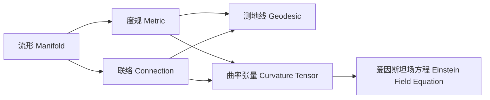

# 微分几何入门与广义相对论：广义相对论的时空结构

关键词：微分几何、广义相对论、时空结构、黎曼几何、测地线、曲率张量、爱因斯坦场方程

## 1. 背景介绍
### 1.1  问题的由来
广义相对论是爱因斯坦在1915年提出的一种全新的引力理论,它以革命性的方式改变了我们对时空的认识。与牛顿引力理论不同,广义相对论将引力解释为时空几何的曲率效应,引入了弯曲时空的概念。要深入理解广义相对论,就需要借助微分几何的语言和工具来描述时空的几何性质。

### 1.2  研究现状
目前,广义相对论已经成为描述引力相互作用的标准理论,并在许多实验和观测中得到了验证,如水星近日点进动、光线偏折、引力红移等。同时,广义相对论也预言了许多新奇的物理现象,如黑洞、引力波等,这些预言也陆续得到了观测的支持。微分几何作为广义相对论的数学基础,在理论物理研究中发挥着重要作用。

### 1.3  研究意义
深入理解广义相对论的时空结构,对于探索宇宙的本质具有重要意义。广义相对论不仅揭示了时空与物质的深刻联系,也为研究黑洞、宇宙学等前沿领域提供了理论基础。同时,广义相对论与微分几何的结合,体现了数学与物理的高度统一,展现了数学的美妙和力量。

### 1.4  本文结构
本文将从微分几何的基本概念出发,逐步引入广义相对论的时空结构。首先介绍微分几何的核心概念,如流形、度规、联络等,然后讨论广义相对论中的关键要素,如测地线、曲率张量、爱因斯坦场方程等。通过数学模型和公式的详细讲解,并结合具体的代码实例,帮助读者深入理解广义相对论的时空几何性质。最后,探讨广义相对论的实际应用和未来发展趋势。

## 2. 核心概念与联系

在微分几何中,最基本的概念是流形(manifold)。流形是一个局部类似于欧氏空间的空间,可以用坐标图(chart)来描述。在广义相对论中,时空就被建模为一个4维的伪黎曼流形(pseudo-Riemannian manifold)。

在流形上,可以定义度规(metric)来度量空间的几何性质。度规是一个对称的(0,2)型张量场,它将流形上每一点的两个切向量映射为一个实数,表示它们之间的"距离"。在广义相对论中,时空的度规由物质的分布和运动决定,满足爱因斯坦场方程。

另一个重要概念是联络(connection),它定义了流形上的平行传输。联络将流形上每一点的两个切向量映射为另一个切向量,表示当一个向量沿着另一个向量方向平行传输时的变化率。在广义相对论中,时空的联络由度规唯一确定,称为李维-奇维塔联络(Levi-Civita connection)。

利用度规和联络,可以定义流形上的测地线(geodesic)。测地线是流形上两点之间的"最短路径",是自由粒子在时空中运动的轨迹。广义相对论将引力解释为时空几何的曲率效应,自由粒子沿着时空的测地线运动。

曲率张量(curvature tensor)是描述流形曲率的重要工具。它由度规和联络决定,反映了流形偏离欧氏空间的程度。在广义相对论中,时空的曲率张量满足爱因斯坦场方程,由物质的能量动量张量决定。

## 3. 核心算法原理 & 具体操作步骤
### 3.1  算法原理概述
广义相对论的核心是爱因斯坦场方程,它描述了时空几何与物质分布之间的关系。爱因斯坦场方程可以写成张量形式:

$$R_{\mu\nu} - \frac{1}{2}Rg_{\mu\nu} + \Lambda g_{\mu\nu} = \frac{8\pi G}{c^4}T_{\mu\nu}$$

其中,$R_{\mu\nu}$是黎曼曲率张量的缩并,$R$是黎曼曲率张量的标量,$g_{\mu\nu}$是度规张量,$\Lambda$是宇宙学常数,$G$是引力常数,$c$是光速,$T_{\mu\nu}$是能量动量张量。

爱因斯坦场方程是一个非线性偏微分方程组,求解它需要用到微分几何的方法。一般步骤是:首先根据问题的对称性选择合适的度规形式,然后计算度规的联络、黎曼曲率张量等,代入场方程,再结合边界条件和物质分布,最后求解方程得到度规的具体形式。

### 3.2  算法步骤详解
以求解史瓦西度规(Schwarzschild metric)为例,具体步骤如下:

1. 根据问题的球对称性,选择球坐标系$(t,r,\theta,\phi)$,度规形式为:

$$ds^2 = -e^{2\alpha(r)}dt^2 + e^{2\beta(r)}dr^2 + r^2(d\theta^2 + \sin^2\theta d\phi^2)$$

2. 计算度规的联络系数、黎曼曲率张量、黎奇标量等。

3. 将计算结果代入爱因斯坦场方程,得到关于$\alpha(r)$和$\beta(r)$的常微分方程组。

4. 根据边界条件:在无穷远处时空是渐近平直的,且在$r=0$处度规是非奇异的,求解方程组。

5. 得到史瓦西度规的解:

$$ds^2 = -(1-\frac{2GM}{c^2r})dt^2 + (1-\frac{2GM}{c^2r})^{-1}dr^2 + r^2(d\theta^2 + \sin^2\theta d\phi^2)$$

其中$M$是引力源的质量。

### 3.3  算法优缺点
爱因斯坦场方程的优点是:

- 它建立了时空几何与物质分布之间的联系,具有深刻的物理意义。
- 它是一个张量方程,满足广义协变性,形式简洁美观。
- 它可以推导出许多新奇的物理效应,如黑洞、引力波等,并得到实验的验证。

但求解爱因斯坦场方程也面临一些困难:

- 它是一个非线性偏微分方程组,求解一般比较困难,只有一些高度对称的情况才能得到解析解。
- 它的解通常含有奇点,需要进一步的物理解释和数学处理。
- 在强引力场和小尺度下,可能需要考虑量子效应,需要量子引力理论来补充。

### 3.4  算法应用领域
爱因斯坦场方程在许多领域有重要应用,如:

- 天体物理:研究黑洞、中子星、引力波等极端天体现象。
- 宇宙学:研究宇宙的大尺度结构和演化,如宇宙学常数、暗能量等。
- 实验检验:通过观测引力透镜、光线偏折、Shapiro延迟等效应,检验广义相对论的预言。

## 4. 数学模型和公式 & 详细讲解 & 举例说明
### 4.1  数学模型构建
广义相对论的数学模型是伪黎曼流形。对于一个$n$维流形$M$,若在$M$上每一点$p$都定义了一个对称的非退化的$(0,2)$型张量场$g$,则称$(M,g)$为伪黎曼流形,而$g$称为$M$上的伪黎曼度规。

在局部坐标系$(x^0,x^1,\cdots,x^{n-1})$下,度规$g$可以用度规系数$g_{\mu\nu}$来描述:

$$ds^2 = g_{\mu\nu}dx^\mu dx^\nu$$

其中,$ds$是两个无穷接近的事件之间的时空间隔。

度规$g$完全确定了流形上的几何性质。流形上两点之间的测地线方程为:

$$\frac{d^2x^\mu}{d\tau^2} + \Gamma^\mu_{\nu\lambda}\frac{dx^\nu}{d\tau}\frac{dx^\lambda}{d\tau} = 0$$

其中,$\tau$是测地线的固有时,$\Gamma^\mu_{\nu\lambda}$是由度规唯一确定的联络系数:

$$\Gamma^\mu_{\nu\lambda} = \frac{1}{2}g^{\mu\sigma}(\partial_\nu g_{\sigma\lambda} + \partial_\lambda g_{\nu\sigma} - \partial_\sigma g_{\nu\lambda})$$

黎曼曲率张量$R^\rho_{\sigma\mu\nu}$由度规和联络决定:

$$R^\rho_{\sigma\mu\nu} = \partial_\mu\Gamma^\rho_{\nu\sigma} - \partial_\nu\Gamma^\rho_{\mu\sigma} + \Gamma^\rho_{\mu\lambda}\Gamma^\lambda_{\nu\sigma} - \Gamma^\rho_{\nu\lambda}\Gamma^\lambda_{\mu\sigma}$$

### 4.2  公式推导过程
以史瓦西度规为例,详细推导爱因斯坦场方程的求解过程。

首先,根据球对称性,选择度规形式为:

$$ds^2 = -e^{2\alpha(r)}dt^2 + e^{2\beta(r)}dr^2 + r^2(d\theta^2 + \sin^2\theta d\phi^2)$$

计算联络系数,得到非零分量:

$$\Gamma^0_{01} = \alpha'(r), \quad \Gamma^1_{00} = \alpha'(r)e^{2(\alpha-\beta)}, \quad \Gamma^1_{11} = \beta'(r)$$
$$\Gamma^1_{22} = -re^{-2\beta}, \quad \Gamma^1_{33} = -r\sin^2\theta e^{-2\beta}, \quad \Gamma^2_{12} = \frac{1}{r}$$
$$\Gamma^2_{33} = -\sin\theta\cos\theta, \quad \Gamma^3_{13} = \frac{1}{r}, \quad \Gamma^3_{23} = \cot\theta$$

计算黎曼曲率张量,得到非零分量:

$$R_{0101} = e^{2(\alpha-\beta)}(\alpha''+\alpha'^2-\alpha'\beta'), \quad R_{0202} = -r\alpha'e^{-2\beta}, \quad R_{0303} = -r\alpha'e^{-2\beta}\sin^2\theta$$
$$R_{1212} = re^{-2\beta}\beta', \quad R_{1313} = re^{-2\beta}\beta'\sin^2\theta, \quad R_{2323} = (1-e^{-2\beta})r^2\sin^2\theta$$

计算黎奇标量:

$$R = -2e^{-2\beta}(\alpha''+\alpha'^2-\alpha'\beta'+\frac{2}{r}\alpha'-\frac{2}{r}\beta'+\frac{1-e^{2\beta}}{r^2})$$

将以上结果代入爱因斯坦场方程,并考虑真空解$T_{\mu\nu}=0$,得到关于$\alpha(r)$和$\beta(r)$的常微分方程组:

$$\alpha''+\alpha'^2-\alpha'\beta'+\frac{2}{r}\alpha'-\frac{2}{r}\beta'+\frac{1-e^{2\beta}}{r^2} = 0$$
$$\alpha'\beta'-\alpha'^2-\frac{\alpha'}{r}+\frac{\beta'}{r}+\frac{1-e^{2\beta}}{r^2} = 0$$

求解方程组,并考虑边界条件,得到史瓦西度规:

$$ds^2 = -(1-\frac{2GM}{c^2r})dt^2 + (1-\frac{2GM}{c^2r})^{-1}dr^2 + r^2(d\theta^2 + \sin^2\theta d\phi^2)$$

### 4.3  案例分析与讲解
下面以一个具体的例子来说明史瓦西度规的应用。考虑一个质量为$M$的球对称星体,求解其引力场中光线的运动轨迹。

在史瓦西度规下,考虑光线在$\theta=\pi/2$平面内的运动,则测地线方程