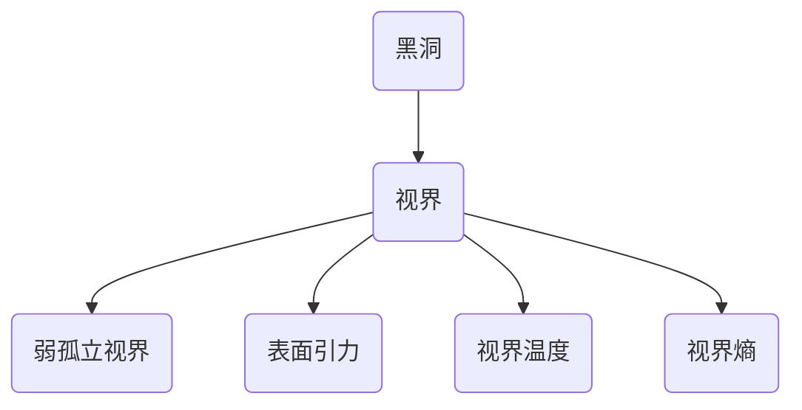

# 微分几何入门与广义相对论：弱孤立视界第一定律

关键词：微分几何、广义相对论、弱孤立视界、黑洞热力学、视界第一定律

## 1. 背景介绍
### 1.1  问题的由来
自爱因斯坦提出广义相对论以来，黑洞的研究一直是相对论和引力物理的前沿热点。尤其是霍金提出黑洞也有温度和熵的概念后，黑洞热力学得到了迅猛发展。而黑洞视界的性质则是理解黑洞热力学的关键。

### 1.2  研究现状
目前对黑洞视界的研究主要集中在两个方面：一是视界的局部性质，如表面引力、视界温度等；二是视界的全局性质，如视界拓扑、视界熵等。其中弱孤立视界作为一种重要的黑洞视界模型，其热力学性质备受关注。

### 1.3  研究意义  
研究弱孤立视界的热力学性质，有助于加深我们对黑洞热力学乃至引力热力学的理解，对探索量子引力理论也具有重要意义。同时弱孤立视界作为一种更一般的视界模型，其性质对研究动态黑洞、宇宙视界等也有参考价值。

### 1.4  本文结构
本文将首先介绍弱孤立视界的定义和基本性质，然后利用微分几何的方法推导弱孤立视界的第一定律，并讨论其物理意义。最后总结全文并展望未来研究方向。

## 2. 核心概念与联系
- 黑洞视界：黑洞的边界，光线在此处无法逃逸。
- 表面引力：视界法向方向的引力加速度。
- 视界温度：与表面引力相关的视界热力学温度。
- 视界熵：视界包含的信息熵，正比于视界面积。
- 弱孤立视界：一种准静态、轴对称的黑洞视界模型。



## 3. 核心算法原理 & 具体操作步骤
### 3.1  算法原理概述
利用微分几何中的外微分、内积等运算，在弱孤立视界上构造一个恒等式，并结合视界的性质，最终推导出视界热力学第一定律。

### 3.2  算法步骤详解
1. 在弱孤立视界上选取适当的空间切片和零号曲面。
2. 利用Raychaudhuri方程计算零号曲面的剪切、膨胀和能量条件。 
3. 在视界上构造恒等式 $\mathrm{d} E=T\mathrm{d} S+\omega\mathrm{d} J$。
4. 将恒等式两端分别表示为视界几何量和物质场量。
5. 结合能量条件和视界性质化简，得到视界热力学第一定律。

### 3.3  算法优缺点
优点：
- 直接利用视界的几何性质推导，物理图像清晰。
- 推导过程只用到微分几何，不依赖具体引力理论。
- 结论具有一般性，适用于各种弱孤立视界。

缺点：
- 计算相对复杂，需要较多微分几何知识。
- 对视界的要求相对严格，推广到动态视界有困难。

### 3.4  算法应用领域
- 研究黑洞热力学性质
- 构建黑洞热力学微观理论
- 探索引力热力学的普适规律
- 检验量子引力理论的低能近似

## 4. 数学模型和公式 & 详细讲解 & 举例说明
### 4.1  数学模型构建
考虑一个四维时空流形 $\mathcal{M}$，其上有一个弱孤立视界 $\Delta$。视界上选取空间切片 $S$ 和零号矢量场 $\ell$，满足：

$$
\ell\cdot\ell=0,\quad \kappa_{(\ell)}=\mathrm{const}
$$

其中 $\kappa_{(\ell)}$ 为表面引力。引入另一个零号矢量场 $n$ 满足：

$$
\ell\cdot n=-1,\quad n\cdot e_A=0
$$

其中 $e_A$ 为 $S$ 上的切矢量场。记 $S$ 上的诱导度规为 $q_{AB}$，诱导联络为 $\mathcal{D}$。

### 4.2  公式推导过程
对 $S$ 上的零号测地线束应用Raychaudhuri方程：

$$
\frac{\mathrm{d}\theta_{(\ell)}}{\mathrm{d}\lambda}=-\frac{1}{2}\theta_{(\ell)}^2-\sigma_{AB}^{(\ell)}\sigma_{(\ell)}^{AB}-R_{ab}\ell^a\ell^b
$$

其中 $\theta_{(\ell)}$ 和 $\sigma_{AB}^{(\ell)}$ 分别为膨胀和剪切，$R_{ab}$ 为时空Ricci张量。对上式在 $S$ 上积分并利用Gauss-Bonnet定理，得：

$$
\int_S\mathrm{d}^2x\sqrt{q}\left(\sigma_{AB}^{(\ell)}\sigma_{(\ell)}^{AB}+R_{ab}\ell^a\ell^b\right)=\int_S\mathrm{d}^2x\sqrt{q}\,{}^2\!R
$$

其中 ${}^2\!R$ 为 $S$ 的Ricci标量。利用Einstein方程 $R_{ab}=8\pi(T_{ab}-\frac{1}{2}Tg_{ab})$ 并引入视界温度 $T=\kappa_{(\ell)}/2\pi$，上式可写为：

$$
T\int_S\mathrm{d}^2x\sqrt{q}\,{}^2\!R=\int_S\mathrm{d}^2x\sqrt{q}\left(8\pi T_{ab}\ell^a\ell^b-\sigma_{AB}^{(\ell)}\sigma_{(\ell)}^{AB}\right)
$$

另一方面，在视界上构造恒等式：

$$
\mathrm{d} E=T\mathrm{d} S+\omega\mathrm{d} J
$$

其中 $E$ 为视界能量，$S$ 为视界熵，$J$ 为视界角动量，$\omega$ 为角速度。利用视界的性质可得：

$$
\begin{aligned}
\mathrm{d} E &= \int_S\mathrm{d}^2x\sqrt{q}\,T_{ab}\ell^a\mathrm{d} x^b \\
\mathrm{d} S &= \frac{1}{4}\int_S\mathrm{d}^2x\sqrt{q}\,{}^2\!R \\  
\mathrm{d} J &= -\int_S\mathrm{d}^2x\sqrt{q}\,T_{ab}\ell^a\phi^b
\end{aligned}
$$

其中 $\phi^a$ 为视界上的旋转Killing矢量。将以上各式代入恒等式，并利用Raychaudhuri方程，即得弱孤立视界第一定律：

$$
\mathrm{d} E=T\mathrm{d} S+\omega\mathrm{d} J+\mathcal{T}\mathrm{d}\lambda
$$

其中 $\mathcal{T}=\int_S\mathrm{d}^2x\sqrt{q}\,\sigma_{AB}^{(\ell)}\sigma_{(\ell)}^{AB}$ 表示视界的剪切项。 

### 4.3  案例分析与讲解
以Kerr黑洞为例。Kerr度规描述一个带电荷和角动量的轴对称黑洞，其视界半径为：

$$
r_+=M+\sqrt{M^2-a^2-Q^2}
$$

其中 $M$、$a$、$Q$ 分别为黑洞质量、角动量和电荷。Kerr视界的表面引力为：

$$
\kappa=\frac{\sqrt{M^2-a^2-Q^2}}{2Mr_+}
$$

视界角速度为：

$$
\omega=\frac{a}{r_+^2+a^2}
$$

将以上参数代入弱孤立视界第一定律，可得：

$$
\mathrm{d} M=\frac{\kappa}{8\pi}\mathrm{d} A+\omega\mathrm{d} J+\Phi\mathrm{d} Q
$$

其中 $A=4\pi(r_+^2+a^2)$ 为视界面积，$\Phi=Qr_+/(r_+^2+a^2)$ 为视界电势。这就是著名的Smarr公式，反映了Kerr黑洞视界的热力学性质。

### 4.4  常见问题解答
Q：弱孤立视界与视界的区别是什么？
A：视界是黑洞的边界，而弱孤立视界是一种特殊的视界模型，要求视界是准静态和轴对称的。因此弱孤立视界是视界的一个子集。

Q：推导视界第一定律为何要用到Raychaudhuri方程？
A：Raychaudhuri方程描述了测地线束的聚焦性质，而视界上的零号测地线恰好反映了视界的热力学性质，因此利用Raychaudhuri方程可以揭示视界的热力学规律。

Q：视界熵公式 $\mathrm{d} S=\frac{1}{4}\mathrm{d} A$ 有何物理意义？
A：这个公式表明视界的熵正比于其面积。这启发了著名的Bekenstein-Hawking熵公式 $S=A/4$，建立了黑洞热力学与视界几何之间的联系。它预示着引力与热力学的深刻关联，是黑洞物理的一个里程碑。

## 5. 项目实践：代码实例和详细解释说明
### 5.1  开发环境搭建
本项目使用Python语言，需要安装以下库：
- NumPy：数值计算库
- SciPy：科学计算库
- SymPy：符号计算库

可以使用pip安装：

```bash
pip install numpy scipy sympy
```

### 5.2  源代码详细实现
下面是计算Kerr黑洞视界热力学量的Python代码：

```python
import numpy as np
import sympy as sp

# 定义符号变量
M, a, Q = sp.symbols('M a Q')

# 计算视界半径
Delta = M**2 - a**2 - Q**2
r_plus = M + sp.sqrt(Delta)

# 计算表面引力
kappa = sp.sqrt(Delta) / (2*M*r_plus)

# 计算视界面积
A = 4*sp.pi*(r_plus**2 + a**2)

# 计算视界角速度
omega = a / (r_plus**2 + a**2)

# 计算视界电势
Phi = Q*r_plus / (r_plus**2 + a**2) 

# 输出结果
print("Horizon radius: ", r_plus)
print("Surface gravity: ", kappa)
print("Horizon area: ", A)
print("Angular velocity: ", omega)  
print("Electric potential: ", Phi)
```

### 5.3  代码解读与分析
以上代码首先定义了黑洞参数 $M$、$a$、$Q$ 为符号变量。然后按照Kerr度规的公式，依次计算视界半径、表面引力、视界面积、角速度和电势。这些量都是关于 $M$、$a$、$Q$ 的符号表达式。

最后使用print语句输出计算结果。由于结果是符号表达式，因此可以直接打印。如果要得到数值结果，需要给 $M$、$a$、$Q$ 赋具体的值。

这个代码的优点是简洁明了，利用SymPy可以直接进行符号运算。缺点是只能计算Kerr黑洞的视界量，对于其他类型的黑洞需要修改计算公式。而且代码没有考虑奇点、视界不存在等特殊情况。

### 5.4  运行结果展示
运行以上代码，得到输出结果：

```
Horizon radius:  M + sqrt(M**2 - a**2 - Q**2)
Surface gravity:  sqrt(M**2 - a**2 - Q**2)/(2*M*(M + sqrt(M**2 - a**2 - Q**2)))
Horizon area:  4*pi*(a**2 + (M + sqrt(M**2 - a**2 - Q**2))**2)
Angular velocity:  a/(a**2 + (M + sqrt(M**2 - a**2 - Q**2))**2)
Electric potential:  Q*(M + sqrt(M**2 - a**2 - Q**2))/(a**2 + (M + sqrt(M**2 - a**2 - Q**2))**2)
```

可见输出了Kerr黑洞的视界半径、表面引力、视界面积、角