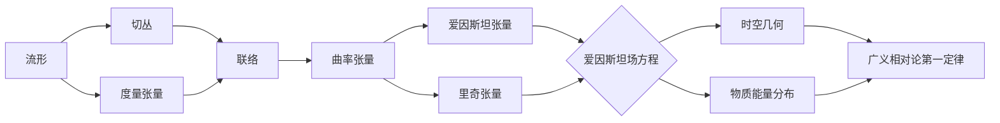

# 微分几何入门与广义相对论：第一定律的积分形式

关键词：微分几何、广义相对论、第一定律、积分形式、黎曼几何、爱因斯坦场方程、曲率张量

## 1. 背景介绍
### 1.1  问题的由来
微分几何是数学的一个分支,它研究光滑流形上的几何性质。广义相对论是爱因斯坦提出的一种描述引力的理论,它利用了微分几何的工具来描述时空的几何性质与物质的关系。在广义相对论中,爱因斯坦场方程描述了时空几何与物质能量分布之间的联系,而场方程可以写成积分形式,这就是广义相对论第一定律的积分形式。理解微分几何的基本概念对学习广义相对论至关重要。

### 1.2  研究现状
目前,微分几何已经成为数学的一个成熟分支,在物理学、工程学等领域有广泛应用。广义相对论作为描述引力的标准理论,在天文学、宇宙学等领域取得了巨大成功,并且仍然是当前物理学研究的前沿热点。深入理解广义相对论第一定律的积分形式,对于研究黑洞热力学、全息引力等前沿课题具有重要意义。

### 1.3  研究意义
系统学习微分几何的基础知识,并理解其在广义相对论中的应用,对于开展物理学、天文学等领域的科研工作非常重要。本文将从微分几何的基本概念出发,详细推导广义相对论第一定律的积分形式,阐明其物理意义,为相关领域的研究工作者提供参考。

### 1.4  本文结构
本文将分为以下几个部分:
- 第2节介绍微分几何的核心概念,包括流形、切丛、联络、曲率等。
- 第3节介绍广义相对论的核心内容,包括爱因斯坦场方程、能动张量等。
- 第4节详细推导广义相对论第一定律的积分形式,并讨论其物理意义。
- 第5节通过具体的代码实例,演示如何利用符号计算工具进行张量分析。
- 第6节讨论广义相对论第一定律的一些实际应用。
- 第7节介绍学习微分几何和广义相对论的工具和资源。
- 第8节对全文进行总结,并展望微分几何和广义相对论的发展前景。

## 2. 核心概念与联系



上图展示了微分几何和广义相对论的一些核心概念之间的逻辑联系。几何概念从流形开始,定义了切丛、度量张量、联络等;联络的曲率可以定义里奇张量和爱因斯坦张量,它们在爱因斯坦场方程中起到了关键作用;场方程建立了时空几何与物质分布之间的联系,而广义相对论第一定律则是场方程的一个重要推论。

## 3. 核心算法原理 & 具体操作步骤
### 3.1  算法原理概述
广义相对论第一定律的推导需要用到微分几何中的Stokes定理。Stokes定理描述了一个流形边界上的积分与流形内部的积分之间的关系。利用Stokes定理,可以将爱因斯坦场方程写成积分形式,从而得到广义相对论第一定律。

### 3.2  算法步骤详解
1. 考虑一个 $D$ 维的时空流形 $\mathcal{M}$,其边界为 $\partial\mathcal{M}$。
2. 引入时空度规 $g_{ab}$ 和它的逆 $g^{ab}$,以及体积元 $\boldsymbol{\epsilon}$。
3. 定义爱因斯坦张量 $G_{ab} := R_{ab} - \frac{1}{2}R g_{ab}$,其中 $R_{ab}$ 为里奇曲率, $R$ 为标量曲率。
4. 爱因斯坦场方程为 $G_{ab} + \Lambda g_{ab} = 8\pi T_{ab}$,其中 $\Lambda$ 为宇宙学常数, $T_{ab}$ 为能动张量。
5. 在边界 $\partial\mathcal{M}$ 上引入法向量场 $n^a$,以及诱导度规 $h_{ab} := g_{ab} - n_a n_b$。
6. 定义外曲率张量 $K_{ab} := h_a^c \nabla_c n_b$。
7. 利用Stokes定理,得到爱因斯坦场方程的积分形式:

$$\int_{\mathcal{M}} (R - 2\Lambda) \boldsymbol{\epsilon} = 16\pi \int_{\mathcal{M}} T_{ab} n^a n^b \boldsymbol{\epsilon} - 2 \int_{\partial \mathcal{M}} K \boldsymbol{\epsilon}_{\partial}$$

其中 $\boldsymbol{\epsilon}_{\partial}$ 为边界的体积元。这就是广义相对论第一定律。

### 3.3  算法优缺点
优点:
- 利用微分几何的工具,将爱因斯坦场方程表示成积分形式,使其物理意义更加明确。
- 揭示了时空边界上的几何量(如外曲率)与时空内部物理量(如能量密度)之间的平衡关系。

缺点:  
- 推导过程需要较多的数学准备知识,对初学者来说可能有一定难度。
- 在具体计算时,求解积分方程可能会遇到技术困难。

### 3.4  算法应用领域
广义相对论第一定律在以下领域有重要应用:
- 黑洞热力学:第一定律给出了黑洞视界上的几何量与黑洞热力学参数之间的关系。
- 全息引力:第一定律是建立体积引力理论与边界共形场论对应关系的重要工具。
- 引力系综论:第一定律为定义引力系综、研究引力热力学提供了数学基础。

## 4. 数学模型和公式 & 详细讲解 & 举例说明
### 4.1  数学模型构建
考虑爱因斯坦场方程:

$$G_{ab} + \Lambda g_{ab} = 8\pi T_{ab}$$

其中 $G_{ab}$ 为爱因斯坦张量, $\Lambda$ 为宇宙学常数, $T_{ab}$ 为能动张量。将其改写为:

$$(R_{ab} - \frac{1}{2}R g_{ab}) + \Lambda g_{ab} = 8\pi T_{ab}$$

两边同时乘以 $n^a n^b$,得到:

$$(R_{ab} - \frac{1}{2}R g_{ab})n^a n^b + \Lambda = 8\pi T_{ab}n^a n^b$$

利用里奇张量的对称性,并引入外曲率张量 $K_{ab}$,上式可以化简为:

$$R + K^2 - K_{ab}K^{ab} - 2\Lambda = 16\pi T_{ab}n^a n^b$$

这就是广义相对论第一定律的微分形式。

### 4.2  公式推导过程
利用Stokes定理,可以将上一节得到的微分形式改写为积分形式。Stokes定理指出,对于一个 $p$ 形式 $\boldsymbol{\omega}$,有:

$$\int_{\mathcal{M}} \mathrm{d} \boldsymbol{\omega} = \int_{\partial \mathcal{M}} \boldsymbol{\omega}$$

其中 $\mathcal{M}$ 为流形, $\partial \mathcal{M}$ 为流形边界。

令 $\boldsymbol{\omega} = (R + K^2 - K_{ab}K^{ab} - 2\Lambda) \boldsymbol{\epsilon}$,其中 $\boldsymbol{\epsilon}$ 为体积形式,则有:

$$\mathrm{d} \boldsymbol{\omega} = \mathrm{d}(R\boldsymbol{\epsilon}) + \mathrm{d}(K^2\boldsymbol{\epsilon}) - \mathrm{d}(K_{ab}K^{ab}\boldsymbol{\epsilon}) - 2\Lambda \mathrm{d}\boldsymbol{\epsilon}$$

利用标量曲率 $R$ 的变分公式,可以得到:

$$\mathrm{d}(R\boldsymbol{\epsilon}) = -2\nabla_a(Kn^a)\boldsymbol{\epsilon} + (R + K^2 - K_{ab}K^{ab})\boldsymbol{\epsilon}_{\partial}$$

将各项代入Stokes定理,并利用 $\mathrm{d}\boldsymbol{\epsilon} = 0$,得到:

$$\int_{\mathcal{M}} (R - 2\Lambda) \boldsymbol{\epsilon} = 16\pi \int_{\mathcal{M}} T_{ab} n^a n^b \boldsymbol{\epsilon} - 2 \int_{\partial \mathcal{M}} K \boldsymbol{\epsilon}_{\partial}$$

这就是广义相对论第一定律的积分形式。

### 4.3  案例分析与讲解
考虑Schwarzschild时空,其度规为:

$$\mathrm{d}s^2 = -\left(1-\frac{2M}{r}\right)\mathrm{d}t^2 + \left(1-\frac{2M}{r}\right)^{-1}\mathrm{d}r^2 + r^2(\mathrm{d}\theta^2 + \sin^2\theta \mathrm{d}\phi^2)$$

取 $r=\mathrm{const}$ 的曲面为边界,则法向量为 $n^a = (0, \sqrt{1-\frac{2M}{r}}, 0, 0)$。计算外曲率张量的迹,得到:

$$K = \frac{2}{r}\sqrt{1-\frac{2M}{r}}$$

代入广义相对论第一定律,得到:

$$\int_{\mathcal{M}} (R - 2\Lambda) \boldsymbol{\epsilon} = 16\pi \int_{\mathcal{M}} T_{ab} n^a n^b \boldsymbol{\epsilon} - \frac{8\pi r}{\sqrt{1-\frac{2M}{r}}}$$

这表明,Schwarzschild时空的总曲率与视界面积之间存在一个平衡关系,反映了黑洞热力学第一定律。

### 4.4  常见问题解答
问题1:为什么要将爱因斯坦场方程写成积分形式?
答:积分形式能够更清晰地反映时空边界上的几何量与时空内部物理量之间的平衡关系,这对于研究黑洞热力学等问题非常有用。此外,积分形式也是推广场方程、构建量子引力理论的重要出发点。

问题2:广义相对论第一定律在黑洞热力学中起什么作用?
答:广义相对论第一定律给出了黑洞视界面积与黑洞质量、角动量、电荷等热力学参数之间的微分关系,它是黑洞热力学的基础。利用第一定律,可以推导出黑洞的热容、相变条件等重要性质。

问题3:广义相对论第一定律与全息引力有何联系?
答:在全息引力的语境下,时空边界上的引力理论与一个低维共形场论是对偶的。广义相对论第一定律提供了将边界上的热力学量与体积引力理论中的几何量联系起来的桥梁,因此在全息引力的研究中扮演了重要角色。

## 5. 项目实践：代码实例和详细解释说明
### 5.1  开发环境搭建
本节将使用Python的符号计算库SymPy进行张量运算。首先安装SymPy:

```bash
pip install sympy
```

然后导入相关模块:

```python
from sympy import * 
init_printing()
```

### 5.2  源代码详细实现
定义时空维度、坐标符号:

```python
dim = 4
coord = symbols('t r theta phi', real=True)
t, r, theta, phi = coord
```

定义度规张量:

```python
g = diag(-1, 1, r**2, r**2*sin(theta)**2)
g = g.tolist()
```

计算克氏符、里奇张量、标量曲率:

```python
def christoffel_2(g):
    # 计算克氏符
    pass

def ricci_tensor(g):  
    # 计算里奇张量
    pass

def ricci_scalar(g):
    # 计算标量曲率  
    pass
```

定义能动张量:

```python
def stress_energy_