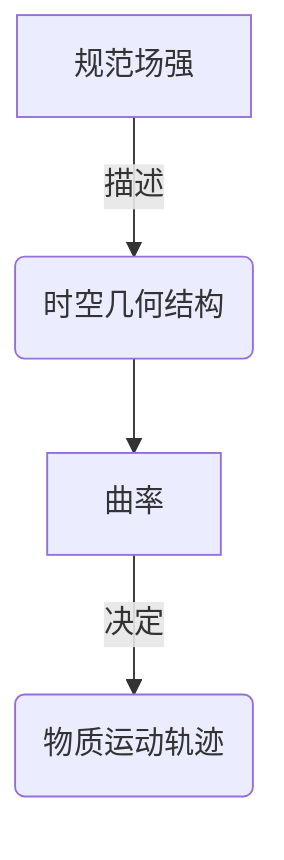

# 微分几何入门与广义相对论：规范场强与曲率

## 1. 背景介绍

### 1.1 问题的由来

自古以来，人类一直对宇宙的奥秘充满好奇。从古希腊时期的哲学家到现代物理学家，都在努力探索宇宙的本质和运行规律。然而,传统的牛顿力学理论在解释一些极端情况下的现象时遇到了困难,例如水星周日运动的离心率、光的偏转等。这促使科学家们寻找一种新的理论来解释这些现象。

### 1.2 研究现状

1905年,爱因斯坦提出了狭义相对论,描述了高速运动物体的运动规律。然而,狭义相对论仅适用于惯性参考系,无法解释加速运动和引力现象。1915年,爱因斯坦在狭义相对论的基础上,提出了广义相对论理论,将引力现象纳入到时空几何的框架中,从而解决了牛顿力学理论无法解释的问题。

广义相对论的核心思想是,物质决定了时空的曲率,而时空的曲率又决定了物质的运动轨迹。这种思想彻底改变了人们对时空和引力的认识,被誉为20世纪最伟大的科学成就之一。

### 1.3 研究意义

广义相对论不仅在理论物理学领域具有重大意义,也为现代科技的发展提供了重要基础。例如,全球卫星导航系统(GPS)就是基于广义相对论的时空扭曲效应进行校正的。此外,广义相对论还为黑洞、大爆炸理论等宇宙学领域的研究奠定了坚实的理论基础。

### 1.4 本文结构

本文将从微分几何的角度出发,介绍广义相对论中的一些核心概念和数学工具。首先,我们将探讨规范场强和曲率在广义相对论中的作用和联系。接着,将详细阐述相关的算法原理和数学模型,并通过实例和代码实现加深理解。最后,我们将讨论广义相对论在实际应用中的场景,以及未来的发展趋势和挑战。

## 2. 核心概念与联系

在广义相对论中,规范场强(Gauge Field Strength)和曲率(Curvature)是两个核心概念,它们紧密相连,共同描述了时空的几何结构和物质的运动规律。

规范场强描述了时空几何结构的变化,而曲率则反映了时空的弯曲程度。在广义相对论中,物质的存在会导致时空产生曲率,而曲率又会影响物质的运动轨迹。这种相互作用形成了一个闭环,体现了广义相对论的核心思想。

接下来,我们将详细探讨规范场强和曲率在广义相对论中的具体作用和数学表述。

## 3. 核心算法原理 & 具体操作步骤

### 3.1 算法原理概述

在广义相对论中,爱因斯坦场方程是描述时空曲率和物质分布之间关系的核心方程。该方程通过张量的形式,将时空曲率与物质和能量的分布联系起来。

$$
R_{\mu\nu} - \frac{1}{2}g_{\mu\nu}R = \frac{8\pi G}{c^4}T_{\mu\nu}
$$

其中,左边项描述了时空的曲率,右边项表示物质和能量的分布。具体来说:

- $R_{\mu\nu}$ 是黎曼曲率张量(Riemann Curvature Tensor),描述了时空的内在曲率。
- $g_{\mu\nu}$ 是度规张量(Metric Tensor),描述了时空的几何结构。
- $R$ 是黎曼曲率标量(Riemann Curvature Scalar),是曲率张量的迹。
- $T_{\mu\nu}$ 是能量动量张量(Energy-Momentum Tensor),描述了物质和能量的分布。
- $G$ 是牛顿万有引力常数,而 $c$ 是光速。

爱因斯坦场方程建立了时空几何和物质分布之间的关联,描述了广义相对论的核心思想。

### 3.2 算法步骤详解

要解析爱因斯坦场方程,需要遵循以下步骤:

1. **确定度规张量 $g_{\mu\nu}$**

度规张量描述了时空的几何结构,是解析场方程的基础。在某些对称性情况下,可以根据对称性来假设度规张量的形式。

2. **计算黎曼曲率张量 $R_{\mu\nu}$**

黎曼曲率张量可以通过度规张量及其导数计算得到,具体计算过程较为复杂,需要使用张量微分几何的方法。

3. **计算黎曼曲率标量 $R$**

黎曼曲率标量是曲率张量的迹,可以通过对曲率张量进行张量收缩得到。

4. **确定能量动量张量 $T_{\mu\nu}$**

能量动量张量描述了物质和能量的分布,需要根据具体的物理情况来确定。

5. **解析爱因斯坦场方程**

将上述计算得到的各个张量代入爱因斯坦场方程,即可得到时空曲率和物质分布之间的关系。

6. **解方程获取度规张量的具体形式**

通过解析得到的关系式,可以解出度规张量的具体形式,从而描述出时空的几何结构。

7. **计算物体在该时空中的运动轨迹**

已知时空的几何结构,可以利用广义相对论中的测地线方程计算物体在该时空中的运动轨迹。

这一系列步骤体现了广义相对论的核心思想:物质决定了时空的曲率,而时空的曲率又决定了物质的运动轨迹。

### 3.3 算法优缺点

**优点:**

- 能够精确描述引力现象,解决了牛顿力学理论无法解释的问题。
- 将时空几何和物质统一到同一理论框架中,极大地简化了对宇宙的理解。
- 为现代科技的发展提供了理论基础,如GPS导航系统等。

**缺点:**

- 数学计算过程复杂,需要掌握高等张量微分几何的知识。
- 只适用于大尺度的宇宙现象,无法描述微观粒子的运动规律。
- 与量子力学存在一定的理论矛盾,两者尚未统一。

### 3.4 算法应用领域

广义相对论及其核心算法在以下领域有着广泛的应用:

- **天体物理学:** 解释行星运动、黑洞、引力波等天体现象。
- **宇宙学:** 构建大爆炸理论、研究宇宙的起源和演化。
- **航天导航:** GPS导航系统需要考虑相对论效应进行校正。
- **实验物理:** 验证广义相对论的预言,如光的偏转、时间膨胀等。
- **理论物理:** 为统一场论、量子引力理论等前沿理论提供基础。

## 4. 数学模型和公式 & 详细讲解 & 举例说明

### 4.1 数学模型构建

在广义相对论中,时空被描述为一个四维流形(Manifold),其上定义了一个度规张量场(Metric Tensor Field)。度规张量场决定了该流形上的几何结构,并通过爱因斯坦场方程与物质和能量的分布相关联。

我们可以使用张量微分几何的方法来构建这一数学模型。首先,定义一个四维流形 $\mathcal{M}$,其上的每一点用坐标 $(x^0, x^1, x^2, x^3)$ 表示,分别对应时间和三个空间坐标。

在流形 $\mathcal{M}$ 上,定义一个度规张量场 $g_{\mu\nu}(x)$,它是一个二阶协变张量场,描述了该点附近的局部几何结构。度规张量场的具体形式需要通过解析爱因斯坦场方程来获得。

接下来,我们可以定义一些几何量,如联络(Connection)、曲率张量(Curvature Tensor)等,来描述流形上的几何性质。这些几何量都可以通过度规张量场及其导数计算得到。

最后,我们引入能量动量张量 $T_{\mu\nu}(x)$ 来描述物质和能量的分布,并将其代入爱因斯坦场方程:

$$
R_{\mu\nu} - \frac{1}{2}g_{\mu\nu}R = \frac{8\pi G}{c^4}T_{\mu\nu}
$$

通过解析这一方程,我们可以获得度规张量场 $g_{\mu\nu}(x)$ 的具体形式,从而描述出时空的几何结构。已知时空的几何结构,我们就可以计算物体在该时空中的运动轨迹,从而解释和预测各种引力现象。

### 4.2 公式推导过程

为了更好地理解广义相对论中的数学模型,我们将详细推导一些关键公式。

**1. 黎曼曲率张量的推导**

黎曼曲率张量 $R_{\mu\nu\rho\sigma}$ 描述了时空的内在曲率,它可以通过度规张量及其导数计算得到。具体推导过程如下:

$$
\begin{aligned}
R_{\mu\nu\rho\sigma} &= \partial_\rho\Gamma_{\mu\nu\sigma} - \partial_\sigma\Gamma_{\mu\nu\rho} + \Gamma_{\mu\lambda\rho}\Gamma_{\nu}^{\lambda}{}_\sigma - \Gamma_{\mu\lambda\sigma}\Gamma_{\nu}^{\lambda}{}_\rho \\
\Gamma_{\mu\nu\rho} &= \frac{1}{2}g_{\mu\lambda}(\partial_\nu g_{\rho\lambda} + \partial_\rho g_{\nu\lambda} - \partial_\lambda g_{\nu\rho})
\end{aligned}
$$

其中,

$$\Gamma_{\mu\nu\rho}$$ 是

 Christoffel 符号,描述了流形上的联络。通过计算黎曼曲率张量,我们可以获得时空的内在曲率信息。

**2. 黎曼曲率标量的推导**

黎曼曲率标量 $R$ 是曲率张量的迹,可以通过对曲率张量进行张量收缩得到:

$$
R = g^{\mu\nu}R_{\mu\nu}
$$

将黎曼曲率张量的表达式代入上式,经过一系列计算,我们可以得到黎曼曲率标量的具体表达式。

**3. 爱因斯坦场方程的推导**

爱因斯坦场方程是广义相对论的核心方程,将时空的曲率与物质和能量的分布联系起来。我们可以通过一些物理上的要求和数学上的简化来推导出这一方程。

首先,根据广义相对论的基本思想,我们要求场方程在任何坐标系下都是协变的,即保持相同的张量形式。同时,为了简化计算,我们要求场方程是线性的,且只包含度规张量及其一阶和二阶导数。

在满足上述要求的情况下,通过一系列数学推导,我们可以得到爱因斯坦场方程的最终形式:

$$
R_{\mu\nu} - \frac{1}{2}g_{\mu\nu}R = \frac{8\pi G}{c^4}T_{\mu\nu}
$$

这一推导过程体现了广义相对论理论的数学严谨性和物理合理性。

### 4.3 案例分析与讲解

为了更好地理解广义相对论中的数学模型和公式,我们将通过一个具体案例进行分析和讲解。

**案例背景:**
考虑一个具有球对称的静态黑洞,我们需要求解该黑洞附近的时空几何结构,并计算一个试验粒子在该时空中的运动轨迹。

**步骤1: 确定度规张量的形式**

由于该黑洞具有球对称性,我们可以假设度规张量具有如下形式:

$$
ds^2 = -A(r)dt^2 + B(r)dr^2 + r^2(d\theta^2 + \sin^2\theta d\phi^2)
$$

其中,

 $A(r)$ 和 $B(r)$ 是待定