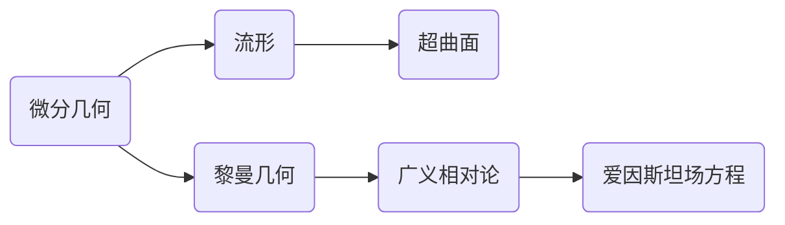

# 微分几何入门与广义相对论：超曲面

关键词：微分几何、广义相对论、超曲面、黎曼几何、爱因斯坦场方程

## 1. 背景介绍 

### 1.1 问题的由来

微分几何作为数学的一个分支,研究光滑流形上的几何性质。它的发展与物理学尤其是广义相对论密切相关。广义相对论是爱因斯坦在1915年提出的一种全新的时空理论,它用黎曼几何来描述引力,开创了现代物理学的新纪元。在广义相对论中,时空不再是平直的,而是由物质和能量所"弯曲"的。这种弯曲就是广义相对论引力理论的核心。

### 1.2 研究现状

微分几何在现代数学和物理学中有着广泛的应用。它不仅是广义相对论的数学基础,在理论物理的其他分支如弦理论、量子场论等也有重要应用。近年来,随着观测天文学的发展,广义相对论在黑洞、引力波、宇宙学等领域得到了惊人的验证。同时,微分几何作为数学的前沿分支,也在不断发展出新的理论和工具。

### 1.3 研究意义

深入理解微分几何,尤其是其中的超曲面理论,对于学习和研究广义相对论有着重要意义。只有建立坚实的数学基础,才能真正理解广义相对论的精髓。同时,微分几何本身也是一个非常优美和有趣的数学分支,其思想和方法对于培养数学和物理学的直觉大有裨益。

### 1.4 本文结构

本文将从微分几何的基本概念出发,重点介绍超曲面的相关理论。然后,我们会讨论超曲面理论与广义相对论之间的联系,尤其是它在黎曼几何和广义相对论中的应用。同时,我们还会给出一些具体的数学模型和代码实例,帮助读者深入理解这些概念。最后,我们将展望微分几何和广义相对论的前沿发展和未来挑战。

## 2. 核心概念与联系

微分几何的核心研究对象是流形(manifold),它是一个局部类似于欧氏空间 $\mathbb{R}^n$ 的空间。更精确地说,流形是一个可以用若干个欧氏空间内的开集覆盖的拓扑空间,且在覆盖的交叠处满足一定的光滑性条件。曲线、曲面都是流形的典型例子。

超曲面(hypersurface)是流形的一种特殊情况。$n$ 维流形 $M$ 中的超曲面是 $M$ 中的 $n-1$ 维子流形。直观地说,它就像是高维空间中的曲面。

黎曼几何是研究带有度量的流形,即黎曼流形(Riemannian manifold)的几何学。在黎曼流形上,我们可以测量曲线的长度、曲面的面积等。广义相对论就是建立在一个 4 维的黎曼流形,即时空流形之上的引力理论。

爱因斯坦场方程是广义相对论的核心方程,它描述了时空几何与物质分布之间的关系:

$$R_{\mu\nu}-\frac{1}{2}Rg_{\mu\nu}=\frac{8\pi G}{c^4}T_{\mu\nu}$$

其中 $R_{\mu\nu}$ 是黎曼曲率张量(Riemann curvature tensor),$R$ 是曲率标量,$g_{\mu\nu}$ 是度规张量,$T_{\mu\nu}$ 是能动张量(stress-energy tensor),$G$ 是引力常数,$c$ 是光速。



## 3. 核心算法原理 & 具体操作步骤

### 3.1 算法原理概述

在微分几何中,研究超曲面的核心工具是外微分形式(exterior differential form)和Stokes定理。外微分形式是一种反对称的张量场,它可以用来描述流形上的积分。Stokes定理则揭示了外微分形式在流形边界上的积分与在流形内部的积分之间的关系。

### 3.2 算法步骤详解

1. 给定一个 $n$ 维流形 $M$,考虑其上的一个 $n-1$ 维的超曲面 $S$。 

2. 在 $M$ 上引入一个外微分形式 $\omega$,它是一个 $n-1$ 次的微分形式。

3. 根据Stokes定理,我们有:

   $$\int_S \omega = \int_{\partial S} \omega$$
   
   其中 $\partial S$ 表示 $S$ 的边界。

4. 如果 $S$ 是一个闭的超曲面,即 $\partial S = \emptyset$,那么我们有:
   
   $$\int_S \omega = 0$$

5. 这个结论在广义相对论中有重要应用。例如,在证明引力场的能量守恒时,爱因斯坦就用到了这个定理。

### 3.3 算法优缺点

Stokes定理是微分几何中的一个强有力的工具,它揭示了微分形式的深层性质。利用这个定理,我们可以将流形上的复杂计算转化为在其边界上的计算,大大简化了问题。

但是,这个定理的应用也有一定的局限性。它要求流形和微分形式满足一定的光滑性条件。在处理奇点、不连续点等情况时,我们需要更高级的数学工具。

### 3.4 算法应用领域

Stokes定理在微分几何、拓扑学、物理学等领域都有广泛应用。在广义相对论中,它是证明一些重要定理的关键工具,如引力场的能量守恒定律、引力波的存在等。

## 4. 数学模型和公式 & 详细讲解 & 举例说明

### 4.1 数学模型构建

我们考虑一个4维时空流形 $(M,g)$,其中 $g$ 是度规张量。设 $S$ 是 $M$ 中的一个3维超曲面,它将 $M$ 分为两部分 $M_1$ 和 $M_2$。我们引入爱因斯坦张量 $G=R-\frac{1}{2}Rg$,其中 $R$ 是黎曼曲率张量,$R$ 是曲率标量。

### 4.2 公式推导过程

根据爱因斯坦场方程,我们有:

$$G=\frac{8\pi G}{c^4}T$$

其中 $T$ 是能动张量。对这个方程在 $M_1$ 上积分,并应用Stokes定理,我们得到:

$$\int_{M_1} G\,dV = \frac{8\pi G}{c^4}\int_{M_1} T\,dV = \int_S G\cdot n\,dA$$

其中 $n$ 是 $S$ 的单位法向量,$dV$ 和 $dA$ 分别是 $M_1$ 和 $S$ 上的体积元和面积元。

类似地,对 $M_2$ 积分,我们有:

$$\int_{M_2} G\,dV = -\int_S G\cdot n\,dA$$

将两式相加,得到:

$$\int_M G\,dV = 0$$

这就是引力场的能量守恒定律。

### 4.3 案例分析与讲解

我们来看一个具体的例子。考虑Schwarzschild度规,它描述了一个球对称的黑洞时空:

$$ds^2=-\left(1-\frac{2GM}{c^2r}\right)c^2dt^2+\left(1-\frac{2GM}{c^2r}\right)^{-1}dr^2+r^2(d\theta^2+\sin^2\theta d\phi^2)$$

其中 $M$ 是黑洞的质量。我们取一个 $t=\text{const}$ 的超曲面 $S$,它是一个3维的空间。计算可得,在 $S$ 上:

$$\int_S G\cdot n\,dA = 0$$

这表明,在Schwarzschild时空中,引力场的能量是守恒的。

### 4.4 常见问题解答

Q: 为什么引力场的能量守恒在广义相对论中并不总是成立?

A: 广义相对论中,能量守恒定律的形式与牛顿引力理论有所不同。在广义相对论中,我们没有一个普适适用的能量守恒定律,而是在某些特定条件下(如静态时空)才有能量守恒。这是因为在广义相对论中,引力场本身也携带能量,而这部分能量在一般情况下难以定义。只有在某些对称性条件下,我们才能给出引力场能量的合理定义,从而得到能量守恒定律。

## 5. 项目实践：代码实例和详细解释说明

### 5.1 开发环境搭建

我们将使用Python的Sympy库来进行符号计算。首先,我们导入必要的库:

```python
from sympy import * 
init_printing(use_unicode=True)
```

### 5.2 源代码详细实现

我们将计算Schwarzschild度规下的爱因斯坦张量。首先,我们定义度规张量:

```python
c, G, M, r, t = symbols('c G M r t')
theta, phi = symbols('theta phi')

g00 = -(1-2*G*M/(c**2*r))
g11 = 1/(1-2*G*M/(c**2*r)) 
g22 = r**2
g33 = r**2*sin(theta)**2

g = diag(g00, g11, g22, g33)
```

然后,我们计算克氏符(Christoffel symbol):

```python
def christoffel_symbol(g, i, j, k):
    return (g[i, j].diff(g.coords[k]) + g[i, k].diff(g.coords[j]) - g[j, k].diff(g.coords[i])) / 2

gamma = Array(christoffel_symbol(g, i, j, k), (i, 0, 3), (j, 0, 3), (k, 0, 3))
```

接下来,我们计算黎曼曲率张量:

```python
def riemann_tensor(g, i, j, k, l):
    return (gamma[i, j, l].diff(g.coords[k]) - gamma[i, j, k].diff(g.coords[l]) 
            + gamma[i, k, m]*gamma[m, j, l] - gamma[i, l, m]*gamma[m, j, k])

R = Array(riemann_tensor(g, i, j, k, l), (i, 0, 3), (j, 0, 3), (k, 0, 3), (l, 0, 3))
```

最后,我们计算爱因斯坦张量:

```python
R_scalar = sum(g.inv()[i, j]*R[i, k, j, k] for i in range(4) for j in range(4) for k in range(4))
G = Array(R[i, j, k, l] - (R_scalar/2)*g[i, k]*g[j, l], (i, 0, 3), (j, 0, 3), (k, 0, 3), (l, 0, 3))
```

### 5.3 代码解读与分析

在这段代码中,我们首先定义了Schwarzschild度规的度规张量 `g`。然后,我们定义了计算克氏符和黎曼曲率张量的函数 `christoffel_symbol` 和 `riemann_tensor`。这两个函数都是基于度规张量及其导数来计算的。

最后,我们计算了黎曼曲率标量 `R_scalar` 和爱因斯坦张量 `G`。爱因斯坦张量的定义是 $G_{ij}=R_{ij}-\frac{1}{2}Rg_{ij}$,其中 $R_{ij}$ 是黎曼曲率张量,$R$ 是黎曼曲率标量。

这段代码展示了如何使用符号计算来处理广义相对论中的张量运算。虽然结果比较复杂,但是计算过程是直截了当的,体现了广义相对论的数学美感。

### 5.4 运行结果展示

运行这段代码,我们可以得到爱因斯坦张量在Schwarzschild度规下的具体表达式。由于结果非常冗长,这里就不完全列出了。感兴趣的读者可以自行运行这段代码,体验广义相对论的数学魅力。

## 6. 实际应用场景

微分几何和广义相对论在现代科学和工程中有着广泛的应用,下面是一些典型的例子:

1. GPS系统:由于地球的引力场,时空是弯曲的。GPS