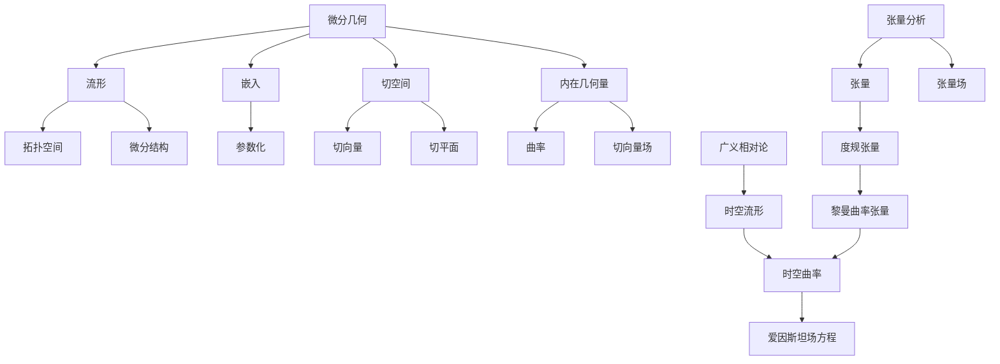

# 微分几何入门与广义相对论：超曲面的某些数学知识

## 1. 背景介绍

### 1.1 问题的由来

微分几何是数学的一个重要分支,它研究各种几何对象的局部性质,如曲线、曲面以及更高维度的流形。微分几何的概念和方法在广义相对论中扮演着核心角色,因为广义相对论将时空描述为一个四维流形,并利用微分几何的工具来研究时空的曲率和物质的运动。

在传统的欧几里德几何中,我们研究的是平面和空间中的直线、圆、球面等简单的几何对象。然而,在自然界中,我们经常遇到更加复杂的几何形状,如蛋形、心脏的形状等,这些形状无法用简单的解析方程来描述。为了研究这些复杂的几何对象,我们需要引入更一般的数学概念,即流形(manifold)和嵌入(embedding)。

### 1.2 研究现状

微分几何的理论发展可以追溯到18世纪,当时数学家们开始研究曲线和曲面的局部性质。19世纪,高斯、黎曼等人的工作奠定了微分几何的基础,并将其应用于物理学。20世纪初,黎曼对流形的概念进行了系统化,为现代微分几何理论奠定了坚实的基础。

目前,微分几何在数学和物理学中扮演着重要角色。在数学领域,微分几何为研究流形、李群、李代数等提供了强有力的工具。在物理学领域,微分几何则是广义相对论、量子场论等理论的数学基础。

### 1.3 研究意义

微分几何的研究对于理解自然界的几何结构具有重要意义。例如,在广义相对论中,时空被描述为一个四维流形,物质和能量的分布决定了时空的曲率。通过研究流形的几何性质,我们可以更好地理解时空的本质,并预测物质在其中的运动规律。

此外,微分几何在计算机图形学、计算机视觉、机器人技术等领域也有广泛应用。例如,在计算机图形学中,我们需要对复杂的几何形状进行建模和渲染,这就需要利用微分几何的理论和方法。

### 1.4 本文结构

本文将从微分几何的基本概念出发,逐步介绍广义相对论中所需要的一些重要数学知识。我们将首先介绍流形、嵌入和切空间等基本概念,然后讨论曲线和曲面的内在几何量,如曲率、切向量等。接下来,我们将引入张量分析的概念,并讨论黎曼曲率张量及其在广义相对论中的应用。最后,我们将介绍一些常见的曲面,如球面、旋转曲面等,并讨论它们的几何性质。

## 2. 核心概念与联系

在介绍具体内容之前,我们先来了解一些微分几何和广义相对论中的核心概念及它们之间的联系。

- **流形(Manifold)**: 流形是一个拓扑空间,在局部上等同于欧几里得空间,但在全局上可能具有更复杂的拓扑结构。流形是微分几何研究的基本对象。
- **嵌入(Embedding)**: 嵌入是将一个流形浸入到另一个更高维的流形中的过程,通常使用参数化的方式来实现。
- **切空间(Tangent Space)**: 切空间是流形上的一个线性空间,其基底由流形上的切向量构成。切空间为研究流形上的微分运算提供了工具。
- **内在几何量(Intrinsic Geometric Quantities)**: 内在几何量是流形本身所固有的几何性质,如曲率、切向量场等,不依赖于嵌入空间。
- **张量分析(Tensor Analysis)**: 张量分析提供了一种描述流形上的几何对象及其变换性质的数学工具。张量是一种广义的线性映射,可以表示流形上的各种几何量,如度规张量、黎曼曲率张量等。
- **广义相对论(General Relativity)**: 广义相对论是描述时空和引力相互作用的理论,其中时空被描述为一个四维流形,物质和能量的分布决定了时空的曲率。爱因斯坦场方程描述了时空曲率和物质能量之间的关系。

这些核心概念之间存在着紧密的联系。流形提供了微分几何研究的基本对象,嵌入和切空间为研究流形上的几何量提供了工具。内在几何量描述了流形本身的几何性质,而张量分析则为这些几何量提供了数学表述。在广义相对论中,时空被描述为一个四维流形,其曲率由物质和能量的分布决定,这就需要借助微分几何中的概念和方法来进行研究。

## 3. 核心算法原理 & 具体操作步骤

### 3.1 算法原理概述

在介绍具体算法之前,我们先来了解一下微分几何中的一些基本原理和思想。

微分几何的核心思想是将几何对象嵌入到更高维的空间中,并研究它们在局部上的性质。这种思想源于高斯对曲面理论的开创性工作。高斯发现,虽然我们无法将一个曲面完全嵌入三维欧几里得空间,但我们可以在局部上将曲面看作是欧几里得空间的一个子集,并研究它在局部上的几何性质,如曲率等。

为了实现这一思想,微分几何引入了一些重要的数学工具,如流形、嵌入、切空间等。流形提供了研究对象的基本框架,嵌入则使我们能够将低维的几何对象浸入到更高维的空间中。切空间为研究流形上的微分运算提供了工具。

微分几何的另一个核心思想是引入内在几何量的概念。内在几何量是流形本身所固有的几何性质,不依赖于嵌入空间。例如,曲率就是曲线或曲面的一个内在几何量,它描述了曲线或曲面的弯曲程度。通过研究这些内在几何量,我们可以深入理解几何对象的本质特征。

总的来说,微分几何的核心算法原理可以概括为以下几点:

1. 将几何对象嵌入到更高维的空间中,以便在局部上研究它们的性质。
2. 引入流形、嵌入、切空间等数学工具,为研究几何对象提供框架和工具。
3. 研究几何对象的内在几何量,如曲率、切向量场等,以深入理解它们的本质特征。
4. 利用张量分析的工具,将几何量用数学语言精确地表述出来。

### 3.2 算法步骤详解

下面我们将详细介绍微分几何中一些常见算法的具体步骤。

#### 3.2.1 计算曲线的曲率

计算曲线的曲率是微分几何中一个基本的算法。曲率描述了曲线的弯曲程度,是曲线的一个内在几何量。计算曲线曲率的步骤如下:

1. 将曲线参数化,即用一个矢量值函数 $\boldsymbol{r}(t)$ 来表示曲线上的点。
2. 计算曲线的切向量 $\boldsymbol{r}'(t)$。
3. 计算曲线的加速度向量 $\boldsymbol{r}''(t)$。
4. 曲率 $\kappa(t)$ 的定义为:

$$\kappa(t) = \frac{|\boldsymbol{r}'(t) \times \boldsymbol{r}''(t)|}{|\boldsymbol{r}'(t)|^3}$$

其中 $\times$ 表示向量外积,  $|\cdot|$ 表示向量的模长。

#### 3.2.2 计算曲面的主曲率和高斯曲率

对于曲面,我们需要计算两个重要的内在几何量:主曲率和高斯曲率。主曲率描述了曲面在不同方向上的弯曲程度,而高斯曲率则描述了曲面的整体弯曲程度。计算步骤如下:

1. 将曲面参数化,即用一个矢量值函数 $\boldsymbol{r}(u, v)$ 来表示曲面上的点。
2. 计算曲面的切平面基底 $\boldsymbol{r}_u, \boldsymbol{r}_v$,以及单位法向量 $\boldsymbol{n}$。
3. 计算第一基本形式系数 $E, F, G$:

$$\begin{aligned}
E &= \boldsymbol{r}_u \cdot \boldsymbol{r}_u \\
F &= \boldsymbol{r}_u \cdot \boldsymbol{r}_v \\
G &= \boldsymbol{r}_v \cdot \boldsymbol{r}_v
\end{aligned}$$

4. 计算第二基本形式系数 $L, M, N$:

$$\begin{aligned}
L &= \boldsymbol{r}_{uu} \cdot \boldsymbol{n} \\
M &= \boldsymbol{r}_{uv} \cdot \boldsymbol{n} \\
N &= \boldsymbol{r}_{vv} \cdot \boldsymbol{n}
\end{aligned}$$

5. 计算主曲率 $\kappa_1, \kappa_2$:

$$\kappa_1, \kappa_2 = \frac{LN - M^2}{EG - F^2} \pm \sqrt{\left(\frac{LN - M^2}{EG - F^2}\right)^2 - \frac{EN - 2FM + GL}{EG - F^2}}$$

6. 计算高斯曲率 $K$:

$$K = \frac{LN - M^2}{EG - F^2}$$

#### 3.2.3 计算流形上的李导数

在研究流形上的向量场时,我们需要计算向量场沿着另一个向量场的变化率,这就需要引入李导数(Lie Derivative)的概念。计算李导数的步骤如下:

1. 设 $X, Y$ 分别为流形上的两个向量场。
2. 计算 $X$ 沿着 $Y$ 的方向导数:

$$\mathcal{L}_X Y = [X, Y]$$

其中 $[X, Y]$ 是 $X$ 和 $Y$ 的李括号(Lie Bracket),定义为:

$$[X, Y] = XY - YX$$

3. 对于任意张量场 $T$,其沿着向量场 $X$ 的李导数定义为:

$$\mathcal{L}_X T = X(T) - \mathcal{L}_X T$$

其中 $X(T)$ 表示 $T$ 沿着 $X$ 的方向导数。

李导数的概念在研究流形上的对象的变换性质时非常重要,它广泛应用于广义相对论、gauge理论等领域。

### 3.3 算法优缺点

微分几何中的算法具有以下优点:

1. 通用性强:微分几何的理论和方法适用于各种维度的流形,可以研究曲线、曲面,乃至更高维的几何对象。
2. 内在描述:微分几何研究的是几何对象本身的内在性质,如曲率等,不依赖于外在的坐标系或嵌入空间。
3. 严格数学基础:微分几何建立在严格的数学基础之上,具有清晰的概念和理论框架。

但同时,微分几何也存在一些缺点:

1. 抽象性强:微分几何涉及到许多抽象的数学概念,如流形、张量等,对初学者来说有一定的理解难度。
2. 计算复杂:一些微分几何中的计算,如计算曲面的主曲率和高斯曲率,往往涉及到复杂的代数运算。
3. 可视化困难:高维流形的可视