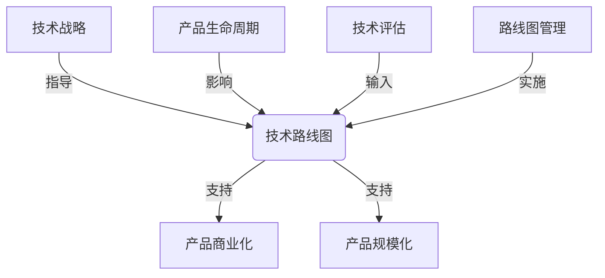

# 怎样具体规划并实施软件产品技术路线图，紧跟前沿技术趋势，实现产品商业化和规模化

## 1. 背景介绍

### 1.1 问题的由来

在当今瞬息万变的技术环境中，软件产品的成功不仅取决于满足当前需求，更重要的是能够与时俱进，紧跟前沿技术趋势。然而，规划和实施一个有效的技术路线图并非易事。它需要深入了解行业动态、预测未来需求、评估新兴技术的影响，并制定切实可行的实施计划。

### 1.2 研究现状

许多企业都意识到了技术路线图的重要性,但在实践中却面临诸多挑战。一些公司过于关注短期目标,忽视了长远发展;另一些公司则盲目追逐新技术,缺乏战略规划。此外,技术路线图的制定和实施往往需要跨部门协作,这增加了沟通和协调的难度。

### 1.3 研究意义

制定和实施有效的技术路线图对于软件产品的长期发展至关重要。它不仅有助于企业把握市场机遇,抢占先机,还能够提高产品的竞争力,实现商业化和规模化。同时,技术路线图也为研发团队提供了明确的发展方向,有利于资源的合理分配和高效利用。

### 1.4 本文结构

本文将从以下几个方面探讨如何规划和实施软件产品的技术路线图:首先阐述核心概念和原则;其次介绍具体的规划和实施步骤;然后讨论数学模型和公式在路线图制定中的应用;接着通过实际案例和代码示例深入解释;最后总结未来发展趋势和挑战。

## 2. 核心概念与联系

规划和实施软件产品技术路线图涉及多个关键概念,包括技术战略、产品生命周期、技术评估、路线图管理等。这些概念相互关联,共同构建了一个完整的技术路线图框架。

技术战略为技术路线图提供了总体方向和目标,确保路线图与企业的战略愿景保持一致。产品生命周期则决定了路线图的时间范围和阶段性目标。技术评估过程对新兴技术进行深入分析和评估,为路线图制定提供依据。最后,路线图管理负责落实和执行技术路线图,并根据实际情况进行调整和优化。

## 3. 核心算法原理 & 具体操作步骤

### 3.1 算法原理概述

规划和实施软件产品技术路线图可以借鉴"技术路线图规划算法"(Technology Roadmapping Algorithm)的思路。该算法包括以下几个核心步骤:

1. 确定技术路线图的目标和范围
2. 收集和分析相关数据,包括市场需求、现有技术、新兴技术等
3. 识别关键技术和能力
4. 构建技术路线图
5. 实施和持续优化路线图

### 3.2 算法步骤详解

1. **确定目标和范围**

   首先需要明确技术路线图的目标,是否侧重于开发新产品、优化现有产品,还是探索新的商业模式。同时,还需要确定路线图的时间范围,通常为3-5年。

2. **数据收集和分析**

   这一步骤包括收集市场需求数据、分析现有技术的优缺点、评估新兴技术的发展趋势等。可以采用多种方式,如市场调研、专家访谈、文献综述等。

3. **识别关键技术和能力**

   根据数据分析结果,识别对实现技术路线图目标至关重要的技术和能力。这些技术和能力将成为路线图的核心组成部分。

4. **构建技术路线图**

   将识别出的关键技术和能力按照时间顺序排列,形成技术路线图的初步版本。同时,还需要考虑技术之间的依赖关系和资源需求。

5. **实施和优化**

   将技术路线图与产品开发计划相结合,制定具体的实施方案。在实施过程中,需要持续监控进度,并根据实际情况对路线图进行调整和优化。

### 3.3 算法优缺点

**优点**:

- 系统性:该算法提供了一种结构化的方法,有助于全面考虑各种因素。
- 灵活性:算法允许根据实际情况进行调整和优化,适应不断变化的环境。
- 可视化:技术路线图以图形化的方式呈现,便于理解和传达。

**缺点**:

- 数据依赖:算法的效果在很大程度上取决于数据的质量和完整性。
- 复杂性:涉及多个步骤和因素,对于规模较小的项目可能过于复杂。
- 主观性:在识别关键技术和构建路线图时,存在一定的主观判断。

### 3.4 算法应用领域

技术路线图规划算法可以应用于各种软件产品领域,包括:

- 企业级应用软件
- 移动应用程序
- 物联网和嵌入式系统
- 人工智能和机器学习
- 云计算和大数据

无论是传统软件还是新兴技术领域,该算法都可以提供有效的指导和支持。

## 4. 数学模型和公式 & 详细讲解 & 举例说明

在规划和实施技术路线图的过程中,数学模型和公式可以为决策提供量化依据。下面将介绍两个常用的模型和公式。

### 4.1 数学模型构建

#### 技术成熟度模型

技术成熟度模型(Technology Maturity Model)用于评估某项技术的成熟程度,通常采用9个等级(1-9)进行划分。该模型可以帮助企业确定何时采用新技术,以及何时放弃旧技术。

技术成熟度等级的定义如下:

$$
\begin{aligned}
\text{TRL} &= \begin{cases}
1, & \text{基本原理已经被观察和报告} \\
2, & \text{技术概念和应用已经被形式化} \\
3, & \text{关键功能或概念的实验性证明} \\
4, & \text{在实验室环境中进行技术验证} \\
5, & \text{在相关环境中进行技术验证} \\
6, & \text{在相关环境中进行系统/子系统模型或原型样机测试} \\
7, & \text{在操作环境中进行系统原型示范} \\
8, & \text{实际系统完成并通过测试和示范} \\
9, & \text{实际系统已投入运行}
\end{cases}
\end{aligned}
$$

其中,TRL表示技术成熟度等级(Technology Readiness Level)。

通常,当技术达到6-7级时,企业可以考虑将其纳入技术路线图。而当技术达到8-9级时,则表明该技术已经足够成熟,可以大规模应用。

#### 技术生命周期模型

技术生命周期模型(Technology Life Cycle Model)描述了技术从出现到被淘汰的整个过程。它可以帮助企业预测技术的发展趋势,并做出相应的决策。

技术生命周期通常包括以下几个阶段:

1. 新兴阶段
2. 增长阶段
3. 成熟阶段
4. 衰退阶段
5. 淘汰阶段

这个过程可以用下面的公式来描述:

$$
y = a + \frac{b}{1 + e^{-c(x - d)}}
$$

其中:

- $y$表示技术的采用率
- $x$表示时间
- $a$、$b$、$c$、$d$是参数,用于控制曲线的形状

通过拟合历史数据,可以估计这些参数的值,从而预测技术的发展趋势。

### 4.2 公式推导过程

#### 技术成熟度模型

技术成熟度模型的9个等级是基于NASA(美国国家航空航天局)的研究和实践经验而制定的。每个等级都对应着技术发展的不同阶段,从基本原理到实际应用。

这种等级划分方式可以帮助企业客观评估技术的成熟程度,避免过早或过晚采用新技术。

#### 技术生命周期模型

技术生命周期模型的公式是基于logistic函数(又称sigmoid函数)推导而来的。logistic函数常用于描述一种增长过程,其曲线形状与技术的采用过程非常相似。

推导过程如下:

1. 定义logistic函数:

$$
f(x) = \frac{L}{1 + e^{-k(x - x_0)}}
$$

其中:

- $L$表示上限值
- $k$表示增长率
- $x_0$表示曲线的中点

2. 将上限值$L$替换为$a + b$,即:

$$
f(x) = \frac{a + b}{1 + e^{-k(x - x_0)}}
$$

3. 令$c = k$,令$d = x_0$,得到技术生命周期模型的公式:

$$
y = a + \frac{b}{1 + e^{-c(x - d)}}
$$

通过对历史数据进行拟合,可以估计出$a$、$b$、$c$、$d$的值,从而描述和预测技术的发展过程。

### 4.3 案例分析与讲解

#### 技术成熟度模型案例

假设企业正在评估一项新的人工智能技术,目前该技术的成熟度等级为5级(在相关环境中进行技术验证)。根据技术成熟度模型,企业可以做出以下判断:

- 该技术已经达到了一定的成熟程度,可以考虑将其纳入技术路线图
- 但是,由于还没有在实际操作环境中进行验证,存在一定的风险
- 企业可以先进行小规模试点,评估技术的实际效果和潜在问题
- 如果试点成功,则可以逐步扩大应用范围,直至大规模部署

通过技术成熟度模型,企业可以更加理性地评估和决策,避免盲目追逐新技术或错失良机。

#### 技术生命周期模型案例

假设企业正在考虑是否继续投资某项云计算技术。通过对历史数据进行拟合,得到该技术的生命周期模型参数如下:

- $a = 0.1$
- $b = 0.8$
- $c = 0.5$
- $d = 10$

将这些参数代入公式,可以绘制出该技术的采用率曲线:

从曲线可以看出,该技术目前处于成熟阶段,采用率接近峰值。根据这一分析结果,企业可以做出以下决策:

- 继续投资该技术,以满足当前的需求
- 但同时也要关注新兴技术的发展动向,为未来做好准备
- 在技术进入衰退阶段之前,制定技术迁移计划,平稳过渡到新技术

通过技术生命周期模型,企业可以更好地把握技术发展的节奏,做出前瞻性的决策。

### 4.4 常见问题解答

1. **如何获取数据来构建模型?**

   可以通过多种渠道收集数据,包括市场调研、专家访谈、行业报告、开源数据等。同时,也可以利用企业内部的历史数据进行分析。

2. **模型参数如何确定?**

   对于技术成熟度模型,参数是固定的,基于NASA的标准。而对于技术生命周期模型,需要通过对历史数据进行拟合来估计参数值。

3. **如何处理数据质量问题?**

   数据质量对模型的准确性有很大影响。因此,在构建模型之前,需要对数据进行清洗和预处理,剔除异常值和噪声数据。同时,也可以采用多种数据源进行交叉验证。

4. **模型结果如何应用于决策