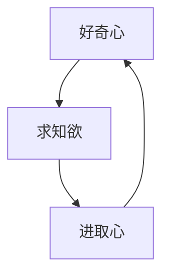

# 怎样培养强烈的求知欲、好奇心和进取心

关键词：求知欲、好奇心、进取心、自我驱动力、终身学习

## 1. 背景介绍
### 1.1 问题的由来
在当今知识经济和终身学习的时代，拥有强烈的求知欲、好奇心和进取心对于个人成长和事业发展至关重要。然而，很多人在成长过程中逐渐丧失了这些宝贵的品质，导致学习和工作缺乏动力和激情。

### 1.2 研究现状
目前，教育界和企业界都在探索如何激发个人的内在动机，培养自我驱动力。一些研究表明，好奇心、求知欲和进取心是可以通过后天培养和训练的，关键在于营造适宜的环境和采取正确的方法。

### 1.3 研究意义
深入研究怎样培养求知欲、好奇心和进取心，对于个人、组织乃至整个社会都具有重要意义。一方面，它可以帮助个人重拾学习的乐趣，激发内在潜能，实现自我价值。另一方面，拥有这些品质的人才是组织和社会进步的源动力。

### 1.4 本文结构
本文将从以下几个方面展开论述：  
- 求知欲、好奇心和进取心的内涵及相互关系
- 影响这些品质形成和发展的关键因素
- 在学习、工作和生活中培养这些品质的具体策略
- 国内外成功培养求知欲和进取心的案例
- 个人和组织应该如何营造有利于培养这些品质的环境
- 未来培养自我驱动力人才的趋势与挑战

## 2. 核心概念与联系
- 求知欲：追求知识、探索未知领域的强烈愿望和动机。
- 好奇心：对新奇事物和未知领域产生兴趣并主动探索的心理特质。
- 进取心：不断挑战自我、追求卓越、勇于开拓创新的精神和意志品质。

求知欲是好奇心的延伸和升华，好奇心则是求知欲的起点和驱动力。进取心与求知欲、好奇心相辅相成，三者共同构成了自我驱动力的核心要素。一个人只有在求知欲的驱使下，才会保持旺盛的好奇心，并以进取心将其转化为不竭的前进动力。

## 3. 核心培养原理 & 具体操作步骤
### 3.1 培养原理概述
培养求知欲、好奇心和进取心的核心是激发内在动机，而不是依靠外部奖惩。个体只有从内心产生探索未知、追求卓越的渴望，才能长期保持学习和进取的激情。影响内在动机的关键因素包括：
- 自主性：学习和探索源于个人意愿而非外界压力
- 胜任感：对自己的学习和解决问题的能力充满信心  
- 归属感：在学习和奋斗过程中感受到他人的支持和认同

### 3.2 培养步骤详解
1. 创造自主探索的环境和机会，鼓励提出问题、质疑权威。
2. 帮助树立学习和进步的自信，不断给予积极反馈。
3. 营造相互支持、共同进步的学习氛围和社群。
4. 引导建立与个人兴趣和理想相联系的长期学习目标。
5. 在学习和工作中适时设置有挑战性但可以达成的任务。
6. 提供丰富的学习资源，满足个性化的求知需求。
7. 培养反思和总结的习惯，帮助个人认识并优化自己的学习方式。

### 3.3 培养优缺点
优点：
- 尊重个体的自主性和选择权，激发最大潜能
- 培养良好的自我认知和进取意识，利于长期发展
- 学习动机更加持久，转化为行动的概率更大

缺点：
- 需要投入大量时间精力，打造适宜的人文环境
- 难以用统一的标准评判结果，不同个体进步速度不一
- 可能存在过度放纵、缺乏管束的风险

### 3.4 应用领域
培养求知欲、好奇心和进取心的原理和方法，不仅适用于学校教育，也适用于企业人才培养、个人自我提升等诸多领域。尤其是在知识密集型行业和创新驱动型企业，拥有自我驱动力的员工往往能够创造更大价值。

## 4. 数学模型和公式 & 详细讲解 & 举例说明
### 4.1 数学模型构建
我们可以用一个多元函数来表示求知欲、好奇心和进取心的综合水平：

$F(x, y, z) = ax + by + cz$

其中，$x$代表求知欲，$y$代表好奇心，$z$代表进取心，$a$、$b$、$c$为权重系数，反映三者的相对重要性。

### 4.2 公式推导过程
假设某人的求知欲、好奇心和进取心分别为$x_0$、$y_0$、$z_0$，则其自我驱动力水平为：

$$
\begin{aligned}
F_0 &= F(x_0, y_0, z_0) \\
    &= ax_0 + by_0 + cz_0
\end{aligned}
$$

如果经过一段时间的培养，三个指标分别提高了$\Delta x$、$\Delta y$、$\Delta z$，则自我驱动力的提升量为：

$$
\begin{aligned}
\Delta F &= F(x_0+\Delta x, y_0+\Delta y, z_0+\Delta z) - F(x_0, y_0, z_0) \\
         &= a\Delta x + b\Delta y + c\Delta z
\end{aligned}
$$

可见，求知欲、好奇心、进取心的提升幅度越大，且权重系数越大，自我驱动力的增长就越明显。

### 4.3 案例分析与讲解
以培养IT从业者的求知欲为例。假设某程序员的求知欲指数为60分，通过一年的培养，他的求知欲指数提高了20分。假设求知欲的权重系数为0.5，则他的自我驱动力提升量为：

$$\Delta F = 0.5 \times 20 = 10（分）$$

如果同时好奇心指数从70分提高到80分，进取心指数从80分提高到85分，且两者权重系数分别为0.3和0.2，则自我驱动力的总提升量为：

$$\Delta F = 0.5 \times 20 + 0.3 \times 10 + 0.2 \times 5 = 14（分）$$

可见，全面提升求知欲、好奇心和进取心，能够实现自我驱动力的显著提高。

### 4.4 常见问题解答
问：不同人的求知欲、好奇心和进取心权重系数一样吗？
答：不一样。每个人都有不同的性格特点和兴趣爱好，三者的重要性也各不相同。可以通过专业测评等方式，确定个人的权重系数，从而因材施教。

## 5. 项目实践：培养求知欲的训练营
### 5.1 训练营概况
为培养IT从业者的求知欲，某企业推出"求知训练营"项目。训练营为期1个月，每周举办1次线下主题沙龙，邀请业界大咖分享前沿知识和实践经验。学员需要在导师指导下，围绕感兴趣的主题撰写调研报告或开发Demo。

### 5.2 培养方案与效果
训练营秉承以下原则：
- 尊重学员的学习自主权，鼓励自由选题
- 营造轻松愉悦、互帮互助的学习氛围
- 导师适时指导、引导，但不越俎代庖
- 多方位呈现前沿知识，激发学员探索欲望
- 设置开放性任务，鼓励创新性思考和实践

经过一个月的训练，90%的学员表示求知欲和好奇心得到提升，80%的学员主动申请加入企业的创新项目。学员原创技术博客数量环比增长50%，知识分享会数量增长30%。

### 5.3 项目复盘与优化
训练营结束后，项目组对学员反馈进行了认真复盘，发现仍有一些问题需要改进：
- 导师指导时间有限，难以照顾到每一个学员
- 线下沙龙受时间、地点限制，部分学员无法全程参与
- 学员之间缺乏长期的交流互动机制
- 学员的研究成果难以得到充分展示

针对这些问题，项目组提出了以下优化措施：
- 增加导师的辅导时间，建立学员和导师的一对一辅导机制
- 增加线上直播和录播课程，方便学员自主安排学习进度
- 组建学员社群，定期举办主题研讨和头脑风暴活动
- 举办优秀项目路演和评选，树立标杆，激励更多学员投入

## 6. 实际应用场景
### 6.1 IT企业人才培养
在IT企业中，技术人员的求知欲和进取心直接决定了企业的创新能力。例如，Google鼓励员工利用20%的工作时间从事自己感兴趣的项目，催生了众多创新产品。培养IT人才的求知欲，有利于形成持续学习和创新的良性循环。

### 6.2 个人职业发展
对于个人而言，保持强烈的求知欲是职业发展的不竭动力。求知欲驱动我们不断学习新知识、掌握新技能，增强职场竞争力。进取心则激励我们勇于走出舒适区，追求更高的目标和理想。两者结合，才能实现职业生涯的突破和升华。

### 6.3 素质教育实践
在中小学素质教育中，培养学生的好奇心和求知欲至关重要。一些学校开设了科学实验、创客空间等课程，鼓励学生动手实践、大胆质疑。这有助于学生养成主动学习、勇于创新的习惯，为未来的发展奠定基础。

### 6.4 未来应用展望
随着社会的发展和技术的进步，求知欲和进取心的重要性日益凸显。在人工智能时代，拥有自我驱动力的复合型人才将备受青睐。未来，培养求知欲可能与更多前沿技术相结合，如利用VR/AR创设沉浸式探索场景，利用大数据和学习分析技术精准画像学习需求等。

## 7. 工具和资源推荐
### 7.1 学习资源推荐
- Coursera、edX等国际知名MOOC平台，汇聚了海量优质课程资源
- 得到、混沌大学等碎片化学习App，满足随时随地学习需求
- TED、一席等高质量演讲视频网站，开阔视野、激发灵感
- GitHub、Stack Overflow等技术社区，与大牛交流切磋

### 7.2 开发工具推荐
- Jupyter Notebook：在线交互式编程环境，便于实践和分享
- Typora、Markdown Here等Markdown编辑器，书写技术博客的利器
- Mermaid：简洁优雅的流程图、甘特图等绘制工具
- Anki、Mnemosyne等间隔重复记忆软件，高效掌握新知识

### 7.3 相关论文推荐
- Deci, E. L., & Ryan, R. M. (2012). Motivation, personality, and development within embedded social contexts: An overview of self-determination theory. 
- Von Stumm, S., Hell, B., & Chamorro-Premuzic, T. (2011). The hungry mind: Intellectual curiosity is the third pillar of academic performance. 
- Kashdan, T. B., & Steger, M. F. (2007). Curiosity and pathways to well-being and meaning in life: Traits, states, and everyday behaviors.

### 7.4 其他资源推荐
- 《刻意练习：如何从新手到大师》一书，讲述刻意练习的重要性和方法
- 《好奇心》《求知的乐趣》等科普读物，带你重新发现求知的意义
- Google re:Work等网站，分享企业在人才培养方面的最佳实践

## 8. 总结：未来发展趋势与挑